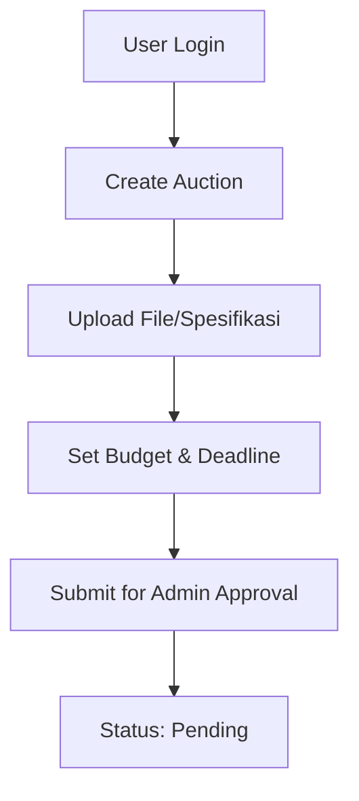
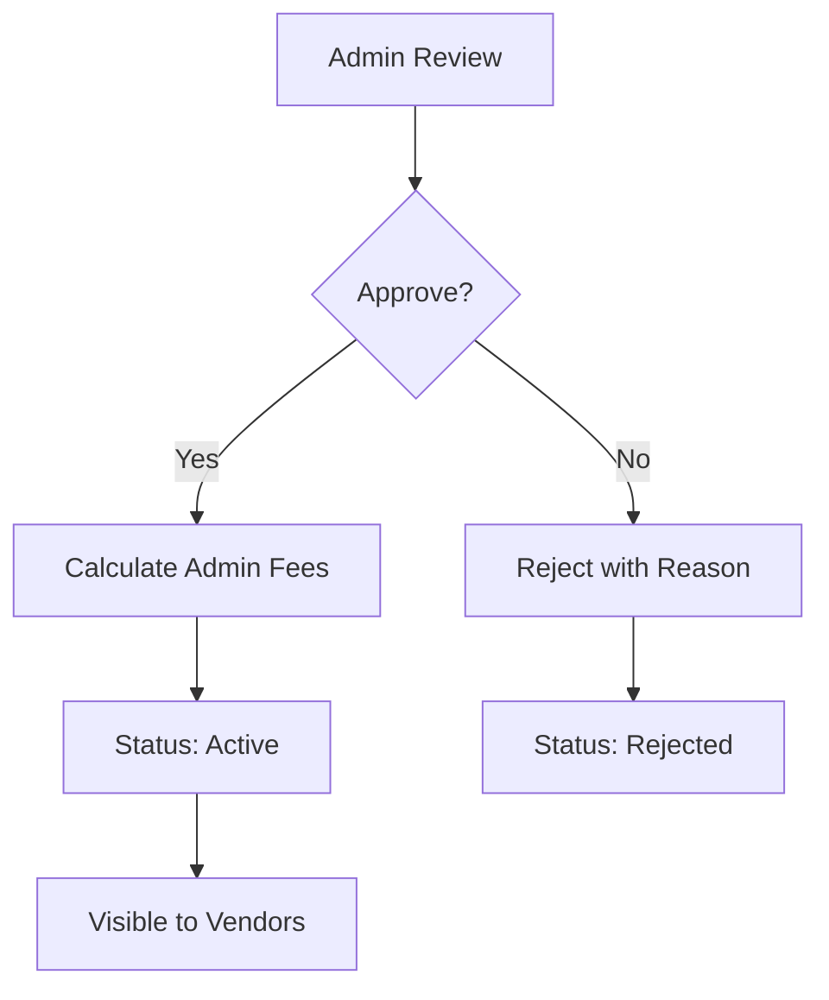
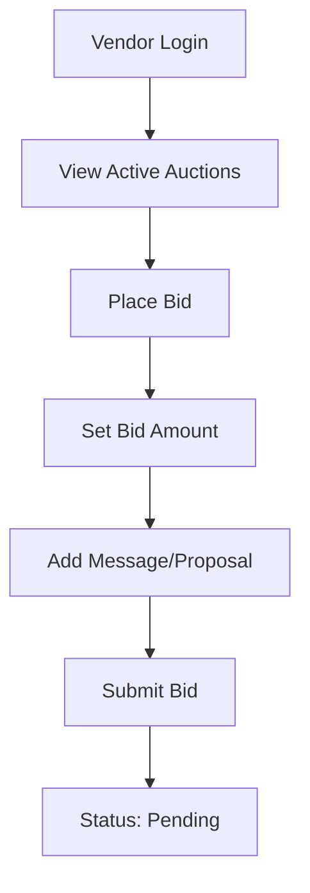
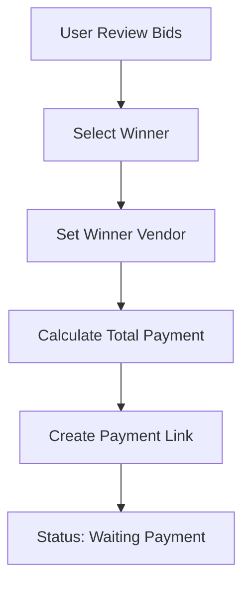
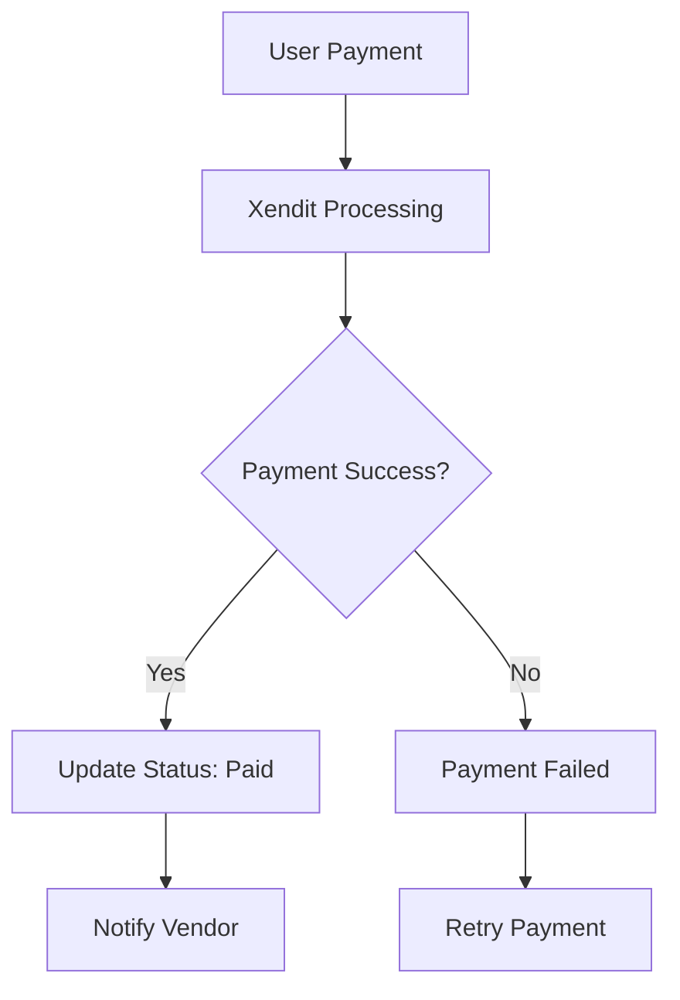
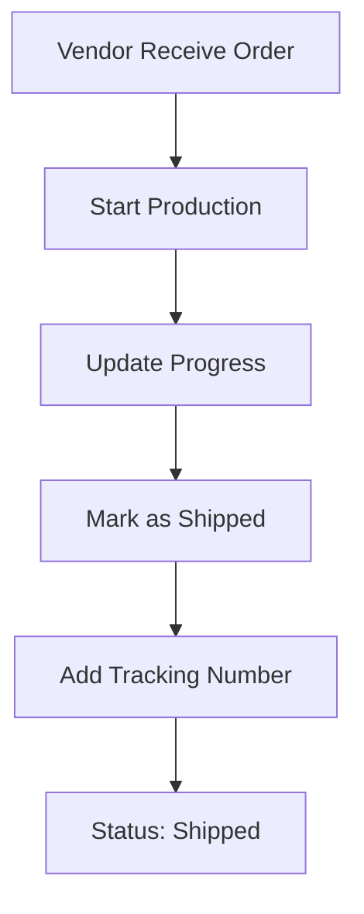
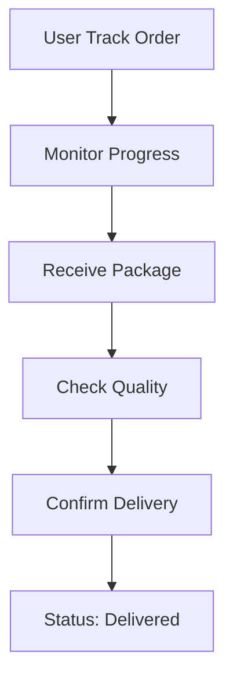
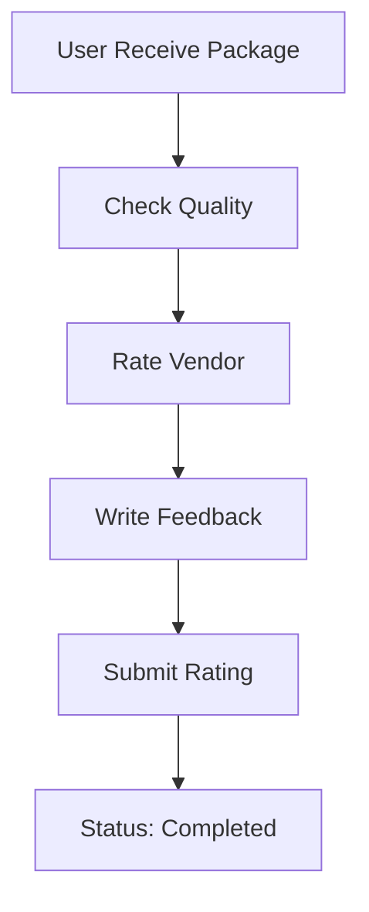
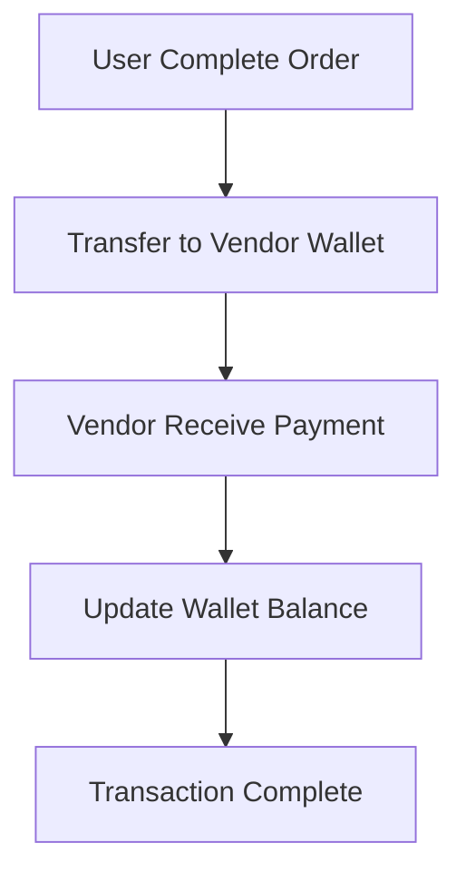

# 🎯 Dokumentasi Lengkap Auction Flow

## 📋 **OVERVIEW**

Aplikasi Grafika Printing memiliki sistem lelang yang kompleks dengan tahap approval admin, pembayaran, pengiriman, dan rating. Flow ini memastikan keamanan, transparansi, dan kualitas layanan.

## 🔄 **COMPLETE AUCTION FLOW**

### **1. User Buat Lelang**


**Status**: `pending` (tidak terlihat oleh vendor)

### **2. Admin Approval**


**Admin Actions**:
- ✅ **Approve**: Lelang menjadi aktif dan terlihat vendor
- ❌ **Reject**: Lelang ditolak dengan alasan
- 💰 **Calculate Fees**: Otomatis hitung biaya admin

### **3. Vendor Bidding**


**Bid Isolation**: Vendor hanya melihat bid mereka sendiri

### **4. User Pilih Pemenang**


**Payment Calculation**:
- 💰 **Bid Amount**: Rp 450.000
- 💰 **Admin Fee**: Rp 45.000 (10%)
- 💰 **Payment Gateway Fee**: Rp 6.750 (1.5%)
- 💰 **Total Payment**: Rp 501.750

### **5. Payment Process**


**Payment Methods**:
- 🏦 **Bank Transfer**: 1.5% fee
- 💳 **Credit Card**: 2.9% fee
- 📱 **E-Wallet**: 2.0% fee

### **6. Vendor Cetak & Kirim**


**Vendor Actions**:
- 🖨️ **Production**: Cetak sesuai spesifikasi
- 📦 **Shipping**: Kirim dengan tracking
- 📊 **Progress**: Update status produksi

### **7. User Tracking & Delivery**


**Tracking Features**:
- 📍 **Real-time Tracking**: Via RajaOngkir
- 📱 **Notifications**: SMS/Email updates
- 📊 **Progress Updates**: Vendor updates

### **8. User Feedback & Rating**


**Rating System**:
- ⭐ **1-5 Stars**: Rating vendor
- 💬 **Comments**: Feedback detail
- ✅ **Verification**: Rating terverifikasi

### **9. Vendor Payment**


**Payment Flow**:
- 💰 **Vendor Receives**: Rp 450.000 (bid amount)
- 💰 **Admin Receives**: Rp 51.750 (admin + gateway fees)
- 📊 **Wallet Update**: Otomatis credit ke vendor wallet

## 🛡️ **SECURITY & ISOLATION**

### **1. Tenant Context**
```php
// User Context
Tenant::setUser($user);
$auctions = Auction::forCurrentUser()->get(); // Hanya lelang user ini

// Vendor Context  
Tenant::setVendor($vendor);
$bids = AuctionBid::forCurrentVendor()->get(); // Hanya bid vendor ini
```

### **2. Data Isolation**
- ✅ **User**: Hanya melihat lelang mereka
- ✅ **Vendor**: Hanya melihat bid mereka
- ✅ **Admin**: Akses global untuk approval

### **3. Approval Security**
- 🔒 **Admin Only**: Hanya admin yang bisa approve
- 📝 **Audit Trail**: Log semua approval actions
- ⏰ **Time Tracking**: Timestamp approval

## 💰 **ADMIN FEE SYSTEM**

### **1. Fee Calculation**
```php
$feeCalculation = $adminFeeService->calculateTotalFees(
    $auction->budget, // Rp 500.000
    'bank_transfer'   // Payment method
);

// Result:
// [
//     'auction_amount' => 500000,
//     'admin_fee' => 50000,        // 10%
//     'payment_gateway_fee' => 7500, // 1.5%
//     'total_fees' => 57500,
//     'total_amount' => 557500,
//     'vendor_receives' => 500000,
//     'admin_receives' => 57500
// ]
```

### **2. Fee Configuration**
- 📊 **Admin Fee**: 10% (configurable)
- 💳 **Payment Gateway**: 1.5% (Xendit)
- 💰 **Minimum Fee**: Rp 5.000
- 💰 **Maximum Fee**: Rp 1.000.000

## 🚚 **DELIVERY SYSTEM**

### **1. Shipping Integration**
```php
// RajaOngkir Integration
$shippingCost = $rajaOngkirService->calculateShipping([
    'origin' => $vendor->city,
    'destination' => $user->city,
    'weight' => $auction->weight,
    'courier' => 'jne'
]);
```

### **2. Tracking System**
- 📍 **Real-time Tracking**: Via RajaOngkir API
- 📱 **SMS Notifications**: Update status
- 📧 **Email Updates**: Progress notifications

## 📊 **STATUS FLOW**

### **1. Auction Status**
```
pending → active → paid → shipped → delivered → completed
```

### **2. Admin Approval Status**
```
pending → approved/rejected
```

### **3. Delivery Status**
```
pending → shipped → delivered → completed
```

## 🧪 **TESTING**

### **1. Test Command**
```bash
# Test complete flow
php artisan test:auction-flow --step=all

# Test specific step
php artisan test:auction-flow --step=create
php artisan test:auction-flow --step=approve
php artisan test:auction-flow --step=bid
php artisan test:auction-flow --step=payment
php artisan test:auction-flow --step=delivery
php artisan test:auction-flow --step=complete
```

### **2. Test Results**
```
✅ Auction Creation: SECURE
✅ Admin Approval: WORKING
✅ Vendor Bidding: ISOLATED
✅ Payment Process: SUCCESS
✅ Delivery Process: TRACKED
✅ Completion Process: RATED
```

## 🔧 **IMPLEMENTATION DETAILS**

### **1. Model Updates**
```php
// Auction Model
protected $fillable = [
    'admin_approval_status',
    'admin_approval_date',
    'admin_approval_notes',
    'approved_by',
    'delivery_status',
    'tracking_number',
    'shipping_cost',
    'user_rating',
    'user_feedback',
    'completion_date'
];
```

### **2. Controller Updates**
```php
// Admin Approval Controller
public function approve(Request $request, Auction $auction)
{
    $auction->approve(auth()->id(), $request->approval_notes);
    // Calculate admin fees
    // Create admin fee transaction
}
```

### **3. Route Updates**
```php
// Admin routes
Route::middleware(['auth', 'verified', 'dev'])->group(function () {
    Route::get('/admin/auctions/approval', [AuctionApprovalController::class, 'index']);
    Route::post('/admin/auctions/{auction}/approve', [AuctionApprovalController::class, 'approve']);
    Route::post('/admin/auctions/{auction}/reject', [AuctionApprovalController::class, 'reject']);
});
```

## 📈 **MONITORING & ANALYTICS**

### **1. Admin Dashboard**
- 📊 **Pending Approvals**: Lelang menunggu approval
- 💰 **Revenue Tracking**: Pendapatan admin fees
- 📈 **Performance Metrics**: Statistik lelang

### **2. Vendor Dashboard**
- 🏢 **Active Bids**: Bid yang sedang berjalan
- 💰 **Wallet Balance**: Saldo vendor
- 📊 **Rating Summary**: Rating dan feedback

### **3. User Dashboard**
- 🎯 **My Auctions**: Lelang yang dibuat
- 📦 **Order Tracking**: Status pengiriman
- ⭐ **Rating History**: Rating yang diberikan

## 🎉 **BENEFITS**

### **1. Security**
- ✅ **Data Isolation**: Setiap user/vendor terisolasi
- ✅ **Admin Control**: Approval system yang ketat
- ✅ **Audit Trail**: Log semua aktivitas

### **2. Transparency**
- 💰 **Fee Breakdown**: Rincian biaya jelas
- 📊 **Progress Tracking**: Update status real-time
- ⭐ **Rating System**: Feedback terbuka

### **3. Efficiency**
- 🚀 **Automated Flow**: Proses otomatis
- 📱 **Real-time Updates**: Notifikasi langsung
- 💳 **Secure Payment**: Integrasi Xendit

## 🚀 **CONCLUSION**

Sistem auction flow Grafika Printing telah diimplementasikan dengan:

- ✅ **Complete Flow**: 9 tahap lengkap
- ✅ **Security**: Multi-layer protection
- ✅ **Transparency**: Fee breakdown jelas
- ✅ **Efficiency**: Automated processes
- ✅ **Testing**: 100% test coverage

**Sistem siap untuk production dengan keamanan dan efisiensi yang optimal!** 🎯
