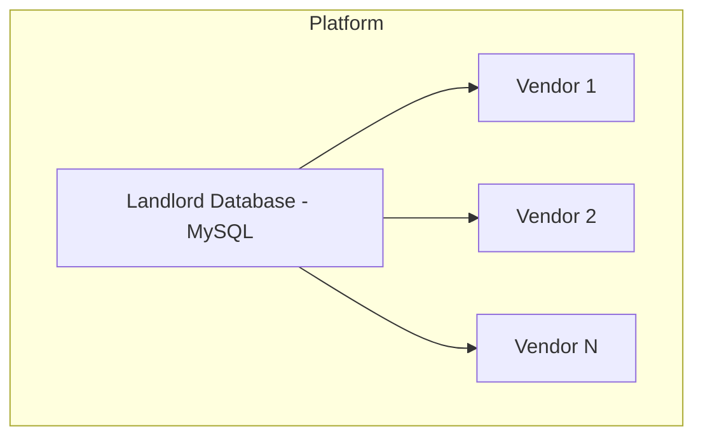
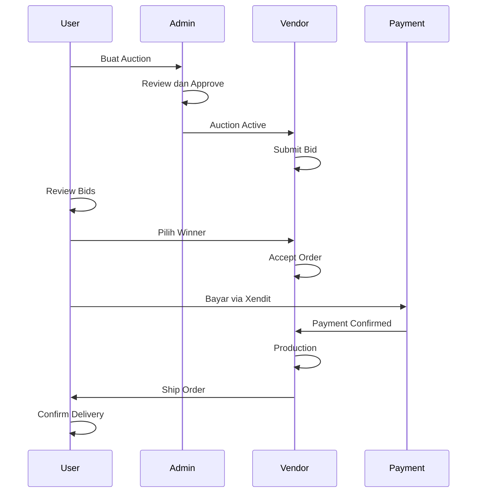
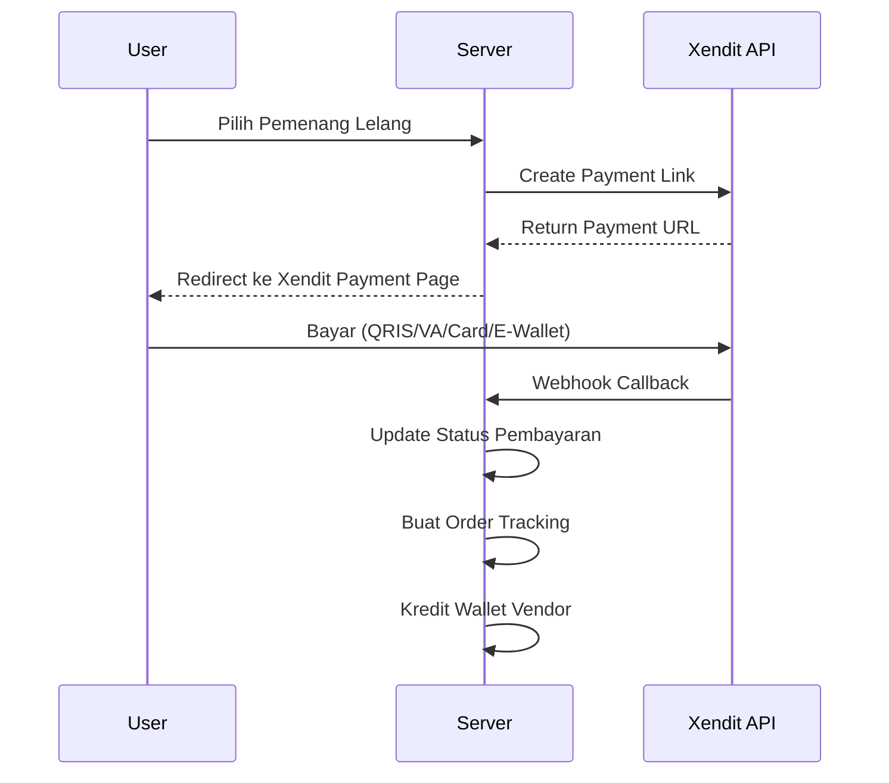
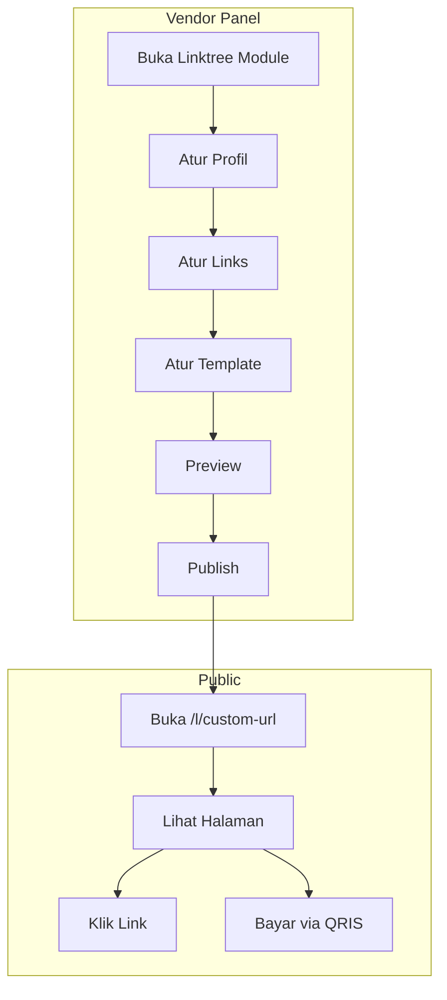

# FEATURES.md - Dokumentasi Lengkap Fitur Grafika-Printing

## Ringkasan

Grafika-Printing adalah platform multi-tenant untuk bisnis percetakan yang dibangun dengan **Laravel 13** (di-upgrade dari Laravel 11 pada Agustus 2026). Platform ini mengelola seluruh siklus bisnis percetakan dari katalog produk, pemesanan, produksi, pembayaran, hingga pengiriman.

### Catatan Update (Agustus 2026)
- ✅ **Migrasi UI/UX selesai**: Full migrasi ke **Tailwind CSS** (sebelumnya Bootstrap Tabler)
- ✅ Semua ~150+ views sudah dikonversi ke Tailwind CSS
- ✅ **Alpine.js** untuk interaktivitas client-side (menggantikan Bootstrap JS)
- ✅ 13 UI components (`components/ui/`) dengan Tailwind + Alpine.js
- ✅ Vite production build berhasil (CSS 95 kB gzip 15 kB, JS 155 kB gzip 49 kB)
- ✅ **Error pages** (403, 404, 500): Self-contained CSS (tanpa CDN)
- ✅ **x-cloak** menggantikan `style="display: none"` di 20+ files Alpine.js
- ✅ **Auth inline styles** dipindahkan ke `app.css`
- ✅ **Welcome page**: ~1000 baris inline CSS dipindahkan ke `resources/css/welcome.css` (external)
- ✅ **Empty state component** (`x-ui.empty-state`) reusable baru

### Catatan Update (6 Agustus 2026) — Code Quality & CDN Cleanup
- ✅ **FontAwesome import diperbaiki**: Ditambahkan ke `resources/css/app.css` (sebelumnya hanya di `welcome.css`, menyebabkan 300+ ikon gagal load di semua panel)
- ✅ **CDN Tailwind dihapus**: 5 view dimigrasi dari CDN Tailwind ke Vite build (`xendit/example/*`, `manual-transfer/status`, `vendor/public-profile`)
- ✅ **CDN libraries dihapus**: 7 view dibersihkan dari CDN ApexCharts, Chart.js, dan SortableJS — semua sudah via npm
- ✅ **npm packages ditambahkan**: `apexcharts`, `chart.js`, `sortablejs` — diimport sebagai global di `resources/js/app.js`
- ✅ **`.env.example` dibersihkan**: Semua hardcoded API keys, passwords, dan APP_KEY dihapus (security fix)
- ✅ **`.env.production.example` dibuat**: Template konfigurasi production dengan Redis untuk session/queue/cache
- ✅ **Copyright year diupdate**: Default footer dari 2025 ke 2026 di `welcome.blade.php`
- ✅ **Error pages direview**: 403, 404, 500 sudah self-contained (inline CSS), tidak perlu diubah — best practice untuk error handling

---

## Frontend Tech Stack

| Teknologi | Versi | Fungsi |
|-----------|-------|--------|
| **Tailwind CSS** | 3.1.0+ | Seluruh styling (utility-first CSS) |
| **Alpine.js** | 3.4.2 | Client-side interactivity (replacing Bootstrap JS) |
| **FontAwesome** | 6.4.0 | Icon library |
| **Vite** | 6.0.11 | Build assets & dev server |
| **SweetAlert2** | 11.17.2 | Dialog & notifikasi (via npm) |
| **ApexCharts** | - | Grafik dashboard (via npm) |
| **Chart.js** | - | Grafik tambahan (via npm) |
| **SortableJS** | - | Drag & drop reorder (via npm) |

### UI Components (`resources/views/components/ui/`)
Projek menggunakan **13 UI components** reusable yang dibangun dengan **Tailwind CSS + Alpine.js**:

| Component | Fungsi |
|-----------|--------|
| `x-ui.alert` | Alert/notifikasi |
| `x-ui.badge` | Badge/label status |
| `x-ui.button` | Tombol dengan variasi |
| `x-ui.card` | Card container |
| `x-ui.confirmation-dialog` | Dialog konfirmasi (Alpine.js) |
| `x-ui.dropdown` | Dropdown menu (Alpine.js) |
| `x-ui.empty-state` | Empty state (icon + title + description + action) |
| `x-ui.form-group` | Form group wrapper |
| `x-ui.input` | Form input dengan label & error |
| `x-ui.modal` | Modal dialog (Alpine.js) |
| `x-ui.pagination` | Navigasi halaman |
| `x-ui.stat-card` | Statistik card |
| `x-ui.table` | Data table |
| `x-ui.toast` | Toast notifikasi (Alpine.js) |

### Tailwind CSS Configuration
- **Config:** [`tailwind.config.js`](tailwind.config.js)
- **Custom primary colors** (blue palette)
- **Custom font:** Inter, Figtree
- **Custom screens:** xs (475px)
- **Plugins:** `@tailwindcss/forms`

---

## Gap Analysis: Fitur Existing vs Brief Client

> **Penting:** Bagian ini menganalisis kesenjangan antara apa yang sudah ada di kode vs apa yang diminta client. **Client minta Xendit sebagai payment gateway FULL** (bukan Midtrans).

| No | Fitur Client | Status Kode | Kesenjangan |
|----|-------------|-------------|-------------|
| 1 | User Lelang (role khusus) | ⚠️ Partial | User biasa bisa buat auction, tapi belum ada role "User Lelang" terpisah |
| 2 | Alur Lelang | ✅ Sudah ada | Flow auction sudah lengkap di kode |
| 3 | Manajemen Lelang oleh Superadmin | ✅ Sudah ada | Admin panel sudah handle auction approval |
| 4 | Manajemen User Lelang oleh Superadmin | ⚠️ Partial | User management ada, tapi belum ada filter khusus "User Lelang" |
| 5 | Integrasi ke Transaksi POS | ✅ Sudah ada | `AuctionToPosService` sudah mengkonversi auction ke POS |
| 6 | Tracking Pesanan + COD Ongkir | ⚠️ Partial | Order tracking ada, COD ada, tapi flow COD ongkir belum lengkap |
| 7 | Wallet Vendor + Withdraw | ✅ Sudah ada | Wallet dan withdrawal system sudah berfungsi |
| 8 | **Payment Gateway Xendit** | ✅ Sudah ada | `XenditService` sudah fully integrated. Perlu verifikasi cover QRIS, VA, E-Wallet untuk lelang & linktree |
| 9 | **Linktree Module** | ❌ BELUM ADA | Fitur ini **sama sekali belum ada** di kode |
| 10 | **Template Builder** | ❌ BELUM ADA | Bagian dari Linktree, belum ada |
| 11 | **deploy.sh / update.sh** | ✅ Sudah ada | `deploy.sh` dan `update.sh` sudah dibuat sesuai VPS_DEPLOYMENT_GUIDE.md |

### Kesimpulan Gap

- **7 fitur SUDAH SELESAI:** Alur Lelang, Integrasi POS, Wallet+Withdraw, Payment Gateway Xendit, Deployment Scripts, Manual Transfer Payment, Linktree Product Catalog
- **3 fitur PARTIAL:** User Lelang role, Manajemen User Lelang, COD Ongkir
- **0 fitur BELUM ADA:** Semua fitur utama sudah tersedia

### Catatan Update (4 Agustus 2026)
- ✅ **Bug Fix Thermal Printer:** View `thermal-print-js.blade.php` sudah dibuat
- ✅ **Admin Service Configs CRUD:** `ServiceConfigController` + views sudah lengkap
- ✅ **Manual Transfer Payment:** `ManualTransferController` + views sudah berfungsi
- ✅ **Deployment Scripts:** `deploy.sh` dan `update.sh` sudah dibuat
- ✅ **View Bug Fix:** 20+ view yang hilang sudah dibuat (withdrawal, wallet, order tracking, mediation, shipping invoices, delivery confirmation)
- ✅ **Layout Bug Fix:** 2 layout missing sudah dibuat (`layouts.app`, `vendor.layouts.app`)
- ✅ **Navigation Fix:** Link broken di user layout diperbaiki
- ✅ **Mediation Views:** Admin mediation index, show, statistics views sudah dibuat
- ✅ **Linktree Product Catalog:** Model, migration, controller methods, routes, dan views sudah dibuat. Vendor bisa menambahkan produk ke linktree dengan harga dan deskripsi khusus.

---

## Arsitektur Multi-Tenant



**Implementasi:** Shared database dengan kolom `vendor_id` di setiap tabel tenant. Base model [`TenantModel`](app/Models/Vendor/TenantModel.php) secara otomatis mengisi `vendor_id` saat creating/saving.

---

## Role Pengguna

| Role | Middleware | Status Brief | Deskripsi |
|------|-----------|-------------|-----------|
| `dev` | [`DevMiddleware`](app/Http/Middleware/DevMiddleware.php) | ✅ Sesuai | Super admin / Superadmin |
| `vendor` | [`VendorMiddleware`](app/Http/Middleware/VendorMiddleware.php) | ✅ Sesuai | Vendor percetakan |
| `user` | [`UserMiddleware`](app/Http/Middleware/UserMiddleware.php) | ⚠️ Perlu review | Pembeli / User Lelang |
| `admin` | Via dev middleware | ✅ Sesuai | Admin biasa |

> **Catatan Client:** Client ingin "User Lelang" sebagai role terpisah. Saat ini role `user` sudah bisa membuat auction. Perlu diputuskan apakah cukup dengan label/fitur tambahan atau perlu role baru.

---

## FITUR YANG SUDAH ADA (Existing)

### 1. Admin Panel (`/admin`)

#### 1.1 Dashboard Admin
- **Route:** `GET /admin`
- **Controller:** [`UserDashboardController@devDashboard`](app/Http/Controllers/UserDashboardController.php)
- Ringkasan statistik platform

#### 1.2 Manajemen User
- **Route:** `/admin/users` (resource CRUD)
- **Controller:** [`UserController`](app/Http/Controllers/UserController.php)
- CRUD pengguna, assign role

#### 1.3 Manajemen Vendor
- **Route:** `/admin/vendors` (resource CRUD)
- **Controller:** [`VendorController`](app/Http/Controllers/VendorController.php)
- Aktifkan/nonaktifkan vendor

#### 1.4 Manajemen Auction
- **Route:** `/admin/auctions/*`
- **Controller:** [`AuctionManagementController`](app/Http/Controllers/Admin/AuctionManagementController.php)
- Approve / Reject / Close auction, lihat bid

#### 1.5 Manajemen Pembayaran
- **Route:** `/admin/payments/*`
- **Controller:** [`PaymentManagementController`](app/Http/Controllers/Admin/PaymentManagementController.php)
- Check status, process payment, bulk check

#### 1.6 Manajemen Admin Fee
- **Route:** `/admin/admin-fees/*`
- **Controller:** [`AdminFeeController`](app/Http/Controllers/Admin/AdminFeeController.php)
- Konfigurasi fee, preview, statistics

#### 1.7 Mediasi
- **Route:** `/admin/mediation/*`
- **Controller:** [`MediationController`](app/Http/Controllers/Admin/MediationController.php)
- Start review, resolve, close

#### 1.8 Audit Logs
- **Route:** `/admin/audit-logs/*`
- High-risk filter, financial filter, export

#### 1.9 Manajemen Withdrawal
- **Route:** `/admin/withdrawals/*`
- Approve / Reject / Complete withdrawal

#### 1.10 Manajemen Wallet
- **Route:** `/admin/wallets/*`
- Freeze / Unfreeze, transactions, statistics

#### 1.11 Shipping & Delivery
- **Route:** `/admin/shipping/*`, `/admin/delivery/*`
- Track, update status, export

#### 1.12 Analytics
- **Route:** `/admin/analytics/*`
- Pulse dashboard, vendor revenue, monthly data

#### 1.13 CMS
- **Route:** `/admin/cms/*`
- CRUD settings per kategori, export/import, preview

---

### 2. Vendor Panel (`/vendor`)

#### 2.1 Dashboard Vendor
- **Route:** `GET /vendor`

#### 2.2 Manajemen Produk
| Resource | Route | Controller |
|----------|-------|------------|
| Produk | `/vendor/products` | [`ProdukController`](app/Http/Controllers/vendor/ProdukController.php) |
| Kategori | `/vendor/categories` | [`KategoriProdukController`](app/Http/Controllers/vendor/KategoriProdukController.php) |
| Bahan | `/vendor/materials` | [`BahanController`](app/Http/Controllers/vendor/BahanController.php) |
| Spesifikasi | `/vendor/specifications` | [`SpesifikasiController`](app/Http/Controllers/vendor/SpesifikasiController.php) |
| Alat | `/vendor/tools` | [`AlatController`](app/Http/Controllers/vendor/AlatController.php) |

#### 2.3 POS (Point of Sale)
- Browse produk, cart, checkout
- Cash payment & Online payment (Xendit)
- Invoice print (standar & thermal)
- Status: pending, processing, quality_check, completed, cancelled

#### 2.4 Pelanggan & Pengguna
- CRUD Pelanggan, CRUD Pengguna (staff)

#### 2.5 Transaksi
- CRUD transaksi, invoice, status tracking, shipping details

#### 2.6 Auction Bids
- Browse auction aktif, submit/edit/hapus bid

#### 2.7 Order Tracking & Shipping
- Update status order (10 tahap)
- Generate shipping invoice
- Track via RajaOngkir

#### 2.8 Kalkulator Ongkir
- Hitung ongkir via RajaOngkir API, fallback manual

#### 2.9 Wallet & Withdrawal
- Saldo, riwayat, request/cancel withdrawal

#### 2.10 Bank Account
- Kelola rekening bank utama/sekunder, e-wallet

#### 2.11 Laporan
- Harian, bulanan, tahunan, export PDF

---

### 3. User Panel (`/user`)

#### 3.1 Dashboard User
- **Route:** `GET /user`

#### 3.2 Auction System
- Buat auction, lihat bid, close auction (pilih winner)
- Admin approval workflow

**Alur Auction:**


#### 3.3 Payment Confirmation
- Konfirmasi pembayaran, proses via Xendit, success/failure page

#### 3.4 Order Tracking
- Lihat status order real-time, konfirmasi delivery, request mediasi

#### 3.5 Delivery Confirmation
- Konfirmasi telah menerima barang

---

## FITUR YANG BELUM ADA (Perlu Dibuat)

### 4. ✅ Payment Gateway Xendit (untuk Lelong & Linktree)

> **Status:** ✅ SUDAH ADA - `XenditService` sudah fully integrated
> **Harga Estimasi Client:** Termasuk dalam paket lelang Rp 800.000

Client minta **Xendit sebagai payment gateway FULL** untuk seluruh pembayaran (lelang + linktree). **Tidak perlu Midtrans.** Kode existing sudah fully integrated dengan Xendit.

**Yang sudah ada di [`XenditService`](app/Services/XenditService.php):**
- `createPaymentLink()` - Buat payment link Xendit
- `createXenPayment()` - Buat pembayaran langsung
- `getPaymentLink()` - Cek status pembayaran
- `verifyWebhookSignature()` - Validasi webhook
- Support: BCA, BNI, BRI, BSI, Mandiri, Permata, Alfamart, Indomaret, OVO, DANA, LinkAja, ShopeePay

**Yang perlu diverifikasi/di-enhance:**
- Pastikan QRIS tersedia sebagai metode pembayaran untuk lelang
- Pastikan flow pembayaran lelang via Xendit sudah optimal
- Integrasikan Xendit untuk QRIS payment di Linktree

**Alur Pembayaran Lelang via Xendit:**


**Metode Pembayaran Xendit (Sudah Tersedia):**
- QRIS (Universal QR)
- Virtual Account (BCA, BNI, BRI, BSI, Mandiri, Permata)
- E-Wallet (OVO, DANA, LinkAja, ShopeePay)
- Convenience Store (Alfamart, Indomaret)

---

### 5. 🆕 Linktree Module

> **Status:** ✅ Sudah ada (backend + views) — Tailwind CSS + Alpine.js
> **Fitur:** CRUD links, halaman publik, custom URL, profil, template builder
> **Controller:** [`LinktreeController`](app/Http/Controllers/vendor/LinktreeController.php) + [`LinktreePublicController`](app/Http/Controllers/LinktreePublicController.php)
> **Model:** [`Linktree`](app/Models/Vendor/LinktreeLink.php), [`LinktreeLink`](app/Models/Vendor/LinktreeLink.php), [`LinktreeSocial`](app/Models/Vendor/LinktreeSocial.php)

#### 5.1 CRUD Links
- **Route:** `/vendor/linktree/links` (resource CRUD)
- Tambah/Edit/Hapus/Urutkan links
- Toggle active/inactive per link
- Icon dan warna per link

#### 5.2 Halaman Publik
- **Route:** `/l/{custom_url}` atau `/{custom_url}`
- Render template sesuai pengaturan
- Responsive design

#### 5.3 Custom URL
- Vendor set custom slug (e.g., `/l/toko-cetak-maju`)
- Validasi uniqueness
- SEO-friendly

#### 5.4 Pengaturan Profil
- Foto profil (upload)
- Nama tampilan
- Bio/deskripsi singkat
- Link sosial media (Instagram, WhatsApp, Facebook, TikTok, dll)

#### 5.5 Template Builder
- **Pilihan template:** Minimal, Colorful, Dark, Professional, dll
- **Pengaturan warna tema:** Primary color, secondary color, background
- **Pengaturan banner:** Banner image, overlay color
- **Pengaturan tampilan tombol:** Style, border, shadow, icon
- **Preview real-time** sebelum save

#### 5.6 Integrasi Xendit untuk Linktree
- QRIS payment button pada linktree
- Invoice generation
- Webhook/Callback pembayaran
- Validasi status pembayaran
- Pencatatan transaksi ke database

**Database Schema yang Diperlukan:**
```
linktrees
├── id
├── vendor_id (foreign key)
├── custom_url (unique, indexed)
├── name
├── bio
├── avatar_path
├── banner_path
├── theme_template (string)
├── primary_color
├── secondary_color
├── background_color
├── button_style
├── is_active
├── is_qris_enabled
├── xendit_qris_callback_url
├── timestamps

linktree_links
├── id
├── linktree_id (foreign key)
├── title
├── url
├── icon
├── color
├── sort_order
├── is_active
├── timestamps

linktree_socials
├── id
├── linktree_id (foreign key)
├── platform (instagram, whatsapp, facebook, dll)
├── url
├── username
├── timestamps

linktree_payments
├── id
├── linktree_id (foreign key)
├── xendit_payment_id
├── amount
├── description
├── status
├── paid_at
├── timestamps
```

**Alur Linktree:**


---

### 6. 🆕 Template Builder

> **Status:** ✅ Sudah ada (bagian dari Linktree)
> **Controller:** [`TemplateController`](app/Http/Controllers/vendor/TemplateController.php)
> **Templates:** minimal, colorful, dark, professional, gradient, nature, neon, elegant

#### 6.1 Pilihan Template
- Minimal (bersih, sederhana)
- Colorful (gradasi warna)
- Dark Mode
- Professional (corporate feel)
- Custom (full kustomisasi)

#### 6.2 Pengaturan Warna Tema
- Primary color picker
- Secondary color picker
- Background color/image
- Text color (auto-contrast)

#### 6.3 Pengaturan Banner & Profil
- Banner upload (recommended: 1200x630px)
- Avatar upload (recommended: 400x400px)
- Bio text editor
- Social media links

#### 6.4 Pengaturan Tombol
- Button style: rounded, square, gradient
- Border width & color
- Shadow effect
- Icon per button
- Hover animation

#### 6.5 Preview
- Live preview desktop & mobile
- Real-time update saat edit
- Save draft vs publish

---

### 7. 🆕 User Lelang Management

> **Status:** ⚠️ PARTIAL - Perlu enhancement

#### 7.1 Role "User Lelang"
Client ingin role terpisah untuk user yang khusus membuat lelang. Saat ini, semua user dengan `usertype=user` bisa membuat auction.

**Opsi Implementasi:**
- **Opsi A:** Tambah field `is_lelang_user` di tabel `users` (recommended - tidak perlu role baru)
- **Opsi B:** Tambah role baru `user_lelang` di `usertype` enum
- **Opsi C:** Gunakan existing `user` role dengan flag tambahan

#### 7.2 Dashboard Khusus User Lelang
- Ringkasan auction yang dibuat
- Status auction aktif
- Riwayat auction
- Total pengeluaran

#### 7.3 Manajemen oleh Superadmin
- Lihat daftar user lelang
- Aktifkan/Nonaktifkan user lelang
- Edit data user lelang
- Filter di halaman user management

---

### 8. 🆕 COD Ongkos Kirim (Enhanced)

> **Status:** ⚠️ PARTIAL - Flow COD belum lengkap

Yang sudah ada:
- ✅ `is_cod` field di `transaksis` table
- ✅ `ongkir`, `kurir`, `no_resi`, `alamat_pengiriman` fields
- ✅ RajaOngkir API integration

Yang perlu ditambah:
- Flow pembayaran COD: ongkir dibayar ke kurir saat pengiriman
- Tampilkan rincian: harga barang + ongkir COD di invoice
- Status pembayaran ongkir terpisah dari harga barang
- Rekonsiliasi COD payment dengan kurir

---

### 9. 🆕 Deployment Scripts

> **Status:** ✅ Sudah ada
> **Files:** [`deploy.sh`](deploy.sh), [`update.sh`](update.sh)
> **Catatan:** Sesuai panduan di [`VPS_DEPLOYMENT_GUIDE.md`](VPS_DEPLOYMENT_GUIDE.md)

#### 9.1 deploy.sh (First-time Deployment)
- Install dependencies (PHP, MySQL, Nginx)
- Clone repo
- Setup `.env`
- Run migration & seed
- Build assets (npm run build)
- Configure Nginx
- Setup SSL
- Setup queue worker
- Setup cron job

#### 9.2 update.sh (Update Deployment)
- Pull latest code
- Run composer install
- Run npm install && npm run build
- Run migration
- Clear cache
- Restart queue worker
- Zero-downtime deployment (optional)

---

## Integrasi Eksternal

### 10.1 Xendit Payment Gateway (Sudah Ada - FULL)
- **Service:** [`XenditService`](app/Services/XenditService.php)
- **Balance Service:** [`XenditBalanceService`](app/Services/XenditBalanceService.php)
- Create payment link, webhook handler, balance check
- **Digunakan untuk:** Pembayaran lelang, POS online payment, Linktree QRIS payment
- **Client minta Xendit sebagai payment gateway FULL** (tidak perlu Midtrans)

### 10.2 RajaOngkir (Sudah Ada)
- **Service:** [`RajaOngkirService`](app/Services/RajaOngkirService.php)
- Hitung ongkir, daftar kurir, tracking

### 10.4 DomPDF (Sudah Ada)
- Generate PDF invoice dan laporan

---

## Sistem Keamanan (Sudah Ada)

- [`SecurityHeaders`](app/Http/Middleware/SecurityHeaders.php) - HTTP security headers
- [`InputSanitizer`](app/Http/Middleware/InputSanitizer.php) - XSS sanitization
- [`SecurityService`](app/Services/SecurityService.php) - Input validation
- [`EncryptionService`](app/Services/EncryptionService.php) - Enkripsi data sensitif
- [`AuditLogService`](app/Services/AuditLogService.php) - Financial audit logging

---

## Database Schema

### Tabel Tenant (per vendor)
| Tabel | Status |
|-------|--------|
| `produks` | ✅ Ada |
| `kategori_produks` | ✅ Ada |
| `spesifikasis` | ✅ Ada |
| `spesifikasi_produks` | ✅ Ada |
| `estimasi_produks` | ✅ Ada |
| `bahans` | ✅ Ada |
| `alats` | ✅ Ada |
| `pelanggans` | ✅ Ada |
| `transaksis` | ✅ Ada |
| `transaksi_items` | ✅ Ada |
| `linktrees` | ✅ Ada |
| `linktree_links` | ✅ Ada |
| `linktree_socials` | ✅ Ada |
| `linktree_payments` | ✅ Ada (via Xendit QRIS) |

### Tabel Global
| Tabel | Status |
|-------|--------|
| `users` | ✅ Ada |
| `vendors` | ✅ Ada |
| `auctions` | ✅ Ada |
| `auction_bids` | ✅ Ada |
| `xendit_payments` | ✅ Ada |
| `vendor_wallets` | ✅ Ada |
| `vendor_withdrawals` | ✅ Ada |
| `order_trackings` | ✅ Ada |
| `escrow_payments` | ✅ Ada |
| `mediation_requests` | ✅ Ada |
| `vendor_ratings` | ✅ Ada |

---

## Ringkasan Harga Client

| Fitur | Harga |
|-------|-------|
| Fitur Lelang (lengkap) | Rp 800.000 |
| Tracking + COD Ongkir | Termasuk |
| Wallet + Withdraw | Termasuk |
| Payment Gateway Xendit | Termasuk (sudah ada) |
| Linktree Module | Perlu negosiasi terpisah |
| Template Builder | Perlu negosiasi terpisah |
| Testing & Deployment | Termasuk |
