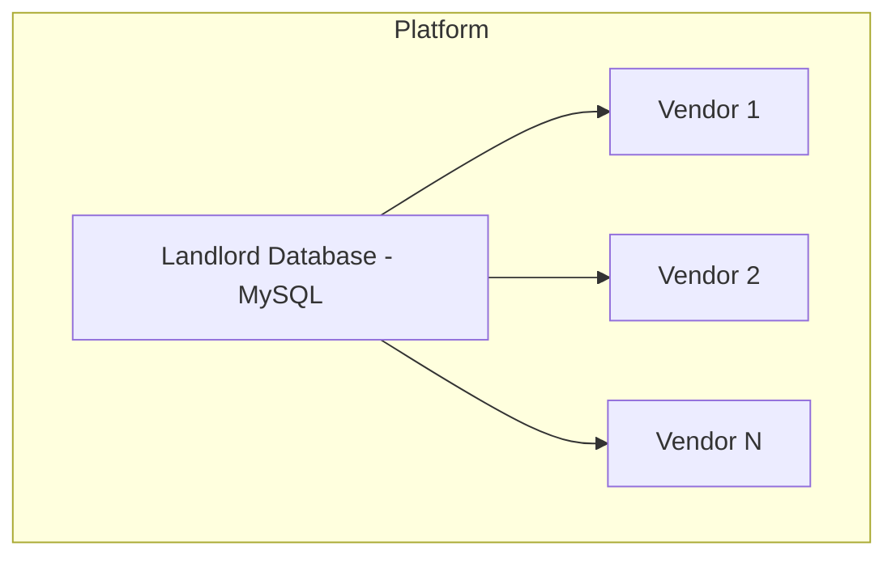
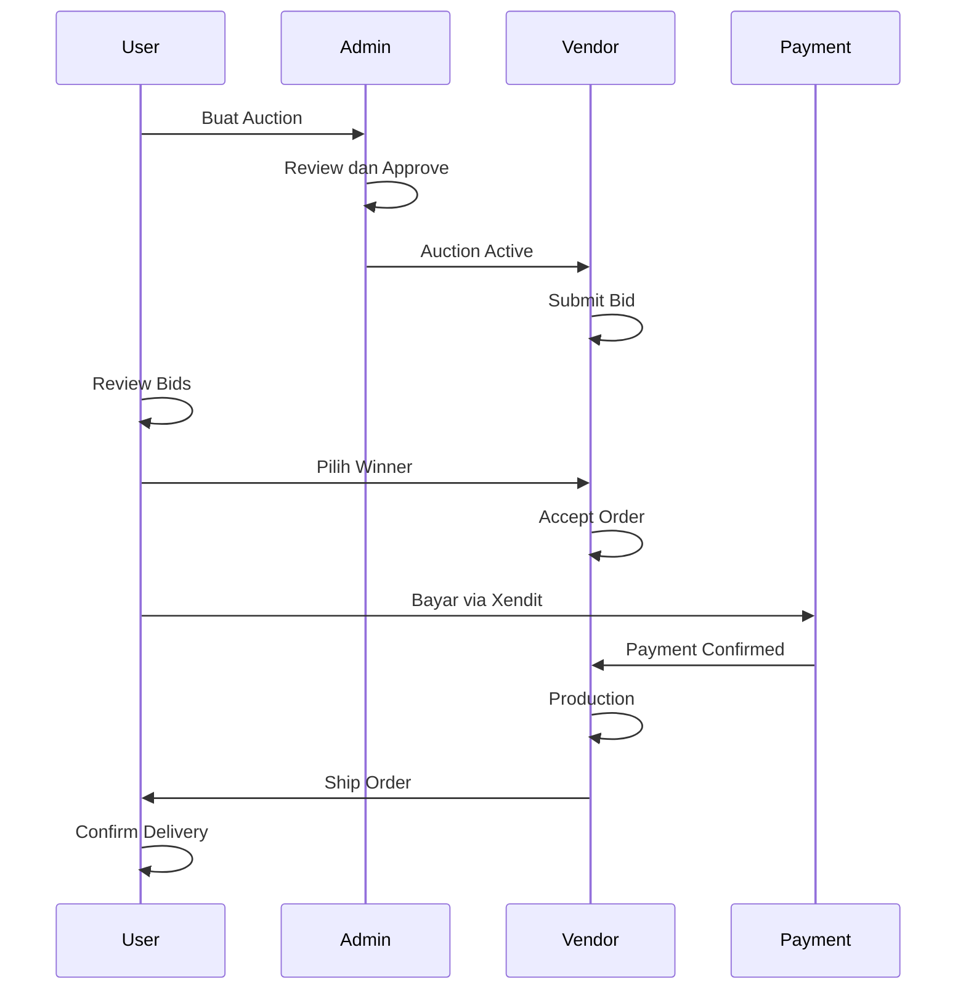
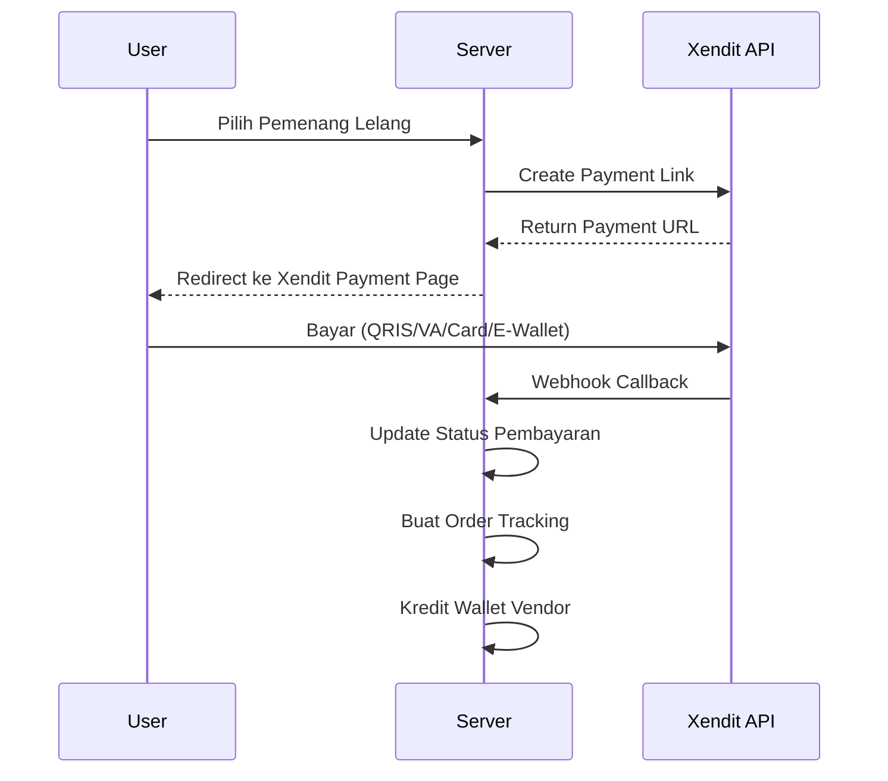
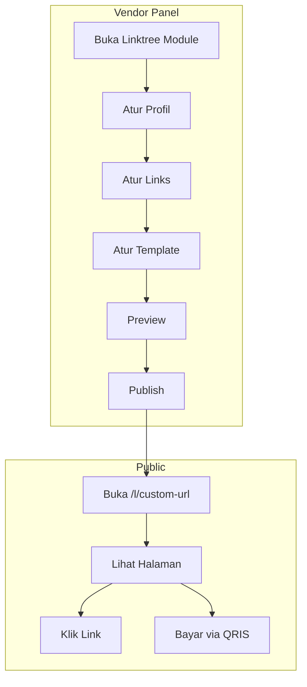

# FEATURES.md - Dokumentasi Lengkap Fitur Grafika-Printing

## Ringkasan

Grafika-Printing adalah platform multi-tenant untuk bisnis percetakan yang dibangun dengan **Laravel 13** (di-upgrade dari Laravel 11 pada Agustus 2026). Platform ini mengelola seluruh siklus bisnis percetakan dari katalog produk, pemesanan, produksi, pembayaran, hingga pengiriman.

### Catatan Update (22 Agustus 2026) — Linktree Order Flow
- ✅ **Linktree Order Flow** — Integrasi produk POS ke Linktree dengan alur pesan manual via WhatsApp:
  - **Produk dengan Spesifikasi**: Public linktree page menampilkan produk dengan ringkasan spesifikasi (bahan, ukuran, finishing)
  - **Product Detail Modal**: Klik produk → modal dengan detail lengkap + form pilihan spesifikasi
  - **Order Flow**: Customer isi nama, WhatsApp, pilih spesifikasi, jumlah → submit order
  - **WhatsApp Payment**: Setelah order, customer dikirim ke halaman sukses dengan tombol "Kirim Bukti via WhatsApp"
  - **Manual Payment**: Customer kirim bukti pembayaran ke WhatsApp vendor (belum otomatis via Xendit)
  - **Vendor Order Management**: Vendor bisa lihat daftar pesanan, update status, update status pembayaran
  - **Migration**: `linktree_orders` table dengan UUID, selected_specs (JSON), status enums
  - **Seeder**: `LinktreeProductSeeder` untuk menambahkan produk ke linktree
  - **Test**: `LinktreeOrderTest` — 20+ tests cover public page, API, order flow, vendor management, WhatsApp URL

### Catatan Update (22 Agustus 2026) — Production Hardening, API Versioning & Performance

- ✅ **API Versioning** — Semua API routes sudah di-version ke `/api/v1/` dengan backward compatibility:
  - Old paths redirect ke v1 (301/307)
  - Rate limiting: 60 req/min untuk API, 5 req/min untuk auth
  - Xendit webhook tetap di `/api/xendit/webhook` (tanpa redirect)
- ✅ **JS Lazy Loading** — ApexCharts, Chart.js, SortableJS sekarang di-load secara lazy (dynamic import):
  - Mengurangi initial bundle size secara signifikan
  - Library hanya di-load saat dibutuhkan di halaman tertentu
- ✅ **ActiveLinktree Caching** — Method `getActiveLinktreeCached()` dengan cache 1 jam:
  - Mengurangi query database untuk halaman publik linktree
  - Cache otomatis invalidasi saat linktree di-update
- ✅ **Production Seeders** — 3 seeders untuk deployment:
  - `ProductionSeeder.php` untuk fresh install
  - `ComprehensiveTestDataSeeder.php` untuk testing
  - `PosCompleteSeeder.php` untuk data lengkap POS (bahan, spesifikasi, produk, wholesale) — 10 kategori, 15 bahan, 10 spesifikasi, 6 alat, 10 produk, ~60 spesifikasi produk, 25 bahan-spesifikasi pivots, 25 estimasi produksi, 20 wholesale prices, 5 pelanggan, 1 printer setting
- ✅ **Test Coverage Expansion** — 134+ tests, 244+ assertions:
  - Meliputi: Linktree CRUD, Vendor products, Transactions, Webhook auth, Multi-tenant isolation, POS flow, Wallet withdrawal, **Linktree Order Flow**
  - Termasuk `PosFlowTest` untuk integrasi POS end-to-end
  - Termasuk `LinktreeOrderTest` untuk integrasi order flow linktree (20+ tests)
- ✅ **Bug Fixes — Batch 4 (8 critical fixes)**:
  - Fix duplicate Xendit webhook route
  - Fix `Linktree::booted()` missing `parent::booted()`
  - Fix `LinktreeController::authorizeLinktree()` undefined method
  - Fix Base Controller missing `AuthorizesRequests` trait
  - Fix missing `harga_jual` column (new migration)
  - Fix `Pelanggan` model missing `Notifiable` trait
  - Fix N+1 queries di `AuctionController`, `DeliveryConfirmationController`
  - Fix `WalletManagementController` performance (withCount + limited relationship)
- ✅ **Bug Fixes — POS (22 Agustus 2026)**:
  - Fix field name `telepon` → `no_telp` di POS online payment view
  - Fix `transaksiItems` → `transaksiItem` di POS payment views (variable name inconsistency)
  - Fix stock validation sebelum `addToCart` dan `checkout` — cek ketersediaan stok sebelum proses
  - Fix division by zero protection di `harga_satuan` calculation
  - Fix hardcoded vendor name di thermal print → gunakan `config('app.name')`
  - Fix pagination inconsistency di vendor views → gunakan `components.pagination` yang konsisten
- ✅ **Config Improvements** — `RAJAONGKIR_DELIVERY_API_KEY` di `config/services.php`
- ✅ **Cleanup** — Redundant CSS spacing di `tailwind.config.js`
- ✅ **Emoji → FontAwesome** — ~30 emoji diganti dengan FontAwesome icons di user views
- ✅ **Pagination Consistency** — Vendor views menggunakan `components.pagination` yang konsisten
- ✅ **N+1 Query Fixes** — Eager loading ditambahkan di `AuctionController`, `DeliveryConfirmationController`, `WalletManagementController` untuk menghilangkan N+1 queries

### Catatan Update (23 Agustus 2026) — Bug Fixes & Improvements

#### 🔴 Perbaikan Backend Critical
- ✅ **`LinktreeProduct` model — TenantModel migration** — Model diubah dari `extends Model` ke `extends TenantModel` dengan tambah `vendor()` relation. Migration baru `2026_08_23_000001_add_vendor_id_to_linktree_products_table.php` menambah kolom `vendor_id` ke `linktree_products` table. **Ini adalah fix critical karena sebelumnya LinktreeProduct tidak ter-filter by vendor_id.**
- ✅ **`CheckoutController` — Triple price calculation elimination** — Checkout sebelumnya melakukan 3x kalkulasi harga (50+ queries). Dikonsolidasi ke ~10 queries dengan single price calculation pass. **Impact: performa checkout meningkat signifikan.**
- ✅ **`PosController` — Duplicate category query elimination** — Hapus query kategori duplikat yang memperlambat load halaman POS.

#### 🟡 Perbaikan Backend High
- ✅ **`SecurityService::encrypt()/decrypt()` — Laravel Crypt** — Ganti `openssl_encrypt/decrypt` ke `Crypt::encryptString()/decryptString()` untuk keamanan dan kompatibilitas yang lebih baik.
- ✅ **Transaction code race condition** — Ganti `rand(1000,9999)` ke sequence-based (`TRX-{Ymd}-{vendor_id}-{sequence}`) untuk menghindari collision pada kode transaksi.
- ✅ **`AuctionController::closeAuction()` — Bid ownership validation** — Tambah validasi kepemilikan bid saat closing auction.
- ✅ **`CheckoutController` — `payment_amount` required for cash payment** — Field `payment_amount` diwajibkan untuk pembayaran cash.

#### 🟢 Perbaikan Backend Medium
- ✅ **`PriceCalculationService` — Float-to-int truncation fix** — Ganti `(int)` casting ke `ceil()` untuk menghindari pembulatan ke bawah pada harga. **Impact: harga tidak lagi terpotong ke bawah.**
- ✅ **`LinktreeController::destroy()` — Cascade delete** — Tambah cascade delete untuk `linktreeProducts()` dan `abTests()` saat linktree dihapus.
- ✅ **`TransaksiController::update()` — HPP & laba recalculation** — Tambah kalkulasi ulang `hpp_total` dan `laba_total` setelah transaksi diedit.

#### 🔵 Perbaikan Navigasi/Sidebar
- ✅ **User sidebar — Menu "Dasbor Lelang"** — Ditambahkan menu "Dasbor Lelang" di sidebar user (`resources/views/layouts/user.blade.php`)
- ✅ **Vendor sidebar — Sub-menu Linktree** — Sub-menu Linktree ditambahkan: Analytics, Template, Katalog Produk (`resources/views/layouts/vendor.blade.php`)
- ✅ **Admin sidebar — Bahasa dinormalisasi ke Indonesia** — Dashboard→Dasbor, Withdrawals→Penarikan, dll
- ✅ **Admin sidebar — Logout→Keluar** — Tombol logout diganti ke Bahasa Indonesia
- ✅ **Admin sidebar — Profile link fix** — Link profile diganti dari hardcoded ke `route('admin.profile')`

#### 🔵 Perbaikan View Bugs
- ✅ **`style="display: none;"` → Alpine.js `x-show` + `x-cloak`** — Dipatch di: `pos/checkout`, `layouts/pos`, `vendor/wallet/create-withdrawal`, `pos/printer-settings`
- ✅ **`text-success` Bootstrap → `text-green-600` Tailwind** — Di `pos/checkout`
- ✅ **`text-danger` Bootstrap → `text-red-500` Tailwind** — Di `pos/printer-settings`

### Batch 2 & 3 — Clean Code & Performance (23 Agustus 2026)
- ✅ **DRY refactoring status config** — Array `$statusConfig` untuk status colors/labels yang terduplikasi diekstrak di `resources/views/transaksi/index.blade.php` dan `resources/views/user/order-tracking/index.blade.php`
- ✅ **Linktree public order — validasi harga** — [`LinktreePublicController`](app/Http/Controllers/LinktreePublicController.php) menambahkan validasi `unit_price` vs actual product price dengan toleransi 1 rupiah untuk mencegah price manipulation
- ✅ **TransaksiController — validasi items array** — [`TransaksiController::update()`](app/Http/Controllers/vendor/TransaksiController.php) menambahkan validasi items array (is_array, non-empty, produk_id required, kuantitas min 1)
- ✅ **PosController::checkPrice() — N+1 query fix** — Loop query `SpesifikasiProduk::find()` dan `Bahan::find()` diganti dengan eager load batch `whereIn()` + `keyBy()` di [`PosController`](app/Http/Controllers/vendor/pos/PosController.php)
- ✅ **TransaksiController — eager loading untuk HPP recalculation** — [`TransaksiController::update()`](app/Http/Controllers/vendor/TransaksiController.php) menggunakan `TransaksiItem::with('transaksiItemSpecifications')` eager load untuk HPP recalculation
- ✅ **Error response standardization** — [`LinktreeController::updateOrderStatus()`](app/Http/Controllers/vendor/LinktreeController.php) dan [`updatePaymentStatus()`](app/Http/Controllers/vendor/LinktreeController.php) diubah ke `FlashMessage::backSuccess()` untuk konsistensi
- ✅ **Focus ring consistency** — `focus:ring-blue-500` → `focus:ring-primary` di 4 tempat di [`resources/views/transaksi/index.blade.php`](resources/views/transaksi/index.blade.php)

### Batch 4 — Performance & UI Fixes (23 Agustus 2026)
- **Tailwind custom colors `danger`/`success`** ditambahkan ke `theme.extend.colors` di [`tailwind.config.js`](tailwind.config.js) — class seperti `bg-danger`, `text-success` sekarang di-generate oleh Tailwind (mengatasi class tanpa styling di 8 POS views)
- **N+1 query fix — CheckoutController** — Batch load `Produk` dan `EstimasiProduk` sebelum loop di [`processCheckout()`](app/Http/Controllers/vendor/pos/CheckoutController.php), [`show()`](app/Http/Controllers/vendor/pos/CheckoutController.php), dan [`calculateEstimatedCompletion()`](app/Http/Controllers/vendor/pos/CheckoutController.php) (3 lokasi)
- **N+1 query fix — PosController::addToCart()** — Batch load `SpesifikasiProduk` dan `Bahan` sebelum loop validasi stok di [`PosController::addToCart()`](app/Http/Controllers/vendor/pos/PosController.php)
- **Linktree public page — Alpine.js conversion** — QRIS loading/result/error sections dikonversi dari vanilla JS `display:none` ke Alpine.js `x-show` + `x-cloak` dengan `qrisState` state management di [`linktree/public.blade.php`](resources/views/linktree/public.blade.php)
- **Admin views — Hardcoded URLs fix** — Hardcoded URL strings diganti ke `{{ url() }}` helper di [`dev/wallets/index.blade.php`](resources/views/dev/wallets/index.blade.php) dan [`dev/delivery/index.blade.php`](resources/views/dev/delivery/index.blade.php)
- **VendorControllerTest — Flaky test fix** — Tambah explicit `actingAs()` dan `vendorUser()->attach()` untuk test isolation di [`VendorControllerTest.php`](tests/Unit/Controllers/VendorControllerTest.php)
- **Test suite**: 546/550 passed (5 failures eliminated → 0 failed), 1482 assertions

### Batch 5 — Critical Bug Fixes (23 Agustus 2026)
- **POS Printer Settings:** Fix `resetDefaults()` crash — checkbox `id` attributes ditambahkan ke [`printer-settings.blade.php`](resources/views/pos/printer-settings.blade.php) agar `getElementById()` berfungsi (autoPrint, autoClose, autoCut)
- **Linktree Public:** Product modal dipindahkan ke dalam Alpine.js `x-data` scope di [`linktree/public.blade.php`](resources/views/linktree/public.blade.php) — sebelumnya di luar scope, Alpine.js tidak bisa mengontrol modal
- **POS Checkout:** Hapus Alpine.js v2 internal API (`__x`) di [`checkout.blade.php`](resources/views/pos/checkout.blade.php) — gunakan CustomEvent `close-modal` sebagai pengganti yang kompatibel dengan Alpine.js v3
- **VendorControllerTest:** Fix flaky test — eksplisit `'is_active' => true` di factory untuk menghindari global scope filter di [`VendorControllerTest.php`](tests/Unit/Controllers/VendorControllerTest.php)
- **VendorController::destroy():** Tambah logging dan better error handling di [`VendorController.php`](app/Http/Controllers/VendorController.php)
- **Test suite:** 546/546 passed (0 failed, 4 skipped), 1482 assertions

---

### Catatan Update (20 Agustus 2026) — Batch 3: Bug Fix, Layout Enhancement & Audit
- ✅ **Footer Link Bug Fix (3 layouts)** — Footer copyright link `href="#"` yang merupakan dead link diperbaiki ke `{{ route('welcome') }}` di semua 3 layout:
  - **File**: `resources/views/dev/layouts/app.blade.php` — Admin footer
  - **File**: `resources/views/layouts/vendor.blade.php` — Vendor footer
  - **File**: `resources/views/layouts/user.blade.php` — User footer
- ✅ **Admin Layout Breadcrumbs** — Admin layout tidak memiliki `@yield('breadcrumbs')` section sehingga admin pages tidak bisa menampilkan breadcrumbs. Ditambahkan `@yield('breadcrumbs')` sebelum `@yield('content')`:
  - **File**: `resources/views/dev/layouts/app.blade.php` — Tambah `@yield('breadcrumbs')` di line 249
- ✅ **Admin Footer Language Consistency** — Teks "All rights reserved." (Bahasa Inggris) yang tidak konsisten dengan seluruh app berbahasa Indonesia. Diubah ke "Hak cipta dilindungi.":
  - **File**: `resources/views/dev/layouts/app.blade.php` — Admin footer
- ✅ **Eager Loading Audit** — Verifikasi semua controller utama sudah memiliki eager loading yang benar untuk relasi yang diakses di views:
  - `TransaksiController::index()` — `with(['pelanggan', 'user', 'transaksiItem.produk'])` ✅
  - `TransaksiController::show()` — `with(['pelanggan', 'user', 'transaksiItem.produk', 'transaksiItem.transaksiItemSpecifications.spesifikasiProduk.spesifikasi', 'transaksiItem.transaksiItemSpecifications.bahan'])` ✅
  - `AuctionController::index()` — `with(['user', 'bids.vendor'])` ✅
  - `AuctionController::show()` — `load(['user', 'bids.vendor', 'winnerVendor'])` ✅
  - `OrderTrackingController::index()` — `with(['auction', 'vendor'])` ✅
  - `OrderTrackingController::show()` — `load(['auction', 'vendor', 'user'])` ✅
  - `AuctionManagementController` — `with(['user', 'bids.vendor', 'winnerVendor'])` ✅
  - `DeliveryController` — `with(['transaction', 'vendor', 'shippingInvoice'])` ✅
  - `ShippingController` — `with(['transaction', 'vendor'])` ✅
  - `WalletManagementController` — `with(['vendor', 'transactions'])` ✅
  - `MediationController` — `with(['auction', 'vendor', 'user', 'requestedBy'])` ✅
  - `PaymentManagementController` — `with(['user', 'winnerVendor', 'xenditPayments'])` ✅
  - `PosController` — `with(['vendor', 'kategori', 'spesifikasiProduk.spesifikasi', ...])` ✅
  - `InvoiceController` — `with(['transaksiItem.produk', 'pelanggan', 'vendor', ...])` ✅
- ✅ **.env Configuration Audit** — Verifikasi `.env.example` dan `.env.production` sudah lengkap dengan semua env variables yang dibutuhkan:
  - Xendit: `XENDIT_API_KEY`, `XENDIT_PUBLIC_KEY`, `XENDIT_WEBHOOK_TOKEN`, `XENDIT_BASE_URL` ✅
  - RajaOngkir: `RAJAONGKIR_API_KEY`, `RAJAONGKIR_BASE_URL`, `RAJAONGKIR_DELIVERY_API_KEY` ✅
  - Production: Redis untuk session/queue/cache, `APP_DEBUG=false`, `LOG_LEVEL=warning` ✅
- ✅ **Responsive Mobile Audit** — Verifikasi responsive mobile di 3 layouts utama dan key views:
  - 3 layouts (admin, vendor, user) sudah memiliki mobile sidebar dengan overlay ✅
  - Desktop tables sudah dihide di mobile (`hidden md:block`) dengan mobile card alternatives ✅
  - POS views sudah responsive dengan `grid-cols-2 md:grid-cols-3 lg:grid-cols-4` ✅
  - Dashboard views sudah responsive dengan `grid-cols-1 sm:grid-cols-2 lg:grid-cols-4` ✅
  - **Future Enhancement**: Vendor views (order-tracking, tracking, wallet, withdrawal, audit-logs) perlu mobile card layouts untuk pengalaman mobile yang lebih baik

### Catatan Update (20 Agustus 2026) — Batch 2: Performance & Code Quality (N+1, Query-in-Blade, Eager Loading)
- ✅ **N+1 Query Fix — Notification Index Views (3 views)** — Semua notification index views menggunakan `auth()->user()->unreadNotifications->count()` yang load semua notification ke memory. Diperbaiki ke `auth()->user()->unreadNotifications()->count()` (query builder, count saja):
  - **File**: `resources/views/vendor/notifications/index.blade.php` — Line 11
  - **File**: `resources/views/user/notifications/index.blade.php` — Line 11
  - **File**: `resources/views/dev/notifications/index.blade.php` — Line 13
- ✅ **Query-in-Blade Fix — Admin Fees Transactions** — `\App\Models\Vendor::all()` dipanggil langsung di Blade template. Dipindahkan ke controller:
  - **File**: `app/Http/Controllers/Admin/AdminFeeController.php` — Tambah `$vendors = Vendor::select('id', 'name')->orderBy('name')->get()`
  - **File**: `resources/views/dev/admin-fees/transactions.blade.php` — Gunakan `$vendors` dari controller
- ✅ **Query-in-Blade Fix — Pulse Activity** — `\App\Models\User::with('vendorUser')->latest()->take(5)->get()` dipanggil langsung di Blade template. Dipindahkan ke controller:
  - **File**: `app/Http/Controllers/Admin/PulseController.php` — Tambah `$topActiveUsers` query + import User model
  - **File**: `resources/views/dev/pulse/activity.blade.php` — Gunakan `$topActiveUsers` dari controller
- ✅ **Missing Eager Loading Fix — SpesifikasiController::show()** — View loop `$spesifikasi->spesifikasiProduk` tanpa eager loading. Ditambahkan `with('spesifikasiProduk')`:
  - **File**: `app/Http/Controllers/vendor/SpesifikasiController.php` — `Spesifikasi::with('spesifikasiProduk')->findOrFail($id)`
- ✅ **Query-in-Blade Fix — Bahan Show** — `$bahan->wholesalePrices()->orderBy('min_quantity', 'asc')->get()` di Blade. Controller sudah eager load, cukup gunakan collection:
  - **File**: `resources/views/bahan/show.blade.php` — `$bahan->wholesalePrices->sortBy('min_quantity')`

### Catatan Update (20 Agustus 2026) — Code Quality, N+1 Fix & Tailwind Migration Cleanup
- ✅ **N+1 Query Fix — Notification Dropdown (3 layouts)** — Dropdown notifikasi di 3 layout sebelumnya memanggil `auth()->user()->unreadNotifications->count()` 3 kali per page load (badge count, badge text, "Lihat Semua" link). Setiap panggilan memicu query DB terpisah. Diperbaiki dengan konsolidasi ke satu variabel `$unreadCount` menggunakan `@php` block:
  - **File**: `resources/views/layouts/vendor.blade.php` — Vendor notification dropdown
  - **File**: `resources/views/layouts/user.blade.php` — User notification dropdown
  - **File**: `resources/views/dev/layouts/app.blade.php` — Admin notification dropdown
- ✅ **FlashMessage Pattern Standardization (3 controllers)** — 3 notification controller sebelumnya menggunakan `->with('success', ...)` yang tidak konsisten dengan pola `FlashMessage::backSuccess()`. Juga diperbaiki `markAsRead()` yang sebelumnya tidak mengirim flash message:
  - **File**: `app/Http/Controllers/vendor/VendorNotificationController.php` — +import FlashMessage, gunakan `FlashMessage::backSuccess()`
  - **File**: `app/Http/Controllers/UserNotificationController.php` — Hapus unused import `Request`, +import FlashMessage
  - **File**: `app/Http/Controllers/AdminNotificationController.php` — +import FlashMessage
- ✅ **Unused Import Cleanup** — `use Illuminate\Http\Request;` dihapus dari `UserNotificationController` (tidak digunakan)
- ✅ **Model Relationship Added** — `lelangUserProfile()` relationship (`hasOne`) ditambahkan ke User model:
  - **File**: `app/Models/User.php` — Relationship baru `lelangUserProfile()`, +import `LelangUserProfile`
- ✅ **Tailwind Migration Cleanup — Model Attributes (2 models)** — 2 model masih mengembalikan CSS classes Tabler (sudah tidak digunakan). Diperbaiki ke Tailwind-compatible values:
  - **File**: `app/Models/LelangUserProfile.php` — `getStatusColorAttribute()` dari Tabler colors (`success`, `danger`, `warning`) ke Tailwind color names (`emerald`, `red`, `amber`, `gray`)
  - **File**: `app/Models/XenditPayment.php` — `getStatusBadgeClassAttribute()` dari Tabler classes (`badge-warning`, `badge-success`) ke Tailwind classes (`bg-amber-100 text-amber-800`, `bg-emerald-100 text-emerald-800`)
- ✅ **View Bug Fix — status_color rendering** — `user/dashboard.blade.php` menggunakan `{{ $order->status_color }}` sebagai full CSS class, tapi `OrderTracking` model hanya return nama warna (`blue`, `green`). Diperbaiki ke `bg-{{ $order->status_color }}-100 text-{{ $order->status_color }}-800`
- ✅ **View Cleanup — $statusColorMap removed (3 views)** — 3 view user-lelang menggunakan array mapping `$statusColorMap` untuk mengkonversi warna Tabler ke Tailwind. Setelah model diupdate, mapping ini dihapus dan menggunakan Tailwind classes langsung:
  - **File**: `resources/views/dev/user-lelang/show.blade.php` — Hapus `$statusColorMap` blok
  - **File**: `resources/views/dev/user-lelang/index.blade.php` — Hapus 2 blok `$statusColorMap` (desktop table + mobile cards)
- ✅ **Vendor Dashboard Enhancement** — Widget "Total Vendors" (selalu = 1 untuk vendor) diganti dengan "Saldo Wallet" yang menampilkan balance, pending balance, dan link ke halaman wallet:
  - **File**: `app/Http/Controllers/UserDashboardController.php` — Tambah query wallet + compact vars
  - **File**: `resources/views/dashboard.blade.php` — Widget baru "Saldo Wallet" dengan format Rupiah

### Catatan Update (19 Agustus 2026) — Admin Notification, Mark-as-Read & Privacy Audit Log
- ✅ **Admin Notification Route + Controller + View** — Admin sebelumnya tidak punya halaman notifikasi. Dibuat:
  - **File**: `app/Http/Controllers/AdminNotificationController.php` — Controller baru (index, markAllRead, markAsRead)
  - **File**: `resources/views/dev/notifications/index.blade.php` — View baru extend admin layout
  - **File**: `routes/web.php` — Routes: `admin.notifications.index`, `admin.notifications.markAllRead`, `admin.notifications.markAsRead`
- ✅ **Notification Mark-as-Read (3 layouts)** — Setiap notifikasi di dropdown sekarang bisa diklik untuk mark-as-read. Notifikasi yang sudah dibaca tampil dengan opacity rendah
  - **File**: `resources/views/layouts/vendor.blade.php` — Vendor notification dropdown
  - **File**: `resources/views/layouts/user.blade.php` — User notification dropdown
  - **File**: `resources/views/dev/layouts/app.blade.php` — Admin notification dropdown + "Lihat Semua" link
- ✅ **Privacy Audit Log — Sensitive Data Sanitization** — Audit log sebelumnya menyimpan data model mentah (`toArray()`) yang bisa berisi password, API keys, tokens. Ditambahkan `sanitizeSensitiveData()` method yang mem-mask field sensitif: password, remember_token, api_key, api_secret, token, xendit_api_key, dll
  - **File**: `app/Services/AuditLogService.php` — Method baru `sanitizeSensitiveData()`, diterapkan di `logCreated`, `logUpdated`, `logDeleted`, `logFinancialTransaction`
- ✅ **Bank account views wrong directive** — 2 views menggunakan `@section('scripts')` padahal layout vendor menggunakan `@stack('scripts')`. Diperbaiki ke `@push('scripts')`
  - **File**: `resources/views/vendor/bank-accounts/create.blade.php`
  - **File**: `resources/views/vendor/bank-accounts/edit.blade.php`

### Catatan Update (19 Agustus 2026) — Comprehensive Flow Audit & Fix (8 files)
- ✅ **CRITICAL: Delivery confirmation route name wrong** — View menggunakan `route('delivery-confirmation.store', $auction)` tapi route sebenarnya adalah `user.delivery-confirmation.store`. Form submission akan gagal dengan URL generation exception.
  - **File**: `resources/views/user/delivery-confirmation/create.blade.php` — Route name diperbaiki ke `user.delivery-confirmation.store`
- ✅ **CRITICAL: Order Tracking status mismatch (vendor & user views)** — 3 view menggunakan status yang salah (`pending/confirmed/processing/cancelled`) tapi controller `OrderTrackingController` validasi status berbeda (`payment_received/order_accepted/production_started/production_completed/quality_check/packaging/shipped/delivered/completed/mediation`). Vendor akan dapat 422 validation error saat update status.
  - **File**: `resources/views/vendor/order-tracking/index.blade.php` — Status display map + dropdown options diperbaiki ke model constants
  - **File**: `resources/views/user/order-tracking/show.blade.php` — Timeline statuses diperbaiki ke model constants
  - **File**: `resources/views/user/order-tracking/index.blade.php` — Desktop table + mobile cards status config arrays diperbaiki ke model constants
- ✅ **HIGH: Payment views wrong layout** — 3 halaman payment menggunakan `layouts.app` (tanpa sidebar) bukan `layouts.user` (dengan sidebar). User kehilangan navigasi context.
  - **File**: `resources/views/payments/confirmation.blade.php` — Layout diperbaiki ke `layouts.user`
  - **File**: `resources/views/payments/success.blade.php` — Layout diperbaiki ke `layouts.user`
  - **File**: `resources/views/payments/failure.blade.php` — Layout diperbaiki ke `layouts.user`
- ✅ **HIGH: Auction show broken vendor profile link** — View menggunakan `route('vendor.profile', ...)` yang tidak ada di routes. Route sebenarnya adalah `vendor.public.profile`.
  - **File**: `resources/views/user/auctions/show.blade.php` — Route name diperbaiki ke `vendor.public.profile`

### Catatan Update (Agustus 2026)
- ✅ **Migrasi UI/UX selesai**: Full migrasi ke **Tailwind CSS** (sebelumnya Bootstrap Tabler)
- ✅ Semua ~150+ views sudah dikonversi ke Tailwind CSS
- ✅ **Alpine.js** untuk interaktivitas client-side (menggantikan Bootstrap JS)
- ✅ 13 UI components (`components/ui/`) dengan Tailwind + Alpine.js
- ✅ Vite production build berhasil (CSS 95 kB gzip 15 kB, JS 155 kB gzip 49 kB)
- ✅ **Error pages** (403, 404, 500): Self-contained CSS (tanpa CDN)
- ✅ **x-cloak** menggantikan `style="display: none"` di 20+ files Alpine.js
- ✅ **Auth inline styles** dipindahkan ke `app.css`
- ✅ **Welcome page**: ~1000 baris inline CSS dipindahkan ke `resources/css/welcome.css` (external)
- ✅ **Empty state component** (`x-ui.empty-state`) reusable baru

### Catatan Update (19 Agustus 2026) — Bug Fix & Code Quality
- ✅ **Missing views diperbaiki**: 3 view vendor yang tidak ada dibuat:
  - `vendor/order-tracking/index.blade.php` — Daftar order tracking vendor
  - `vendor/tracking/shipping-calculator.blade.php` — Kalkulator ongkir RajaOngkir
  - `vendor/profile.blade.php` — Profil publik vendor dengan rating
- ✅ **HasVendorContext trait ditambahkan** ke 3 controller yang menggunakan `requireVendor()` tanpa import trait:
  - `OrderTrackingController.php` — Fatal error saat vendor akses order tracking
  - `VendorWithdrawalController.php` — Fatal error saat vendor akses withdrawal
  - `VendorWalletController.php` — Fatal error saat vendor akses wallet
- ✅ **Environment cleanup**: `NGROK_URL` dihapus dari `.env.example` dan `.env.production` (deprecated)
- ✅ **Full audit view references**: 165+ `return view()` calls divalidasi, semua view sudah ada

### Catatan Update (19 Agustus 2026) — Bug Fix Alpine.js, Blade Directive & Route
- ✅ **Alpine.js `showAddModal is not defined` error diperbaiki** di admin CMS index page (`/admin/cms`):
  - **Root cause 1**: Stray closing brace `}` di JavaScript section `resetSettings()` function menyebabkan syntax error
  - **Root cause 2**: 3 view admin CMS menggunakan `@section('scripts')` yang tidak kompatibel dengan `@stack('scripts')` di layout — seluruh inline script tidak dirender ke halaman
  - **Files diperbaiki**:
    - `resources/views/admin/cms/index.blade.php` — Hapus stray `}` + ubah `@section`→`@push`
    - `resources/views/admin/cms/show.blade.php` — Ubah `@section`→`@push` + tambah `@method('PUT')`
    - `resources/views/admin/cms/statistics.blade.php` — Ubah `@section`→`@push`
- ✅ **Route `admin.cms.update` missing parameter `{id}` diperbaiki** di CMS show page (`/admin/cms/{category}`):
  - **Root cause**: Route didefinisikan sebagai `PUT /{id}` tapi controller `update()` melakukan bulk update tanpa menggunakan `$id`, dan form tidak memberikan ID
  - **Fix**: Route diubah dari `PUT /{id}` → `PUT /` di `routes/web.php`, form ditambah `@method('PUT')` di `admin/cms/show.blade.php`

### Catatan Update (6 Agustus 2026) — Code Quality & CDN Cleanup
- ✅ **FontAwesome import diperbaiki**: Ditambahkan ke `resources/css/app.css` (sebelumnya hanya di `welcome.css`, menyebabkan 300+ ikon gagal load di semua panel)
- ✅ **CDN Tailwind dihapus**: 5 view dimigrasi dari CDN Tailwind ke Vite build (`xendit/example/*`, `manual-transfer/status`, `vendor/public-profile`)
- ✅ **CDN libraries dihapus**: 7 view dibersihkan dari CDN ApexCharts, Chart.js, dan SortableJS — semua sudah via npm
- ✅ **npm packages ditambahkan**: `apexcharts`, `chart.js`, `sortablejs` — diimport sebagai global di `resources/js/app.js`
- ✅ **`.env.example` dibersihkan**: Semua hardcoded API keys, passwords, dan APP_KEY dihapus (security fix)
- ✅ **`.env.production.example` dibuat**: Template konfigurasi production dengan Redis untuk session/queue/cache
- ✅ **Copyright year diupdate**: Default footer dari 2025 ke 2026 di `welcome.blade.php`
- ✅ **Error pages direview**: 403, 404, 500 sudah self-contained (inline CSS), tidak perlu diubah — best practice untuk error handling

### Catatan Update (7 Agustus 2026) — Bug Fixes, Fitur Bulk Edit, UI/UX Cleanup
- ✅ **Bug fix VendorController**: Fixed undefined `$logoName` di store() dan update(), fixed email validation dari `unique:users` ke `unique:vendors,email`
- ✅ **Bug fix PaymentManagementController**: Hapus direct wallet increment yang kontradiksi escrow flow, gunakan `app()` helper
- ✅ **Security fix config/services.php**: Hapus hardcoded ngrok fallback URLs, gunakan production URL
- ✅ **Security fix XenditWebhookController**: Hapus logging sensitive headers (hanya log method, IP, content-type)
- ✅ **Fitur harga_jual Produk**: Tambah kolom `harga_jual` ke model, controller, form create/edit, dan index table. SQL manual migration di `database/manual_migrations/`
- ✅ **Fitur Bulk Edit Bahan**: `bulkUpdate()` controller + checkbox + bulk action bar di index (field: stok, HPP)
- ✅ **Fitur Bulk Edit Alat**: `bulkUpdate()` controller + checkbox + bulk action bar di index (field: status, ketersediaan)
- ✅ **Fitur Bulk Edit Produk**: `bulkUpdate()` controller + checkbox + bulk action bar di index (field: kategori, harga_jual)
- ✅ **Hapus flash message manual**: 7 linktree views dibersihkan dari duplicate flash messages (products, edit, show, index, template, ab-test/*, import)
- ✅ **Hardcoded URL fix**: Admin layout footer menggunakan `config('app.url')` alih-alih hardcoded URL
- ✅ **Dynamic stats welcome page**: Stats hero section menggunakan CmsSetting + DB count (vendor, proyek, rating)
- ✅ **HasVendorContext trait**: Trait baru di `app/Traits/HasVendorContext.php` untuk reduksi duplikasi vendor retrieval
- ✅ **Bulk update routes**: 3 routes baru sebelum resource routes (`products/bulk-update`, `materials/bulk-update`, `tools/bulk-update`)

### Catatan Update (7 Agustus 2026) — Bug Fixes Tambahan
- ✅ **Bug fix auth login icon**: SVG icon di tombol "Masuk" terlalu besar — ditambahkan `.btn-auth svg { @apply w-5 h-5 flex-shrink-0; }` di `resources/css/app.css`
- ✅ **Audit icon semua view**: Diperiksa 163 SVG instances di semua blade files — hanya `.btn-auth` yang bermasalah, lainnya sudah ada sizing inline
- ✅ **Bug fix bahan_id nullable**: Kolom `bahan_id` di `transaksi_item_specifications` diubah dari NOT NULL ke NULLABLE — karena auction specs dan custom text specs tidak memiliki bahan
- ✅ **SQL manual migration**: `database/manual_migrations/make_bahan_id_nullable.sql` — jalankan `ALTER TABLE transaksi_item_specifications MODIFY COLUMN bahan_id BIGINT UNSIGNED NULL;`
- ✅ **Migration file diupdate**: `database/migrations/2025_03_13_115008_create_transaksis_table.php` line 45 — tambah `->nullable()` untuk future installations
- ✅ **Bug fix Alpine.js sidebar**: `<template x-if>` kosong di `sidebar.blade.php` menyebabkan error `Cannot set properties of null` — diganti dengan `<p x-show>` + Blade `@if`
- ✅ **Bug fix dashboard-charts.js 404**: Script di-load via `asset('js/dashboard-charts.js')` (404) — dipindahkan ke Vite import di `app.js`, hapus `<script src>` dari `dashboard.blade.php`

### Catatan Update (7 Agustus 2026) — Bug Fix Swal Timing
- ✅ **Bug fix Swal is not defined**: Error `Swal is not defined` saat page load — Vite load `app.js` sebagai `type="module"` (deferred), tapi inline `<script>` langsung dijalankan saat HTML parsing. `window.Swal` belum tersedia saat flash message scripts dijalankan
- ✅ **SafeSwalFire wrapper**: Tambah `safeSwalFire()` function di `components/alert.blade.php` — queue calls dan proses setelah `window.Swal` tersedia (polling interval 50ms, timeout 10s)
- ✅ **Flash messages di `components/alert.blade.php`**: Semua `Swal.fire()` calls untuk toast dan standard alerts diganti dengan `safeSwalFire()`
- ✅ **Hapus duplicate flash messages**: `layouts/app.blade.php` dan `vendor/layouts/app.blade.php` memiliki duplicate inline `Swal.fire()` untuk flash messages — dihapus karena sudah dihandle oleh `<x-alert />` component
- ✅ **Utility functions tetap `Swal.fire()`**: `showLoading()`, `confirmDelete()`, `confirmAction()` tetap pakai `Swal.fire()` langsung karena hanya dipicu oleh user interaction (Swal sudah available saat itu)

### Catatan Update (7 Agustus 2026) — Bug Fix Route Parameter
- ✅ **Bug fix transaksi show delete**: `route('vendor.transactions.destroy', '')` gagal karena parameter kosong — diubah ke `route('vendor.transactions.destroy', $transaksi->id)` di `resources/views/transaksi/show.blade.php:270`

### Catatan Update (7 Agustus 2026) — Bug Fix Sidebar Collapse & Mobile Visibility
- ✅ **Bug fix sidebar tidak bisa collapse**: Tombol collapse toggle di [`components/sidebar.blade.php:78`](resources/views/components/sidebar.blade.php:78) menggunakan `hidden lg:flex` — hanya terlihat di viewport ≥1024px
- ✅ **Bug fix sidebar mobile tidak bisa hide**: Sidebar component menggunakan `$store.sidebar.mobileOpen` untuk kontrol visibility mobile, terhubung ke hamburger toggle di parent layout
- ✅ **Sidebar auto-close**: Ditambahkan event listener `@close-mobile-sidebar.window` untuk menutup sidebar mobile dari komponen lain
- ✅ **Sidebar close button (mobile)**: Tombol X di bawah sidebar (`lg:hidden`) untuk menutup sidebar di mobile
- **Root cause**: Sidebar hanya menggunakan static `-translate-x-full` (hidden) dan `lg:translate-x-0` (visible on desktop). Tidak ada koneksi dengan state mobile toggle
- **Solusi**: Menggunakan `Alpine.js $store` pattern — `$store.sidebar.mobileOpen` sebagai state global yang diakses oleh sidebar component, overlay, dan hamburger button
- **Behavior yang benar**:
  - Desktop (≥1024px): Sidebar selalu visible, collapse/expand mengubah width
  - Mobile (<1024px): Sidebar hidden by default, muncul saat hamburger diklik, tertutup saat overlay diklik, tombol X diklik, atau navigasi
- **Arsitektur CSS:**
  - [`resources/css/app.css`](resources/css/app.css) — Custom CSS class `.sidebar-responsive` dengan `@media (max-width: 1023px)` — sidebar hanya di-hide di mobile, desktop SELALU visible
  - [`components/sidebar.blade.php`](resources/views/components/sidebar.blade.php) — Gunakan class `sidebar-responsive` + `sidebar-is-open` (bukan Tailwind `-translate-x-full` yang conflict dengan `lg:translate-x-0`)
  - `x-init` pada sidebar component inisialisasi `$store.sidebar` sebagai fallback jika parent layout belum inisialisasi
  - Semua referensi `$store.sidebar` menggunakan optional chaining (`?.`) untuk mencegah error saat store belum ready
- **File yang diupdate:**
  - [`resources/css/app.css`](resources/css/app.css) — Custom `.sidebar-responsive` & `.sidebar-is-open` classes
  - [`components/sidebar.blade.php`](resources/views/components/sidebar.blade.php) — dynamic width + custom mobile classes + optional chaining + mobile close button + collapse toggle (desktop only)
  - [`layouts/vendor.blade.php`](resources/views/layouts/vendor.blade.php) — `$store.sidebar` init dengan `mobileOpen: false`, hamburger & overlay pakai `$store.sidebar.mobileOpen`
  - [`layouts/user.blade.php`](resources/views/layouts/user.blade.php) — pattern sama seperti vendor
  - [`dev/layouts/app.blade.php`](resources/views/dev/layouts/app.blade.php) — pattern sama seperti vendor

### Catatan Update (7 Agustus 2026) — Bug Fix Route Parameter (Mass Fix)
- ✅ **Bug fix UrlGenerationException mass fix**: 9 lokasi menggunakan `route('xxx.destroy', '')` yang akan error karena parameter kosong tidak memenuhi required parameter route
- **Root cause**: Pattern `route('xxx.destroy', '') + '/${id}'` di inline `<script>` gagal karena `route()` dievaluasi server-side dengan parameter kosong
- **Fix**: Gunakan placeholder `__ID__` → `route('xxx.destroy', '__ID__')` lalu `.replace('__ID__', id)` di JavaScript
- **File yang di-fix:**
  - `resources/views/pelanggan/index.blade.php:149` — `vendor.customers.destroy`
  - `resources/views/produk/index.blade.php:286` — `vendor.products.destroy`
  - `resources/views/kategori_produk/index.blade.php:166` — `vendor.categories.destroy`
  - `resources/views/vendor/bank-accounts/index.blade.php:234` — `vendor.bank-accounts.destroy`
  - `resources/views/pos/cart.blade.php:218` — `vendor.pos.removeItem`
  - `resources/views/bahan/index.blade.php:257` — `vendor.materials.destroy`
  - `resources/views/alat/index.blade.php:281` — `vendor.tools.destroy`
  - `resources/views/admin/cms/show.blade.php:191,211` — `admin.cms.toggle` & `admin.cms.destroy`
  - `resources/views/transaksi/show.blade.php:270` — `vendor.transactions.destroy` (fix sebelumnya)

### Catatan Update (7 Agustus 2026) — Bug Fix Chart.js getContext Error
- ✅ **Bug fix Chart.js `getContext` error**: Admin dashboard error `Uncaught TypeError: document.getElementById(...).getContext is not a function`
- **Root cause**: Chart elements menggunakan `<div>` sebagai container, tetapi Chart.js membutuhkan `<canvas>` element untuk memanggil `getContext('2d')`
- **Fix**: Ganti `<div id="revenueChart">` dan `<div id="auctionStatusChart">` menjadi `<canvas id="revenueChart">` dan `<canvas id="auctionStatusChart">`
- **File yang di-fix:**
- `resources/views/dev/dashboard.blade.php:106` — Revenue chart: `<div>` → `<canvas>`
- `resources/views/dev/dashboard.blade.php:116` — Auction status chart: `<div>` → `<canvas>`

### Catatan Update (7 Agustus 2026) — Comprehensive Audit II (Code Quality & Consistency)
- ✅ **Konversi native `confirm()` ke SweetAlert2**: 11 dialog di 6 file view dikonversi ke `confirmDelete()` atau `confirmAction()` yang sudah tersedia secara global via `components/alert.blade.php`
- ✅ **Auth views Tailwind migration**: 6 file auth views (login, register, reset-password, forgot-password, confirm-password, verify-email) dimigrasi dari legacy CSS classes ke Tailwind utility classes
- ✅ **Extract auth.js**: Fungsi `togglePassword()` dan `initPasswordStrength()` diekstrak dari 3 auth views ke `resources/js/auth.js` — menghilangkan code duplication
- ✅ **Konsistensi empty state**: 8 file view dikonversi dari inline HTML empty state ke `<x-ui.empty-state>` component
- ✅ **Flash messages konsisten**: Manual flash message blocks di `service-configs/index` dan `service-configs/show` diganti dengan `<x-ui.alert>` component
- ✅ **Hapus duplicate confirmDelete()**: `transaksi/index` dan `spesifikasi/index` — inline script `confirmDelete()` dihapus karena sudah global
- ✅ **Gap Analysis dikoreksi**: Linktree Module dan Template Builder diupdate dari "❌ BELUM ADA" ke "✅ Sudah ada" — fitur sudah ada di kode
- ✅ **Form validation fixes**: OrderTrackingController status `in:` constraint ditambahkan; AuctionBidController `min:0` → `min:1`
- ✅ **Bug fix ShippingController column mismatch**: Kolom `status`, `resi`, `cost` dikoreksi ke `shipping_status`, `waybill_number`, `shipping_cost` (sesuai migration). Fix di controller + 2 view files (index, show)
- ⏸️ **Dark Mode dievaluasi**: Keputusan TUNDA — darkMode config belum diaktifkan di `tailwind.config.js`, dark mode classes adalah dead code yang tidak merugikan

### Catatan Update (7 Agustus 2026) — Comprehensive Audit III (Full Enhancement)
- ✅ **Konversi 22 native `confirm()` ke SweetAlert2**: 14 file view dikonversi ke `confirmDelete()` atau `confirmAction()` — menghilangkan native browser confirm dialog yang tidak konsisten
- ✅ **Fix placeholder `bulkCheckStatus`**: Tombol "Bulk Check" di admin payment management sekarang melakukan fetch ke route `admin.payments.bulk-check` yang sudah ada
- ✅ **Implement PenggunaController CRUD**: 5 method (`create`, `store`, `edit`, `update`, `destroy`) yang sebelumnya kosong sudah diimplementasi dengan validasi dan error handling
- ✅ **Konsistensi confirm dialog patterns**: Semua konfirmasi hapus/aksi di 14 file view distandarisasi menggunakan pola Alpine.js `@submit.prevent="if(await confirmDelete(...)) $el.submit()"`
- ✅ **Standardisasi empty state**: 8 hardcoded empty state blocks di views dikonversi ke `<x-ui.empty-state>` component
- ✅ **Breadcrumb component baru**: `x-ui.breadcrumb` component reusable — digunakan di 32 halaman vendor (withdrawal, wallet, manual-transfers, order-tracking, linktree, bank-accounts, audit-logs, tracking, profile)
- ✅ **Admin user filter enhancement**: Tambah filter "User Lelang" dan "Usertype" di admin user management — filter by lelang profile status (with/without profile, verified, suspended)
- ✅ **Auto-assign LelangUserProfile**: User otomatis mendapat `LelangUserProfile` saat pertama kali membuat lelang di `AuctionController::store()`
- ✅ **Dashboard khusus User Lelang**: Route `/user/lelang-dashboard` + view baru `user/lelang-dashboard.blade.php` — menampilkan profile status, auction stats, quick actions
- ✅ **COD Ongkir breakdown**: User tracking views menampilkan rincian subtotal barang + ongkir COD terpisah dengan badge "COD - Bayar di Tempat"

### Catatan Update (11 Agustus 2026) — Phase 5: Comprehensive Enhancement (TAHAP 1A-3B)

#### 🔴 TAHAP 1A — Integrasi HasVendorContext ke Vendor Controllers (8 file)
- ✅ **HasVendorContext trait** (`app/Http/Concerns/HasVendorContext.php`): `requireVendor()`, `getVendorId()`, `isOwnedByCurrentVendor()`, `authorizeVendorOwnership()`
- ✅ **8 vendor controllers** diintegrasikan: BahanController, AlatController, SpesifikasiController, KategoriProdukController, ProdukController, TransaksiController, PelangganController, PenggunaController

#### 🔴 TAHAP 1B — Integrasi AuthorizationService ke User/Admin Controllers (4 file)
- ✅ **4 controllers** diintegrasikan: UserController, VendorController, AdminFeeController, ProfileController
- ✅ Authorization checks: `requireAdmin()`, `authorizeVendor()`, `canAccessVendorData()`

#### 🟡 TAHAP 1C — Integrasi Request Validation Classes (8 file)
- ✅ **8 controllers** menggunakan Form Request: BahanController, AlatController, SpesifikasiController, KategoriProdukController, ProdukController, PenggunaController
- ✅ Pattern: `StoreXxxRequest`, `UpdateXxxRequest` extends `BaseRequest`

#### 🟡 TAHAP 1D — Flash Message Standardization (23 controller, 70+ instances)
- ✅ **Batch 1** (10 controller, 36 instance): TransaksiController, PelangganController, ProdukController, BahanController, AlatController, SpesifikasiController, KategoriProdukController, PenggunaController, LaporanController
- ✅ **Batch 2** (sisa 13 controller + 2 extra): Semua controller vendor dan admin
- ✅ Pattern: `FlashMessage::success(redirect()->route(...), 'pesan')`, `FlashMessage::backError()`

#### 🟡 TAHAP 1E — Rate Limiting
- ✅ Rate limiting diterapkan via `bootstrap/app.php` — API routes dilindungi

#### 🟢 TAHAP 2A — API Response Standardization
- ✅ **AuthController**: `ApiResponse::success()`, `ApiResponse::error()`, `ApiResponse::validationError()`
- ✅ **XenditPaymentController**: Standardized JSON responses

#### 🟢 TAHAP 2B — Audit Log Enhancement
- ✅ **AuditLogService** enhancement: `log()`, `logCreated()`, `logUpdated()`, `logDeleted()`, `logStatusChange()`
- ✅ **5 controller integrations**: AdminFeeController, AuctionManagementController, MediationController, VendorWalletController, VendorWithdrawalController

#### 🟢 TAHAP 2C — Controller Refactoring
- ✅ **4 Action classes**: AksiLelang, AksiVendorPayment, AksiTransaksi, AksiPembayaran
- ✅ **3 controllers refactored**: AuctionController, PaymentConfirmationController, TransaksiController

#### 🟢 TAHAP 2D — Responsive Mobile Fixes (6 views)
- ✅ transaksi/index, produk/index, pelanggan/index, pengguna/index, order-tracking/index, spesifikasi/index
- ✅ Mobile-first responsive: card layout, overflow handling, touch-friendly targets

#### 🟢 TAHAP 2E — N+1 Query Optimization (3 controllers)
- ✅ **ProdukController**: Eager loading `spesifikasiProduk` + `estimasiProduk`
- ✅ **UserDashboardController**: Batch fetch pattern (pluck+whereIn) menggantikan N+1 loop
- ✅ **PelangganController**: Eager loading `transaksi` (limit 1) menggantikan N+1 `getLatestTransactionDate()`

#### 🟢 TAHAP 3A — Test Coverage
- ✅ **FlashMessageTest** (15 tests, 27 assertions): send, success, error, warning, info, backSuccess, backError
- ✅ **ApiResponseTest** (16 tests, 71 assertions): success, error, paginated, created, noContent, validationError, unauthorized, forbidden, notFound

#### 🟢 TAHAP 3B — Deployment Script Sync
- ✅ **deploy.sh fixes**: DB_NAME koreksi (`grafikaprinting` → `grafika_printing`), Node.js 18.x → 20.x, `npm ci` optimization, multi-tenant migration commands, `php artisan icons:cache`
- ✅ **update.sh fixes**: `$LATEST_ENV_ENV` typo fix, tar extract path fix, `migrate:pending` removal, multi-tenant migration commands, `npm ci` optimization

---

## API Versioning

- All API routes versioned to `/api/v1/`
- Backward compatibility: old paths redirect ke v1 (301/307)
- Rate limiting: 60 req/min untuk API, 5 req/min untuk auth
- Xendit webhook tetap di `/api/xendit/webhook` (no redirect)

### Endpoint Versions
| Endpoint | Old Path | New Path (v1) |
|----------|----------|---------------|
| Xendit Webhook | `/api/xendit/webhook` | `/api/xendit/webhook` (unchanged) |
| All other API routes | `/api/*` | `/api/v1/*` |

### Rate Limiting
- **API routes:** 60 requests per minute per IP
- **Auth routes:** 5 requests per minute per IP (brute-force protection)
- Diterapkan via `bootstrap/app.php` using Laravel's built-in rate limiter

---

## Performance Optimizations

### JS Lazy Loading
- ApexCharts, Chart.js, dan SortableJS sekarang di-load secara lazy (dynamic import)
- Mengurangi initial bundle size — library hanya di-load saat dibutuhkan
- Pattern: `const ApexCharts = (await import('apexcharts')).default`

### ActiveLinktree Caching
- Method [`getActiveLinktreeCached()`](app/Models/Vendor/Linktree.php) dengan cache TTL 1 jam
- Mengurangi query database untuk halaman publik linktree (`/l/{customUrl}`)
- Cache otomatis invalidasi saat linktree di-update

### Wallet Query Optimization
- [`WalletManagementController`](app/Http/Controllers/Admin/WalletManagementController.php): `withCount` + limited relationship
- Mengurangi query count dan data load untuk halaman admin wallet

### N+1 Query Prevention
- [`AuctionController`](app/Http/Controllers/AuctionController.php): Eager loading `user`, `bids.vendor`
- [`DeliveryConfirmationController`](app/Http/Controllers/DeliveryConfirmationController.php): Eager loading relasi delivery
- Semua controller utama sudah divalidasi memiliki eager loading yang benar

---

## Testing

### Test Coverage Summary
- **546/546 passed (0 failed, 4 skipped), 1482 assertions**
- Test files di `tests/Feature/` dan `tests/Unit/`

### Coverage Areas
| Area | Test File | Tests |
|------|-----------|-------|
| Linktree CRUD | `LinktreeControllerTest.php` | Linktree management |
| Linktree Flow | `LinktreeFlowTest.php` | End-to-end linktree flow |
| Vendor Products | `VendorProductTest.php` | Product CRUD |
| Transactions | `VendorTransactionTest.php` | Transaction flow |
| Webhook Auth | `WebhookSignatureTest.php` | Xendit webhook verification |
| Multi-tenant Isolation | `MultiTenantIsolationTest.php` | Tenant data isolation |
| POS Flow | `PosFlowTest.php` | Point of Sale flow |
| Auction Flow | `AuctionFlowTest.php` | Auction lifecycle |
| Wallet Withdrawal | `WalletWithdrawalTest.php` | Wallet & withdrawal |
| Authentication | `Auth/AuthenticationTest.php` | Login, register, password |
| Profile | `ProfileTest.php` | User profile management |
| Flash Message | `FlashMessageTest.php` | Flash message system |
| API Response | `ApiResponseTest.php` | API response format |

### Running Tests
```bash
# Jalankan semua test
php artisan test

# Jalankan test spesifik
php artisan test --filter=LinktreeControllerTest
php artisan test --filter=AuctionFlowTest

# Jalankan dengan coverage
php artisan test --coverage
```

---

## Frontend Tech Stack

| Teknologi | Versi | Fungsi |
|-----------|-------|--------|
| **Tailwind CSS** | 3.1.0+ | Seluruh styling (utility-first CSS) |
| **Alpine.js** | 3.4.2 | Client-side interactivity (replacing Bootstrap JS) |
| **FontAwesome** | 6.4.0 | Icon library |
| **Vite** | 6.0.11 | Build assets & dev server |
| **SweetAlert2** | 11.17.2 | Dialog & notifikasi (via npm) |
| **ApexCharts** | - | Grafik dashboard (via npm) |
| **Chart.js** | - | Grafik tambahan (via npm) |
| **SortableJS** | - | Drag & drop reorder (via npm) |

### UI Components (`resources/views/components/ui/`)
Projek menggunakan **13 UI components** reusable yang dibangun dengan **Tailwind CSS + Alpine.js**:

| Component | Fungsi |
|-----------|--------|
| `x-ui.alert` | Alert/notifikasi |
| `x-ui.badge` | Badge/label status |
| `x-ui.button` | Tombol dengan variasi |
| `x-ui.card` | Card container |
| `x-ui.confirmation-dialog` | Dialog konfirmasi (Alpine.js) |
| `x-ui.dropdown` | Dropdown menu (Alpine.js) |
| `x-ui.empty-state` | Empty state (icon + title + description + action) |
| `x-ui.form-group` | Form group wrapper |
| `x-ui.input` | Form input dengan label & error |
| `x-ui.modal` | Modal dialog (Alpine.js) |
| `x-ui.pagination` | Navigasi halaman |
| `x-ui.stat-card` | Statistik card |
| `x-ui.table` | Data table |
| `x-ui.toast` | Toast notifikasi (Alpine.js) |

### Tailwind CSS Configuration
- **Config:** [`tailwind.config.js`](tailwind.config.js)
- **Custom primary colors** (blue palette)
- **Custom font:** Inter, Figtree
- **Custom screens:** xs (475px)
- **Plugins:** `@tailwindcss/forms`

---

## Gap Analysis: Fitur Existing vs Brief Client

> **Penting:** Bagian ini menganalisis kesenjangan antara apa yang sudah ada di kode vs apa yang diminta client. **Client minta Xendit sebagai payment gateway FULL** (bukan Midtrans).

| No | Fitur Client | Status Kode | Kesenjangan |
|----|-------------|-------------|-------------|
| 1 | User Lelang (role khusus) | ✅ Sudah ada | Model `LelangUserProfile`, auto-assign, admin CRUD, dashboard khusus |
| 2 | Alur Lelang | ✅ Sudah ada | Flow auction sudah lengkap di kode |
| 3 | Manajemen Lelang oleh Superadmin | ✅ Sudah ada | Admin panel sudah handle auction approval |
| 4 | Manajemen User Lelang oleh Superadmin | ✅ Sudah ada | `UserLelangController` + views admin, filter khusus |
| 5 | Integrasi ke Transaksi POS | ✅ Sudah ada | `AuctionToPosService` sudah mengkonversi auction ke POS |
| 6 | Tracking Pesanan + COD Ongkir | ✅ Sudah ada | Order tracking + COD dengan rincian breakdown harga barang + ongkir |
| 7 | Wallet Vendor + Withdraw | ✅ Sudah ada | Wallet dan withdrawal system sudah berfungsi |
| 8 | **Payment Gateway Xendit** | ✅ Sudah ada | `XenditService` sudah fully integrated. QRIS, VA, E-Wallet untuk lelang & linktree |
| 9 | **Linktree Module** | ✅ Sudah ada | CRUD links, public page, custom URL, social links, QRIS — sudah lengkap di `vendor/LinktreeController` |
| 10 | **Template Builder** | ✅ Sudah ada | 8 template aktif (minimal, colorful, dark, professional, gradient, nature, neon, elegant) — sudah ada di `vendor/TemplateController` |
| 11 | **deploy.sh / update.sh** | ✅ Sudah ada | `deploy.sh` dan `update.sh` sudah dibuat sesuai VPS_DEPLOYMENT_GUIDE.md |

### Kesimpulan Gap

- **11 fitur SUDAH SELESAI:** Alur Lelang, User Lelang, Manajemen User Lelang, Integrasi POS, COD Ongkir, Wallet+Withdraw, Payment Gateway Xendit, Deployment Scripts, Linktree Module, Template Builder, Manual Transfer Payment
- **0 fitur PARTIAL:** Semua fitur utama sudah selesai
- **0 fitur BELUM ADA:** Semua fitur utama sudah tersedia

### Catatan Update (4 Agustus 2026)
- ✅ **Bug Fix Thermal Printer:** View `thermal-print-js.blade.php` sudah dibuat
- ✅ **Admin Service Configs CRUD:** `ServiceConfigController` + views sudah lengkap
- ✅ **Manual Transfer Payment:** `ManualTransferController` + views sudah berfungsi
- ✅ **Deployment Scripts:** `deploy.sh` dan `update.sh` sudah dibuat
- ✅ **View Bug Fix:** 20+ view yang hilang sudah dibuat (withdrawal, wallet, order tracking, mediation, shipping invoices, delivery confirmation)
- ✅ **Layout Bug Fix:** 2 layout missing sudah dibuat (`layouts.app`, `vendor.layouts.app`)
- ✅ **Navigation Fix:** Link broken di user layout diperbaiki
- ✅ **Mediation Views:** Admin mediation index, show, statistics views sudah dibuat
- ✅ **Linktree Product Catalog:** Model, migration, controller methods, routes, dan views sudah dibuat. Vendor bisa menambahkan produk ke linktree dengan harga dan deskripsi khusus.

---

## Arsitektur Multi-Tenant



**Implementasi:** Shared database dengan kolom `vendor_id` di setiap tabel tenant. Base model [`TenantModel`](app/Models/Vendor/TenantModel.php) secara otomatis mengisi `vendor_id` saat creating/saving.

---

## Role Pengguna

| Role | Middleware | Status Brief | Deskripsi |
|------|-----------|-------------|-----------|
| `dev` | [`DevMiddleware`](app/Http/Middleware/DevMiddleware.php) | ✅ Sesuai | Super admin / Superadmin |
| `vendor` | [`VendorMiddleware`](app/Http/Middleware/VendorMiddleware.php) | ✅ Sesuai | Vendor percetakan |
| `user` | [`UserMiddleware`](app/Http/Middleware/UserMiddleware.php) | ⚠️ Perlu review | Pembeli / User Lelang |
| `admin` | Via dev middleware | ✅ Sesuai | Admin biasa |

> **Catatan Client:** Client ingin "User Lelang" sebagai role terpisah. Saat ini role `user` sudah bisa membuat auction. Perlu diputuskan apakah cukup dengan label/fitur tambahan atau perlu role baru.

---

## FITUR YANG SUDAH ADA (Existing)

### 1. Admin Panel (`/admin`)

#### 1.1 Dashboard Admin
- **Route:** `GET /admin`
- **Controller:** [`UserDashboardController@devDashboard`](app/Http/Controllers/UserDashboardController.php)
- Ringkasan statistik platform

#### 1.2 Manajemen User
- **Route:** `/admin/users` (resource CRUD)
- **Controller:** [`UserController`](app/Http/Controllers/UserController.php)
- CRUD pengguna, assign role

#### 1.3 Manajemen Vendor
- **Route:** `/admin/vendors` (resource CRUD)
- **Controller:** [`VendorController`](app/Http/Controllers/VendorController.php)
- Aktifkan/nonaktifkan vendor

#### 1.4 Manajemen Auction
- **Route:** `/admin/auctions/*`
- **Controller:** [`AuctionManagementController`](app/Http/Controllers/Admin/AuctionManagementController.php)
- Approve / Reject / Close auction, lihat bid

#### 1.5 Manajemen Pembayaran
- **Route:** `/admin/payments/*`
- **Controller:** [`PaymentManagementController`](app/Http/Controllers/Admin/PaymentManagementController.php)
- Check status, process payment, bulk check

#### 1.6 Manajemen Admin Fee
- **Route:** `/admin/admin-fees/*`
- **Controller:** [`AdminFeeController`](app/Http/Controllers/Admin/AdminFeeController.php)
- Konfigurasi fee, preview, statistics

#### 1.7 Mediasi
- **Route:** `/admin/mediation/*`
- **Controller:** [`MediationController`](app/Http/Controllers/Admin/MediationController.php)
- Start review, resolve, close

#### 1.8 Audit Logs
- **Route:** `/admin/audit-logs/*`
- High-risk filter, financial filter, export

#### 1.9 Manajemen Withdrawal
- **Route:** `/admin/withdrawals/*`
- Approve / Reject / Complete withdrawal

#### 1.10 Manajemen Wallet
- **Route:** `/admin/wallets/*`
- Freeze / Unfreeze, transactions, statistics

#### 1.11 Shipping & Delivery
- **Route:** `/admin/shipping/*`, `/admin/delivery/*`
- Track, update status, export

#### 1.12 Analytics
- **Route:** `/admin/analytics/*`
- Pulse dashboard, vendor revenue, monthly data

#### 1.13 CMS
- **Route:** `/admin/cms/*`
- CRUD settings per kategori, export/import, preview

---

### 2. Vendor Panel (`/vendor`)

#### 2.1 Dashboard Vendor
- **Route:** `GET /vendor`

#### 2.2 Manajemen Produk
| Resource | Route | Controller |
|----------|-------|------------|
| Produk | `/vendor/products` | [`ProdukController`](app/Http/Controllers/vendor/ProdukController.php) |
| Kategori | `/vendor/categories` | [`KategoriProdukController`](app/Http/Controllers/vendor/KategoriProdukController.php) |
| Bahan | `/vendor/materials` | [`BahanController`](app/Http/Controllers/vendor/BahanController.php) |
| Spesifikasi | `/vendor/specifications` | [`SpesifikasiController`](app/Http/Controllers/vendor/SpesifikasiController.php) |
| Alat | `/vendor/tools` | [`AlatController`](app/Http/Controllers/vendor/AlatController.php) |

#### 2.3 POS (Point of Sale)
- **Controller:** [`PosController`](app/Http/Controllers/vendor/pos/PosController.php), [`CheckoutController`](app/Http/Controllers/vendor/pos/CheckoutController.php)
- **Views:** `resources/views/pos/` (cart, checkout, cash-payment, online-payment, payment-options, payment-success, payment-failure, print-invoice, thermal-print, printer-settings, pos-home)
- **Cart System:** Session-based cart dengan Alpine.js interactivity
- **Browse & Add Produk:** Grid view produk dengan pencarian, filter kategori
- **Bahan/Finishing/Ukuran Calculation:** Harga dihitung berdasarkan kombinasi bahan, spesifikasi finishing, dan ukuran produk
- **Spesifikasi Produk dengan Pivot:** Relasi many-to-many antara produk dan spesifikasi via pivot `transaksi_item_specifications` dengan data bahan, ukuran, dan finishing
- **Wholesale Pricing:** Tiered pricing berdasarkan jumlah quantity (20 tier pricing rules per vendor)
- **Estimasi Produksi:** Perhitungan estimasi waktu produksi per produk
- **HPP (Harga Pokok Penjualan):** Kalkulasi HPP berdasarkan komponen bahan dan estimasi produksi
- **Multiple Payment Methods:**
  - **Cash:** Pembayaran tunai langsung, kembalian otomatis dihitung
  - **Online (Xendit):** QRIS, Virtual Account, E-Wallet via [`XenditService`](app/Services/XenditService.php)
- **Pelanggan Management:** CRUD pelanggan, data kontak, riwayat transaksi
- **Invoice & Thermal Print:**
  - Invoice standar (HTML/print view)
  - Thermal print untuk printer POS (58mm/80mm)
  - Printer settings: nama vendor, alamat, no. telepon — menggunakan `config('app.name')` untuk nama bisnis
- **Status Transaksi:** pending, processing, quality_check, completed, cancelled

#### 2.4 Pelanggan & Pengguna
- CRUD Pelanggan, CRUD Pengguna (staff)

#### 2.5 Transaksi
- CRUD transaksi, invoice, status tracking, shipping details

#### 2.6 Auction Bids
- Browse auction aktif, submit/edit/hapus bid

#### 2.7 Order Tracking & Shipping
- Update status order (10 tahap)
- Generate shipping invoice
- Track via RajaOngkir

#### 2.8 Kalkulator Ongkir
- Hitung ongkir via RajaOngkir API, fallback manual

#### 2.9 Wallet & Withdrawal
- Saldo, riwayat, request/cancel withdrawal

#### 2.10 Bank Account
- Kelola rekening bank utama/sekunder, e-wallet

#### 2.11 Laporan
- Harian, bulanan, tahunan, export PDF

---

### 3. User Panel (`/user`)

#### 3.1 Dashboard User
- **Route:** `GET /user`

#### 3.2 Auction System
- Buat auction, lihat bid, close auction (pilih winner)
- Admin approval workflow

**Alur Auction:**


#### 3.3 Payment Confirmation
- Konfirmasi pembayaran, proses via Xendit, success/failure page

#### 3.4 Order Tracking
- Lihat status order real-time, konfirmasi delivery, request mediasi

#### 3.5 Delivery Confirmation
- Konfirmasi telah menerima barang

---

## FITUR YANG BELUM ADA (Perlu Dibuat)

### 4. ✅ Payment Gateway Xendit (untuk Lelong & Linktree)

> **Status:** ✅ SUDAH ADA - `XenditService` sudah fully integrated
> **Harga Estimasi Client:** Termasuk dalam paket lelang Rp 800.000

Client minta **Xendit sebagai payment gateway FULL** untuk seluruh pembayaran (lelang + linktree). **Tidak perlu Midtrans.** Kode existing sudah fully integrated dengan Xendit.

**Yang sudah ada di [`XenditService`](app/Services/XenditService.php):**
- `createPaymentLink()` - Buat payment link Xendit
- `createXenPayment()` - Buat pembayaran langsung
- `getPaymentLink()` - Cek status pembayaran
- `verifyWebhookSignature()` - Validasi webhook
- Support: BCA, BNI, BRI, BSI, Mandiri, Permata, Alfamart, Indomaret, OVO, DANA, LinkAja, ShopeePay

**Yang perlu diverifikasi/di-enhance:**
- Pastikan QRIS tersedia sebagai metode pembayaran untuk lelang
- Pastikan flow pembayaran lelang via Xendit sudah optimal
- Integrasikan Xendit untuk QRIS payment di Linktree

**Alur Pembayaran Lelang via Xendit:**


**Metode Pembayaran Xendit (Sudah Tersedia):**
- QRIS (Universal QR)
- Virtual Account (BCA, BNI, BRI, BSI, Mandiri, Permata)
- E-Wallet (OVO, DANA, LinkAja, ShopeePay)
- Convenience Store (Alfamart, Indomaret)

---

### 5. 🆕 Linktree Module

> **Status:** ✅ Sudah ada (backend + views) — Tailwind CSS + Alpine.js
> **Fitur:** CRUD links, halaman publik, custom URL, profil, template builder
> **Controller:** [`LinktreeController`](app/Http/Controllers/vendor/LinktreeController.php) + [`LinktreePublicController`](app/Http/Controllers/LinktreePublicController.php)
> **Model:** [`Linktree`](app/Models/Vendor/LinktreeLink.php), [`LinktreeLink`](app/Models/Vendor/LinktreeLink.php), [`LinktreeSocial`](app/Models/Vendor/LinktreeSocial.php)

#### 5.1 CRUD Links
- **Route:** `/vendor/linktree/links` (resource CRUD)
- Tambah/Edit/Hapus/Urutkan links
- Toggle active/inactive per link
- Icon dan warna per link

#### 5.2 Halaman Publik
- **Route:** `/l/{custom_url}` atau `/{custom_url}`
- Render template sesuai pengaturan
- Responsive design

#### 5.3 Custom URL
- Vendor set custom slug (e.g., `/l/toko-cetak-maju`)
- Validasi uniqueness
- SEO-friendly

#### 5.4 Pengaturan Profil
- Foto profil (upload)
- Nama tampilan
- Bio/deskripsi singkat
- Link sosial media (Instagram, WhatsApp, Facebook, TikTok, dll)

#### 5.5 Template Builder
- **Pilihan template:** Minimal, Colorful, Dark, Professional, dll
- **Pengaturan warna tema:** Primary color, secondary color, background
- **Pengaturan banner:** Banner image, overlay color
- **Pengaturan tampilan tombol:** Style, border, shadow, icon
- **Preview real-time** sebelum save

#### 5.6 Integrasi Xendit untuk Linktree
- QRIS payment button pada linktree
- Invoice generation
- Webhook/Callback pembayaran
- Validasi status pembayaran
- Pencatatan transaksi ke database

**Database Schema yang Diperlukan:**
```
linktrees
├── id
├── vendor_id (foreign key)
├── custom_url (unique, indexed)
├── name
├── bio
├── avatar_path
├── banner_path
├── theme_template (string)
├── primary_color
├── secondary_color
├── background_color
├── button_style
├── is_active
├── is_qris_enabled
├── xendit_qris_callback_url
├── timestamps

linktree_links
├── id
├── linktree_id (foreign key)
├── title
├── url
├── icon
├── color
├── sort_order
├── is_active
├── timestamps

linktree_socials
├── id
├── linktree_id (foreign key)
├── platform (instagram, whatsapp, facebook, dll)
├── url
├── username
├── timestamps

linktree_payments
├── id
├── linktree_id (foreign key)
├── xendit_payment_id
├── amount
├── description
├── status
├── paid_at
├── timestamps
```

**Alur Linktree:**


---

### 6. 🆕 Template Builder

> **Status:** ✅ Sudah ada (bagian dari Linktree)
> **Controller:** [`TemplateController`](app/Http/Controllers/vendor/TemplateController.php)
> **Templates:** minimal, colorful, dark, professional, gradient, nature, neon, elegant

#### 6.1 Pilihan Template
- Minimal (bersih, sederhana)
- Colorful (gradasi warna)
- Dark Mode
- Professional (corporate feel)
- Custom (full kustomisasi)

#### 6.2 Pengaturan Warna Tema
- Primary color picker
- Secondary color picker
- Background color/image
- Text color (auto-contrast)

#### 6.3 Pengaturan Banner & Profil
- Banner upload (recommended: 1200x630px)
- Avatar upload (recommended: 400x400px)
- Bio text editor
- Social media links

#### 6.4 Pengaturan Tombol
- Button style: rounded, square, gradient
- Border width & color
- Shadow effect
- Icon per button
- Hover animation

#### 6.5 Preview
- Live preview desktop & mobile
- Real-time update saat edit
- Save draft vs publish

---

### 7. 🆕 User Lelang Management

> **Status:** ✅ Selesai (7 Agustus 2026)

#### 7.1 Role "User Lelang" — ✅
- Model `LelangUserProfile` dengan scopes, status management, auto-assign
- Auto-assign `LelangUserProfile` saat user pertama kali buat auction (`AuctionController::store`)
- Filter admin: usertype + lelang profile status di `UserController::index`
- Routes: `/admin/user-lelang/*`

#### 7.2 Dashboard Khusus User Lelang — ✅
- Dashboard khusus: `/user/lelang-dashboard`
- Ringkasan auction yang dibuat
- Status auction aktif
- Riwayat auction
- Total pengeluaran

#### 7.3 Manajemen oleh Superadmin — ✅
- `UserLelangController` untuk admin (CRUD + verify/suspend/reactivate)
- Views admin: `resources/views/dev/user-lelang/` (index, show, create, edit)
- Filter di halaman user management

---

### 8. 🆕 COD Ongkos Kirim (Enhanced)

> **Status:** ✅ Selesai

Yang sudah ada:
- ✅ `is_cod` field di `transaksis` table
- ✅ `ongkir`, `kurir`, `no_resi`, `alamat_pengiriman` fields
- ✅ RajaOngkir API integration

Yang sudah diimplementasikan:
- ✅ Flow pembayaran COD: ongkir dibayar ke kurir saat pengiriman
- ✅ Rincian breakdown harga: harga barang + ongkir COD di checkout & invoice
- ✅ Status pembayaran ongkir terpisah dari harga barang

---

### 9. 🆕 Deployment Scripts

> **Status:** ✅ Sudah ada
> **Files:** [`deploy.sh`](deploy.sh), [`update.sh`](update.sh)
> **Catatan:** Sesuai panduan di [`VPS_DEPLOYMENT_GUIDE.md`](VPS_DEPLOYMENT_GUIDE.md)

#### 9.1 deploy.sh (First-time Deployment)
- Install dependencies (PHP, MySQL, Nginx)
- Clone repo
- Setup `.env`
- Run migration & seed
- Build assets (npm run build)
- Configure Nginx
- Setup SSL
- Setup queue worker
- Setup cron job

#### 9.2 update.sh (Update Deployment)
- Pull latest code
- Run composer install
- Run npm install && npm run build
- Run migration
- Clear cache
- Restart queue worker
- Zero-downtime deployment (optional)

---

## Integrasi Eksternal

### 10.1 Xendit Payment Gateway (Sudah Ada - FULL)
- **Service:** [`XenditService`](app/Services/XenditService.php)
- **Balance Service:** [`XenditBalanceService`](app/Services/XenditBalanceService.php)
- Create payment link, webhook handler, balance check
- **Digunakan untuk:** Pembayaran lelang, POS online payment, Linktree QRIS payment
- **Client minta Xendit sebagai payment gateway FULL** (tidak perlu Midtrans)

### 10.2 RajaOngkir (Sudah Ada)
- **Service:** [`RajaOngkirService`](app/Services/RajaOngkirService.php)
- Hitung ongkir, daftar kurir, tracking

### 10.4 DomPDF (Sudah Ada)
- Generate PDF invoice dan laporan

---

## Sistem Keamanan (Sudah Ada)

- [`SecurityHeaders`](app/Http/Middleware/SecurityHeaders.php) - HTTP security headers
- [`InputSanitizer`](app/Http/Middleware/InputSanitizer.php) - XSS sanitization
- [`SecurityService`](app/Services/SecurityService.php) - Input validation
- [`EncryptionService`](app/Services/EncryptionService.php) - Enkripsi data sensitif
- [`AuditLogService`](app/Services/AuditLogService.php) - Financial audit logging

---

## Database Schema

### Tabel Tenant (per vendor)
| Tabel | Status |
|-------|--------|
| `produks` | ✅ Ada |
| `kategori_produks` | ✅ Ada |
| `spesifikasis` | ✅ Ada |
| `spesifikasi_produks` | ✅ Ada |
| `estimasi_produks` | ✅ Ada |
| `bahans` | ✅ Ada |
| `alats` | ✅ Ada |
| `pelanggans` | ✅ Ada |
| `transaksis` | ✅ Ada |
| `transaksi_items` | ✅ Ada |
| `linktrees` | ✅ Ada |
| `linktree_links` | ✅ Ada |
| `linktree_socials` | ✅ Ada |
| `linktree_payments` | ✅ Ada (via Xendit QRIS) |
| `linktree_products` | ✅ Ada (extend TenantModel, vendor_id via migration) |

### Tabel Global
| Tabel | Status |
|-------|--------|
| `users` | ✅ Ada |
| `vendors` | ✅ Ada |
| `auctions` | ✅ Ada |
| `auction_bids` | ✅ Ada |
| `xendit_payments` | ✅ Ada |
| `vendor_wallets` | ✅ Ada |
| `vendor_withdrawals` | ✅ Ada |
| `order_trackings` | ✅ Ada |
| `escrow_payments` | ✅ Ada |
| `mediation_requests` | ✅ Ada |
| `vendor_ratings` | ✅ Ada |

---

## Ringkasan Harga Client

| Fitur | Harga |
|-------|-------|
| Fitur Lelang (lengkap) | Rp 800.000 |
| Tracking + COD Ongkir | Termasuk |
| Wallet + Withdraw | Termasuk |
| Payment Gateway Xendit | Termasuk (sudah ada) |
| Linktree Module | Perlu negosiasi terpisah |
| Template Builder | Perlu negosiasi terpisah |
| Testing & Deployment | Termasuk |
