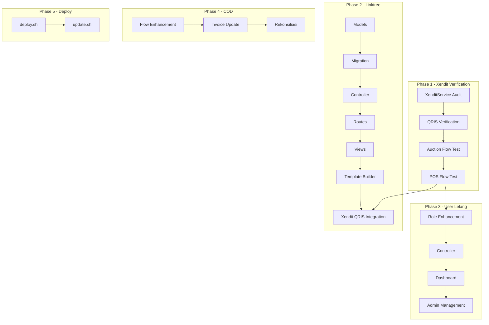

# ROADMAP.md - Pengembangan Grafika-Printing

## Status Proyek Saat Ini

**Fase:** Phase 1 - Menyelesaikan fitur sesuai brief client

Platform sudah memiliki fitur POS, Auction, Wallet, dan integrasi **Xendit full** (payment gateway). Brief client meminta Xendit sebagai payment gateway untuk semua pembayaran (lelang + linktree), tambahan fitur Linktree, dan deployment scripts.

---

## Prioritas Berdasarkan Brief Client

```
🔴 KRITIS (Harus selesai)
    ├── User Lelang Management
    └── COD Ongkir Flow Enhancement

🟡 PENTING (Fitur utama brief)
    ├── Linktree Module (CRUD, halaman publik, custom URL)
    ├── Template Builder
    └── Xendit Integration untuk Linktree QRIS

🟢 NORMAL (Supporting)
    ├── Testing & Bug Fixing
    ├── deploy.sh & update.sh
    └── Code cleanup
```

> **Catatan Penting:** Client meminta **Xendit sebagai payment gateway FULL**. Tidak perlu Midtrans. `XenditService` sudah fully integrated dan mendukung QRIS, VA, E-Wallet. Phase 1 diubah menjadi verifikasi & enhancement Xendit yang sudah ada.

---

## Phase 1: Xendit Payment Gateway - Verifikasi & Enhancement

> **Prioritas:** ✅ SUDAH ADA (perlu verifikasi)
> **Estimasi:** ~10% dari total effort

### Tujuan
Memastikan [`XenditService`](app/Services/XenditService.php) yang sudah ada cover seluruh kebutuhan pembayaran untuk lelang dan linktree. **Tidak perlu membuat MidtransService baru.**

### 1.1 Verifikasi XenditService
- [ ] Cek apakah QRIS tersedia sebagai metode pembayaran di Xendit dashboard
- [ ] Verifikasi `createPaymentLink()` support QRIS
- [ ] Verifikasi `createXenPayment()` support QRIS direct payment
- [ ] Pastikan webhook callback sudah benar untuk semua metode pembayaran

### 1.2 Verifikasi Flow Pembayaran Lelang
- [ ] Test flow: User pilih winner → Buat payment link → Bayar → Webhook confirm
- [ ] Pastikan [`OrderTrackingService`](app/Services/OrderTrackingService.php) ter-trigger dengan benar
- [ ] Pastikan [`EscrowPayment`](app/Models/EscrowPayment.php) terbuat saat payment success
- [ ] Pastikan wallet vendor ter-kredit setelah delivery confirmed

### 1.3 Verifikasi Flow POS Payment
- [ ] Test flow: Checkout → Pilih online payment → Xendit → Webhook confirm
- [ ] Pastikan invoice terbuat dengan benar
- [ ] Pastikan status transaksi terupdate

### 1.4 Environment Variables
- [ ] Pastikan `XENDIT_API_KEY` terkonfigurasi di `.env`
- [ ] Pastikan `XENDIT_WEBHOOK_TOKEN` terkonfigurasi
- [ ] Pastikan `XENDIT_BASE_URL` benar (production vs development)

---

## Phase 2: Linktree Module

> **Prioritas:** 🟡 PENTING
> **Estimasi:** ~35% dari total effort

### 2.1 Database
- [ ] Buat migration `create_linktrees_table.php`
- [ ] Buat migration `create_linktree_links_table.php`
- [ ] Buat migration `create_linktree_socials_table.php`
- [ ] Buat migration `create_linktree_payments_table.php`
- [ ] Buat Model `Linktree` (extend TenantModel)
- [ ] Buat Model `LinktreeLink` (extend TenantModel)
- [ ] Buat Model `LinktreeSocial` (extend TenantModel)
- [ ] Buat Model `LinktreePayment` (extend UserTenantModel)

### 2.2 Backend - CRUD Links
- [ ] Buat `app/Http/Controllers/vendor/LinktreeController.php`
  - `index()` - Dashboard linktree vendor
  - `edit()` - Edit profil & pengaturan
  - `update(Request $request)` - Save pengaturan
  - `links()` - List links
  - `storeLink(Request $request)` - Tambah link
  - `updateLink(Request $request, LinktreeLink $link)` - Update link
  - `destroyLink(LinktreeLink $link)` - Hapus link
  - `reorderLinks(Request $request)` - Drag & drop reorder
  - `toggleLink(LinktreeLink $link)` - Active/inactive
- [ ] Buat `app/Http/Controllers/LinktreePublicController.php`
  - `show(string $customUrl)` - Render halaman publik
  - `handlePayment(Request $request)` - Proses pembayaran via QRIS

### 2.3 Backend - Template Builder
- [ ] Buat `app/Http/Controllers/vendor/TemplateController.php`
  - `index()` - List template tersedia
  - `preview(Request $request)` - Preview template
  - `apply(Request $request)` - Apply template ke linktree

### 2.4 Backend - Linktree Payment (Xendit)
- [ ] Integrasikan `XenditService` untuk QRIS payment di linktree
- [ ] Buat QR code generation
- [ ] Webhook handler untuk payment confirmation
- [ ] Pencatatan transaksi

### 2.5 Routes
- [ ] Vendor routes:
  ```php
  Route::prefix('linktree')->name('linktree.')->group(function () {
      Route::get('/', [LinktreeController::class, 'index'])->name('index');
      Route::put('/', [LinktreeController::class, 'update'])->name('update');
      Route::get('/links', [LinktreeController::class, 'links'])->name('links');
      Route::post('/links', [LinktreeController::class, 'storeLink'])->name('store-link');
      Route::put('/links/{link}', [LinktreeController::class, 'updateLink'])->name('update-link');
      Route::delete('/links/{link}', [LinktreeController::class, 'destroyLink'])->name('destroy-link');
      Route::post('/links/reorder', [LinktreeController::class, 'reorderLinks'])->name('reorder-links');
      Route::patch('/links/{link}/toggle', [LinktreeController::class, 'toggleLink'])->name('toggle-link');
      Route::get('/templates', [TemplateController::class, 'index'])->name('templates');
      Route::post('/templates/preview', [TemplateController::class, 'preview'])->name('template-preview');
      Route::post('/templates/apply', [TemplateController::class, 'apply'])->name('template-apply');
  });
  ```
- [ ] Public route:
  ```php
  Route::get('/l/{customUrl}', [LinktreePublicController::class, 'show'])->name('linktree.public');
  ```

### 2.6 Views
- [ ] Vendor views:
  - `resources/views/vendor/linktree/index.blade.php` - Dashboard
  - `resources/views/vendor/linktree/edit.blade.php` - Edit profil & settings
  - `resources/views/vendor/linktree/links.blade.php` - Manage links
  - `resources/views/vendor/linktree/template.blade.php` - Template builder
  - `resources/views/vendor/linktree/preview.blade.php` - Preview
- [ ] Public views:
  - `resources/views/linktree/public/show.blade.php` - Halaman publik
  - `resources/views/linktree/public/payment.blade.php` - QRIS payment

### 2.7 Frontend
- [ ] Alpine.js untuk drag & drop reorder links
- [ ] Color picker untuk theme customization
- [ ] Live preview desktop & mobile
- [ ] Image upload (avatar, banner)
- [ ] QR code display untuk pembayaran

---

## Phase 3: User Lelang Enhancement

> **Prioritas:** 🔴 KRITIS
> **Estimasi:** ~15% dari total effort

### 3.1 User Lelang Role
- [ ] Buat migration tambah kolom `is_lelang_user` ke `users` table (atau gunakan field `user_role_type`)
- [ ] Update User model
- [ ] Buat `UserLelangController` untuk admin
  - `index()` - List user lelang
  - `show(User $user)` - Detail user lelang + auction history
  - `toggleStatus(User $user)` - Aktifkan/Nonaktifkan
  - `update(Request $request, User $user)` - Edit data

### 3.2 Dashboard User Lelang
- [ ] Buat view khusus `resources/views/user/lelang/dashboard.blade.php`
- [ ] Ringkasan: auction aktif, total pengeluaran, riwayat

### 3.3 Admin Management
- [ ] Route: `/admin/user-lelang/*`
- [ ] Views: `resources/views/dev/user-lelang/`
- [ ] Filter di halaman user management

### 3.4 Routes
- [ ] Admin routes:
  ```php
  Route::prefix('user-lelang')->name('user-lelang.')->group(function () {
      Route::get('/', [UserLelangController::class, 'index'])->name('index');
      Route::get('/{user}', [UserLelangController::class, 'show'])->name('show');
      Route::put('/{user}', [UserLelangController::class, 'update'])->name('update');
      Route::patch('/{user}/toggle-status', [UserLelangController::class, 'toggleStatus'])->name('toggle-status');
  });
  ```

---

## Phase 4: COD Ongkir Enhancement

> **Prioritas:** 🔴 KRITIS
> **Estimasi:** ~10% dari total effort

- [ ] Update flow pembayaran COD di POS
- [ ] Pisahkan rincian: harga barang + ongkir COD
- [ ] Tampilkan di invoice: subtotal barang, ongkir, total
- [ ] Status pembayaran ongkir terpisah
- [ ] Rekonsiliasi COD dengan kurir
- [ ] Update `Transaksi` model: field `ongkir_paid_separate`
- [ ] Update invoice template untuk tampilkan rincian COD

---

## Phase 5: Deployment Scripts

> **Prioritas:** 🟢 NORMAL
> **Estimasi:** ~10% dari total effort

### 5.1 deploy.sh (First-time)
```bash
#!/bin/bash
# deploy.sh - First-time deployment to VPS
# - Install system dependencies
# - Clone repo
# - Setup .env
# - Run migrations
# - Build assets
# - Configure Nginx
# - Setup SSL
# - Setup queue worker
# - Setup cron
```
- [ ] Buat `deploy.sh` berdasarkan [`VPS_DEPLOYMENT_GUIDE.md`](VPS_DEPLOYMENT_GUIDE.md)
- [ ] Test di VPS

### 5.2 update.sh (Updates)
```bash
#!/bin/bash
# update.sh - Update deployment
# - Pull latest code
# - composer install
# - npm install && npm run build
# - php artisan migrate
# - php artisan cache:clear
# - Restart queue worker
```
- [ ] Buat `update.sh`
- [ ] Test di VPS

---

## Phase 6: Testing & Bug Fixing

> **Prioritas:** 🟢 NORMAL
> **Estimasi:** Perlu dijalankan sepanjang development

### 6.1 Unit Tests
- [ ] Test `XenditService` untuk semua metode pembayaran
- [ ] Test `LinktreeController`
- [ ] Test `LinktreePublicController`

### 6.2 Feature Tests
- [ ] Test alur auction dengan Xendit payment
- [ ] Test CRUD linktree links
- [ ] Test public linktree page render
- [ ] Test linktree QRIS payment flow
- [ ] Test user lelang management

### 6.3 Integration Tests
- [ ] Test Xendit webhook untuk auction
- [ ] Test Xendit webhook untuk linktree
- [ ] Test POS flow setelah auction menang
- [ ] Test COD ongkir flow

### 6.4 Bug Fixing
- [ ] Fix semua error dari testing
- [ ] Fix edge cases
- [ ] Fix responsive design issues

---

## Dependency & Integration Map



---

## Tech Debt yang Perlu Diatasi

1. **Xendit Full Coverage** - Client minta Xendit sebagai payment gateway FULL. Kode existing sudah integrated. Perlu:
   - Verifikasi semua metode pembayaran (QRIS, VA, E-Wallet) berfungsi
   - Pastikan webhook handling robust untuk semua metode
   - Integrasi Xendit untuk Linktree QRIS payment

2. **Credentials di .env.example** - API keys dan credentials tidak boleh di version control

3. **No deploy/update scripts** - Perlu dibuat sesuai brief client

4. **Test coverage minim** - Perlu tambah test untuk semua fitur baru

5. **Mixed language kode** - Campuran Bahasa Indonesia dan Inggris, perlu standardisasi
