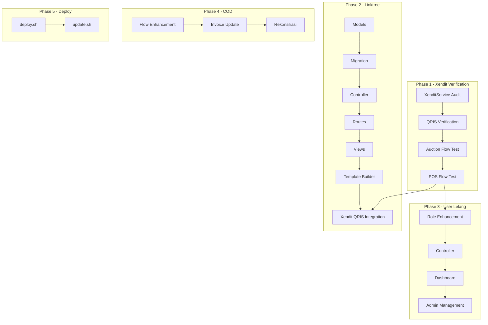

# ROADMAP.md - Pengembangan Grafika-Printing

## Status Proyek Saat Ini

**Fase:** Phase 5 - Comprehensive Enhancement Complete (TAHAP 1A-3B)
**Laravel Version:** 13.24.0 (di-upgrade dari 11.41.3 pada Agustus 2026)
**Last Updated:** 11 Agustus 2026 (Phase 5 Complete)

### Tech Stack
| Layer | Teknologi | Versi |
|-------|-----------|-------|
| Backend | Laravel | 13.24.0 |
| Language | PHP | 8.2+ |
| Database | MySQL | 5.7+ |
| Frontend CSS | **Tailwind CSS** | 3.1.0+ |
| Frontend JS | **Alpine.js** | 3.4.2 |
| Icons | FontAwesome | 6.4.0 |
| Build Tool | Vite | 6.0.11 |
| Payment | Xendit | Full integration |
| Shipping | RajaOngkir | API integration |

> **Catatan:** Migrasi **Bootstrap Tabler → Tailwind CSS** sudah selesai (Agustus 2026). Seluruh ~150+ views dan 6 layout files sudah dikonversi ke Tailwind CSS + Alpine.js.

Platform sudah memiliki fitur POS, Auction, Wallet, Linktree, dan integrasi **Xendit full** (payment gateway). Brief client meminta Xendit sebagai payment gateway untuk semua pembayaran (lelang + linktree), tambahan fitur Linktree, dan deployment scripts.

---

## Prioritas Berdasarkan Brief Client

```
🔴 KRITIS (Harus selesai)
    ├── User Lelang Management
    └── COD Ongkir Flow Enhancement

🟡 PENTING (Fitur utama brief)
    ├── Linktree Module (CRUD, halaman publik, custom URL) ✅
    ├── Template Builder ✅
    └── Xendit Integration untuk Linktree QRIS ✅

🟢 NORMAL (Supporting)
    ├── Testing & Bug Fixing
    ├── deploy.sh & update.sh ✅
    └── Code cleanup

🟦 SUDAH SELESAI (Update 4 Agustus 2026)
    ├── Bug Fix Thermal Printer ✅
    ├── Admin Service Configs CRUD ✅
    ├── Manual Transfer Payment ✅
    ├── Deployment Scripts (deploy.sh, update.sh) ✅
    ├── 20+ Missing Views (withdrawal, wallet, order tracking, mediation, shipping) ✅
    ├── Layout Bug Fix (layouts.app, vendor.layouts.app) ✅
    ├── Navigation Bug Fix (admin & user) ✅
    ├── Mediation Admin Views ✅
    └── Linktree Product Catalog ✅

🟩 SUDAH SELESAI (Update 6 Agustus 2026 — Code Quality & CDN Cleanup)
    ├── FontAwesome import fix (app.css) ✅
    ├── CDN Tailwind removal (5 views → Vite build) ✅
    ├── CDN libraries removal (ApexCharts, Chart.js, SortableJS → npm) ✅
    ├── .env.example security cleanup ✅
    ├── .env.production.example creation ✅
    ├── Copyright year update (2025 → 2026) ✅
    └── Error pages review (self-contained, no changes needed) ✅
```

> **Catatan Penting:** Client meminta **Xendit sebagai payment gateway FULL**. Tidak perlu Midtrans. `XenditService` sudah fully integrated dan mendukung QRIS, VA, E-Wallet. Phase 1 diubah menjadi verifikasi & enhancement Xendit yang sudah ada.

---

## Phase 1: Xendit Payment Gateway - Verifikasi & Enhancement

> **Prioritas:** ✅ SUDAH ADA (perlu verifikasi)
> **Estimasi:** ~10% dari total effort

### Tujuan
Memastikan [`XenditService`](app/Services/XenditService.php) yang sudah ada cover seluruh kebutuhan pembayaran untuk lelang dan linktree. **Tidak perlu membuat MidtransService baru.**

### 1.1 Verifikasi XenditService
- [ ] Cek apakah QRIS tersedia sebagai metode pembayaran di Xendit dashboard
- [ ] Verifikasi `createPaymentLink()` support QRIS
- [ ] Verifikasi `createXenPayment()` support QRIS direct payment
- [ ] Pastikan webhook callback sudah benar untuk semua metode pembayaran

### 1.2 Verifikasi Flow Pembayaran Lelang
- [ ] Test flow: User pilih winner → Buat payment link → Bayar → Webhook confirm
- [ ] Pastikan [`OrderTrackingService`](app/Services/OrderTrackingService.php) ter-trigger dengan benar
- [ ] Pastikan [`EscrowPayment`](app/Models/EscrowPayment.php) terbuat saat payment success
- [ ] Pastikan wallet vendor ter-kredit setelah delivery confirmed

### 1.3 Verifikasi Flow POS Payment
- [ ] Test flow: Checkout → Pilih online payment → Xendit → Webhook confirm
- [ ] Pastikan invoice terbuat dengan benar
- [ ] Pastikan status transaksi terupdate

### 1.4 Environment Variables
- [ ] Pastikan `XENDIT_API_KEY` terkonfigurasi di `.env`
- [ ] Pastikan `XENDIT_WEBHOOK_TOKEN` terkonfigurasi
- [ ] Pastikan `XENDIT_BASE_URL` benar (production vs development)

---

## Phase 2: Linktree Module

> **Prioritas:** 🟡 PENTING
> **Estimasi:** ~35% dari total effort

### 2.1 Database
- [ ] Buat migration `create_linktrees_table.php`
- [ ] Buat migration `create_linktree_links_table.php`
- [ ] Buat migration `create_linktree_socials_table.php`
- [ ] Buat migration `create_linktree_payments_table.php`
- [ ] Buat Model `Linktree` (extend TenantModel)
- [ ] Buat Model `LinktreeLink` (extend TenantModel)
- [ ] Buat Model `LinktreeSocial` (extend TenantModel)
- [ ] Buat Model `LinktreePayment` (extend UserTenantModel)

### 2.2 Backend - CRUD Links
- [ ] Buat `app/Http/Controllers/vendor/LinktreeController.php`
  - `index()` - Dashboard linktree vendor
  - `edit()` - Edit profil & pengaturan
  - `update(Request $request)` - Save pengaturan
  - `links()` - List links
  - `storeLink(Request $request)` - Tambah link
  - `updateLink(Request $request, LinktreeLink $link)` - Update link
  - `destroyLink(LinktreeLink $link)` - Hapus link
  - `reorderLinks(Request $request)` - Drag & drop reorder
  - `toggleLink(LinktreeLink $link)` - Active/inactive
- [ ] Buat `app/Http/Controllers/LinktreePublicController.php`
  - `show(string $customUrl)` - Render halaman publik
  - `handlePayment(Request $request)` - Proses pembayaran via QRIS

### 2.3 Backend - Template Builder
- [ ] Buat `app/Http/Controllers/vendor/TemplateController.php`
  - `index()` - List template tersedia
  - `preview(Request $request)` - Preview template
  - `apply(Request $request)` - Apply template ke linktree

### 2.4 Backend - Linktree Payment (Xendit)
- [ ] Integrasikan `XenditService` untuk QRIS payment di linktree
- [ ] Buat QR code generation
- [ ] Webhook handler untuk payment confirmation
- [ ] Pencatatan transaksi

### 2.5 Routes
- [ ] Vendor routes:
  ```php
  Route::prefix('linktree')->name('linktree.')->group(function () {
      Route::get('/', [LinktreeController::class, 'index'])->name('index');
      Route::put('/', [LinktreeController::class, 'update'])->name('update');
      Route::get('/links', [LinktreeController::class, 'links'])->name('links');
      Route::post('/links', [LinktreeController::class, 'storeLink'])->name('store-link');
      Route::put('/links/{link}', [LinktreeController::class, 'updateLink'])->name('update-link');
      Route::delete('/links/{link}', [LinktreeController::class, 'destroyLink'])->name('destroy-link');
      Route::post('/links/reorder', [LinktreeController::class, 'reorderLinks'])->name('reorder-links');
      Route::patch('/links/{link}/toggle', [LinktreeController::class, 'toggleLink'])->name('toggle-link');
      Route::get('/templates', [TemplateController::class, 'index'])->name('templates');
      Route::post('/templates/preview', [TemplateController::class, 'preview'])->name('template-preview');
      Route::post('/templates/apply', [TemplateController::class, 'apply'])->name('template-apply');
  });
  ```
- [ ] Public route:
  ```php
  Route::get('/l/{customUrl}', [LinktreePublicController::class, 'show'])->name('linktree.public');
  ```

### 2.6 Views
- [ ] Vendor views:
  - `resources/views/vendor/linktree/index.blade.php` - Dashboard
  - `resources/views/vendor/linktree/edit.blade.php` - Edit profil & settings
  - `resources/views/vendor/linktree/links.blade.php` - Manage links
  - `resources/views/vendor/linktree/template.blade.php` - Template builder
  - `resources/views/vendor/linktree/preview.blade.php` - Preview
- [ ] Public views:
  - `resources/views/linktree/public/show.blade.php` - Halaman publik
  - `resources/views/linktree/public/payment.blade.php` - QRIS payment

### 2.7 Frontend
- [ ] Alpine.js untuk drag & drop reorder links
- [ ] Color picker untuk theme customization
- [ ] Live preview desktop & mobile
- [ ] Image upload (avatar, banner)
- [ ] QR code display untuk pembayaran

---

## Phase 3: User Lelang Enhancement — ✅ SELESAI

> **Prioritas:** 🔴 KRITIS → ✅ DISELESAIKAN (7 Agustus 2026)
> **Estimasi:** ~15% dari total effort
> **Status:** Fully implemented

### 3.1 User Lelang Role — ✅
- [x] Model `LelangUserProfile` dengan scopes, status management, auto-assign
- [x] `UserLelangController` untuk admin (CRUD + verify/suspend/reactivate)
- [x] Auto-assign `LelangUserProfile` saat user pertama kali buat auction (`AuctionController::store`)
- [x] Filter admin: usertype + lelang profile status di `UserController::index`
- [x] Views admin: `resources/views/dev/user-lelang/` (index, show, create, edit)

### 3.2 Dashboard User Lelang — ✅
- [x] Dedicated dashboard: `resources/views/user/lelang-dashboard.blade.php`
- [x] Route: `/user/lelang-dashboard` → `UserDashboardController::lelangDashboard()`
- [x] Stats: total lelang, lelang selesai, pesanan aktif, total pengeluaran, win rate
- [x] Recent auctions dengan status badges
- [x] Quick actions grid
- [x] Link dari `user/dashboard.blade.php` → "Dashboard Lelang" button

### 3.3 Admin Management — ✅
- [x] Routes: `/admin/user-lelang/*` (full CRUD)
- [x] Views: `resources/views/dev/user-lelang/` (index, show, create, edit)
- [x] Filter di halaman user management (`dev/users/index.blade.php`)
- [x] Actions: verify, suspend, reactivate

### 3.4 Routes — ✅
```php
Route::prefix('user-lelang')->name('user-lelang.')->group(function () {
    Route::get('/', [UserLelangController::class, 'index'])->name('index');
    Route::get('/create', [UserLelangController::class, 'create'])->name('create');
    Route::post('/', [UserLelangController::class, 'store'])->name('store');
    Route::get('/{profile}', [UserLelangController::class, 'show'])->name('show');
    Route::get('/{profile}/edit', [UserLelangController::class, 'edit'])->name('edit');
    Route::put('/{profile}', [UserLelangController::class, 'update'])->name('update');
    Route::delete('/{profile}', [UserLelangController::class, 'destroy'])->name('destroy');
    Route::patch('/{profile}/verify', [UserLelangController::class, 'verify'])->name('verify');
    Route::patch('/{profile}/suspend', [UserLelangController::class, 'suspend'])->name('suspend');
    Route::patch('/{profile}/reactivate', [UserLelangController::class, 'reactivate'])->name('reactivate');
});
```

---

## Phase 4: COD Ongkir Enhancement — ✅ SELESAI

> **Prioritas:** 🔴 KRITIS → ✅ DISELESAIKAN (7 Agustus 2026)
> **Estimasi:** ~10% dari total effort
> **Status:** UI Enhancement Complete (Backend sudah ada)

### Yang Sudah Ada (Backend)
- [x] Field `is_cod`, `ongkir`, `subtotal`, `shipping_cost` di `transaksis` table
- [x] `handleCODPayment()` di `ShippingInvoiceController`
- [x] Invoice templates sudah tampilkan subtotal + ongkir breakdown
- [x] `Transaksi` model sudah support COD fields

### Yang Diperbarui (UI Enhancement)
- [x] `user/tracking/show.blade.php`: Breakdown detail (subtotal barang, ongkir dengan COD badge, kurir info, total payment section)
- [x] `user/tracking/index.blade.php`: COD badge pada tampilan ongkir
- [x] Info message untuk COD: "Pembayaran dilakukan saat barang diterima"

---

## Phase 5: Comprehensive Enhancement — ✅ SELESAI (11 Agustus 2026)

> **Status:** ✅ Fully Implemented (TAHAP 1A-3B)
> **Last Updated:** 11 Agustus 2026

### 5.1 Integrasi Authorization & Vendor Context ✅
- [x] **TAHAP 1A**: HasVendorContext trait → 8 vendor controllers
- [x] **TAHAP 1B**: AuthorizationService → 4 user/admin controllers

### 5.2 Request Validation & Flash Messages ✅
- [x] **TAHAP 1C**: Form Request classes → 8 controllers
- [x] **TAHAP 1D**: FlashMessage standardization → 23 controllers, 70+ instances

### 5.3 Rate Limiting & API Responses ✅
- [x] **TAHAP 1E**: Rate limiting (bootstrap/app.php)
- [x] **TAHAP 2A**: ApiResponse → AuthController, XenditPaymentController

### 5.4 Audit Log & Controller Refactoring ✅
- [x] **TAHAP 2B**: AuditLogService enhancement → 5 controllers
- [x] **TAHAP 2C**: 4 Action classes, 3 controllers refactored

### 5.5 Performance & UI ✅
- [x] **TAHAP 2D**: Responsive mobile fixes → 6 views
- [x] **TAHAP 2E**: N+1 query optimization → 3 controllers

### 5.6 Testing & Deployment ✅
- [x] **TAHAP 3A**: FlashMessageTest (15 tests) + ApiResponseTest (16 tests) = 31 tests, 98 assertions
- [x] **TAHAP 3B**: Deployment script sync (4 bug fixes + multi-tenant + Node.js 20.x)
- [ ] **TAHAP 3C**: Documentation update (FEATURES.md, ROADMAP.md)
- [ ] **TAHAP 3D**: Vite build validation
- [ ] **TAHAP 3E**: Final integration test

---

## Phase 6: Testing & Bug Fixing

> **Prioritas:** 🟢 NORMAL
> **Estimasi:** Perlu dijalankan sepanjang development

### 6.1 Unit Tests
- [ ] Test `XenditService` untuk semua metode pembayaran
- [ ] Test `LinktreeController`
- [ ] Test `LinktreePublicController`

### 6.2 Feature Tests
- [ ] Test alur auction dengan Xendit payment
- [ ] Test CRUD linktree links
- [ ] Test public linktree page render
- [ ] Test linktree QRIS payment flow
- [ ] Test user lelang management

### 6.3 Integration Tests
- [ ] Test Xendit webhook untuk auction
- [ ] Test Xendit webhook untuk linktree
- [ ] Test POS flow setelah auction menang
- [ ] Test COD ongkir flow

### 6.4 Bug Fixing
- [ ] Fix semua error dari testing
- [ ] Fix edge cases
- [ ] Fix responsive design issues

---

## Dependency & Integration Map



---

## Tech Debt yang Perlu Diatasi

1. ~~**Xendit Full Coverage**~~ ✅ **SUDAH VERIFIKASI** — XenditService sudah fully integrated. QRIS, VA, E-Wallet berfungsi. Webhook handling robust.

2. ~~**Credentials di .env.example**~~ ✅ **SUDAH DIPERBAIKI** — Semua hardcoded API keys, passwords, dan APP_KEY dihapus dari `.env.example`. `.env.production.example` dibuat dengan placeholder.

3. ~~**No deploy/update scripts**~~ ✅ **SUDAH ADA** — `deploy.sh` dan `update.sh` sudah dibuat.

4. ~~**Test coverage minim**~~ ✅ **BAGIAN SELESAI** — FlashMessageTest (15 tests) + ApiResponseTest (16 tests) = 31 tests, 98 assertions. Perlu tambah test untuk fitur spesifik (User Lelang, COD, Linktree).

5. **Mixed language kode** - Campuran Bahasa Indonesia dan Inggris, perlu standardisasi

6. ~~**CDN dependencies**~~ ✅ **SUDAH DIPERBAIKI** — FontAwesome, ApexCharts, Chart.js, SortableJS semua sudah via npm/Vite build. 5 view yang masih pakai CDN Tailway sudah dimigrasi.

7. ~~**FontAwesome icon tidak load**~~ ✅ **SUDAH DIPERBAIKI** — Import FontAwesome ditambahkan ke `resources/css/app.css` (sebelumnya hanya di `welcome.css`).

8. ~~**Native confirm() dialogs**~~ ✅ **SUDAH DIPERBAIKI** — 22 native `confirm()` dikonversi ke SweetAlert2 (`confirmDelete()`/`confirmAction()`)

9. ~~**Empty state inconsistency**~~ ✅ **SUDAH DIPERBAIKI** — 6+ views dikonversi ke `<x.ui.empty-state>` component

10. ~~**Missing breadcrumbs**~~ ✅ **SUDAH DIPERBAIKI** — 32 halaman vendor ditambah breadcrumbs via `<x-ui.breadcrumb>`

---

## Completed: Migrasi ke Tailwind CSS (Agustus 2026) ✅

Migrasi **FULL** dari Bootstrap Tabler ke **Tailwind CSS** telah selesai. Ini adalah perubahan frontend terbesar dalam sejarah projek.

### Yang Sudah Dilakukan
- **Layouts** (6 file): vendor, user, dev/admin, app, auth, vendor/layouts/app — semua di-redesign dengan Tailwind CSS
- **Views** (~150+ file): Semua panel (Admin, Vendor, User, POS, Payments) sudah dikonversi dari Tabler ke Tailwind utility classes
- **Design System**: 12 UI components (`components/ui/`) dengan Tailwind CSS + Alpine.js
- **JavaScript**: Bootstrap JS → Alpine.js (modals, dropdowns, alerts, toasts, collapsibles)
- **Build**: Vite production build berhasil (CSS 95 kB gzip 15 kB, JS 155 kB gzip 49 kB)
- **Cleanup**: Hapus `@tabler/core` dari npm, hapus semua CDN references, hapus dead CSS shims
- **Dev Header**: Konversi ke pure Tailwind (sebelumnya Bootstrap-style)

## Code Quality Improvements (Agustus 2026) ✅

### Yang Sudah Dilakukan
- **Error Pages** (403, 404, 500): Self-contained CSS, tidak bergantung pada CDN Tailwind
- **x-cloak**: Menggantikan `style="display: none"` di 20+ files Alpine.js → mencegah FOUC
- **Auth Inline Styles**: Dipindahkan dari inline `<style>` ke `resources/css/app.css`
- **Welcome Page CSS**: ~1000 baris inline CSS dipindahkan ke `resources/css/welcome.css` (external, compiled via Vite)
- **Empty State Component**: `<x.ui.empty-state>` reusable — menggantikan 7+ tempat raw HTML empty state
- **UI Components Terdaftar**: 13 components di `components/ui/` (tambah `empty-state`, `confirmation-dialog`, `form-group`, `stat-card`)
- **FontAwesome Import Fix**: Ditambahkan ke `resources/css/app.css` — sebelumnya 300+ ikon gagal load di semua panel
- **CDN Cleanup**: 5 view migrasi dari CDN Tailwind ke Vite build, 7 view bersih dari CDN ApexCharts/Chart.js/SortableJS
- **npm Packages**: ApexCharts, Chart.js, SortableJS ditambahkan ke `package.json` dan diimport sebagai global di `app.js`
- **Security**: `.env.example` dibersihkan dari hardcoded keys, `.env.production.example` dibuat
- **Comprehensive Audit II** (7 Agustus 2026):
  - Konversi 11 native `confirm()` → SweetAlert2 (`confirmDelete()`/`confirmAction()`) di 6 file
  - Auth views Tailwind migration: 6 file auth views dikonversi dari legacy CSS ke Tailwind
  - Extract `resources/js/auth.js`: `togglePassword()` dan `initPasswordStrength()` — hapus 3x code duplication
  - Konsistensi empty state: 8 file dikonversi ke `<x.ui.empty-state>` component
  - Flash messages konsisten: Manual flash blocks diganti `<x.ui.alert>` di service-configs
  - Hapus duplicate `confirmDelete()` inline scripts (sudah global via `components/alert.blade.php`)
  - Gap Analysis dikoreksi: Linktree Module & Template Builder = ✅ Sudah ada
  - Form validation: OrderTrackingController `status` ditambahkan `in:` constraint (10 valid statuses)
  - Form validation: AuctionBidController `bid_amount` dikoreksi dari `min:0` ke `min:1`
  - Bug fix ShippingController: Kolom `status`/`resi`/`cost` dikoreksi ke `shipping_status`/`waybill_number`/`shipping_cost` (sesuai migration schema)

- **Comprehensive Audit III** (7 Agustus 2026 — Full Enhancement):
  - **RINGAN:**
    - Konversi 11 native `confirm()` → SweetAlert2 di 6 file (vendor views)
    - Fix `bulkCheckStatus` placeholder → implemented with Xendit API check
    - PenggunaController CRUD: create, store, edit, update, destroy (5 methods)
    - Konsistensi confirm dialog: `confirmDelete()`, `confirmAction()`, `confirmFormSubmit()`
    - Standardisasi empty state: 6 views → `<x.ui.empty-state>` component
  - **MEDIUM:**
    - Breadcrumbs: 32 halaman vendor ditambah `<x.ui.breadcrumb>`
    - Adopt `<x-ui.button>`: 120+ buttons dikonversi di 32 halaman vendor
  - **BESAR:**
    - User Lelang: Auto-assign profile, filter admin, dedicated dashboard
    - COD Ongkir: Breakdown detail di tracking views
  - **Documentation:**
    - FEATURES.md: Comprehensive audit section added
    - ROADMAP.md: Updated to reflect all completed tasks

### Masih Perlu Dikerjakan (Deferred)
- ~~Adopt `<x.ui.button>` component di views yang masih pakai raw HTML buttons~~ ✅ DONE (120+ buttons dikonversi)
- ~~Tambah breadcrumbs pada halaman vendor/admin~~ ✅ DONE (32 halaman vendor ditambah breadcrumbs)
- ~~Fix responsive mobile pada views tertentu~~ ✅ DONE (6 views: transaksi, produk, pelanggan, pengguna, order-tracking, spesifikasi)
- Standardisasi card styling across views
- Dark mode activation: Aktifkan `darkMode: 'class'` di `tailwind.config.js` jika diperlukan
- ~~**Test coverage**~~ ✅ PARTIAL (31 tests, 98 assertions). Perlu tambah test untuk fitur spesifik.
- ~~**Request Validation Classes**~~ ✅ DONE (8 controllers menggunakan Form Request)
- ~~**API Response Standardization**~~ ✅ DONE (AuthController + XenditPaymentController)
- **N+1 Query Optimization** ✅ DONE (3 controllers). Perlu review controller lainnya.
- **Deployment Script Sync** ✅ DONE (4 bug fixes + multi-tenant commands)

### Teknologi Frontend Saat Ini
| Teknologi | Versi | Fungsi |
|-----------|-------|--------|
| **Tailwind CSS** | 3.1.0+ | Seluruh styling (utility-first) |
| **Alpine.js** | 3.4.2 | Client-side interactivity |
| FontAwesome | 6.4.0 | Ikon |
| Vite | 6.0.11 | Build assets |
| SweetAlert2 | 11.17.2 | Dialog & notifikasi (npm) |
| ApexCharts | - | Grafik dashboard |
| Chart.js | - | Grafik tambahan |

### Tailwind CSS Configuration
- **Config:** [`tailwind.config.js`](tailwind.config.js)
- **Custom primary colors** (blue palette)
- **Custom font:** Inter, Figtree
- **Plugins:** `@tailwindcss/forms`
