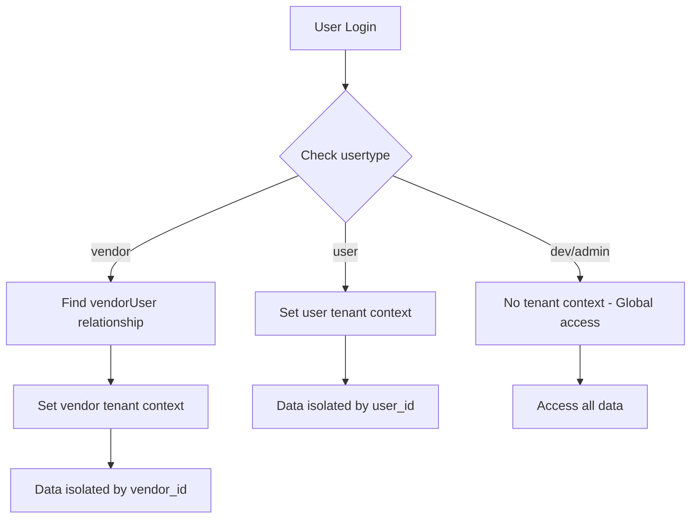

# 🔒 Panduan Keamanan Tenant Context

## 🎯 **OVERVIEW**

Aplikasi Grafika Printing menggunakan **tenant context** untuk mengisolasi data antar pengguna. Setiap user dan vendor memiliki data yang terisolasi sepenuhnya, sementara admin memiliki akses global.

## 🏗️ **ARSITEKTUR KEAMANAN**

### **1. Login Flow & Tenant Context**



### **2. User Types & Tenant Context**

| User Type | Tenant Context | Data Isolation | Access Level |
|-----------|---------------|-----------------|--------------|
| `user` | ✅ User Context | `user_id` | Own data only |
| `vendor` | ✅ Vendor Context | `vendor_id` | Own vendor data only |
| `dev` | ❌ No Context | Global | All data |
| `admin` | ❌ No Context | Global | All data |
| `superadmin` | ❌ No Context | Global | All data |

## 🔐 **IMPLEMENTASI KEAMANAN**

### **1. Middleware SetTenantContext**

```php
// app/Http/Middleware/SetTenantContext.php
public function handle(Request $request, Closure $next)
{
    if (Auth::check()) {
        $user = Auth::user();

        switch ($user->usertype) {
            case 'vendor':
                // Set vendor tenant context
                $vendorUser = $user->vendorUser->first();
                if ($vendorUser) {
                    Tenant::setVendor($vendorUser);
                } else {
                    // Security: Logout if no vendor relationship
                    Auth::logout();
                    return redirect('/login')->with('error', 'No vendor account associated.');
                }
                break;

            case 'user':
                // Set user tenant context
                Tenant::setUser($user);
                break;

            case 'dev':
            case 'admin':
            case 'superadmin':
                // No tenant context (global access)
                break;
        }
    }

    return $next($request);
}
```

### **2. Model Security**

#### **UserTenantModel** (User Data)
```php
// app/Models/User/UserTenantModel.php
abstract class UserTenantModel extends Model
{
    protected static function booted()
    {
        // Auto-apply user_id filter
        static::addGlobalScope('user_tenant', function (Builder $builder) {
            $tenantManager = app(TenantManager::class);
            if ($tenantManager->hasUserContext()) {
                $builder->where('user_id', $tenantManager->getUserId());
            }
        });

        // Auto-set user_id on create
        static::creating(function ($model) {
            $tenantManager = app(TenantManager::class);
            if ($tenantManager->hasUserContext() && !$model->user_id) {
                $model->user_id = $tenantManager->getUserId();
            }
        });
    }
}
```

#### **TenantModel** (Vendor Data)
```php
// app/Models/Vendor/TenantModel.php
abstract class TenantModel extends Model
{
    protected static function booted()
    {
        // Auto-apply vendor_id filter
        static::addGlobalScope('vendor_tenant', function (Builder $builder) {
            $tenantManager = app(TenantManager::class);
            if ($tenantManager->hasVendorContext()) {
                $builder->where('vendor_id', $tenantManager->getVendorId());
            }
        });

        // Auto-set vendor_id on create
        static::creating(function ($model) {
            $tenantManager = app(TenantManager::class);
            if ($tenantManager->hasVendorContext() && !$model->vendor_id) {
                $model->vendor_id = $tenantManager->getVendorId();
            }
        });
    }
}
```

## 🧪 **TESTING KEAMANAN**

### **1. Test Command**
```bash
php artisan test:tenant-security
```

### **2. Test Results**
```
🔒 Testing Tenant Context Security...

👤 Testing User Data Isolation...
✅ User1 data isolation: SECURE
✅ User2 data isolation: SECURE

🏢 Testing Vendor Data Isolation...
✅ Vendor data isolation: SECURE

🚫 Testing Cross-Tenant Access Prevention...
✅ Cross-tenant access prevention: SECURE

👨‍💻 Testing Admin Global Access...
✅ Admin global access: WORKING
```

## 🛡️ **LAYER KEAMANAN**

### **1. Application Layer**
- ✅ **Middleware**: SetTenantContext otomatis diterapkan
- ✅ **Global Scopes**: Data otomatis terisolasi
- ✅ **Auto-fill**: `user_id`/`vendor_id` otomatis diisi
- ✅ **Session Fallback**: Tenant context tersimpan di session

### **2. Database Layer**
- ✅ **Foreign Keys**: Relasi data terjamin
- ✅ **Indexes**: Query performance optimal
- ✅ **Constraints**: Data integrity terjaga

### **3. Model Layer**
- ✅ **Inheritance**: UserTenantModel vs TenantModel
- ✅ **Scoping**: Automatic data filtering
- ✅ **Relationships**: Proper data relationships

## 🔍 **SCENARIOS KEAMANAN**

### **1. User Login**
```php
// User dengan usertype 'user'
$user = Auth::user(); // usertype = 'user'
Tenant::setUser($user); // Set user tenant context

// Data yang bisa diakses:
$auctions = Auction::all(); // Hanya auctions milik user ini
$payments = XenditPayment::all(); // Hanya payments milik user ini
```

### **2. Vendor Login**
```php
// User dengan usertype 'vendor'
$user = Auth::user(); // usertype = 'vendor'
$vendor = $user->vendorUser->first();
Tenant::setVendor($vendor); // Set vendor tenant context

// Data yang bisa diakses:
$products = Produk::all(); // Hanya products milik vendor ini
$transactions = Transaksi::all(); // Hanya transactions milik vendor ini
```

### **3. Admin Login**
```php
// User dengan usertype 'dev'
$user = Auth::user(); // usertype = 'dev'
// No tenant context set

// Data yang bisa diakses:
$allUsers = User::all(); // Semua users
$allVendors = Vendor::all(); // Semua vendors
$allAuctions = Auction::all(); // Semua auctions
```

## 🚨 **POTENTIAL SECURITY RISKS**

### **1. Data Leakage Prevention**
```php
// ❌ DANGEROUS - Bypassing tenant context
$auctions = Auction::withoutGlobalScopes()->get();

// ✅ SECURE - Using tenant context
$auctions = Auction::forCurrentUser()->get();
```

### **2. Cross-Tenant Access Prevention**
```php
// ❌ DANGEROUS - Direct access
$user = User::find($otherUserId);
$auctions = $user->auctions;

// ✅ SECURE - Through tenant context
$auctions = Auction::forCurrentUser()->get();
```

### **3. Admin Override Prevention**
```php
// ❌ DANGEROUS - Admin accessing user data directly
if (Auth::user()->usertype === 'dev') {
    $userAuctions = Auction::where('user_id', $userId)->get();
}

// ✅ SECURE - Admin should use proper admin routes
$userAuctions = Auction::where('user_id', $userId)->get(); // Only in admin context
```

## 📋 **BEST PRACTICES**

### **1. Controller Security**
```php
// ✅ Correct - User controller
public function myAuctions()
{
    // Automatically filtered to current user
    $auctions = Auction::forCurrentUser()->get();
    return view('user.auctions', compact('auctions'));
}

// ✅ Correct - Vendor controller
public function myProducts()
{
    // Automatically filtered to current vendor
    $products = Produk::forCurrentVendor()->get();
    return view('vendor.products', compact('products'));
}

// ✅ Correct - Admin controller
public function allAuctions()
{
    // Global access for admin
    $auctions = Auction::with(['user', 'bids'])->get();
    return view('admin.auctions', compact('auctions'));
}
```

### **2. Route Security**
```php
// ✅ Correct - User routes
Route::middleware(['auth', 'verified', 'user'])->group(function () {
    Route::get('/user/auctions', [AuctionController::class, 'myAuctions']);
});

// ✅ Correct - Vendor routes
Route::middleware(['auth', 'verified', 'vendor', 'tenants'])->group(function () {
    Route::get('/vendor/products', [ProdukController::class, 'index']);
});

// ✅ Correct - Admin routes
Route::middleware(['auth', 'verified', 'dev'])->group(function () {
    Route::get('/admin/auctions', [AdminController::class, 'allAuctions']);
});
```

### **3. Testing Security**
```php
// ✅ Test tenant isolation
public function testUserDataIsolation()
{
    $user1 = User::factory()->create(['usertype' => 'user']);
    $user2 = User::factory()->create(['usertype' => 'user']);
    
    // Set tenant context for user1
    Tenant::setUser($user1);
    
    // Create auction for user1
    $auction = Auction::create(['user_id' => $user1->id, ...]);
    
    // User1 should see the auction
    $this->assertEquals(1, Auction::forCurrentUser()->count());
    
    // Switch to user2 context
    Tenant::setUser($user2);
    
    // User2 should not see user1's auction
    $this->assertEquals(0, Auction::forCurrentUser()->count());
}
```

## 🎯 **KESIMPULAN KEAMANAN**

### **✅ SECURITY FEATURES**
1. **Automatic Isolation**: Data otomatis terisolasi per tenant
2. **Global Scopes**: Query otomatis difilter
3. **Auto-fill**: `user_id`/`vendor_id` otomatis diisi
4. **Session Security**: Tenant context tersimpan aman
5. **Admin Override**: Admin memiliki akses global yang terkontrol

### **🛡️ PROTECTION LAYERS**
1. **Middleware Layer**: SetTenantContext otomatis
2. **Model Layer**: Global scopes dan auto-fill
3. **Database Layer**: Foreign keys dan constraints
4. **Application Layer**: Proper route middleware

### **🔒 SECURITY GUARANTEES**
- ✅ **User**: Hanya melihat data milik sendiri
- ✅ **Vendor**: Hanya melihat data vendor mereka
- ✅ **Admin**: Akses global yang terkontrol
- ✅ **Cross-tenant**: Tidak ada akses lintas tenant
- ✅ **Data Integrity**: Relasi data terjamin

**Aplikasi Grafika Printing memiliki keamanan tenant context yang robust dan aman!** 🚀
