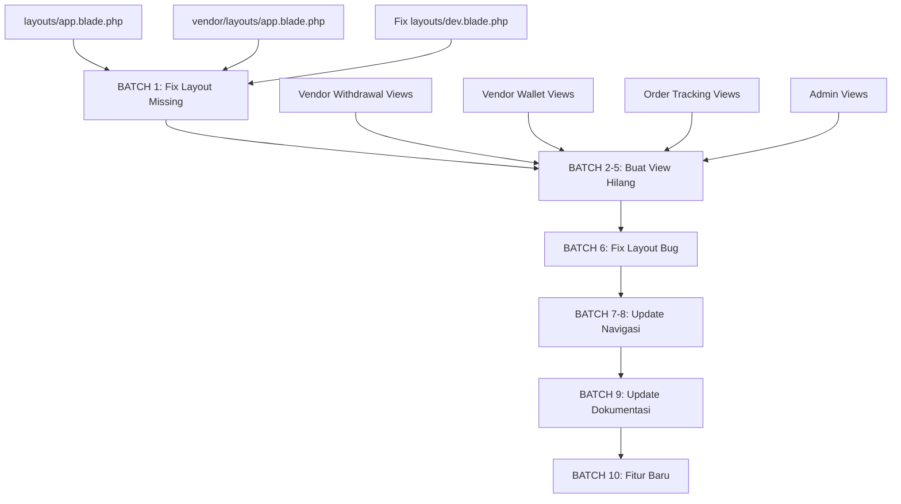

# Rencana Komprehensif: Review & Perbaikan Proyek Grafika-Printing
> Tanggal: 2026-08-04
> Status: Menunggu Approval

---

## Ringkasan Temuan Analisis

Analisis komprehensif terhadap seluruh kode proyek mengungkap **13 view yang hilang/kritis**, **2 layout bug**, **3 navigasi yang perlu diupdate**, dan **2 dokumentasi yang usang**. Semua perbaikan ini **aman untuk production** karena hanya menambah file baru atau memperbaiki view, tanpa mengubah database.

---

## Temuan Kritis: View yang Hilang (akan menyebabkan error 500)

### Kategori 1: Layout Missing

| # | File yang Hilang | Views yang Terdampak | Severity |
|---|-----------------|---------------------|----------|
| 1a | `layouts/app.blade.php` | `payments/confirmation`, `payments/success`, `payments/failure`, `payments/xendit`, `user/delivery-confirmation/create` | KRITIS |
| 1b | `vendor/layouts/app.blade.php` | `vendor/audit-logs/index`, `vendor/audit-logs/show` | KRITIS |
| 1c | `layouts/dev.blade.php` | Dead code (referensi `layouts/navigation` tidak ada) | RENDAH |

### Kategori 2: Vendor Views Missing

| # | File yang Hilang | Controller yang Referensi |
|---|-----------------|--------------------------|
| 2a | `vendor/withdrawal/index.blade.php` | `VendorWithdrawalController@index` |
| 2b | `vendor/withdrawal/create.blade.php` | `VendorWithdrawalController@create` |
| 2c | `vendor/withdrawal/show.blade.php` | `VendorWithdrawalController@show` |
| 2d | `vendor/withdrawal/history.blade.php` | `VendorWithdrawalController@history` |
| 3a | `vendor/wallet/transactions.blade.php` | `VendorWalletController@transactions` |
| 3b | `vendor/wallet/withdrawals.blade.php` | `VendorWalletController@withdrawals` |
| 3c | `vendor/wallet/show-withdrawal.blade.php` | `VendorWalletController@showWithdrawal` |

### Kategori 3: Order Tracking Views Missing

| # | File yang Hilang | Controller yang Referensi |
|---|-----------------|--------------------------|
| 4a | `user/order-tracking/index.blade.php` | `OrderTrackingController@index` |
| 4b | `user/order-tracking/show.blade.php` | `OrderTrackingController@show` |
| 4c | `vendor/order-tracking/index.blade.php` | `OrderTrackingController@vendorIndex` |

### Kategori 4: Admin Views Missing

| # | File yang Hilang | Controller yang Referensi |
|---|-----------------|--------------------------|
| 5a | `admin/withdrawal/index.blade.php` | `WithdrawalManagementController@index` |
| 5b | `admin/withdrawal/show.blade.php` | `WithdrawalManagementController@show` |
| 5c | `admin/mediation/index.blade.php` | `MediationController@index` |
| 5d | `admin/mediation/show.blade.php` | `MediationController@show` |
| 5e | `admin/mediation/statistics.blade.php` | `MediationController@statistics` |
| 5f | `dev/shipping/invoices.blade.php` | `ShippingController@invoices` |
| 5g | `user/delivery-confirmation/show.blade.php` | `DeliveryConfirmationController@show` |

---

## Temuan: Layout Bug

| # | File | Masalah | Fix |
|---|------|---------|-----|
| 6a | `pengguna/create.blade.php` | Extend `dev.layouts.app` (admin layout) | Ganti ke `layouts.vendor` |
| 6b | `pengguna/edit.blade.php` | Extend `dev.layouts.app` (admin layout) | Ganti ke `layouts.vendor` |

---

## Temuan: Navigasi yang Perlu Diupdate

| # | Layout | Masalah |
|---|--------|---------|
| 7 | `dev/layouts/app.blade.php` | Missing links: Withdrawal, Mediation, Service Configs |
| 8 | `layouts/user.blade.php` | Link ke `user.orders.index` dan `user.tracking.index` ada tapi view hilang |

---

## Temuan: Dokumentasi Usang

| # | File | Masalah |
|---|------|---------|
| 9a | `FEATURES.md` | Status fitur salah: Linktree, Template Builder, User Lelang ditulis "BELUM ADA" padahal sudah ada |
| 9b | `ROADMAP.md` | Phase 2 Linktree sudah selesai tapi belum ditandai |

---

## Rencana Implementasi (10 Batch)

### BATCH 1: Fix View Bug Kritis (Layout Missing)
> **Prioritas: TERTINGGI** - Error ini akan crash production

1a. **Buat `resources/views/layouts/app.blade.php`**
- Layout dasar yang digunakan oleh payment views dan delivery confirmation
- Extend dari `layouts.vendor` atau buat standalone layout
- Views yang terdampak: 5 views

1b. **Buat `resources/views/vendor/layouts/app.blade.php`**
- Layout untuk vendor audit logs
- Extend dari `layouts.vendor`
- Views yang terdampak: 2 views

1c. **Fix `layouts/dev.blade.php`**
- File ini adalah dead code (Breeze default layout)
- Referensi `layouts/navigation` yang tidak ada
- **Opsi**: Hapus atau perbaiki referensi

### BATCH 2: Buat View Vendor Withdrawal
> **Prioritas: TINGGI** - Fitur withdrawal vendor sudah ada di backend

2a. `vendor/withdrawal/index.blade.php` - Daftar withdrawal
2b. `vendor/withdrawal/create.blade.php` - Form buat withdrawal baru
2c. `vendor/withdrawal/show.blade.php` - Detail withdrawal
2d. `vendor/withdrawal/history.blade.php` - Riwayat withdrawal

### BATCH 3: Buat View Vendor Wallet
> **Prioritas: TINGGI** - Bagian dari fitur wallet yang sudah ada

3a. `vendor/wallet/transactions.blade.php` - Daftar transaksi wallet
3b. `vendor/wallet/withdrawals.blade.php` - Daftar withdrawal dari wallet
3c. `vendor/wallet/show-withdrawal.blade.php` - Detail withdrawal

### BATCH 4: Buat View Order Tracking
> **Prioritas: TINGGI** - Fitur tracking pesanan penting untuk UX

4a. `user/order-tracking/index.blade.php` - Daftar pesanan user
4b. `user/order-tracking/show.blade.php` - Detail tracking pesanan
4c. `vendor/order-tracking/index.blade.php` - Daftar pesanan vendor

### BATCH 5: Buat View Admin
> **Prioritas: SEDANG** - Fitur admin yang sudah ada di backend

5a-5b. Admin Withdrawal views
5c-5e. Admin Mediation views
5f. Admin Shipping Invoices view
5g. User Delivery Confirmation show view

### BATCH 6: Fix Layout Bug
> **Prioritas: SEDANG** - View menggunakan layout yang salah

6a-6b. Fix `pengguna/create` dan `pengguna/edit` extends

### BATCH 7: Update Navigasi Admin
> **Prioritas: SEDANG** - Admin perlu akses ke semua fitur

7a-7c. Tambah missing nav links di `dev/layouts/app.blade.php`

### BATCH 8: Verifikasi Navigasi User
> **Prioritas: RENDAH** - User navigation sudah lengkap

8a. Verifikasi semua user nav links function

### BATCH 9: Update Dokumentasi
> **Prioritas: RENDAH** - Documentation cleanup

9a. Update FEATURES.md
9b. Update ROADMAP.md

### BATCH 10: Fitur 3 - Linktree Product Catalog
> **Prioritas: FITUR BARU** - Fitur baru setelah bug fix selesai

10a. Rancang dan implementasi linktree product catalog

---

## Diagram Alur Perbaikan

---

## Catatan Penting

1. **Semua perbaikan ini AMAN untuk production** - Tidak ada perubahan database
2. **Batch 1 harus dikerjakan duluan** karena view yang hilang akan menyebabkan error 500
3. **Batch 2-5** adalah pembuatan view baru berdasarkan controller yang sudah ada
4. **Batch 10** (Fitur Linktree Product Catalog) adalah fitur baru yang bisa ditunda
5. **Total view yang perlu dibuat**: ~20 file baru
6. **Total fix yang perlu dilakukan**: ~5 file
