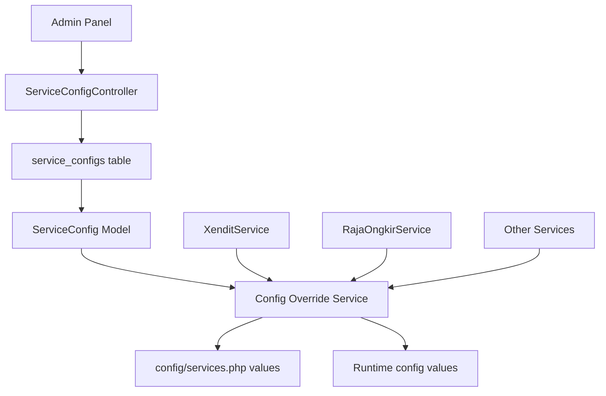
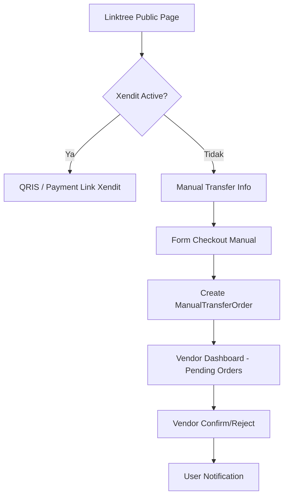
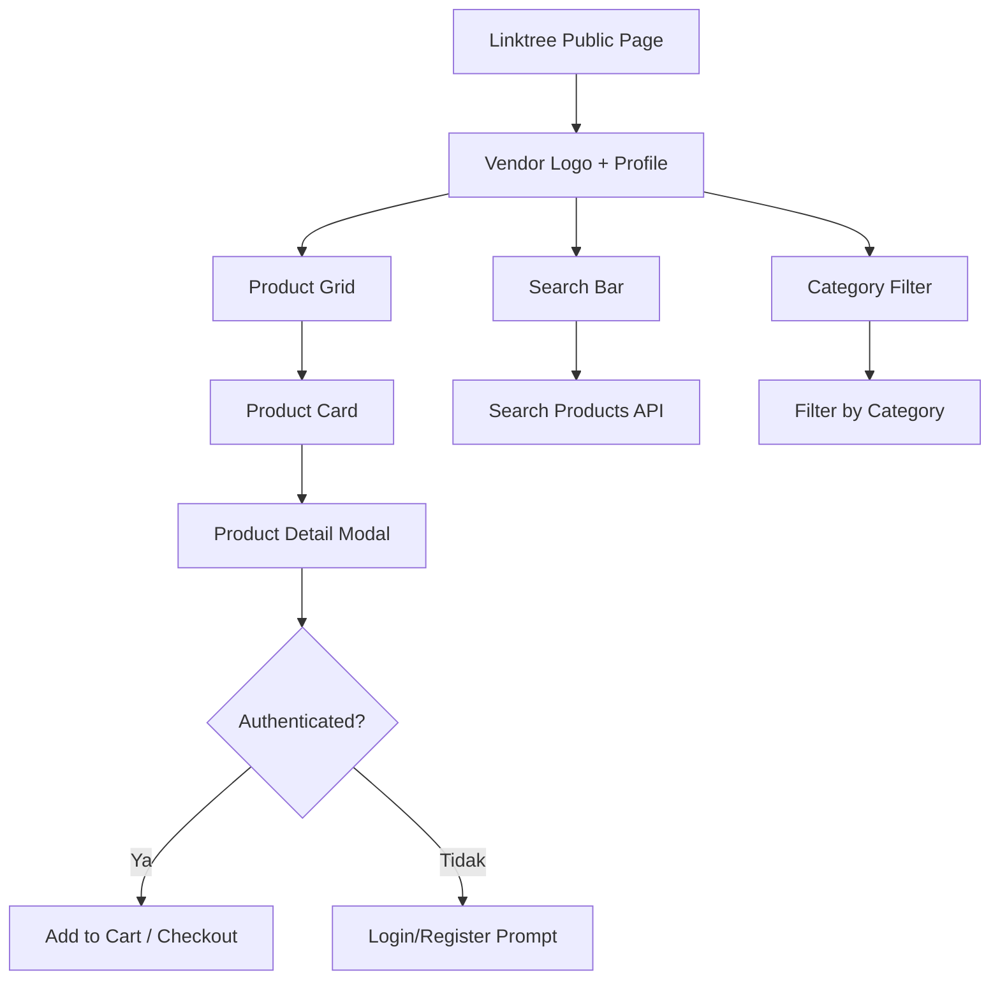
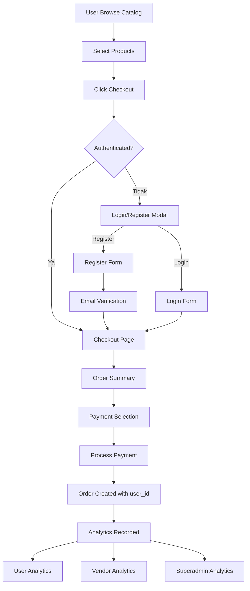

# Master Plan: 6 Fitur Utama Grafika-Printing

> **Tanggal:** 2026-08-04
> **Status:** Draft - Menunggu Approval

---

## Ringkasan Permintaan Pengguna

| # | Fitur | Prioritas | Kompleksitas |
|---|-------|-----------|--------------|
| 1 | Superadmin Third-Party Config CRUD | 🔴 Tinggi | Sedang |
| 2 | Manual Transfer Payment | 🔴 Tinggi | Sedang |
| 3 | Linktree sebagai Product Catalog | 🔴 Tinggi | Tinggi |
| 4 | Registrasi Wajib untuk Checkout | 🔴 Tinggi | Sedang |
| 5 | Fix Bug Thermal Printer | 🔴 Tinggi | Sedang |
| 6 | Upgrade Laravel | 🟡 Sedang | Rendah (dengan catatan) |

---

## Temuan Penting dari Analisis Kode

### Bug Thermal Printer (KRITIS)
- [`ThermalPrintController`](app/Http/Controllers/vendor/pos/ThermalPrintController.php:45) method `printViaJS()` memanggil view `pos.thermal-print-js` yang **TIDAK ADA** di filesystem
- Method `printDirect()` hanya menggunakan `window.print()` - browser print dialog, bukan ESC/POS direct printer
- **Root cause bug:** View `thermal-print-js.blade.php` hilang + tidak ada integrasi ESC/POS printer

### Laravel Version
- ~~Saat ini: `laravel/framework: ^11.31` (Laravel 11)~~
- **Status:** ✅ Sudah di-upgrade ke `laravel/framework: ^13.0` (Laravel 13.24.0) pada Agustus 2026
- **Upgrade path:** Laravel 11 → 12 → 13 (two-step upgrade)
- **Package updates:** `dedoc/scramble` ^0.13, `barryvdh/laravel-debugbar` ^4.0, `laravel/tinker` ^3.0, `phpunit/phpunit` ^12.0

### Struktur Admin Panel
- Admin panel menggunakan layout [`resources/views/dev/layouts/app.blade.php`](resources/views/dev/layouts/app.blade.php:1) dengan **Tabler Core** CSS
- Navigation bar horizontal (bukan sidebar) dengan dropdown menus
- Sudah ada pola `CmsSetting` model yang bisa diadaptasi untuk service settings

### Model & Table yang Relevan
- [`Produk`](app/Models/Vendor/Produk.php:13): tenant-scoped (vendor_id), punya `kategori_id`, `gambar` (JSON), `nama_produk`, `deskripsi`
- [`KategoriProduk`](app/Models/Vendor/KategoriProduk.php:10): tenant-scoped, punya `nama_kategori`, `slug`
- [`Vendor`](app/Models/Vendor.php:28): punya field `logo`, `name`, `address`, `phone`
- [`Linktree`](app/Models/Vendor/Linktree.php:8): tenant-scoped, sudah punya `show_qris`, `qris_image`

---

## Detail Rencana per Fitur

### Fitur 1: Superadmin Third-Party Config CRUD

#### Konsep
Membuat halaman admin untuk mengelola konfigurasi API pihak ketiga (Xendit, RajaOngkir, dll) dari panel admin, bukan hanya dari file `.env`.

#### Arsitektur



#### Database
- **New Table:** `service_configs` (migration baru)
  - `id`, `service_name` (xendit, rajaongkir, etc), `key` (api_key, webhook_token, etc), `value` (encrypted), `label`, `description`, `is_active`, `is_encrypted`, `sort_order`, `timestamps`
  - Unique index on `service_name` + `key`

#### Backend
- **New Model:** [`ServiceConfig`](app/Models/ServiceConfig.php) dengan method `get($service, $key)`, `set($service, $key, $value)`, `getGroupedByService()`
- **New Controller:** [`ServiceConfigController`](app/Http/Controllers/Admin/ServiceConfigController.php) - CRUD operations
- **New Service:** [`ServiceConfigOverride`](app/Services/ServiceConfigOverride.php) - Override nilai config di runtime
- **Modify:** [`XenditService`](app/Services/XenditService.php:18) constructor - ambil config dari DB dulu, fallback ke `config()`
- **Modify:** [`RajaOngkirService`](app/Services/RajaOngkirService.php) - sama seperti XenditService

#### Routes
```php
Route::prefix('service-configs')->name('service-configs.')->group(function () {
    Route::get('/', [ServiceConfigController::class, 'index'])->name('index');
    Route::get('/{service}', [ServiceConfigController::class, 'show'])->name('show');
    Route::post('/', [ServiceConfigController::class, 'store'])->name('store');
    Route::put('/{serviceConfig}', [ServiceConfigController::class, 'update'])->name('update');
    Route::delete('/{serviceConfig}', [ServiceConfigController::class, 'destroy'])->name('destroy');
    Route::post('/{serviceConfig}/toggle', [ServiceConfigController::class, 'toggle'])->name('toggle');
    Route::post('/test-connection', [ServiceConfigController::class, 'testConnection'])->name('test-connection');
    Route::get('/seed-defaults', [ServiceConfigController::class, 'seedDefaults'])->name('seed-defaults');
});
```

#### Views
- [`resources/views/dev/service-configs/index.blade.php`](resources/views/dev/service-configs/index.blade.php) - Daftar semua service configs grouped by service
- [`resources/views/dev/service-configs/show.blade.php`](resources/views/dev/service-configs/show.blade.php) - Detail & edit configs per service (Xendit, RajaOngkir, etc)
- Tambah menu "Service Configs" di navbar admin layout

#### Fitur Penting
- **Encryption:** Nilai sensitif (API keys) di-enkripsi di database
- **Test Connection:** Tombol test untuk verifikasi API key berfungsi
- **Toggle Active/Inactive:** Nonaktifkan service tertentu
- **Seed Defaults:** Import nilai dari `.env` sebagai initial values
- **Cache Busting:** Clear config cache setelah update

---

### Fitur 2: Manual Transfer Payment

#### Konsep
Ketika Xendit tidak aktif/diisi, tampilkan opsi manual transfer bank untuk pembayaran di linktree.

#### Arsitektur



#### Database
- **New Table:** `manual_transfer_orders` (migration baru)
  - `id`, `vendor_id` (FK), `user_id` (FK nullable), `order_number` (unique), `customer_name`, `customer_phone`, `customer_email`, `items` (JSON), `total_amount`, `bank_name`, `account_number`, `account_name`, `transfer_proof` (file path), `status` (pending/paid/rejected/completed), `notes`, `paid_at`, `timestamps`

#### Backend
- **New Model:** [`ManualTransferOrder`](app/Models/ManualTransferOrder.php) - extends UserTenantModel (global scope, karena melibatkan user + vendor)
- **New Controller:** [`ManualTransferController`](app/Http/Controllers/ManualTransferController.php)
- **Modify:** [`LinktreePublicController`](app/Http/Controllers/LinktreePublicController.php:16) - tambah logic check Xendit active

#### Routes
```php
// Public routes (no auth required for placing order)
Route::post('/manual-transfer/order', [ManualTransferController::class, 'placeOrder'])->name('manual-transfer.place');
Route::get('/manual-transfer/{orderNumber}/status', [ManualTransferController::class, 'checkStatus'])->name('manual-transfer.status');
Route::post('/manual-transfer/{orderNumber}/upload-proof', [ManualTransferController::class, 'uploadProof'])->name('manual-transfer.upload-proof');

// Vendor routes
Route::prefix('vendor/manual-transfers')->name('vendor.manual-transfers.')->group(function () {
    Route::get('/', [VendorManualTransferController::class, 'index'])->name('index');
    Route::get('/{order}', [VendorManualTransferController::class, 'show'])->name('show');
    Route::post('/{order}/confirm', [VendorManualTransferController::class, 'confirm'])->name('confirm');
    Route::post('/{order}/reject', [VendorManualTransferController::class, 'reject'])->name('reject');
});
```

#### Views
- [`resources/views/linktree/public/parts/manual-transfer.blade.php`](resources/views/linktree/public/parts/manual-transfer.blade.php) - Form manual transfer di halaman linktree
- [`resources/views/vendor/manual-transfers/index.blade.php`](resources/views/vendor/manual-transfers/index.blade.php) - Daftar order manual transfer
- [`resources/views/vendor/manual-transfers/show.blade.php`](resources/views/vendor/manual-transfers/show.blade.php) - Detail order + approve/reject

#### Flow Detail
1. Linktree public page mendeteksi Xendit tidak aktif
2. Menampilkan info rekening bank vendor + form pemesanan
3. User isi: nama, no HP, pilih items dari katalog, upload bukti transfer
4. Order tersimpan dengan status `pending`
5. Vendor dapat lihat di dashboard, approve atau reject
6. Jika approve → status berubah `completed`, analytics tercatat

---

### Fitur 3: Linktree sebagai Product Catalog

#### Konsep
Mengubah halaman linktree publik menjadi katalog produk seperti toko online, menampilkan produk vendor dari tabel `produks`.

#### Arsitektur



#### Database
- **No new tables needed** - menggunakan tabel `produks`, `kategori_produks`, `spesifikasi_produks` yang sudah ada
- **Optional:** Tambah field `linktree_id` ke `produks` atau pivot table untuk mapping produk ke linktree (jika vendor ingin memilih produk mana yang tampil di linktree)

#### Backend
- **Modify:** [`LinktreePublicController`](app/Http/Controllers/LinktreePublicController.php:16)
  - Load produk vendor beserta kategori dan spesifikasi
  - Support search & filter by kategori
  - Pagination untuk performa
- **New API endpoint:** `/api/linktree/{customUrl}/products` untuk AJAX search/filter
- **Modify:** [`Linktree`](app/Models/Vendor/Linktree.php:8) - tambah relasi `products()`

#### Views
- **Modify:** [`resources/views/linktree/public.blade.php`](resources/views/linktree/public.blade.php:1) - Transform jadi product catalog layout
  - Header: Vendor logo (fallback ke `logo.png` Grafika Printing)
  - Linktree public URL display
  - Search bar
  - Category filter pills
  - Product grid cards (gambar, nama, harga dasar, kategori)
  - Product detail modal (deskripsi, spesifikasi, harga)
  - Footer: social links + QRIS (jika aktif)

#### Desain Product Card
```
┌─────────────────────────┐
│  [Product Image]        │
│                         │
│  Nama Produk            │
│  Kategori               │
│  Rp Harga Dasar         │
│  [Detail] [Pesan]       │
└─────────────────────────┘
```

#### Logo Fallback Logic
```php
// Di controller
$vendorLogo = null;
if ($vendor->logo && file_exists(public_path('vendors_logo/' . $vendor->logo))) {
    $vendorLogo = asset('vendors_logo/' . $vendor->logo);
} else {
    $vendorLogo = asset('logo.png'); // Grafika Printing logo
}
```

---

### Fitur 4: Registrasi Wajib untuk Checkout

#### Konsep
User harus login/register sebelum bisa melakukan checkout di linktree. Ini untuk tracking analytics di 3 level: user, vendor, superadmin.

#### Arsitektur



#### Database
- **New Table:** `linktree_orders` (migration baru)
  - `id`, `vendor_id` (FK), `user_id` (FK), `linktree_id` (FK nullable), `order_number` (unique), `items` (JSON - [{produk_id, nama, qty, harga}]), `total_amount`, `payment_method` (xendit/manual), `payment_status` (pending/paid/failed), `xendit_payment_id`, `status` (pending/processing/completed/cancelled), `notes`, `timestamps`
  - Index: `vendor_id`, `user_id`, `status`, `created_at`

#### Backend
- **New Model:** [`LinktreeOrder`](app/Models/LinktreeOrder.php) - extends UserTenantModel
- **New Controller:** [`LinktreeOrderController`](app/Http/Controllers/LinktreeOrderController.php) - handle checkout flow
- **Modify:** [`LinktreePublicController`](app/Http/Controllers/LinktreePublicController.php:16) - tambah cart/checkout flow
- **New Auth Controller:** Extend existing Breeze auth untuk linktree context
- **Middleware:** Create custom `linktree.auth` middleware untuk redirect back to linktree after login

#### Routes
```php
// Auth routes for linktree (guest can access register/login)
Route::get('/l/{customUrl}/login', [LinktreeAuthController::class, 'showLogin'])->name('linktree.login');
Route::post('/l/{customUrl}/login', [LinktreeAuthController::class, 'login'])->name('linktree.login.post');
Route::get('/l/{customUrl}/register', [LinktreeAuthController::class, 'showRegister'])->name('linktree.register');
Route::post('/l/{customUrl}/register', [LinktreeAuthController::class, 'register'])->name('linktree.register.post');

// Checkout routes (auth required)
Route::middleware(['auth', 'verified'])->group(function () {
    Route::get('/l/{customUrl}/checkout', [LinktreeOrderController::class, 'checkout'])->name('linktree.checkout');
    Route::post('/l/{customUrl}/checkout', [LinktreeOrderController::class, 'processOrder'])->name('linktree.checkout.process');
    Route::get('/l/{customUrl}/orders', [LinktreeOrderController::class, 'myOrders'])->name('linktree.orders');
    Route::get('/l/{customUrl}/orders/{order}', [LinktreeOrderController::class, 'showOrder'])->name('linktree.orders.show');
});

// Vendor order management
Route::middleware(['auth', 'verified', 'vendor', 'tenants'])->group(function () {
    Route::get('/vendor/linktree-orders', [VendorLinktreeOrderController::class, 'index'])->name('vendor.linktree-orders.index');
    Route::get('/vendor/linktree-orders/{order}', [VendorLinktreeOrderController::class, 'show'])->name('vendor.linktree-orders.show');
    Route::post('/vendor/linktree-orders/{order}/status', [VendorLinktreeOrderController::class, 'updateStatus'])->name('vendor.linktree-orders.status');
});
```

#### Views
- [`resources/views/auth/linktree-login.blade.php`](resources/views/auth/linktree-login.blade.php) - Login page dengan redirect back ke linktree
- [`resources/views/auth/linktree-register.blade.php`](resources/views/auth/linktree-register.blade.php) - Register page
- [`resources/views/linktree/public/checkout.blade.php`](resources/views/linktree/public/checkout.blade.php) - Checkout page
- [`resources/views/linktree/public/orders.blade.php`](resources/views/linktree/public/orders.blade.php) - Riwayat order user
- [`resources/views/vendor/linktree-orders/index.blade.php`](resources/views/vendor/linktree-orders/index.blade.php) - Vendor manage orders

#### Analytics Tracking
Setiap order akan tercatat di:
- **User level:** `linktree_orders` dengan `user_id` → user bisa lihat riwayat belanja
- **Vendor level:** Vendor dashboard menampilkan linktree orders → revenue, order count
- **Superadmin level:** Admin dashboard aggregate data → total GMV, conversion rate

---

### Fitur 5: Fix Bug Thermal Printer

#### Temuan Bug
1. [`ThermalPrintController::printViaJS()`](app/Http/Controllers/vendor/pos/ThermalPrintController.php:45) memanggil view `pos.thermal-print-js` yang **TIDAK ADA**
2. [`ThermalPrintController::printDirect()`](app/Http/Controllers/vendor/pos/ThermalPrintController.php:16) hanya menggunakan `window.print()` - tidak bisa langsung ke thermal printer
3. Tidak ada integrasi ESC/POS protocol atau WebUSB/WebSocket untuk direct printer communication

#### Solusi yang Direkomendasikan

**Approach A (Recommended): Web-based ESC/POS via WebUSB**
- Implementasi [`WebUSB`](https://developer.chrome.com/docs/capabilities/usb) untuk koneksi langsung ke printer thermal via USB
- Gunakan library seperti [`escpos-php`](https://github.com/mike42/escpos-php) di backend untuk generate ESC/POS commands
- Fallback ke `window.print()` jika WebUSB tidak tersedia

**Approach B (Simpler): Improved Browser Print**
- Perbaiki CSS `@page` untuk semua ukuran kertas thermal (58mm, 80mm)
- Tambah printer detection & configuration UI
- Support multiple printer profiles

#### Implementasi (Approach A + B hybrid)

**Backend:**
- **Modify:** [`ThermalPrintController`](app/Http/Controllers/vendor/pos/ThermalPrintController.php) - tambah methods:
  - `printEscPos($transaksi)` - generate ESC/POS raw commands
  - `getPrintableHtml($transaksi)` - return optimized HTML for thermal
  - `printSettings()` - save/get printer settings per vendor
- **New:** [`PrinterSetting`](app/Models/Vendor/PrinterSetting.php) - model untuk menyimpan pengaturan printer per vendor (paper_width, auto_cut, dll)
- **New Migration:** `printer_settings` table

**Frontend:**
- **Modify:** [`resources/views/pos/thermal-print.blade.php`](resources/views/pos/thermal-print.blade.php:1) - perbaiki:
  - Multi-size support (58mm, 80mm, A4)
  - Better print CSS
  - Auto-detect printer
  - WebUSB printer selection
- **Create:** `resources/views/pos/thermal-print-js.blade.php` - view yang hilang! (JavaScript-based printing)
- **Create:** `resources/views/pos/printer-settings.blade.php` - UI pengaturan printer

**Routes tambahan:**
```php
Route::prefix('pos')->name('pos.')->group(function () {
    // Existing routes...
    Route::get('/{transaksi}/thermal', [ThermalPrintController::class, 'printDirect'])->name('thermal-print');
    Route::get('/{transaksi}/thermal-js', [ThermalPrintController::class, 'printViaJS'])->name('thermal-print-js');
    Route::get('/printer-settings', [ThermalPrintController::class, 'showSettings'])->name('printer.settings');
    Route::post('/printer-settings', [ThermalPrintController::class, 'saveSettings'])->name('printer.settings.save');
});
```

---

### Fitur 6: Upgrade Laravel

#### Status Saat Ini
- **Current:** Laravel 11.31 (`laravel/framework: ^11.31`)
- **Available:** Laravel 12 (rilis Feb 2025)
- **Laravel 13:** Belum tersedia saat ini

#### Rekomendasi
Upgrade ke **Laravel 12** (bukan 13, karena belum ada). Laravel 12 masih mendukung PHP 8.2+ yang sudah digunakan project ini.

#### Migration Path
1. Jalankan `composer require laravel/framework:^12.0`
2. Jalankan `php artisan upgrade` (auto-upgrade tool)
3. Review breaking changes:
   - Laravel 12 fokus pada perubahan internal, minimal breaking changes
   - Cek compatibility packages: `spatie/laravel-multitenancy`, `barryvdh/laravel-dompdf`, `xendit/xendit-php`
4. Update `bootstrap/app.php` jika ada perubahan
5. Test semua fitur kritis

#### Risiko
- **Rendah:** Laravel 12 backward-compatible dengan 11
- **Medium:** Package third-party mungkin perlu update
- **Note:** Jalankan upgrade di environment development/test dulu, bukan langsung di production

---

## Urutan Eksekusi (Priority Order)

### Phase 1: Bug Fix & Quick Win
1. **Fix Thermal Printer** (Fitur 5) - Bug fix, impact langsung ke client
   - Buat view `thermal-print-js.blade.php` yang hilang
   - Perbaiki CSS thermal print
   - Tambah printer settings
   - Implementasi basic ESC/POS support

### Phase 2: Backend Infrastructure
2. **Service Config CRUD** (Fitur 1) - Fondasi untuk fitur lain
   - Buat migration, model, controller
   - Implementasi config override
   - Seed defaults dari .env
   - Update XenditService & RajaOngkirService

### Phase 3: Payment Flow
3. **Manual Transfer Payment** (Fitur 2) - Payment alternative
   - Buat model & migration
   - Implementasi vendor bank info display
   - Form checkout manual transfer
   - Vendor confirm/reject flow

### Phase 4: Product Catalog
4. **Linktree Product Catalog** (Fitur 3) - Core feature
   - Transform linktree public page
   - Product grid dengan search & filter
   - Vendor logo integration
   - Product detail modal

### Phase 5: Auth & Orders
5. **Registrasi Wajib Checkout** (Fitur 4) - Complete the flow
   - Linktree auth pages (login/register)
   - Checkout flow
   - Order management (user + vendor + admin)
   - Analytics tracking

### Phase 6: Upgrade
6. **Laravel Upgrade** (Fitur 6) - Maintenance
   - Upgrade ke Laravel 12
   - Test semua fitur
   - Update dependencies

---

## File yang Perlu Dibuat/Dimodifikasi

### File Baru
| File | Deskripsi |
|------|-----------|
| `database/migrations/xxxx_create_service_configs_table.php` | Table service configs |
| `database/migrations/xxxx_create_manual_transfer_orders_table.php` | Table manual transfer |
| `database/migrations/xxxx_create_linktree_orders_table.php` | Table linktree orders |
| `database/migrations/xxxx_create_printer_settings_table.php` | Table printer settings |
| `app/Models/ServiceConfig.php` | Service config model |
| `app/Models/ManualTransferOrder.php` | Manual transfer model |
| `app/Models/LinktreeOrder.php` | Linktree order model |
| `app/Models/Vendor/PrinterSetting.php` | Printer setting model |
| `app/Http/Controllers/Admin/ServiceConfigController.php` | Admin CRUD |
| `app/Http/Controllers/ManualTransferController.php` | Manual transfer public |
| `app/Http/Controllers/VendorManualTransferController.php` | Vendor manage transfers |
| `app/Http/Controllers/LinktreeOrderController.php` | Checkout flow |
| `app/Http/Controllers/VendorLinktreeOrderController.php` | Vendor order mgmt |
| `app/Http/Controllers/LinktreeAuthController.php` | Linktree auth |
| `app/Services/ServiceConfigOverride.php` | Config override |
| `resources/views/dev/service-configs/index.blade.php` | Admin config list |
| `resources/views/dev/service-configs/show.blade.php` | Admin config detail |
| `resources/views/vendor/manual-transfers/index.blade.php` | Vendor transfer list |
| `resources/views/vendor/manual-transfers/show.blade.php` | Vendor transfer detail |
| `resources/views/auth/linktree-login.blade.php` | Linktree login |
| `resources/views/auth/linktree-register.blade.php` | Linktree register |
| `resources/views/linktree/public/checkout.blade.php` | Checkout page |
| `resources/views/linktree/public/orders.blade.php` | User orders |
| `resources/views/pos/thermal-print-js.blade.php` | Missing JS print view |
| `resources/views/pos/printer-settings.blade.php` | Printer settings UI |
| `resources/views/vendor/linktree-orders/index.blade.php` | Vendor order list |

### File yang Perlu Dimodifikasi
| File | Perubahan |
|------|-----------|
| [`app/Services/XenditService.php`](app/Services/XenditService.php:18) | Constructor ambil config dari DB |
| [`app/Services/RajaOngkirService.php`](app/Services/RajaOngkirService.php) | Constructor ambil config dari DB |
| [`app/Http/Controllers/LinktreePublicController.php`](app/Http/Controllers/LinktreePublicController.php:16) | Tambah product catalog + manual transfer |
| [`app/Models/Vendor/Linktree.php`](app/Models/Vendor/Linktree.php:8) | Tambah relasi products, orders |
| [`resources/views/linktree/public.blade.php`](resources/views/linktree/public.blade.php:1) | Transform jadi product catalog |
| [`app/Http/Controllers/vendor/pos/ThermalPrintController.php`](app/Http/Controllers/vendor/pos/ThermalPrintController.php:11) | Perbaiki print methods |
| [`resources/views/pos/thermal-print.blade.php`](resources/views/pos/thermal-print.blade.php:1) | Perbaiki CSS + multi-size |
| [`routes/web.php`](routes/web.php:63) | Tambah semua routes baru |
| [`resources/views/dev/layouts/app.blade.php`](resources/views/dev/layouts/app.blade.php:97) | Tambah menu Service Configs |
| [`app/Http/Controllers/Admin/AdminController.php`](app/Http/Controllers/Admin/AdminController.php) | (tidak ada, perlu buat baru untuk dashboard section) |
