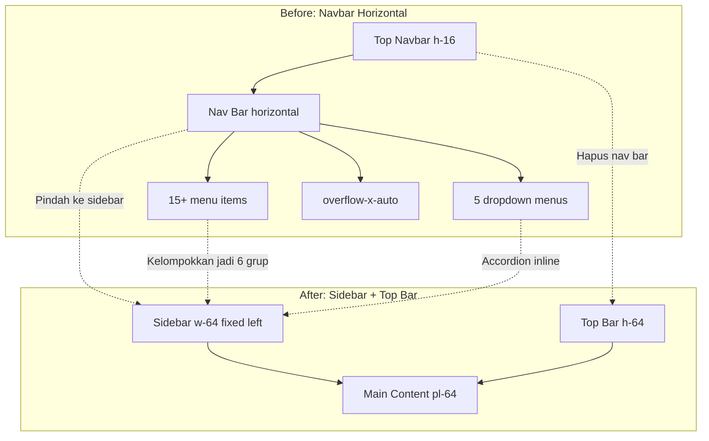
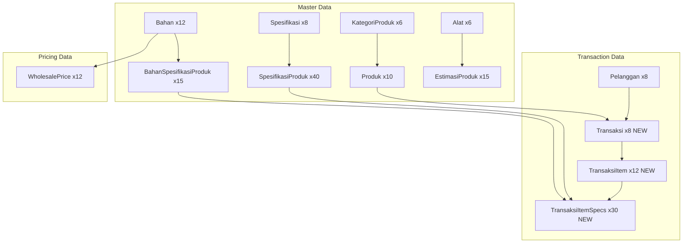

# Rencana Implementasi: Sidebar Navigation & Lengkapi PosSeeder

> **Tanggal:** 5 Agustus 2026
> **Status:** Draft - Menunggu Approval

---

## Ringkasan

| # | Task | Prioritas | File Terdampak |
|---|------|-----------|----------------|
| 1 | Konversi Navbar ke Sidebar — Vendor | 🔴 Tinggi | `layouts/vendor.blade.php` |
| 2 | Konversi Navbar ke Sidebar — Admin/Dev | 🔴 Tinggi | `dev/layouts/app.blade.php` |
| 3 | Konversi Navbar ke Sidebar — User | 🔴 Tinggi | `layouts/user.blade.php` |
| 4 | Buat Shared Sidebar Component | 🔴 Tinggi | `components/sidebar.blade.php` (baru) |
| 5 | Install Alpine.js Collapse Plugin | 🔴 Tinggi | `package.json`, `app.js` |
| 6 | Lengkapi PosSeeder — Transaksi | 🔴 Tinggi | `seeders/PosSeeder.php` |
| 7 | Lengkapi PosSeeder — BahanSpesifikasiProduk | 🟡 Sedang | `seeders/PosSeeder.php` |
| 8 | Lengkapi PosSeeder — WholesalePrice | 🟡 Sedang | `seeders/PosSeeder.php` |
| 9 | Tambah CSS Sidebar | 🟡 Sedang | `resources/css/app.css` |

---

## Temuan Analisis

### Dependensi Teknis

| Package | Versi | Status | Catatan |
|---------|-------|--------|---------|
| Alpine.js | ^3.4.2 | ✅ Installed | Perlu tambah plugin `@alpinejs/collapse` |
| Tailwind CSS | ^3.1.0 | ✅ Installed | Sudah ada custom design system |
| FontAwesome | ^6.4.0 | ✅ Installed | Tapi layout pakai inline SVG, bukan FA |
| Vite | ^6.0.11 | ✅ Installed | Build pipeline sudah jalan |

### Masalah yang Diselesaikan

**Navbar Horizontal (Before):**
- Vendor: 15+ menu item dengan 5 dropdown — scroll horizontal
- Admin: 14 menu item dengan 6 dropdown — scroll horizontal
- User: 7 menu item — lebih ringan tapi tetap tidak ideal di mobile
- Dropdown `absolute` position berpotensi overflow viewport
- Mobile: label tersembunyi (`hidden sm:inline`), hanya icon
- Double sticky: navbar sticky + nav sticky

**Sidebar (After):**
- Semua menu terlihat dalam satu panel vertikal
- Sub-menu menggunakan accordion (expand/collapse) inline
- Mobile: slide-out overlay via hamburger
- Desktop: collapsible ke icon-only mode
- Konsisten dengan pattern admin panel standar

---

## Phase 1: Setup Dependensi

### 1.1 Install Alpine.js Collapse Plugin

**File:** `package.json`

Tambahkan `@alpinejs/collapse` ke devDependencies:

```json
{
    "devDependencies": {
        "@alpinejs/collapse": "^3.4.2",
        ...existing...
    }
}
```

**File:** `resources/js/app.js`

```javascript
import './bootstrap';

import Alpine from 'alpinejs';
import collapse from '@alpinejs/collapse';

Alpine.plugin(collapse);
window.Alpine = Alpine;
Alpine.start();

import Swal from 'sweetalert2';
window.Swal = Swal;
```

**Command:** `npm install @alpinejs/collapse`

---

### 1.2 Tambah CSS untuk Sidebar

**File:** `resources/css/app.css`

Tambahkan di bagian `@layer components` atau di akhir file:

```css
/* ---- Sidebar ---- */
.sidebar-scroll::-webkit-scrollbar {
    width: 4px;
}
.sidebar-scroll::-webkit-scrollbar-track {
    background: transparent;
}
.sidebar-scroll::-webkit-scrollbar-thumb {
    background: #e5e7eb;
    border-radius: 4px;
}
.sidebar-scroll::-webkit-scrollbar-thumb:hover {
    background: #d1d5db;
}

/* Sidebar menu item active indicator */
.sidebar-link-active {
    @apply bg-primary-50 text-primary-700 font-medium;
    box-shadow: inset 3px 0 0 theme('colors.primary.600');
}
```

---

## Phase 2: Shared Sidebar Component

### 2.1 Buat Blade Component

**File baru:** `resources/views/components/sidebar.blade.php`

Component ini akan digunakan oleh ketiga layout (vendor, admin, user).

**Props:**
- `$menus` — array menu items (wajib)
- `$brandName` — nama brand di sidebar (opsional, default: 'Grafika')
- `$collapsed` — apakah sidebar collapsed (opsional, default: false)

**Struktur Component:**

```blade
@props(['menus' => [], 'brandName' => 'Grafika', 'collapsed' => false])

<aside
    x-data
    class="fixed inset-y-0 left-0 z-40 flex flex-col bg-white border-r border-gray-200 transition-all duration-300
    {{ $collapsed ? 'w-[72px]' : 'w-64' }}
    lg:translate-x-0
    {{ request()->cookie('sidebar_open') ? 'translate-x-0' : '-translate-x-full' }}
    ">

    {{-- Logo & Brand --}}
    <div class="flex items-center h-16 px-4 border-b border-gray-200 shrink-0">
        <a href="{{ route('welcome') }}" class="flex items-center gap-2.5">
            
            @unless($collapsed)
                <span class="text-lg font-bold text-gray-900 truncate">{{ $brandName }}</span>
            @endunless
        </a>
    </div>

    {{-- Navigation --}}
    <nav class="flex-1 overflow-y-auto sidebar-scroll py-4 px-3 space-y-1">
        @foreach($menus as $group)
            {{-- Section Header --}}
            @if(isset($group['label']))
                <p class="px-3 pt-4 pb-1 text-xs font-semibold uppercase tracking-wider text-gray-400
                    {{ $collapsed ? 'hidden' : '' }}">
                    {{ $group['label'] }}
                </p>
            @endif

            {{-- Menu Items --}}
            @foreach($group['items'] as $item)
                @if(isset($item['children']) && count($item['children']) > 0)
                    {{-- Accordion Sub-Menu --}}
                    <div x-data="{ open: {{ request()->routeIs($item['route'] ?? '') ? 'true' : 'false' }} }">
                        <button @click="open = !open"
                            class="w-full flex items-center gap-3 px-3 py-2.5 text-sm font-medium rounded-lg transition-colors
                            {{ request()->routeIs($item['route'] ?? '') ? 'sidebar-link-active' : 'text-gray-600 hover:bg-gray-100 hover:text-gray-900' }}">
                            <span class="shrink-0 w-5 h-5">{!! $item['icon'] ?? '' !!}</span>
                            @unless($collapsed)
                                <span class="flex-1 text-left truncate">{{ $item['label'] }}</span>
                                <svg class="w-4 h-4 shrink-0 transition-transform duration-200"
                                    :class="open ? 'rotate-180' : ''"
                                    fill="none" stroke="currentColor" viewBox="0 0 24 24">
                                    <path stroke-linecap="round" stroke-linejoin="round" stroke-width="2" d="M19 9l-7 7-7-7"/>
                                </svg>
                            @endunless
                        </button>
                        <div x-show="open" x-collapse x-cloak
                            class="{{ $collapsed ? 'ml-0' : 'ml-5 mt-1 space-y-0.5 border-l border-gray-200 pl-3' }}">
                            @unless($collapsed)
                                @foreach($item['children'] as $child)
                                    <a href="{{ $child['url'] }}"
                                        class="block px-3 py-2 text-sm rounded-lg transition-colors
                                        {{ request()->routeIs($child['route'] ?? '') ? 'bg-primary-50 text-primary-700 font-medium' : 'text-gray-500 hover:bg-gray-50 hover:text-gray-700' }}">
                                        {{ $child['label'] }}
                                    </a>
                                @endforeach
                            @endunless
                        </div>
                    </div>
                @else
                    {{-- Single Menu Item --}}
                    <a href="{{ $item['url'] ?? '#' }}"
                        class="flex items-center gap-3 px-3 py-2.5 text-sm font-medium rounded-lg transition-colors
                        {{ request()->routeIs($item['route'] ?? '') ? 'sidebar-link-active' : 'text-gray-600 hover:bg-gray-100 hover:text-gray-900' }}">
                        <span class="shrink-0 w-5 h-5">{!! $item['icon'] ?? '' !!}</span>
                        @unless($collapsed)
                            <span class="truncate">{{ $item['label'] }}</span>
                        @endunless
                    </a>
                @endif
            @endforeach
        @endforeach
    </nav>

    {{-- Collapse Toggle (desktop only) --}}
    <div class="hidden lg:flex items-center justify-center border-t border-gray-200 p-3 shrink-0">
        <button onclick="toggleSidebarCollapse()"
            class="p-2 rounded-lg text-gray-400 hover:bg-gray-100 hover:text-gray-600 transition-colors">
            <svg class="w-5 h-5 transition-transform duration-300 {{ $collapsed ? 'rotate-180' : '' }}"
                fill="none" stroke="currentColor" viewBox="0 0 24 24">
                <path stroke-linecap="round" stroke-linejoin="round" stroke-width="2" d="M11 19l-7-7 7-7m8 14l-7-7 7-7"/>
            </svg>
        </button>
    </div>
</aside>
```

**Catatan tentang `x-collapse`:**
- Plugin `@alpinejs/collapse` memberikan animasi expand/collapse yang smooth
- Diganti dari `x-show` biasa ke `x-show` + `x-collapse` untuk animasi height

**Catatan tentang Icon:**
- Menggunakan inline SVG yang di-pass melalui `$item['icon']` karena project tidak menggunakan heroicons package
- Setiap layout akan mendefinisikan SVG icon sendiri dalam menu array

---

## Phase 3: Konversi Layout Vendor

### 3.1 Struktur Menu Vendor

**File:** `resources/views/layouts/vendor.blade.php`

Menu dikelompokkan menjadi **6 grup** dari 15+ item flat:

```php
$vendorMenus = [
    [
        'items' => [
            ['label' => 'Beranda', 'url' => route('welcome'), 'route' => 'welcome', 'icon' => '...svg...'],
            ['label' => 'Dasbor',  'url' => route('vendor.dashboard'), 'route' => 'vendor.dashboard', 'icon' => '...svg...'],
        ]
    ],
    [
        'label' => 'Penjualan',
        'items' => [
            ['label' => 'POS',       'url' => route('vendor.pos.index'), 'route' => 'vendor.pos.*', 'icon' => '...svg...'],
            ['label' => 'Cetak',     'url' => route('vendor.pos.printer.settings'), 'route' => 'vendor.pos.printer.*', 'icon' => '...svg...'],
            ['label' => 'Pelanggan', 'url' => route('vendor.customers.index'), 'route' => 'vendor.customers.*', 'icon' => '...svg...'],
            ['label' => 'Transaksi', 'url' => route('vendor.transactions.index'), 'route' => 'vendor.transactions.*', 'icon' => '...svg...'],
        ]
    ],
    [
        'label' => 'Produk & Inventori',
        'items' => [
            [
                'label' => 'Produk',
                'route' => 'vendor.products.*|vendor.specifications.*|vendor.categories.*',
                'icon' => '...svg...',
                'children' => [
                    ['label' => 'Spesifikasi',  'url' => route('vendor.specifications.index'), 'route' => 'vendor.specifications.*'],
                    ['label' => 'Produk',       'url' => route('vendor.products.index'), 'route' => 'vendor.products.*'],
                    ['label' => 'Kategori',     'url' => route('vendor.categories.index'), 'route' => 'vendor.categories.*'],
                ]
            ],
            [
                'label' => 'Bahan & Alat',
                'route' => 'vendor.materials.*|vendor.tools.*',
                'icon' => '...svg...',
                'children' => [
                    ['label' => 'Bahan', 'url' => route('vendor.materials.index'), 'route' => 'vendor.materials.*'],
                    ['label' => 'Alat',  'url' => route('vendor.tools.index'), 'route' => 'vendor.tools.*'],
                ]
            ],
        ]
    ],
    [
        'label' => 'Keuangan',
        'items' => [
            ['label' => 'Dompet',          'url' => route('vendor.wallet.index'), 'route' => 'vendor.wallet.*', 'icon' => '...svg...'],
            ['label' => 'Bank',            'url' => route('vendor.bank-accounts.index'), 'route' => 'vendor.bank-accounts.*', 'icon' => '...svg...'],
            ['label' => 'Transfer Manual',  'url' => route('vendor.manual-transfers.index'), 'route' => 'vendor.manual-transfers.*', 'icon' => '...svg...'],
            ['label' => 'Ongkir',          'url' => route('vendor.shipping.calculator'), 'route' => 'vendor.shipping.*', 'icon' => '...svg...'],
        ]
    ],
    [
        'label' => 'Lelang',
        'items' => [
            ['label' => 'Daftar Lelang',   'url' => route('vendor.auctions.index'), 'route' => 'vendor.auctions.index', 'icon' => '...svg...'],
            ['label' => 'Penawaran Saya',  'url' => route('vendor.auctions.my-bids'), 'route' => 'vendor.auctions.my-bids', 'icon' => '...svg...'],
        ]
    ],
    [
        'label' => 'Lainnya',
        'items' => [
            ['label' => 'Tracking',   'url' => route('vendor.tracking.index'), 'route' => 'vendor.tracking.*', 'icon' => '...svg...'],
            ['label' => 'Pengguna',   'url' => route('vendor.users.index'), 'route' => 'vendor.users.*', 'icon' => '...svg...'],
            [
                'label' => 'Linktree',
                'route' => 'vendor.linktree.*',
                'icon' => '...svg...',
                'children' => [
                    ['label' => 'Semua Linktree', 'url' => route('vendor.linktree.index'), 'route' => 'vendor.linktree.index'],
                    ['label' => 'Buat Baru',      'url' => route('vendor.linktree.create'), 'route' => 'vendor.linktree.create'],
                ]
            ],
            [
                'label' => 'Laporan',
                'route' => 'vendor.laporan.*',
                'icon' => '...svg...',
                'children' => [
                    ['label' => 'Penjualan Harian',  'url' => route('vendor.laporan.penjualan-harian'), 'route' => 'vendor.laporan.penjualan-harian'],
                    ['label' => 'Penjualan Bulanan', 'url' => route('vendor.laporan.penjualan-bulanan'), 'route' => 'vendor.laporan.penjualan-bulanan'],
                    ['label' => 'Penjualan Tahunan', 'url' => route('vendor.laporan.penjualan-tahunan'), 'route' => 'vendor.laporan.penjualan-tahunan'],
                ]
            ],
            ['label' => 'Audit Log', 'url' => route('vendor.audit-logs.index'), 'route' => 'vendor.audit-logs.*', 'icon' => '...svg...'],
        ]
    ],
];
```

### 3.2 Struktur Layout Baru Vendor

```blade
<!doctype html>
<html lang="id">
<head>...</head>
<body class="bg-gray-50 font-sans text-gray-900 antialiased"
    x-data="{
        sidebarOpen: false,
        sidebarCollapsed: localStorage.getItem('sidebarCollapsed') === 'true'
    }"
    @toggle-sidebar.window="sidebarCollapsed = !sidebarCollapsed; localStorage.setItem('sidebarCollapsed', sidebarCollapsed)">

    {{-- Sidebar --}}
    <x-sidebar :menus="$vendorMenus" :collapsed="sidebarCollapsed" :brandName="$vendorName" />

    {{-- Sidebar Overlay (mobile) --}}
    <div x-show="sidebarOpen"
        x-transition:enter="transition-opacity ease-linear duration-300"
        x-transition:enter-start="opacity-0"
        x-transition:enter-end="opacity-100"
        x-transition:leave="transition-opacity ease-linear duration-300"
        x-transition:leave-start="opacity-100"
        x-transition:leave-end="opacity-0"
        @click="sidebarOpen = false"
        class="fixed inset-0 z-30 bg-gray-900/50 lg:hidden"
        x-cloak>
    </div>

    {{-- Main Area --}}
    <div class="transition-all duration-300 {{ sidebarCollapsed ? 'lg:pl-[72px]' : 'lg:pl-64' }}">

        {{-- Top Bar (simplified) --}}
        <header class="sticky top-0 z-40 flex items-center h-16 px-4 sm:px-6 lg:px-8 bg-white border-b border-gray-200 print:hidden">
            {{-- Hamburger (mobile) --}}
            <button @click="sidebarOpen = !sidebarOpen"
                class="p-2 -ml-2 text-gray-500 rounded-lg lg:hidden hover:text-gray-700 hover:bg-gray-100">
                <svg class="w-6 h-6" fill="none" stroke="currentColor" viewBox="0 0 24 24">
                    <path stroke-linecap="round" stroke-linejoin="round" stroke-width="2" d="M4 6h16M4 12h16M4 18h16"/>
                </svg>
            </button>

            {{-- Spacer for desktop --}}
            <div class="hidden lg:block"></div>

            {{-- Right side: Notifications + User --}}
            <div class="flex items-center gap-2 ml-auto">
                {{-- Notifications --}}
                {{-- User Dropdown --}}
            </div>
        </header>

        {{-- Content --}}
        <main class="min-h-[calc(100vh-4rem)]">
            <div class="max-w-7xl mx-auto px-4 sm:px-6 lg:px-8 py-6">
                <div class="mb-6 print:hidden">
                    <h1 class="text-2xl font-bold text-gray-900">@yield('title', 'Dasbor')</h1>
                </div>
                @yield('content')
            </div>
        </main>

        {{-- Footer --}}
        <footer>...</footer>
    </div>

    @include('components.alert')
    @stack('scripts')
</body>
</html>
```

---

## Phase 4: Konversi Layout Admin/Dev

### 4.1 Struktur Menu Admin

**File:** `resources/views/dev/layouts/app.blade.php`

Menu dikelompokkan menjadi **5 grup** dari 14+ item flat:

```php
$adminMenus = [
    [
        'items' => [
            ['label' => 'Beranda',   'url' => route('welcome'), 'route' => 'welcome', 'icon' => '...svg...'],
            ['label' => 'Dashboard', 'url' => route('admin.dashboard'), 'route' => 'admin.dashboard', 'icon' => '...svg...'],
        ]
    ],
    [
        'label' => 'Manajemen',
        'items' => [
            ['label' => 'Vendor',      'url' => route('admin.vendors.index'), 'route' => 'admin.vendors.*', 'icon' => '...svg...'],
            ['label' => 'Pengguna',    'url' => route('admin.users.index'), 'route' => 'admin.users.*', 'icon' => '...svg...'],
            ['label' => 'User Lelang', 'url' => route('admin.user-lelang.index'), 'route' => 'admin.user-lelang.*', 'icon' => '...svg...'],
            ['label' => 'CMS',         'url' => route('admin.cms.index'), 'route' => 'admin.cms.*', 'icon' => '...svg...'],
        ]
    ],
    [
        'label' => 'Lelang & Mediasi',
        'items' => [
            [
                'label' => 'Lelang',
                'route' => 'admin.auctions.*',
                'icon' => '...svg...',
                'children' => [
                    ['label' => 'Daftar Lelang', 'url' => route('admin.auctions.index'), 'route' => 'admin.auctions.index'],
                    ['label' => 'Statistik',     'url' => route('admin.auctions.statistics'), 'route' => 'admin.auctions.statistics'],
                ]
            ],
            ['label' => 'Mediasi', 'url' => route('admin.mediation.index'), 'route' => 'admin.mediation.*', 'icon' => '...svg...'],
        ]
    ],
    [
        'label' => 'Keuangan',
        'items' => [
            [
                'label' => 'Admin Fee',
                'route' => 'admin.admin-fees.*',
                'icon' => '...svg...',
                'children' => [
                    ['label' => 'Pengaturan',  'url' => route('admin.admin-fees.index'), 'route' => 'admin.admin-fees.index'],
                    ['label' => 'Transaksi',   'url' => route('admin.admin-fees.transactions'), 'route' => 'admin.admin-fees.transactions'],
                    ['label' => 'Statistik',   'url' => route('admin.admin-fees.statistics'), 'route' => 'admin.admin-fees.statistics'],
                ]
            ],
            [
                'label' => 'Keuangan',
                'route' => 'admin.withdrawals.*|admin.payments.*|admin.wallets.*',
                'icon' => '...svg...',
                'children' => [
                    ['label' => 'Withdrawals', 'url' => route('admin.withdrawals.index'), 'route' => 'admin.withdrawals.*'],
                    ['label' => 'Payments',    'url' => route('admin.payments.index'), 'route' => 'admin.payments.*'],
                    ['label' => 'Wallets',     'url' => route('admin.wallets.index'), 'route' => 'admin.wallets.*'],
                ]
            ],
        ]
    ],
    [
        'label' => 'Operasional',
        'items' => [
            [
                'label' => 'Pengiriman',
                'route' => 'admin.shipping.*|admin.delivery.*',
                'icon' => '...svg...',
                'children' => [
                    ['label' => 'Shipping Tracking',     'url' => route('admin.shipping.index'), 'route' => 'admin.shipping.index'],
                    ['label' => 'Delivery Confirmations', 'url' => route('admin.delivery.index'), 'route' => 'admin.delivery.index'],
                    ['label' => 'Shipping Invoices',     'url' => route('admin.shipping.invoices'), 'route' => 'admin.shipping.invoices'],
                ]
            ],
            [
                'label' => 'Audit & Keamanan',
                'route' => 'admin.audit-logs.*',
                'icon' => '...svg...',
                'children' => [
                    ['label' => 'Audit Logs',    'url' => route('admin.audit-logs.index'), 'route' => 'admin.audit-logs.index'],
                    ['label' => 'High Risk',     'url' => route('admin.audit-logs.high-risk'), 'route' => 'admin.audit-logs.high-risk'],
                    ['label' => 'Financial',     'url' => route('admin.audit-logs.financial'), 'route' => 'admin.audit-logs.financial'],
                ]
            ],
            [
                'label' => 'Statistik Server',
                'route' => 'admin.analytics.*',
                'icon' => '...svg...',
                'children' => [
                    ['label' => 'Dashboard',       'url' => route('admin.analytics.pulse'), 'route' => 'admin.analytics.pulse'],
                    ['label' => 'Server Stats',    'url' => route('admin.analytics.pulse.statistics'), 'route' => 'admin.analytics.pulse.statistics'],
                    ['label' => 'Performance',     'url' => route('admin.analytics.pulse.performance'), 'route' => 'admin.analytics.pulse.performance'],
                    ['label' => 'User Activity',   'url' => route('admin.analytics.pulse.activity'), 'route' => 'admin.analytics.pulse.activity'],
                    ['label' => 'Data Pendapatan', 'url' => route('admin.analytics.vendor-revenue'), 'route' => 'admin.analytics.vendor-revenue'],
                ]
            ],
            ['label' => 'Konfigurasi', 'url' => route('admin.service-configs.index'), 'route' => 'admin.service-configs.*', 'icon' => '...svg...'],
        ]
    ],
];
```

### 4.2 Struktur Layout Baru Admin

Sama seperti vendor, menggunakan `<x-sidebar>` component dengan top bar yang dipindahkan ke area `lg:pl-64`.

**Catatan:** File `dev/layouts/header.blade.php` (dark theme header) **TIDAK DIUBAH** karena ini adalah header terpisah yang mungkin digunakan untuk halaman tertentu (developer portal). Fokus perubahan hanya pada `dev/layouts/app.blade.php`.

---

## Phase 5: Konversi Layout User

### 5.1 Struktur Menu User

**File:** `resources/views/layouts/user.blade.php`

User memiliki **7 item flat** — tidak perlu grouping, tapi tetap gunakan sidebar untuk konsistensi:

```php
$userMenus = [
    [
        'items' => [
            ['label' => 'Beranda',               'url' => route('welcome'), 'route' => 'welcome', 'icon' => '...svg...'],
            ['label' => 'Dasbor',                'url' => route('user.dashboard'), 'route' => 'user.dashboard', 'icon' => '...svg...'],
            ['label' => 'Lelang',                'url' => route('user.auctions.index'), 'route' => 'user.auctions.*', 'icon' => '...svg...'],
            ['label' => 'Lelang Saya',           'url' => route('user.auctions.my'), 'route' => 'user.auctions.my', 'icon' => '...svg...'],
            ['label' => 'Tracking Pesanan',      'url' => route('user.orders.index'), 'route' => 'user.orders.*', 'icon' => '...svg...'],
            ['label' => 'Konfirmasi Pengiriman', 'url' => route('user.delivery-confirmation.index'), 'route' => 'user.delivery-confirmation.*', 'icon' => '...svg...'],
            ['label' => 'Profil',                'url' => route('user.profile.edit'), 'route' => 'user.profile.*', 'icon' => '...svg...'],
        ]
    ],
];
```

### 5.2 Struktur Layout Baru User

Sama seperti vendor, menggunakan `<x-sidebar>` component.

---

## Phase 6: Lengkapi PosSeeder

### 6.1 Tambah Transaksi Sample

**File:** `database/seeders/PosSeeder.php`

Tambah method baru `seedTransaksi()` yang membuat **8 sample transaksi** dengan berbagai status:

| Kode | Pelanggan | Items | Status | Payment |
|------|-----------|-------|--------|---------|
| TRX-2026-001 | PLG-001 | 500x Kartu Nama Standar | completed | cash |
| TRX-2026-002 | PLG-002 | 2x Banner Indoor + 100x Stiker | processing | transfer |
| TRX-2026-003 | PLG-003 | 1000x Brosur A4 | completed | cash |
| TRX-2026-004 | PLG-004 | 200x Undangan Pernikahan | completed | transfer |
| TRX-2026-005 | PLG-005 | 10x Nota/Invoice | pending | cash |
| TRX-2026-006 | PLG-006 | 50x Box Kemasan | completed | cash |
| TRX-2026-007 | PLG-007 | 20x Tumbler + 50x Stiker | completed | transfer |
| TRX-2026-008 | PLG-008 | 300x Kartu Nama Premium + 100x Undangan | completed | transfer |

**Struktur data per transaksi:**

```
Transaksi
├── kode, pelanggan_id, total_harga (computed)
├── status, payment_method, payment_amount, change_amount
├── estimasi_selesai (now + random 3-14 hari)
├── tanggal_dibuat (random date dalam 30 hari terakhir)
├── progress_percentage (0-100 based on status)
├── catatan (optional)
│
└── TransaksiItem[] (1-2 items per transaksi)
    ├── produk_id, kuantitas, harga_satuan
    │
    └── TransaksiItemSpecifications[] (2-4 specs per item)
        ├── spesifikasi_produk_id, bahan_id
        ├── value (e.g. 'A4', 'Full Color')
        ├── input_type (e.g. 'select', 'number')
        └── price (computed)
```

### 6.2 Lengkapi BahanSpesifikasiProduk

Tambah hubungan bahan untuk **Finishing** dan **Warna Cetak**:

| Spesifikasi Produk | Bahan Terkait |
|-------------------|---------------|
| kartu-nama-premium:Finishing | Laminasi Glossy Film |
| undangan-pernikahan:Finishing | Laminasi Doff Film |
| box-kemasan:Finishing | Lem Panas |
| kartu-nama-standar:Warna Cetak | Tinta Color CMYK |
| brosur-a4:Warna Cetak | Tinta Color CMYK |
| nota-invoice:Warna Cetak | Tinta Black, Tinta Color CMYK |
| banner-indoor:Warna Cetak | Tinta Color CMYK |
| banner-outdoor:Warna Cetak | Tinta Color CMYK |
| stiker-vinyl:Warna Cetak | Tinta Color CMYK |

**Total:** Dari 6 link → menjadi ~15 link

### 6.3 Lengkapi WholesalePrice

Tambah **6 tier harga grosir** baru:

| Bahan | Min Qty | Max Qty | Harga Grosir |
|-------|---------|---------|-------------|
| Kertas Art Carton 260gsm | 51 | 200 | 165.000 |
| Kertas Buffalo 250gsm | 10 | 50 | 60.000 |
| Kertas Stiker Vinyl | 5 | 20 | 90.000 |
| Laminasi Doff Film | 10 | 50 | 42.000 |
| Laminasi Glossy Film | 10 | 50 | 42.000 |
| Tinta Black | 3 | 10 | 80.000 |

**Total:** Dari 6 record → menjadi 12 record

---

## Phase 7: Diagram Alur

### Alur Konversi Navbar → Sidebar



### Alur Data PosSeeder



---

## File yang Perlu Diubah/Create

| # | File | Aksi | Phase |
|---|------|------|-------|
| 1 | `package.json` | Edit — tambah `@alpinejs/collapse` | 1 |
| 2 | `resources/js/app.js` | Edit — import & register collapse plugin | 1 |
| 3 | `resources/css/app.css` | Edit — tambah sidebar CSS | 1 |
| 4 | `resources/views/components/sidebar.blade.php` | **Create baru** — shared component | 2 |
| 5 | `resources/views/layouts/vendor.blade.php` | **Replace** — sidebar layout | 3 |
| 6 | `resources/views/dev/layouts/app.blade.php` | **Replace** — sidebar layout | 4 |
| 7 | `resources/views/layouts/user.blade.php` | **Replace** — sidebar layout | 5 |
| 8 | `database/seeders/PosSeeder.php` | **Edit** — tambah transaksi + lengkapi data | 6 |

---

## Urutan Eksekusi

```
1. npm install @alpinejs/collapse
2. Edit resources/js/app.js
3. Edit resources/css/app.css
4. Create resources/views/components/sidebar.blade.php
5. Rewrite resources/views/layouts/vendor.blade.php
6. Rewrite resources/views/dev/layouts/app.blade.php
7. Rewrite resources/views/layouts/user.blade.php
8. Edit database/seeders/PosSeeder.php
9. Run npm run build
10. Run php artisan db:seed --class=PosSeeder (untuk test)
```

---

## Risiko & Mitigasi

| Risiko | Mitigasi |
|--------|----------|
| `x-collapse` butuh Alpine.js plugin | Install `@alpinejs/collapse` sebelum implementasi |
| Route name berubah | Pastikan semua `route()` calls konsisten dengan `routes/web.php` |
| View yang extend layout perlu penyesuaian | Layout structure berubah (pl-64), content area tetap sama |
| PosSeeder error jika data belum ada | Pastikan `SimpleTestSeeder` dijalankan dulu |
| Mobile sidebar overlay z-index | Set z-index tinggi (z-40 sidebar, z-30 overlay) |

---

## Checklist验收

- [ ] Sidebar vendor: 6 grup menu, accordion sub-menu, collapse toggle
- [ ] Sidebar admin: 5 grup menu, accordion sub-menu, collapse toggle
- [ ] Sidebar user: 7 menu flat, collapse toggle
- [ ] Mobile: hamburger buka sidebar overlay, click overlay tutup
- [ ] Desktop: sidebar fixed, content area pl-64, collapse ke pl-[72px]
- [ ] Active state: bg-primary-50 + text-primary-700 + left border
- [ ] PosSeeder: 8 transaksi dengan items dan item specifications
- [ ] PosSeeder: BahanSpesifikasiProduk ~15 link (Finishing + Warna Cetak)
- [ ] PosSeeder: WholesalePrice 12 tier harga
- [ ] `npm run build` berhasil
- [ ] `php artisan db:seed --class=PosSeeder` berhasil
