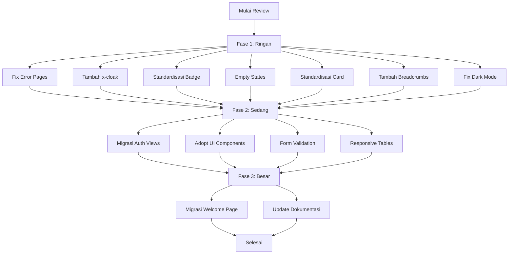

# Rencana Perbaikan Komprehensif - Grafika Printing
**Tanggal:** 6 Agustus 2026
**Status:** Draft - Menunggu Persetujuan

---

## Ringkasan Temuan

Setelah melakukan review menyeluruh terhadap seluruh kode proyek (views, layouts, controllers, routes, komponen, dan dokumentasi), ditemukan beberapa area yang perlu diperbaikan. Perbaikan dikategorikan menjadi 3 tingkat kesulitan: Ringan, Sedang, dan Besar.

### Temuan Utama

| # | Temuan | Severity | File Terdampak |
|---|--------|----------|----------------|
| 1 | Error pages (403, 404, 500) menggunakan CDN Tailwind & Font Awesome | Medium | 3 error pages |
| 2 | `style="display: none;"` digunakan di 50+ tempat alih-alih `x-cloak` | Low | Banyak views |
| 3 | Welcome page menggunakan 1500+ baris inline CSS | High | welcome.blade.php |
| 4 | Auth views menggunakan custom CSS classes | Medium | 6 auth views |
| 5 | Mix antara `onclick` vanilla JS dan Alpine.js `@click` | Low | Banyak views |
| 6 | Beberapa views belum punya empty state | Low | ~10 views |
| 7 | Badge status tidak konsisten antar views | Low | ~8 views |
| 8 | Dark mode classes tidak konsisten | Low | Admin views |
| 9 | Banyak views belum menggunakan UI components | Medium | ~30 views |
| 10 | Missing breadcrumbs pada beberapa halaman | Low | Vendor/Admin views |

---

## Rencana Perbaikan

### FASE 1: RINGAN (Light Tasks)

#### 1.1 Fix Error Pages (403, 404, 500)
**Masalah:** Error pages memuat CDN Tailwind (`cdn.tailwindcss.com`) dan Font Awesome CDN, yang:
- Menambah load time external dependency
- Tidak konsisten dengan Vite-built assets di seluruh aplikasi
- Menggunakan Font Awesome CDN versi 6.5.1 (berbeda dengan 6.4.0 yang digunakan app)

**Solusi:** Buat error pages yang self-contained menggunakan inline styles yang sudah di-compile, atau gunakan Vite assets. Karena error pages harus standalone (tidak bisa extends layout), gunakan pendekatan minimal dengan inline styles yang ringan.

**File:** `resources/views/errors/403.blade.php`, `resources/views/errors/404.blade.php`, `resources/views/errors/500.blade.php`

#### 1.2 Tambah x-cloak CSS Rule
**Masalah:** Banyak Alpine.js elements menggunakan `style="display: none;"` alih-alih `x-cloak`. Ini menyebabkan FOUC (Flash of Unstyled Content) karena `style="display: none;"` bisa konflik dengan Alpine.js transitions.

**Solusi:**
- Tambahkan `[x-cloak] { display: none !important; }` ke CSS global (`resources/css/app.css`)
- Ganti `style="display: none;"` dengan `x-cloak` pada Alpine.js elements

**File:** `resources/css/app.css` + ~50 view files

#### 1.3 Standardisasi Badge Status
**Masalah:** Badge status transaksi menggunakan warna yang berbeda-beda di setiap view.

**Solansi:** Buat `<x-ui.badge>` component yang bisa dipakai secara konsisten di semua views.

**File:** `resources/views/components/ui/badge.blade.php` (sudah ada, perlu dimanfaatkan)

#### 1.4 Empty States
**Masalah:** Beberapa views tidak menampilkan pesan yang informatif ketika tidak ada data.

**Solusi:** Tambahkan empty state yang konsisten dengan ikon, pesan, dan action button.

**File:** Views yang belum punya empty state

#### 1.5 Standardisasi Card Styling
**Masalah:** Cards menggunakan `rounded-xl`, `rounded-2xl`, `rounded-lg` secara tidak konsisten.

**Solusi:** Standardisasi:
- Main cards: `rounded-xl shadow-sm border border-gray-200`
- Stat cards: `rounded-xl border border-gray-200 p-5`
- Modal cards: `rounded-2xl shadow-xl`

#### 1.6 Tambah Breadcrumbs
**Masalah:** Beberapa halaman vendor/admin belum memiliki breadcrumbs.

**Solusi:** Gunakan `<x-breadcrumbs>` component yang sudah ada.

#### 1.7 Fix Dark Mode Classes
**Masalah:** Admin views mencampur `dark:` classes dengan regular classes secara tidak konsisten.

**Solusi:** Karena dark mode belum diaktifkan, pertahankan yang sudah ada dan pastikan tidak ada class `dark:` yang terisolasi.

---

### FASE 2: SEDANG (Medium Tasks)

#### 2.1 Migrasi Auth Views ke Tailwind
**Masalah:** Auth layout menggunakan custom CSS classes (`btn-auth`, `form-group`, `form-label`, `input-wrapper`, `auth-form`, `auth-checkbox`, `auth-footer`, `auth-alert`, `password-toggle`, `form-label-description`).

**Solusi:** Ganti dengan Tailwind utility classes secara bertahap. Auth layout sudah menggunakan Tailwind untuk layout utama, hanya bagian form yang masih pakai custom CSS.

**File:** `resources/views/layouts/auth.blade.php` + 6 auth views

#### 2.2 Adopt UI Components
**Masalah:** Banyak views masih menulis raw HTML alih-alih menggunakan `<x-ui.*>` components.

**Solusi:** Migrasi bertahap ke UI components:
- `<x-ui.button>` untuk semua tombol
- `<x-ui.card>` untuk semua card
- `<x-ui.modal>` untuk semua modal
- `<x-ui.table>` untuk semua tabel
- `<x-ui.input>` untuk semua input form
- `<x-ui.badge>` untuk status badges
- `<x-ui.stat-card>` untuk stat cards
- `<x-ui.alert>` untuk alerts
- `<x-ui.dropdown>` untuk dropdowns

#### 2.3 Form Validation Feedback
**Masalah:** Beberapa form tidak menampilkan inline validation messages.

**Solusi:** Tambahkan `@error` directive pada semua form fields.

#### 2.4 Responsive Table - Mobile Card Layout
**Masalah:** Tabel di mobile hanya scroll horizontal tanpa card layout.

**Solusi:** Implementasikan mobile card pattern menggunakan `hidden sm:table-cell` dan card view untuk mobile.

---

### FASE 3: BESAR (Large Tasks)

#### 3.1 Migrasi Welcome Page ke Tailwind
**Masalah:** `welcome.blade.php` memiliki 1530 baris dengan CSS inline yang sangat panjang.

**Solusi:** Migrasi bertahap ke Tailwind CSS classes, memanfaatkan `resources/css/welcome.css` yang sudah ada.

#### 3.2 Update Dokumentasi
**Solusi:** Update FEATURES.md, ROADMAP.md, dan AGENT.md dengan semua perubahan yang dilakukan.

---

## Diagram Alur Perbaikan

---

## Catatan Penting

1. **Tidak ada migrasi database** - Project sudah production, semua perubahan hanya di views dan CSS
2. **Prioritas: Fase 1 dulu** - Mulai dari yang ringan, pastikan tidak ada regression
3. **Testing** - Setelah setiap perubahan, cek di browser (desktop dan mobile)
4. **Commit berkala** - Setiap selesai satu item, commit perubahan
