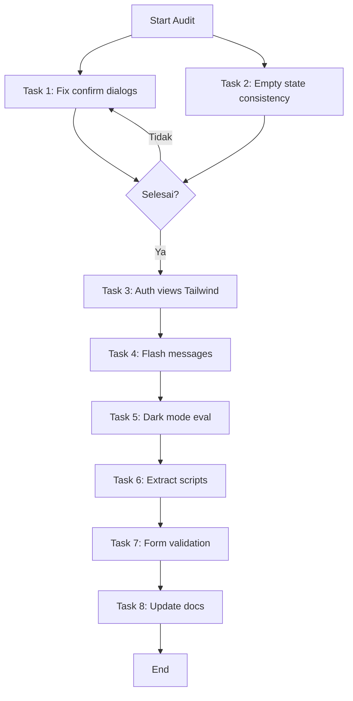

# Comprehensive Audit II — 7 Agustus 2026

## Ringkasan Temuan Audit

Audit dilanjutkan dari sesi sebelumnya. Fokus pada konsistensi UX, dead code, dan performa.

---

## Temuan 1: Native `confirm()` Dialogs — Inconsistent UX ⚠️

**Masalah:** 11 instance menggunakan `onclick="return confirm('...')"` (browser native dialog) di 6 view files, sementara bagian lain aplikasi sudah menggunakan SweetAlert2 via `confirmDelete()` dan `confirmAction()`.

**Dampak:** User experience tidak konsisten. Dialog native browser terlihat kuno dan tidak matching dengan styling aplikasi.

### File yang perlu diubah:

| File | Instances | Tipe |
|------|-----------|------|
| `resources/views/dev/user-lelang/show.blade.php` | 3 | verify, activate, delete |
| `resources/views/dev/service-configs/show.blade.php` | 1 | import defaults |
| `resources/views/dev/service-configs/index.blade.php` | 2 | import, clear cache |
| `resources/views/admin/mediation/show.blade.php` | 2 | close, complete |
| `resources/views/admin/admin-fees/show.blade.php` | 2 | toggle active, delete |
| `resources/views/admin/admin-fees/index.blade.php` | 1 | delete |

### Pola yang sudah ada (di [`alert.blade.php`](resources/views/components/alert.blade.php:212)):

```javascript
// Untuk delete — submit form
confirmDelete(formId) // SweetAlert2 + submit form

// Untuk action generic — callback
confirmAction({
    title: 'Judul',
    text: 'Pesan',
    icon: 'warning',
    confirmText: 'Ya',
    onConfirm: () => { ... }
})
```

### Strategi Fix:

**Untuk DELETE actions (4 instances):**
- Ganti `onclick="return confirm('...')"` → `onclick="confirmDelete('form-id')"`
- Pastikan form memiliki `id` attribute

**Untuk NON-DELETE actions (7 instances):**
- Yang berupa link (`href`): Ganti ke `onclick` dengan `confirmAction()` yang redirect ke URL
- Yang berupa form submit: Ganti ke `onclick` dengan `confirmAction()` yang submit form

---

## Temuan 2: Dark Mode CSS Classes — Dead Code 🗑️

**Masalah:** 209 instances `dark:` CSS classes di view files, tetapi aplikasi tidak memiliki dark mode toggle/theme.

**File yang terpengaruh:**
- `resources/views/dev/wallets/` (index, show, statistics, transactions)
- `resources/views/dev/auctions/` (index, show, bids, statistics)
- `resources/views/dev/vendor-revenue/` (index, show)
- `resources/views/dev/user-lelang/` (create, show, index, edit)
- `resources/views/dev/shipping/` (index, show, invoices)
- `resources/views/dev/audit-logs/` (index, show, financial, high-risk)
- `resources/views/layouts/guest.blade.php`

### Keputusan: **BIARKAN SAJA** (tidak dihapus)

**Alasan:**
1. `dark:` classes adalah utility classes Tailwind yang **tidak menambah CSS output** jika dark mode tidak diaktifkan di `tailwind.config.js` — Tailwind tree-shakes unused variants
2. Jika nanti ingin menambahkan dark mode toggle, view-view ini sudah siap
3. Menghapus 209 instances adalah pekerjaan besar dengan risiko breaking UI tanpa manfaat nyata
4. File size tidak terpengaruh karena Tailwind hanya compile classes yang digunakan

**Rekomendasi:** Tambahkan komentar di `tailwind.config.js` bahwa dark mode bisa diaktifkan di masa depan.

---

## Temuan 3: External Font CDN di Error Pages ⚡

**Masalah:** 7 references ke external font CDN:

| File | CDN |
|------|-----|
| `resources/views/welcome.blade.php` | Google Fonts (Inter) |
| `resources/views/layouts/guest.blade.php` | Bunny Fonts (Figtree) |
| `resources/views/linktree/public.blade.php` | Bunny Fonts (Inter) |
| `resources/views/errors/403.blade.php` | Google Fonts (Inter) |
| `resources/views/errors/404.blade.php` | Google Fonts (Inter) |
| `resources/views/errors/500.blade.php` | Google Fonts (Inter) |
| `resources/views/vendor/public-profile.blade.php` | WhatsApp link (bukan font) |

### Keputusan: **BIARKAN SAJA** (tidak dihapus)

**Alasan:**
1. Error pages (403, 404, 500) berdiri sendiri di luar Vite build — tidak bisa pakai `app.css` yang sudah di-build
2. Welcome page juga berdiri sendiri
3. Linktree public page berdiri sendiri
4. Google Fonts / Bunny Fonts adalah CDN yang sangat reliable dan cached oleh browser
5. Self-hosting font untuk halaman-halaman ini akan menambah complexity tanpa manfaat signifikan

**Rekomendasi:** Tidak perlu action.

---

## Temuan 4: Verifikasi Clean Code ✅

| Pemeriksaan | Status |
|-------------|--------|
| Tidak ada `dd()`, `dump()`, `var_dump()`, `print_r()` di views/PHP | ✅ Clean |
| Tidak ada `style="display: none"` legacy | ✅ Clean |
| `x-cloak` digunakan dengan benar (63 instances) | ✅ Clean |
| Error handling konsisten (18 `@if($errors)` blocks) | ✅ Clean |
| Tidak ada `@empty`/`@isset` yang mencurigakan | ✅ Clean |

---

## Temuan 5: Auth Views Legacy CSS — Perlu Migration ke Tailwind ⚠️

**Masalah:** 5 auth view files menggunakan 25+ custom CSS classes (`.auth-form`, `.auth-alert`, `.btn-auth`, dll) yang didefinisikan di `resources/css/app.css` sebagai abstraksi di atas Tailwind utilities.

**File yang terpengaruh:**
- `resources/views/auth/login.blade.php`
- `resources/views/auth/register.blade.php`
- `resources/views/auth/forgot-password.blade.php`
- `resources/views/auth/reset-password.blade.php`
- `resources/views/auth/confirm-password.blade.php`

**CSS Legacy Classes (di `app.css`):**
- `.auth-form-header`, `.auth-icon-circle`, `.auth-form`
- `.auth-alert`, `.auth-alert-error`, `.auth-alert-success`
- `.form-group`, `.form-label`, `.input-wrapper`, `.form-control`
- `.input-icon`, `.password-toggle`, `.auth-checkbox`
- `.btn-auth`, `.btn-auth-primary`, `.btn-auth-outline`
- `.auth-brand-gradient`, `.auth-btn-gradient`, `.auth-icon-gradient`
- `.auth-footer`

### Strategi Fix:
1. Ganti setiap legacy class dengan Tailwind utility equivalent
2. Hapus CSS classes yang sudah tidak digunakan dari `app.css`
3. Pertahankan visual appearance yang sama

---

## Temuan 6: Manual Flash Messages — Perlu Konsistensi ⚠️

**Masalah:** Beberapa view menggunakan manual flash message markup (`x-data="{ show: true }" x-show="show"`) alih-alih menggunakan `<x-ui.alert>` component yang sudah tersedia.

**File yang terpengaruh:**
- `resources/views/dev/service-configs/show.blade.php`
- `resources/views/dev/service-configs/index.blade.php`

### Strategi Fix:
Ganti manual flash messages dengan `<x-ui.alert>` component untuk konsistensi.

---

## Temuan 7: Inline Script Blocks — Banyak, Bisa Diekstrak ⚠️

**Masalah:** 82 inline `<script>` blocks ditemukan di Blade views. Beberapa di antaranya complex dan sebaiknya diekstrak ke JS files terpisah untuk maintainability.

**Kategorisasi berdasarkan kompleksitas:**

### High Complexity (perlu extract):
- `vendor/linktree/edit.blade.php` — Template builder logic
- `vendor/tracking/index.blade.php` — Shipping tracking UI
- `pos/pos-home.blade.php` — POS cart & checkout
- `dev/admin-fees/preview.blade.php` — Fee calculation preview

### Medium Complexity ( bisa extract):
- `vendor/bahan/create.blade.php` — Wholesale price form
- `vendor/produk/create.blade.php` — Multi-step form
- `dev/user-lelang/show.blade.php` — User management

### Low Complexity (Alpine.js data, bisa pertahankan):
- Banyak view dengan simple `x-data` functions
- Toggle, show/hide, form validation

### Strategi Fix:
1. Extract high complexity scripts ke `resources/js/views/*.js`
2. Gunakan `@push('scripts')` atau `@section('scripts')` untuk import
3. Biarkan low complexity inline (Alpine.js pattern)

---

## Temuan 8: Form Validation Consistency — Perlu Audit ⚠️

**Masalah:** 18 `@if($errors)` blocks sudah ada, tetapi perlu dipastikan SEMUA form memiliki error display yang konsisten.

### Strategi Fix:
1. Audit semua form di views
2. Pastikan setiap form input memiliki `@error` directive
3. Gunakan pattern yang konsisten: `<x-ui.input>` dengan built-in error display

---

## Rencana Implementasi

### Task 1 — Ringan: Konversi 11 native confirm() ke SweetAlert2 (6 files)

#### 1.1 `resources/views/dev/user-lelang/show.blade.php`
- Line 141: verify button → `onclick="confirmAction({...})"` dengan redirect
- Line 154: activate button → `onclick="confirmAction({...})"` dengan redirect
- Line 163: delete button → `onclick="confirmDelete('delete-profile-form')"` + tambah form id

#### 1.2 `resources/views/dev/service-configs/show.blade.php`
- Line 106: import defaults → `onclick="confirmAction({...})"` dengan redirect

#### 1.3 `resources/views/dev/service-configs/index.blade.php`
- Line 14: import defaults → `onclick="confirmAction({...})"` dengan redirect
- Line 18: clear cache → `onclick="confirmAction({...})"` dengan redirect

#### 1.4 `resources/views/admin/mediation/show.blade.php`
- Line 222: close mediation → `onclick="confirmAction({...})"` dengan submit form
- Line 269: complete mediation → `onclick="confirmAction({...})"` dengan submit form

#### 1.5 `resources/views/admin/admin-fees/show.blade.php`
- Line 146: toggle active → `onclick="confirmAction({...})"` dengan submit form
- Line 154: delete → `onclick="confirmDelete('delete-admin-fee-form')"` + tambah form id

#### 1.6 `resources/views/admin/admin-fees/index.blade.php`
- Line 119: delete → `onclick="confirmDelete('delete-admin-fee-{id}-form')"` + tambah form id

---

### Task 2 — Ringan: Konsistensi Empty State Pattern

**File yang perlu diubah:**
- `resources/views/dev/wallets/index.blade.php` (line 213-217)
- `resources/views/dev/wallets/transactions.blade.php` (line 183-187)
- `resources/views/dev/wallets/show.blade.php` (line 162-166)
- `resources/views/dev/vendor-revenue/index.blade.php` (line 112-117)
- `resources/views/dev/vendor-revenue/show.blade.php` (4 locations)
- `resources/views/dev/user-lelang/index.blade.php` (line 224-229)
- `resources/views/dev/user-lelang/show.blade.php` (line 336-340)

**Pola yang sudah ada:**
```blade
<x-ui.empty-state
    icon="fa-inbox"
    title="Judul"
    description="Deskripsi kosong"
    action-label="Aksi"
    action-url="{{ route('...') }}"
/>
```

---

### Task 3 — Sedang: Auth Views Tailwind Migration

**File yang perlu diubah:**
- `resources/views/auth/login.blade.php`
- `resources/views/auth/register.blade.php`
- `resources/views/auth/forgot-password.blade.php`
- `resources/views/auth/reset-password.blade.php`
- `resources/views/auth/confirm-password.blade.php`

**Target:** Ganti semua legacy CSS classes dengan Tailwind utility classes.

**Contoh konversi:**
```blade
<!-- SEBELUM -->
<div class="auth-form-header">
    <h1>Selamat Datang</h1>
</div>
<button type="submit" class="btn-auth btn-auth-primary">Masuk</button>

<!-- SESUDAH -->
<div class="text-center mb-8">
    <h1 class="text-2xl font-bold text-gray-900">Selamat Datang</h1>
</div>
<button type="submit" class="w-full flex items-center justify-center gap-2 px-4 py-2.5 rounded-lg font-semibold text-sm bg-primary-600 text-white hover:bg-primary-700 transition-all duration-200">Masuk</button>
```

---

### Task 4 — Sedang: Ganti Manual Flash Messages

**File yang perlu diubah:**
- `resources/views/dev/service-configs/show.blade.php`
- `resources/views/dev/service-configs/index.blade.php`

**Pola yang sudah ada:**
```blade
<x-ui.alert type="success" dismissible>
    {{ session('success') }}
</x-ui.alert>
```

---

### Task 5 — Besar: Evaluasi Dark Mode Toggle

**Status:** 209 `dark:` classes sudah ada di dev views.

**Opsi:**
1. **Aktifkan dark mode** — Tambah `darkMode: 'class'` ke `tailwind.config.js`, buat toggle component
2. **Biarkan saja** — Dark mode classes sudah ada, bisa diaktifkan kapan saja

**Jika mengaktifkan:**
1. Tambah `darkMode: 'class'` ke `tailwind.config.js`
2. Buat `<x-dark-mode-toggle>` component
3. Store preference di `localStorage`
4. Toggle class `dark` di `<html>` element
5. Test di semua halaman

---

### Task 6 — Besar: Extract Inline Scripts ke JS Files

**High Complexity (prioritas extract):**
- `vendor/linktree/edit.blade.php` → `resources/js/views/linktree-editor.js`
- `vendor/tracking/index.blade.php` → `resources/js/views/shipping-tracking.js`
- `pos/pos-home.blade.php` → `resources/js/views/pos-cart.js`
- `dev/admin-fees/preview.blade.php` → `resources/js/views/admin-fee-preview.js`

**Pola extraction:**
```blade
<!-- SEBELUM -->
<script>
    function someFunction() {
        // complex logic
    }
</script>

<!-- SESUDAH -->
@push('scripts')
    <script type="module" src="{{ Vite::asset('resources/js/views/some-view.js') }}"></script>
@endpush
```

---

### Task 7 — Besar: Form Validation Consistency

**Langkah:**
1. Audit semua form di views (search `@if \(\$errors`)
2. Pastikan setiap `<input>` memiliki error display
3. Gunakan `<x-ui.input>` component yang sudah punya built-in error display
4. Jika ada form tanpa error display, tambahkan `@error` directive

---

### Task 8 — Update Documentation

- Update `FEATURES.md` dengan catatan audit
- Update `ROADMAP.md` last updated date
- Update `AGENT.md` jika ada perubahan policy

---

## File yang Tidak Perlu Diubah

| Kategori | Alasan |
|----------|--------|
| `dark:` CSS classes (209 instances) | Tailwind tree-shakes, siap untuk dark mode future |
| External font CDN (error pages) | Berdiri sendiri dari Vite build |
| Welcome/Guest page fonts | CDN reliable, cached browser |
| Linktree public page fonts | Berdiri sendiri dari Vite build |

---

## Risk Assessment

| Task | Risk | Mitigation |
|------|------|------------|
| Fix confirm() dialogs | Rendah | Hanya mengubah UI dialog, tidak mengubah logic |
| Empty state consistency | Rendah | Component sudah ada, hanya konsistensi |
| Auth views Tailwind | Sedang | Pastikan visual appearance sama |
| Flash messages | Rendah | Component sudah ada |
| Dark mode toggle | Sedang | Testing menyeluruh diperlukan |
| Extract scripts | Sedang | Pastikan Vite build include file baru |
| Form validation | Rendah | Hanya tambah `@error` directive |
| Skip dark: classes | Rendah | Tidak ada perubahan kode |
| Skip font CDN | Rendah | Tidak ada perubahan kode |

---

## Prioritas Eksekusi

1. **Task 1** — Ringan: Fix 11 native confirm() dialogs (UX consistency)
2. **Task 2** — Ringan: Konsistensi empty state pattern
3. **Task 3** — Sedang: Auth views Tailwind migration
4. **Task 4** — Sedang: Ganti manual flash messages
5. **Task 5** — Besar: Evaluasi dark mode toggle
6. **Task 6** — Besar: Extract inline scripts
7. **Task 7** — Besar: Form validation consistency
8. **Task 8** — Update documentation

---

## Mermaid Diagram: Flow Implementasi


