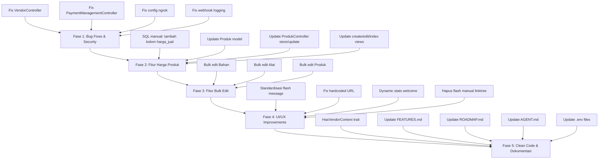

# Rencana Implementasi Komprehensif — 7 Agustus 2026

> **PENTING**: Projek dalam production. TIDAK boleh membuat migration yang alter tabel existing. Gunakan SQL manual script untuk perubahan schema.

---

## Ringkasan Temuan

### Bug Kritis
1. **VendorController** — `$logoName` undefined jika tidak ada logo upload + email validation pakai tabel `users` bukan `vendors`
2. **PaymentManagementController::processPaidPayment()** — Langsung tambah wallet balance, kontradiksi dengan escrow logic di XenditWebhookController
3. **Produk model** — `harga_dasar` ada di `casts` tapi kolom tidak ada di DB → selalu null

### Security
4. **config/services.php** — Hardcoded ngrok fallback URL
5. **XenditWebhookController** — Log semua headers termasuk sensitive data (X-IDN-Key)

### Fitur Gap
6. **Produk** — Tidak ada field harga_jual di model, form, atau index
7. **Bahan** — Tidak ada bulk edit untuk stok & HPP
8. **Alat** — Tidak ada bulk edit untuk status & ketersediaan
9. **Produk** — Tidak ada bulk edit untuk kategori & status aktif

### UI/UX
10. **Flash message campur aduk** — 232 referensi, campuran `toast_success`/`toast_error` vs `success`/`error`/`info`
11. **Admin layout** — Hardcoded `https://grafika.noteds.com` di footer
12. **Welcome page** — Stats hardcoded "100+", "500+", "4.8★"
13. **Linktree products.blade.php** — Flash message manual padahal sudah ada `x-alert` component

### Clean Code
14. **Vendor retrieval duplikasi** — 49 lokasi `Auth::user()->vendorUser->first()` / `session('current_vendor_id')`

---

## Alur Implementasi



---

## Fase 1: Bug Fixes & Security

### 1.1 Fix VendorController — `$logoName` + email validation

**File**: `app/Http/Controllers/VendorController.php`

**Bug 1** (line 74): `$logoName` undefined jika tidak upload logo
```php
// SEBELUM (line 63-74)
if ($request->hasFile('logo')) {
    $logo = $request->file('logo');
    $logoName = time() . '.' . $logo->getClientOriginalExtension();
    $logo->move(public_path('vendors_logo'), $logoName);
}

$vendors = new Vendor([
    ...
    'logo' => $logoName, // UNDEFINED jika no upload
]);
```

**Fix**:
```php
$logoName = null;
if ($request->hasFile('logo')) {
    $logo = $request->file('logo');
    $logoName = time() . '.' . $logo->getClientOriginalExtension();
    $logo->move(public_path('vendors_logo'), $logoName);
}

$vendors = new Vendor([
    ...
    'logo' => $logoName,
]);
```

**Bug 2** (line 54): Email validation `unique:users` → seharusnya `unique:vendors`
```php
// SEBELUM
'email' => 'required|string|email|max:255|unique:users',
// SESUDAH
'email' => 'required|string|email|max:255|unique:vendors,email',
```

**Catatan**: Perlu cek apakah `update()` method juga punya bug yang sama. Perlu baca ulang VendorController update method.

### 1.2 Fix PaymentManagementController — Wallet Funding

**File**: `app/Http/Controllers/Admin/PaymentManagementController.php`

**Bug** (line 128-133): `processPaidPayment()` langsung tambah wallet balance
```php
// SEBELUM — SALAH: Langsung fund wallet tanpa escrow
$wallet = \App\Models\VendorWallet::firstOrCreate(['vendor_id' => $winningBid->vendor_id]);
$wallet->increment('balance', (float) $payment->amount);
```

**Fix**: Hapus baris wallet increment. Biarkan escrow handle oleh XenditWebhookController. Method ini hanya untuk manual admin action — seharusnya hanya update status, TIDAK fund wallet langsung.

### 1.3 Fix config/services.php — Hapus ngrok

**File**: `config/services.php`

```php
// SEBELUM (line 40-42)
'redirect_url' => env('APP_URL', 'https://332deb15a4e6.ngrok-free.app'),
'webhook_url' => env('WEBHOOK_URL', 'https://332deb15a4e6.ngrok-free.app/contoh-xendit/webhook'),

// SESUDAH
'redirect_url' => env('APP_URL', 'https://grafika.noteds.com'),
'webhook_url' => env('WEBHOOK_URL', 'https://grafika.noteds.com/xendit/webhook'),
```

### 1.4 Fix XenditWebhookController — Hapus sensitive logging

**File**: `app/Http/Controllers/XenditWebhookController.php`

```php
// SEBELUM (line 30-34)
Log::info('Xendit webhook received', [
    'headers' => $request->headers->all(), // SENSITIVE!
    'body' => $request->getContent(),
    'ip' => $request->ip()
]);

// SESUDAH
Log::info('Xendit webhook received', [
    'method' => $request->method(),
    'ip' => $request->ip(),
    'content_type' => $request->header('Content-Type'),
]);
```

---

## Fase 2: Fitur Harga Produk

### 2.1 SQL Manual — Tambah kolom harga_jual

**⚠️ PENTING**: Ini bukan migration! Ini script SQL manual untuk dijalankan di production database.

**File baru**: `database/manual_migrations/add_harga_jual_to_produks.sql`

```sql
-- Tambah kolom harga_jual ke tabel produks
-- Jalankan manual di production database!
-- Tanggal: 7 Agustus 2026

ALTER TABLE `produks` 
ADD COLUMN `harga_jual` decimal(15,2) DEFAULT NULL AFTER `deskripsi`;
```

### 2.2 Update Produk Model

**File**: `app/Models/Vendor/Produk.php`

Tambah `harga_jual` ke `$fillable` dan `$casts`:
```php
protected $fillable = [
    'vendor_id', 'gambar', 'nama_produk', 'deskripsi', 'kategori_id', 'harga_jual'
];

protected $casts = [
    'gambar' => 'array',
    'harga_jual' => 'decimal:2',
];
```

**Note**: Pertahankan `harga_dasar` di casts untuk backward compatibility, tapi tambah `harga_jual` sebagai field utama.

### 2.3 Update ProdukController

**File**: `app/Http/Controllers/vendor/ProdukController.php`

**store() method** — Tambah validasi & saving harga_jual:
```php
$rules['harga_jual'] = 'nullable|numeric|min:0';

// Di create array:
'harga_jual' => $request->harga_jual,
```

**update() method** — Sama, tambah harga_jual di validation & update.

### 2.4 Update Views

**resources/views/produk/create.blade.php** — Tambah input harga_jual:
```html
<div>
    <label class="block text-sm font-medium text-gray-700 mb-1">Harga Jual (Rp)</label>
    <input type="number" name="harga_jual" value="{{ old('harga_jual') }}" 
        min="0" step="0.01" placeholder="0"
        class="w-full px-4 py-2 border border-gray-300 rounded-lg focus:ring-2 focus:ring-primary focus:border-primary text-sm">
</div>
```

**resources/views/produk/edit.blade.php** — Sama, tambah input harga_jual.

**resources/views/produk/index.blade.php** — Tambah kolom "Harga" di table:
```html
<th class="px-4 py-3 text-left text-xs font-medium text-gray-500 uppercase">Harga</th>
<td class="px-4 py-3 text-sm text-gray-900">
    {{ $produk->harga_jual ? 'Rp ' . number_format($produk->harga_jual, 0, ',', '.') : '-' }}
</td>
```

**resources/views/produk/show.blade.php** — Tambah tampilan harga_jual.

---

## Fase 3: Fitur Bulk Edit

### Pola Umum

Semua fitur bulk edit akan mengikuti pola yang sama:
1. Tambah checkbox column di table index
2. Tambah "Select All" checkbox di header
3. Tambah dropdown/bulk action bar di atas table
4. Tambah method `bulkUpdate()` di controller
5. Tambah route POST untuk bulk update

### 3.1 Bulk Edit Bahan (Stok & HPP)

**File**: `app/Http/Controllers/vendor/BahanController.php`
- Tambah method `bulkUpdate(Request $request)`
- Validasi: `ids` required array, `field` in ['stok', 'hpp'], `value` required

**File**: `resources/views/bahan/index.blade.php`
- Tambah checkbox per row
- Tambah "Select All" di header
- Tambah bulk action bar: field selector (Stok/HPP) + value input + apply button

**Route**: `POST /vendor/materials/bulk-update` → `BahanController@bulkUpdate`

### 3.2 Bulk Edit Alat (Status & Ketersediaan)

**File**: `app/Http/Controllers/vendor/AlatController.php`
- Tambah method `bulkUpdate(Request $request)`
- Validasi: `ids` required array, `field` in ['status', 'tersedia'], `value` required

**File**: `resources/views/alat/index.blade.php`
- Tambah checkbox per row
- Tambah "Select All" di header
- Tambah bulk action bar: field selector (Status/Ketersediaan) + value dropdown + apply button

**Route**: `POST /vendor/tools/bulk-update` → `AlatController@bulkUpdate`

### 3.3 Bulk Edit Produk (Kategori & Status Aktif)

**File**: `app/Http/Controllers/vendor/ProdukController.php`
- Tambah method `bulkUpdate(Request $request)`
- Validasi: `ids` required array, `field` in ['kategori_id', 'is_active'], `value` required

**File**: `resources/views/produk/index.blade.php`
- Tambah checkbox per row
- Tambah "Select All" di header
- Tambah bulk action bar: field selector (Kategori/Status Aktif) + value dropdown + apply button

**Route**: `POST /vendor/products/bulk-update` → `ProdukController@bulkUpdate`

---

## Fase 4: UI/UX Improvements

### 4.1 Standardisasi Flash Message

**Target**: Ubah semua `->with('success', ...)` / `->with('error', ...)` / `->with('info', ...)` / `->with('warning', ...)` menjadi `->with('toast_success', ...)` / `->with('toast_error', ...)` / `->with('toast_info', ...)`.

**Scope**: 232 referensi di 30+ controller files.

**Controllers yang perlu diupdate** (prioritas):
- `AuctionController.php` (7 referensi)
- `Admin/AdminFeeController.php` (4 referensi)
- `Admin/AuctionManagementController.php` (8 referensi)
- `Admin/MediationController.php` (3 referensi)
- `Admin/ServiceConfigController.php` (8 referensi)
- `DeliveryConfirmationController.php` (6 referensi)
- `LinktreeController.php` (20+ referensi)
- `VendorWalletController.php` (4 referensi)
- `VendorBankAccountController.php` (3 referensi)
- `VendorAuditLogController.php` (4 referensi)
- `VendorRatingController.php` (4 referensi)
- `OrderTrackingController.php` (3 referensi)
- `ManualTransferController.php` (2 referensi)
- `PaymentConfirmationController.php` (3 referensi)
- `vendor/AuctionBidController.php` (10+ referensi)
- `vendor/AbTestController.php` (8 referensi)
- `vendor/pos/PosController.php` (8 referensi)
- `vendor/pos/PaymentController.php` (4 referensi)
- `vendor/pos/CheckoutController.php` (4 referensi)
- `vendor/TemplateController.php` (2 referensi)
- `vendor/VendorManualTransferController.php` (4 referensi)

### 4.2 Fix Hardcoded URL di Admin Layout

**File**: `resources/views/dev/layouts/app.blade.php` (line 235)

```html
<!-- SEBELUM -->
<a href="https://grafika.noteds.com" ...>Website</a>

<!-- SESUDAH -->
<a href="{{ route('home') }}" ...>Website</a>
```

### 4.3 Dynamic Stats di Welcome Page

**File**: `resources/views/welcome.blade.php` (line 99-112)

```blade
<!-- SEBELUM — Hardcoded -->
<span class="stat-number">100+</span>
<span class="stat-label">Vendor Aktif</span>

<!-- SESUDAH — Dynamic dari CmsSetting -->
@php
    $vendorCount = \App\Models\Vendor::where('is_active', true)->count();
    $auctionCount = \App\Models\Auction::where('status', 'completed')->count();
    $avgRating = \App\Models\VendorRating::where('is_verified', true)->avg('rating');
@endphp
<span class="stat-number">{{ $vendorCount }}+</span>
<span class="stat-label">Vendor Aktif</span>
```

**Note**: Gunakan CmsSetting sebagai fallback, atau query langsung. Pertimbangkan caching untuk performa.

### 4.4 Hapus Flash Manual di Linktree Products

**File**: `resources/views/vendor/linktree/products.blade.php` (line 25-37)

Hapus blok flash message manual karena sudah ada `x-alert` component yang handle toast.

---

## Fase 5: Clean Code & Dokumentasi

### 5.1 HasVendorContext Trait

**File baru**: `app/Traits/HasVendorContext.php`

```php
<?php

namespace App\Traits;

use App\Models\Vendor;
use Illuminate\Support\Facades\Auth;

trait HasVendorContext
{
    protected function getVendorId(): ?int
    {
        $user = Auth::user();
        if (!$user) return null;
        
        // Prioritas: session > database
        if (session('current_vendor_id')) {
            return (int) session('current_vendor_id');
        }
        
        $vendorUser = $user->vendorUser->first();
        return $vendorUser ? $vendorUser->id : null;
    }
    
    protected function getVendor(): ?Vendor
    {
        $vendorId = $this->getVendorId();
        return $vendorId ? Vendor::find($vendorId) : null;
    }
}
```

**Note**: Ini adalah refactoring besar yang mempengaruhi banyak controller. Sebaiknya dilakukan bertahap. Untuk fase ini, cukup buat trait-nya dan gunakan di 1-2 controller sebagai contoh. Full migration bisa dilakukan nanti.

### 5.2 Update Dokumentasi

**FEATURES.md** — Tambah section:
- Fitur Bulk Edit (Bahan, Alat, Produk)
- Fitur Harga Produk
- Catatan Update 7 Agustus 2026

**ROADMAP.md** — Update status:
- Phase 1: ✅ Bug fixes selesai
- Tambah phase baru: Bulk Edit Features
- Update tech debt section

**AGENT.md** — Update:
- Tambah informasi bulk edit routes
- Update file yang sering diubah
- Tambah troubleshooting untuk harga_jual

### 5.3 Update .env files

**.env.example** — Pastikan semua variable terdokumentasi dengan benar. Hapus placeholder ngrok.

**.env.production** — Tambah catatan tentang konfigurasi production yang aman.

---

## Urutan Eksekusi

1. **Fix VendorController** (bug kritis, ringan)
2. **Fix PaymentManagementController** (bug kritis, ringan)
3. **Fix config/services.php** (security, ringan)
4. **Fix XenditWebhookController logging** (security, ringan)
5. **Buat SQL manual script** (harga_jual column)
6. **Update Produk model** (harga_jual fillable + casts)
7. **Update ProdukController store/update** (harga_jual handling)
8. **Update Produk views** (create/edit/index/show)
9. **Buat bulk edit Bahan** (controller + view + route)
10. **Buat bulk edit Alat** (controller + view + route)
11. **Buat bulk edit Produk** (controller + view + route)
12. **Standardisasi flash message** (232 referensi)
13. **Fix hardcoded URL admin layout**
14. **Dynamic stats welcome page**
15. **Hapus flash manual linktree/products**
16. **Buat HasVendorContext trait**
17. **Update dokumentasi** (FEATURES.md, ROADMAP.md, AGENT.md)
18. **Update .env files**

---

## Catatan Penting

- **Tidak ada migration** untuk production database — gunakan SQL manual script
- **Bulk edit pattern** mengikuti pola yang sudah ada di `WithdrawalManagementController::bulkApprove()`
- **Flash message** harus dikonsultasikan — apakah cukup ganti ke toast atau ada yang perlu tetap sebagai alert box
- **HasVendorContext trait** adalah refactoring besar — mulai dari 1-2 controller dulu
- **harga_jual** adalah kolom baru — perlu dijalankan SQL manual di production sebelum deploy code
