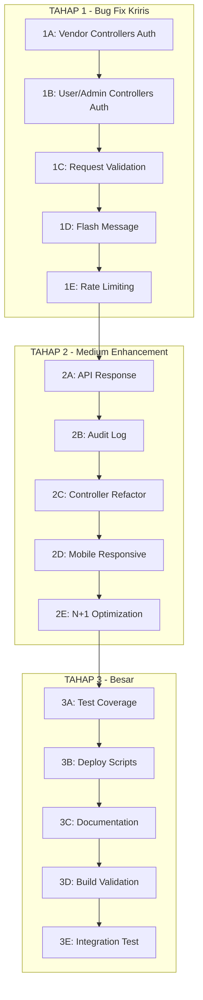

# Rencana Komprehensif Phase 5 — Grafika-Printing

> **Tanggal:** 11 Agustus 2026
> **Berdasarkan:** Hasil analisis menyeluruh FEATURES.md, ROADMAP.md, AGENT.md, architecture-suggestions.md, dan seluruh struktur kode
> **Status Sebelumnya:** Phase 1-4 selesai, Phase 5 (Deployment) selesai, Comprehensive Audit I-III selesai

---

## Ringkasan Analisis

### Yang Sudah Ada & Berfungsi
- ✅ Laravel 13.24.0 + Tailwind CSS + Alpine.js (migrasi lengkap)
- ✅ Multi-tenant architecture dengan shared database
- ✅ 13 UI components reusable
- ✅ POS, Auction, Wallet, Linktree, Xendit Payment, Shipping
- ✅ SoftDeletes di 5 tabel penting
- ✅ Infrastructure: Policies, Request Classes, AuthorizationService, FlashMessage, ApiResponse, FileUploadService, HasVendorContext trait
- ✅ Deploy.sh & update.sh

### Yang Perlu Dikerjakan (Berdasarkan Prioritas)

#### 🔴 KRITIS — Security & Authorization
1. **AuthorizationService belum terintegrasi** ke vendor controllers
2. **HasVendorContext trait belum digunakan** di controllers yang masih manual
3. **Request Validation Classes sudah dibuat tapi belum diintegrasikan** ke controllers
4. **FlashMessage helper belum konsisten** digunakan
5. **Rate Limiting belum diimplementasikan**

#### 🟡 PENTING — Code Quality & Consistency
6. **ApiResponse belum terintegrasi** ke API controllers
7. **AuditLogService belum konsisten** dipanggil
8. **Fat controllers perlu di-refactor**
9. **N+1 query problems** di beberapa views
10. **Responsive mobile** perlu review

#### 🟢 NORMAL — Completeness
11. **Test coverage minim**
12. **Deploy scripts perlu sync**
13. **Documentation perlu update**
14. **Build validation**

---

## TAHAP 1A — Integrasi AuthorizationService + HasVendorContext ke Vendor Controllers

**Prioritas:** 🔴 KRITIS (Security)
**Batas:** Maksimal 10 file per tahap

### File yang Perlu Diubah:
1. `app/Http/Controllers/vendor/ProdukController.php` — Tambah `use HasVendorContext;` + `authorizeVendorOwnership()` di show/edit/update/destroy
2. `app/Http/Controllers/vendor/TransaksiController.php` — Tambah authorization check
3. `app/Http/Controllers/vendor/PelangganController.php` — Tambah authorization check
4. `app/Http/Controllers/vendor/PenggunaController.php` — Tambah authorization check
5. `app/Http/Controllers/vendor/SpesifikasiController.php` — Tambah authorization check
6. `app/Http/Controllers/vendor/KategoriProdukController.php` — Tambah authorization check
7. `app/Http/Controllers/vendor/AlatController.php` — Tambah authorization check
8. `app/Http/Controllers/vendor/BahanController.php` — Tambah authorization check
9. `app/Http/Controllers/vendor/LaporanController.php` — Tambah vendor context
10. `app/Http/Controllers/vendor/LinktreeController.php` — Tambah authorization check

### Pattern Implementasi:
```php
use App\Http\Concerns\HasVendorContext;

class ProdukController extends Controller
{
    use HasVendorContext;

    public function show(Produk $produk)
    {
        $this->authorizeVendorOwnership($produk);
        // ... existing logic
    }
}
```

---

## TAHAP 1B — Integrasi AuthorizationService ke User/Admin Controllers

**Prioritas:** 🔴 KRITIS (Security)
**Batas:** Maksimal 10 file per tahap

### File yang Perlu Diubah:
1. `app/Http/Controllers/AuctionController.php` — Pastikan user hanya bisa aksi pada auction miliknya
2. `app/Http/Controllers/OrderTrackingController.php` — Pastikan vendor hanya akses order vendor-nya
3. `app/Http/Controllers/DeliveryConfirmationController.php` — Authorization check
4. `app/Http/Controllers/PaymentConfirmationController.php` — Authorization check
5. `app/Http/Controllers/UserDashboardController.php` — Vendor context untuk dashboard
6. `app/Http/Controllers/UserController.php` — Authorization check
7. `app/Http/Controllers/VendorController.php` — Authorization check

---

## TAHAP 1C — Integrasi Request Validation Classes

**Prioritas:** 🔴 KRITIS (Data Integrity)
**Batas:** Maksimal 10 file per tahap

### Request Classes yang Sudah Ada (20 files):
- `BaseRequest.php`, `ProfileUpdateRequest.php`, `SecureRequest.php`
- `StoreAlatRequest.php`, `StoreAuctionRequest.php`, `StoreBahanRequest.php`
- `StoreKategoriProdukRequest.php`, `StoreLinktreeRequest.php`, `StorePelangganRequest.php`
- `StorePenggunaRequest.php`, `StoreProdukRequest.php`, `StoreSpesifikasiRequest.php`
- `StoreTransaksiRequest.php`, `UpdateAlatRequest.php`, `UpdateAuctionRequest.php`
- `UpdateLinktreeRequest.php`, `UpdatePenggunaRequest.php`, `UpdateSpesifikasiRequest.php`
- `UpdateTransaksiRequest.php`, `Auth/LoginRequest.php`

### Controllers yang Perlu Diintegrasikan (10 file max per tahap):
1. `vendor/ProdukController.php` — gunakan `StoreProdukRequest` + `UpdateProdukRequest` (perlu buat)
2. `vendor/TransaksiController.php` — gunakan `StoreTransaksiRequest` + `UpdateTransaksiRequest`
3. `vendor/PenggunaController.php` — gunakan `StorePenggunaRequest` + `UpdatePenggunaRequest`
4. `vendor/AlatController.php` — gunakan `StoreAlatRequest` + `UpdateAlatRequest`
5. `vendor/BahanController.php` — gunakan `StoreBahanRequest` (perlu buat)
6. `vendor/SpesifikasiController.php` — gunakan `StoreSpesifikasiRequest` + `UpdateSpesifikasiRequest`
7. `vendor/KategoriProdukController.php` — gunakan `StoreKategoriProdukRequest`
8. `vendor/PelangganController.php` — gunakan `StorePelangganRequest`
9. `AuctionController.php` — gunakan `StoreAuctionRequest` + `UpdateAuctionRequest`
10. `vendor/LinktreeController.php` — gunakan `StoreLinktreeRequest` + `UpdateLinktreeRequest`

---

## TAHAP 1D — Flash Message Standardization

**Prioritas:** 🟡 PENTING (Consistency)
**Batas:** Maksimal 10 file per tahap

### Pattern:
```php
use App\Http\Responses\FlashMessage;

// SEBELUM
return redirect()->route('xxx')->with('success', 'Data berhasil disimpan');

// SESUDAH
return FlashMessage::success(redirect()->route('xxx'), 'Data berhasil disimpan');
```

---

## TAHAP 1E — Rate Limiting

**Prioritas:** 🟡 PENTING (Security)
**File yang Diubah:**
- `app/Providers/AppServiceProvider.php` — Define rate limits
- `routes/web.php` — Apply throttle middleware
- `routes/api.php` — Apply throttle middleware

### Rate Limits:
- API: 60/minute
- Public page (linktree): 30/minute
- Manual transfer: 5/hour
- Auth: 5/minute
- Webhook: 100/minute

---

## TAHAP 2A — API Response Standardization

**Prioritas:** 🟢 NORMAL
**File yang Diubah:** API controllers menggunakan `ApiResponse` helper

## TAHAP 2B — Audit Log Enhancement

**Prioritas:** 🟢 NORMAL
**File yang Diubah:** Controllers memanggil `AuditLogService::log()` di CRUD operations

## TAHAP 2C — Controller Refactoring

**Prioritas:** 🟢 NORMAL
**File yang Diubah:** Fat controllers dipecah ke Action classes

## TAHAP 2D — Responsive Mobile Fixes

**Prioritas:** 🟡 PENTING
**File yang Diubah:** Views yang bermasalah di mobile

## TAHAP 2E — N+1 Query Optimization

**Prioritas:** 🟢 NORMAL
**File yang Diubah:** Controllers/views yang perlu eager loading

---

## TAHAP 3A — Test Coverage

**Prioritas:** 🟢 NORMAL
**File yang Dibuat:** Tests di `tests/Feature/` dan `tests/Unit/`

## TAHAP 3B — Deployment Script Sync

**Prioritas:** 🟡 PENTING
**File yang Diubah:** `deploy.sh`, `update.sh`

## TAHAP 3C — Documentation Update

**Prioritas:** 🟢 NORMAL
**File yang Diubah:** `FEATURES.md`, `ROADMAP.md`, `AGENT.md`

## TAHAP 3D — Vite Build Validation

**Prioritas:** 🟡 PENTING
**Aksi:** Jalankan `npm run build` dan perbaiki error

## TAHAP 3E — Final Integration Test

**Prioritas:** 🟢 NORMAL
**Aksi:** Verifikasi seluruh flow utama

---

## Diagram Alur Pengerjaan



---

## Catatan Penting

1. **Maksimal 10 file per tahap** — Untuk mencegah code corrupt
2. **Non-destructive migration** — Jangan ubah/hapus migration yang sudah jalan di production
3. **SoftDeletes sudah aktif** — Models sudah menggunakan SoftDeletes
4. **Bahasa Indonesia** — Semua komentar, dokumentasi, dan pesan error dalam Bahasa Indonesia
5. **No truncated code** — Setiap file harus ditulis utuh tanpa komentar pemotong
