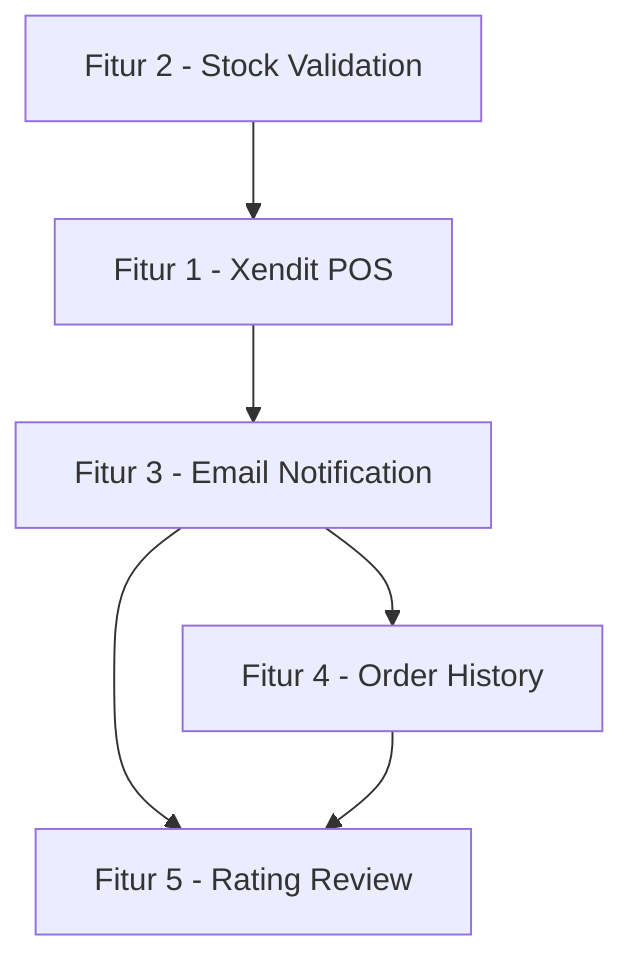
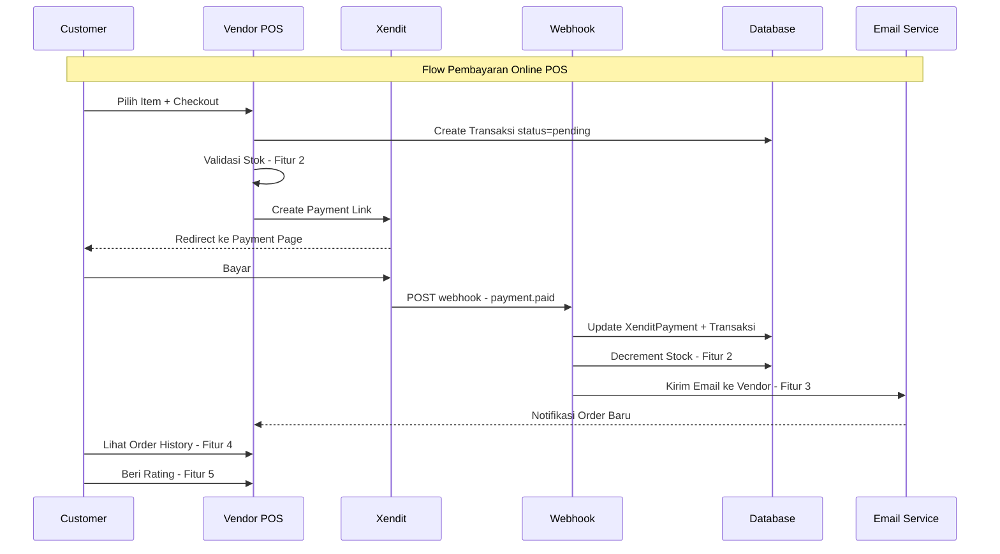
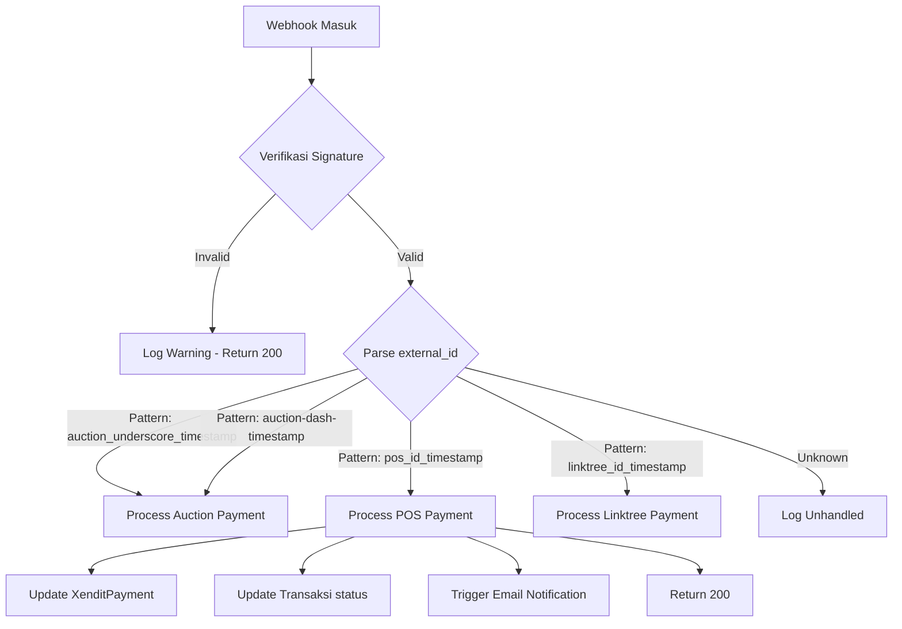

# Rencana Arsitektur: 5 Fitur E-Commerce Grafika-Printing

> **Tanggal:** 2026-08-22
> **Status:** Draft — Menunggu Review
> **Konteks:** Laravel 13, Multi-Tenant Shared Database, Tailwind CSS + Alpine.js

---

## Executive Summary

Dokumen ini merancang 5 fitur baru untuk memperkuat sisi e-commerce Grafika-Printing:

| # | Fitur | Prioritas | Kompleksitas |
|---|-------|-----------|--------------|
| 1 | Xendit Auto-Payment Integration untuk POS | Tinggi | Sedang |
| 2 | Stock Validation Saat Order | Tinggi | Rendah |
| 3 | Email Notification ke Vendor saat Order Baru | Sedang | Rendah |
| 4 | Order History untuk Customer | Sedang | Sedang |
| 5 | Rating/Review setelah Order Selesai | Sedang | Sedang |

**Dependency antar fitur:**



Fitur 2 dan 1 harus diimplementasi duluan karena menjadi fondasi. Fitur 3 aktif di kedua jalur pembayaran. Fitur 4 dan 5 bergantung pada transaksi POS yang sudah berjalan.

---

## Architecture Diagram

### High-Level System Flow



### Webhook Routing Logic



---

## Fitur 1: Xendit Auto-Payment Integration untuk POS

### Kondisi Saat Ini

- [`PaymentController::processXenditPayment()`](app/Http/Controllers/vendor/pos/PaymentController.php:95) sudah membuat payment link dengan `external_id = pos_{id}_{timestamp}`
- [`XenditWebhookController`](app/Http/Controllers/XenditWebhookController.php) hanya handle auction — regex `auction[_-](\d+)[_-]` di [`processAuctionPayment()`](app/Http/Controllers/XenditWebhookController.php:194)
- [`XenditPayment`](app/Models/XenditPayment.php) model hanya punya relasi ke `auction_id`, belum ada `transaksi_id`
- [`handlePaymentLinkPaid()`](app/Http/Controllers/XenditWebhookController.php:106) langsung panggil `processAuctionPayment()` tanpa cek prefix

### Perubahan yang Diperlukan

#### 1a. Migration — Tambah `transaksi_id` ke `xendit_payments`

```
database/migrations/2026_08_22_100001_add_transaksi_id_to_xendit_payments_table.php
```

```php
Schema::table('xendit_payments', function (Blueprint $table) {
    $table->foreignId('transaksi_id')
          ->nullable()
          ->after('auction_id')
          ->constrained('transaksis')
          ->onDelete('set null');
    $table->index(['transaksi_id', 'status']);
});
```

#### 1b. Update Model `XenditPayment`

```php
// app/Models/XenditPayment.php — Tambahkan ke $fillable:
'transaksi_id'

// Tambahkan relasi:
public function transaksi()
{
    return $this->belongsTo(\App\Models\Vendor\Transaksi::class);
}

// Tambahkan helper:
public function isPosPayment(): bool
{
    return str_starts_with($this->external_id, 'pos_');
}

public function isAuctionPayment(): bool
{
    return str_starts_with($this->external_id, 'auction');
}
```

#### 1c. Update `XenditWebhookController`

Ubah alur di [`handlePaymentLinkPaid()`](app/Http/Controllers/XenditWebhookController.php:106) dan [`handleXenPaymentPaid()`](app/Http/Controllers/XenditWebhookController.php:148):

```php
// Strategi: Rute berdasarkan prefix external_id
protected function handlePaymentLinkPaid(array $data): void
{
    $paymentData = $data['data'];
    $externalId = $paymentData['external_id'];

    $payment = XenditPayment::where('external_id', $externalId)->first();

    if (!$payment) {
        Log::warning('No payment found for external_id', ['external_id' => $externalId]);
        return;
    }

    $payment->update([
        'status' => 'paid',
        'payment_method' => $paymentData['payment_method'] ?? null,
        'paid_at' => now(),
        'webhook_data' => $data
    ]);

    // Route berdasarkan prefix
    if ($payment->isPosPayment()) {
        $this->processPosPayment($payment);
    } elseif ($payment->isAuctionPayment()) {
        $this->processAuctionPayment($payment);
    } else {
        Log::info('Unhandled payment prefix', ['external_id' => $externalId]);
    }
}
```

#### 1d. Method Baru `processPosPayment()`

```php
protected function processPosPayment(XenditPayment $payment): void
{
    try {
        // Extract transaksi ID dari external_id: pos_{id}_{timestamp}
        if (preg_match('/^pos_(\d+)_/', $payment->external_id, $matches)) {
            $transaksiId = $matches[1];
            $transaksi = \App\Models\Vendor\Transaksi::find($transaksiId);

            if ($transaksi) {
                $transaksi->update([
                    'status' => 'completed',
                    'paid_at' => now(),
                    'payment_status' => 'paid'
                ]);

                // Kirim notifikasi ke vendor
                $this->sendVendorNotification($transaksi);

                Log::info('POS payment processed', [
                    'transaksi_id' => $transaksi->id,
                    'payment_id' => $payment->id,
                    'amount' => $payment->amount
                ]);
            }
        }
    } catch (\Exception $e) {
        Log::error('Error processing POS payment', [
            'payment_id' => $payment->id,
            'error' => $e->getMessage()
        ]);
    }
}
```

#### 1e. Update `PaymentController::processXenditPayment()`

Tambahan kecil untuk menyimpan `transaksi_id` saat membuat payment link:

```php
// Setelah create XenditPayment record (jika ada), atau langsung di update transaksi:
$transaksi->update([
    'payment_method' => 'xendit',
    'xendit_payment_id' => $response['id'] ?? null,
    'xendit_external_id' => $externalId,
    // ... field lainnya
]);

// Buat XenditPayment record untuk tracking
XenditPayment::create([
    'external_id' => $externalId,
    'xendit_id' => $response['id'] ?? null,
    'amount' => $totalAmount,
    'description' => 'POS Payment: ' . $transaksi->kode,
    'status' => 'pending',
    'transaksi_id' => $transaksi->id,  // ← BARU
    'user_id' => Auth::id(),
    'customer_email' => $request->customer_email,
    'customer_name' => $transaksi->pelanggan->nama,
]);
```

### File yang Diubah

| File | Perubahan |
|------|-----------|
| `database/migrations/2026_08_22_100001_add_transaksi_id_to_xendit_payments_table.php` | **BARU** — Migration |
| [`app/Models/XenditPayment.php`](app/Models/XenditPayment.php) | Tambah `transaksi_id` ke fillable, relasi `transaksi()`, helper methods |
| [`app/Http/Controllers/XenditWebhookController.php`](app/Http/Controllers/XenditWebhookController.php) | Update `handlePaymentLinkPaid()`, `handleXenPaymentPaid()`, tambah `processPosPayment()` |
| [`app/Http/Controllers/vendor/pos/PaymentController.php`](app/Http/Controllers/vendor/pos/PaymentController.php) | Buat `XenditPayment` record di `processXenditPayment()` |

---

## Fitur 2: Stock Validation Saat Order

### Kondisi Saat Ini

- [`CheckoutController::processCheckout()`](app/Http/Controllers/vendor/pos/CheckoutController.php:27) sudah validasi stok (line 99-120) dan decrement stok (line 139-149)
- [`Bahan::checkStockLevel()`](app/Models/Vendor/Bahan.php:125) hanya log warning, belum kirim notifikasi
- Tidak ada rollback stok jika pembayaran gagal
- Tidak ada real-time stock display di cart/checkout

### Perubahan yang Diperlukan

#### 2a. Stock Rollback saat Pembayaran Gagal/Batal

Tambah method di [`CheckoutController`](app/Http/Controllers/vendor/pos/CheckoutController.php) atau buat service baru:

```php
// app/Services/StockService.php — BARU
public function rollbackStock(Transaksi $transaksi): void
{
    foreach ($transaksi->transaksiItem as $item) {
        foreach ($item->transaksiItemSpecifications as $spec) {
            $bahan = Bahan::find($spec->bahan_id);
            if ($bahan) {
                $quantity = $spec->input_type === 'number'
                    ? (float) $spec->value * $item->kuantitas
                    : $item->kuantitas;
                $bahan->increment('stok', $quantity);
            }
        }
    }
}
```

Trigger rollback di:
- [`PaymentController::paymentFailure()`](app/Http/Controllers/vendor/pos/PaymentController.php:201) — saat status = `payment_pending` dan halaman failure dikunjungi
- Webhook expired handler — tambah call ke `rollbackStock()` di [`handlePaymentLinkExpired()`](app/Http/Controllers/XenditWebhookController.php:130)
- Cleanup command untuk transaksi `payment_pending` > 24 jam

#### 2b. Low Stock Alert ke Vendor

Update [`Bahan::checkStockLevel()`](app/Models/Vendor/Bahan.php:125):

```php
public function checkStockLevel()
{
    $minimumStock = $this->minimum_stok ?? 5;

    if ($this->stok <= $minimumStock) {
        // Kirim notifikasi ke vendor
        $vendor = $this->vendor;
        if ($vendor && $vendor->vendorUser) {
            foreach ($vendor->vendorUser as $user) {
                $user->notify(new \App\Notifications\LowStockNotification($this));
            }
        }
    }
}
```

#### 2c. Real-Time Stock Display di Cart

Tambahkan endpoint API untuk AJAX stock check:

```php
// Di routes/web.php — vendor group
Route::get('/pos/stock-check/{bahan}', [PosController::class, 'checkStock'])
    ->name('pos.stock-check');
```

Response JSON:
```json
{
    "bahan_id": 1,
    "nama": "Kertas A4",
    "stok": 15,
    "satuan": "lembar",
    "status": "available",
    "is_low": false
}
```

Di view [`pos/cart.blade.php`](resources/views/pos/cart.blade.php), tampilkan stok real-time via Alpine.js polling setiap 30 detik.

### File yang Dibuat/Diubah

| File | Perubahan |
|------|-----------|
| `app/Services/StockService.php` | **BARU** — Rollback + validation logic |
| [`app/Http/Controllers/vendor/pos/PaymentController.php`](app/Http/Controllers/vendor/pos/PaymentController.php) | Panggil rollback di `paymentFailure()` |
| [`app/Http/Controllers/vendor/pos/CheckoutController.php`](app/Http/Controllers/vendor/pos/CheckoutController.php) | Refactor stok validation ke StockService |
| [`app/Http/Controllers/vendor/pos/PosController.php`](app/Http/Controllers/vendor/pos/PosController.php) | Tambah `checkStock()` endpoint |
| [`app/Models/Vendor/Bahan.php`](app/Models/Vendor/Bahan.php) | Update `checkStockLevel()` untuk kirim notifikasi |
| `app/Notifications/LowStockNotification.php` | **BARU** — Low stock notification |
| [`resources/views/pos/cart.blade.php`](resources/views/pos/cart.blade.php) | Tambah real-time stock display |
| [`routes/web.php`](routes/web.php) | Tambah route `pos.stock-check` |

---

## Fitur 3: Email Notification ke Vendor saat Order Baru

### Kondisi Saat Ini

- 5 notification classes sudah ada, semuanya untuk auction flow
- [`OrderCompletedNotification`](app/Notifications/OrderCompletedNotification.php) kirim ke user, bukan vendor
- [`OrderStatusChanged`](app/Notifications/OrderStatusChanged.php) kirim ke `pelanggan` (bukan vendor)
- [`Pelanggan`](app/Models/Vendor/Pelanggan.php) sudah punya `Notifiable` trait
- [`User`](app/Models/User.php) sudah punya `Notifiable` trait
- Vendor model **belum** punya `Notifiable` trait — perlu di-update

### Perubahan yang Diperlukan

#### 3a. Tambah `Notifiable` ke Vendor Model

```php
// app/Models/Vendor.php
use Illuminate\Notifications\Notifiable;

class Vendor extends Model
{
    use HasFactory, Notifiable;
    // ...
}
```

#### 3b. Notification Class Baru

```php
// app/Notifications/VendorNewOrderNotification.php — BARU
namespace App\Notifications;

use App\Models\Vendor\Transaksi;
use Illuminate\Bus\Queueable;
use Illuminate\Contracts\Queue\ShouldQueue;
use Illuminate\Notifications\Messages\MailMessage;
use Illuminate\Notifications\Notification;

class VendorNewOrderNotification extends Notification
{
    use Queueable;

    public Transaksi $transaksi;

    public function __construct(Transaksi $transaksi)
    {
        $this->transaksi = $transaksi;
    }

    public function via(object $notifiable): array
    {
        return ['mail', 'database'];
    }

    public function toMail(object $notifiable): MailMessage
    {
        return (new MailMessage)
            ->subject('🛒 Order Baru #' . $this->transaksi->kode)
            ->greeting('Halo ' . $notifiable->name . '!')
            ->line('Ada order baru dari POS:')
            ->line('• Kode: **' . $this->transaksi->kode . '**')
            ->line('• Pelanggan: ' . $this->transaksi->pelanggan->nama)
            ->line('• Total: Rp ' . number_format($this->transaksi->total_harga, 0, ',', '.'))
            ->line('• Metode: ' . ucfirst($this->transaksi->payment_method))
            ->line('')
            ->action('Lihat Order', route('vendor.pos.invoice.show', $this->transaksi))
            ->line('Segera proses order ini.')
            ->salutation('Salam, Tim Grafika Printing');
    }

    public function toArray(object $notifiable): array
    {
        return [
            'type' => 'new_pos_order',
            'transaksi_id' => $this->transaksi->id,
            'kode' => $this->transaksi->kode,
            'total' => $this->transaksi->total_harga,
            'pelanggan' => $this->transaksi->pelanggan->nama ?? 'N/A',
            'message' => 'Order baru #' . $this->transaksi->kode . ' dari ' . ($this->transaksi->pelanggan->nama ?? 'POS'),
            'action_url' => route('vendor.pos.invoice.show', $this->transaksi),
            'action_text' => 'Lihat Order'
        ];
    }
}
```

#### 3c. Trigger Notification

**Di Cash Payment** — [`PaymentController::processCashPayment()`](app/Http/Controllers/vendor/pos/PaymentController.php:53):

```php
// Setelah DB::commit() atau setelah update status ke 'completed'
$vendor = $transaksi->vendor;
$vendor->notify(new \App\Notifications\VendorNewOrderNotification($transaksi));
```

**Di Xendit Webhook** — [`XenditWebhookController::processPosPayment()`](app/Http/Controllers/XenditWebhookController.php) (method baru dari Fitur 1):

```php
// Setelah update transaksi status ke 'completed'
$vendor = $transaksi->vendor;
$vendor->notify(new \App\Notifications\VendorNewOrderNotification($transaksi));
```

### File yang Dibuat/Diubah

| File | Perubahan |
|------|-----------|
| [`app/Models/Vendor.php`](app/Models/Vendor.php) | Tambah `Notifiable` trait |
| `app/Notifications/VendorNewOrderNotification.php` | **BARU** — Notification class |
| [`app/Http/Controllers/vendor/pos/PaymentController.php`](app/Http/Controllers/vendor/pos/PaymentController.php) | Trigger notification di `processCashPayment()` |
| [`app/Http/Controllers/XenditWebhookController.php`](app/Http/Controllers/XenditWebhookController.php) | Trigger notification di `processPosPayment()` |

---

## Fitur 4: Order History untuk Customer

### Kondisi Saat Ini

- [`OrderTrackingController`](app/Http/Controllers/OrderTrackingController.php) hanya untuk auction orders
- Route `user.orders.*` sudah ada di [`routes/web.php:520`](routes/web.php:520) — untuk auction order tracking
- Transaksi POS tersimpan di `transaksis` table dengan `user_id` field
- **Tidak ada** user-side view untuk melihat riwayat transaksi POS

### Perubahan yang Diperlukan

#### 4a. Controller Baru

```php
// app/Http/Controllers/UserTransactionController.php — BARU
namespace App\Http\Controllers;

use App\Models\Vendor\Transaksi;
use Illuminate\Http\Request;
use Illuminate\Support\Facades\Auth;
use Illuminate\View\View;

class UserTransactionController extends Controller
{
    /**
     * Daftar transaksi POS milik user
     */
    public function index(Request $request): View
    {
        $query = Transaksi::where('user_id', Auth::id())
            ->with(['vendor', 'pelanggan', 'transaksiItem.produk']);

        // Filter by status
        if ($request->filled('status')) {
            $query->where('status', $request->status);
        }

        // Filter by date range
        if ($request->filled('date_from')) {
            $query->whereDate('tanggal_dibuat', '>=', $request->date_from);
        }
        if ($request->filled('date_to')) {
            $query->whereDate('tanggal_dibuat', '<=', $request->date_to);
        }

        // Search
        if ($request->filled('search')) {
            $query->where(function ($q) use ($request) {
                $q->where('kode', 'like', "%{$request->search}%")
                  ->orWhereHas('vendor', fn($q2) => $q2->where('name', 'like', "%{$request->search}%"));
            });
        }

        $transactions = $query->latest('tanggal_dibuat')->paginate(15);

        return view('user.transactions.index', compact('transactions'));
    }

    /**
     * Detail transaksi
     */
    public function show(Transaksi $transaksi): View
    {
        if ($transaksi->user_id !== Auth::id()) {
            abort(403);
        }

        $transaksi->load(['vendor', 'pelanggan', 'transaksiItem.produk', 'transaksiItemSpecifications.bahan']);

        return view('user.transactions.show', compact('transaksi'));
    }

    /**
     * Download invoice PDF (opsional — bisa print-friendly HTML)
     */
    public function invoice(Transaksi $transaksi)
    {
        if ($transaksi->user_id !== Auth::id()) {
            abort(403);
        }

        return view('user.transactions.invoice', ['transaksi' => $transaksi->load(['vendor', 'pelanggan', 'transaksiItem.produk'])]);
    }
}
```

#### 4b. Routes

```php
// routes/web.php — di dalam Route::middleware(['auth', 'verified', 'user'])->prefix('user')...
Route::prefix('transactions')->name('transactions.')->group(function () {
    Route::get('/', [UserTransactionController::class, 'index'])->name('index');
    Route::get('/{transaksi}', [UserTransactionController::class, 'show'])->name('show');
    Route::get('/{transaksi}/invoice', [UserTransactionController::class, 'invoice'])->name('invoice');
});
```

#### 4c. Views

```
resources/views/user/transactions/
├── index.blade.php      # List transaksi dengan filter
├── show.blade.php       # Detail transaksi + status timeline
└── invoice.blade.php    # Invoice view + print button
```

**index.blade.php** — Komponen:
- Search bar + filter (status, date range)
- Table: Kode, Vendor, Tanggal, Total, Status (badge), Aksi
- Pagination

**show.blade.php** — Komponen:
- Header: Kode transaksi + status badge
- Info vendor + pelanggan
- Daftar item dengan spesifikasi
- Status timeline (pending → processing → quality_check → completed)
- Info pembayaran (metode, jumlah, admin fee)
- Tombol download invoice
- Tombol review (jika sudah selesai dan belum di-review)

**invoice.blade.php** — Komponen:
- Layout print-friendly
- Detail lengkap transaksi
- Tombol print (window.print())

### File yang Dibuat/Diubah

| File | Perubahan |
|------|-----------|
| `app/Http/Controllers/UserTransactionController.php` | **BARU** — Controller |
| [`routes/web.php`](routes/web.php) | Tambah routes `user.transactions.*` |
| `resources/views/user/transactions/index.blade.php` | **BARU** — List view |
| `resources/views/user/transactions/show.blade.php` | **BARU** — Detail view |
| `resources/views/user/transactions/invoice.blade.php` | **BARU** — Invoice view |

---

## Fitur 5: Rating/Review setelah Order Selesai

### Kondisi Saat Ini

- [`VendorRating`](app/Models/VendorRating.php) model sudah ada, extend `UserTenantModel`
- **Unique constraint:** `['user_id', 'auction_id']` — tidak bisa dipakai untuk POS
- [`VendorRatingController`](app/Http/Controllers/VendorRatingController.php) hanya untuk auction
- Model sudah punya field `transaksi_id` dan relasi `transaksi()`
- [`Vendor`](app/Models/Vendor.php) sudah punya relasi `ratings()` dan `average_rating` accessor

### Keputusan Desain

**Pendekatan yang Dipilih: Gunakan model `VendorRating` yang sudah ada, bukan buat model baru.**

Alasan:
1. Model [`VendorRating`](app/Models/VendorRating.php) sudah punya field `transaksi_id` dan `is_verified`
2. Unique constraint `['user_id', 'auction_id']` bisa di-relax → ganti ke `['user_id', 'auction_id', 'transaksi_id']` atau buat conditional unique
3. [`Vendor`](app/Models/Vendor.php) model sudah punya `ratings()`, `average_rating`, `getRatingDistribution()` — semua akan otomatis berfungsi
4. Menghindari duplikasi logic rating di 2 model

**Alternatif: Buat model baru `TransactionReview`**
- Lebih clean secara konsep
- Tapi perlu duplikasi logic di [`Vendor`](app/Models/Vendor.php) model
- Perlu merge 2 sumber rating di tampilan vendor profile

**Rekomendasi: Relax unique constraint** — ubah dari `['user_id', 'auction_id']` menjadi conditional: satu user hanya bisa rating 1x per auction DAN 1x per transaksi POS.

### Perubahan yang Diperlukan

#### 5a. Migration — Update Unique Constraint

```php
// database/migrations/2026_08_22_100002_update_vendor_ratings_unique_constraint.php — BARU

Schema::table('vendor_ratings', function (Blueprint $table) {
    // Drop old unique constraint
    $table->dropUnique(['user_id', 'auction_id']);

    // Add new: unique per auction OR unique per transaksi
    // Karena MySQL tidak support partial unique, kita handle di application layer
    // Tambah index untuk performance
    $table->index(['user_id', 'transaksi_id']);
});
```

> **Catatan:** MySQL tidak mendukung conditional unique constraint. Validasi "satu rating per user per order" akan di-handle di application layer.

#### 5b. Update `VendorRatingController`

```php
// app/Http/Controllers/VendorRatingController.php — Tambah methods:

/**
 * Show rating form for completed POS transaction
 */
public function createForTransaction(Transaksi $transaksi)
{
    if ($transaksi->user_id !== Auth::id()) {
        abort(403);
    }

    if ($transaksi->status !== 'completed') {
        abort(403, 'Transaksi belum selesai');
    }

    // Check if already rated
    $existingRating = VendorRating::where('user_id', Auth::id())
        ->where('transaksi_id', $transaksi->id)
        ->first();

    if ($existingRating) {
        return FlashMessage::info(
            redirect()->route('user.transactions.show', $transaksi),
            'Anda sudah memberikan rating untuk transaksi ini'
        );
    }

    $vendor = $transaksi->vendor;

    return view('user.transactions.rate', compact('transaksi', 'vendor'));
}

/**
 * Store rating for POS transaction
 */
public function storeForTransaction(Request $request, Transaksi $transaksi)
{
    if ($transaksi->user_id !== Auth::id()) {
        abort(403);
    }

    if ($transaksi->status !== 'completed') {
        abort(403, 'Transaksi belum selesai');
    }

    $request->validate([
        'rating' => 'required|integer|min:1|max:5',
        'comment' => 'nullable|string|max:1000',
        'rating_details' => 'nullable|array',
        'rating_details.quality' => 'nullable|integer|min:1|max:5',
        'rating_details.speed' => 'nullable|integer|min:1|max:5',
        'rating_details.service' => 'nullable|integer|min:1|max:5',
        'rating_details.communication' => 'nullable|integer|min:1|max:5'
    ]);

    // Check if already rated (application layer)
    $existingRating = VendorRating::where('user_id', Auth::id())
        ->where('transaksi_id', $transaksi->id)
        ->first();

    if ($existingRating) {
        return FlashMessage::error(
            redirect()->route('user.transactions.show', $transaksi),
            'Anda sudah memberikan rating untuk transaksi ini'
        );
    }

    DB::beginTransaction();
    try {
        VendorRating::create([
            'vendor_id' => $transaksi->vendor_id,
            'user_id' => Auth::id(),
            'auction_id' => null,  // Tidak terkait auction
            'transaksi_id' => $transaksi->id,
            'rating' => $request->rating,
            'comment' => $request->comment,
            'rating_details' => $request->rating_details,
            'is_verified' => true  // POS ratings auto-verified
        ]);

        DB::commit();

        return FlashMessage::success(
            redirect()->route('user.transactions.show', $transaksi),
            'Rating berhasil dikirim!'
        );
    } catch (\Exception $e) {
        DB::rollBack();
        return FlashMessage::backError('Terjadi kesalahan: ' . $e->getMessage());
    }
}
```

#### 5c. Routes

```php
// routes/web.php — di dalam user transactions group
Route::get('/{transaksi}/review', [VendorRatingController::class, 'createForTransaction'])
    ->name('review.create');
Route::post('/{transaksi}/review', [VendorRatingController::class, 'storeForTransaction'])
    ->name('review.store');
```

#### 5d. View — Form Rating

```
resources/views/user/transactions/rate.blade.php — BARU
```

Komponen:
- Star rating picker (1-5) dengan Alpine.js
- Detail rating (quality, speed, service, communication) — optional
- Textarea untuk comment
- Tombol submit

#### 5e. Trigger Link dari Email/Notification

Di [`VendorNewOrderNotification`](app/Notifications/VendorNewOrderNotification.php) (Fitur 3), tambahkan informasi review link. Dan buat notification baru saat order completed:

```php
// app/Notifications/PosOrderCompletedNotification.php — BARU
// Dikirim ke USER (bukan vendor) saat transaksi POS selesai
// Include link ke review form
```

### File yang Dibuat/Diubah

| File | Perubahan |
|------|-----------|
| `database/migrations/2026_08_22_100002_update_vendor_ratings_unique_constraint.php` | **BARU** — Migration |
| [`app/Http/Controllers/VendorRatingController.php`](app/Http/Controllers/VendorRatingController.php) | Tambah `createForTransaction()`, `storeForTransaction()` |
| [`routes/web.php`](routes/web.php) | Tambah routes `user.transactions.*.review` |
| `resources/views/user/transactions/rate.blade.php` | **BARU** — Rating form |
| [`resources/views/user/transactions/show.blade.php`](resources/views/user/transactions/show.blade.php) | Tambah tombol "Beri Rating" |
| `app/Notifications/PosOrderCompletedNotification.php` | **BARU** — Notification ke user saat order selesai |

---

## Database Design — Ringkasan Migrations

### Migration 1: `add_transaksi_id_to_xendit_payments`

```
Tabel: xendit_payments
├── transaksi_id (foreignId, nullable → transaksis.id)
├── Index: [transaksi_id, status]
```

### Migration 2: `update_vendor_ratings_unique_constraint`

```
Tabel: vendor_ratings
├── Drop unique: [user_id, auction_id]
├── Add index: [user_id, transaksi_id]
├── Validasi unique di application layer:
│   ├── Auction rating: WHERE user_id = ? AND auction_id = ?
│   └── POS rating: WHERE user_id = ? AND transaksi_id = ?
```

### Catatan: Tidak ada tabel baru yang dibuat

Semua fitur menggunakan tabel yang sudah ada. Pendekatan ini menjaga backward compatibility dan mengurangi risiko.

---

## File Structure — Ringkasan

### File BARU (dibuat)

```
database/migrations/
├── 2026_08_22_100001_add_transaksi_id_to_xendit_payments_table.php
└── 2026_08_22_100002_update_vendor_ratings_unique_constraint.php

app/Services/
└── StockService.php

app/Notifications/
├── VendorNewOrderNotification.php
├── LowStockNotification.php
└── PosOrderCompletedNotification.php

app/Http/Controllers/
└── UserTransactionController.php

resources/views/user/transactions/
├── index.blade.php
├── show.blade.php
├── invoice.blade.php
└── rate.blade.php
```

### File YANG DIUBAH

```
app/Models/
├── XenditPayment.php          ← tambah transaksi_id, relasi, helper
└── Vendor.php                  ← tambah Notifiable trait

app/Http/Controllers/
├── XenditWebhookController.php ← rute POS + auction, tambah processPosPayment()
├── VendorRatingController.php  ← tambah createForTransaction, storeForTransaction
└── vendor/pos/
    ├── PaymentController.php   ← buat XenditPayment record, trigger notifikasi
    ├── CheckoutController.php  ← refactor stok ke StockService
    └── PosController.php       ← tambah checkStock endpoint

app/Models/Vendor/
└── Bahan.php                   ← update checkStockLevel()

routes/
└── web.php                     ← tambah routes baru

resources/views/pos/
└── cart.blade.php              ← tambah real-time stock display
```

---

## Implementation Steps

### Fase 1: Fondasi Database dan Model

1. Buat migration `add_transaksi_id_to_xendit_payments` → jalankan `php artisan migrate`
2. Buat migration `update_vendor_ratings_unique_constraint` → jalankan `php artisan migrate`
3. Update model [`XenditPayment`](app/Models/XenditPayment.php) — tambah fillable, relasi, helper
4. Tambah `Notifiable` trait ke [`Vendor`](app/Models/Vendor.php) model
5. Buat `StockService` — logic rollback stok
6. Update [`Bahan::checkStockLevel()`](app/Models/Vendor/Bahan.php:125) — kirim notifikasi

### Fase 2: Webhook dan Payment Flow

7. Update [`XenditWebhookController`](app/Http/Controllers/XenditWebhookController.php) — rute POS payment, tambah `processPosPayment()`
8. Update [`PaymentController::processXenditPayment()`](app/Http/Controllers/vendor/pos/PaymentController.php:95) — buat `XenditPayment` record
9. Update [`PaymentController::paymentFailure()`](app/Http/Controllers/vendor/pos/PaymentController.php:201) — trigger stock rollback
10. Update expired webhook handlers — trigger stock rollback

### Fase 3: Notifications

11. Buat `VendorNewOrderNotification`
12. Buat `LowStockNotification`
13. Buat `PosOrderCompletedNotification`
14. Trigger notifications di [`PaymentController::processCashPayment()`](app/Http/Controllers/vendor/pos/PaymentController.php:53) dan webhook

### Fase 4: User-Facing Views

15. Buat `UserTransactionController` — index, show, invoice
16. Buat routes `user.transactions.*`
17. Buat views: `index.blade.php`, `show.blade.php`, `invoice.blade.php`
18. Tambah real-time stock display di [`cart.blade.php`](resources/views/pos/cart.blade.php)
19. Buat `checkStock()` endpoint di [`PosController`](app/Http/Controllers/vendor/pos/PosController.php)

### Fase 5: Rating System

20. Update [`VendorRatingController`](app/Http/Controllers/VendorRatingController.php) — tambah POS rating methods
21. Buat routes `user.transactions.*.review`
22. Buat view `rate.blade.php`
23. Tambah tombol "Beri Rating" di [`show.blade.php`](resources/views/user/transactions/show.blade.php)
24. Link review dari `PosOrderCompletedNotification`

### Fase 6: Testing

25. Unit test untuk `StockService::rollbackStock()`
26. Unit test untuk `processPosPayment()` — webhook flow
27. Feature test untuk `UserTransactionController` — CRUD + authorization
28. Feature test untuk rating — create, duplicate prevention
29. Integration test — end-to-end POS payment flow
30. Update existing tests jika ada yang affected

---

## Testing Plan

### Unit Tests

| Test | File | Coverage |
|------|------|----------|
| `StockServiceTest` | `tests/Feature/StockServiceTest.php` | Rollback stok, validasi stok |
| `XenditPaymentTest` | `tests/Feature/XenditPaymentTest.php` | Model helpers, relasi |
| `VendorNewOrderNotificationTest` | `tests/Feature/VendorNewOrderNotificationTest.php` | Mail + database channels |

### Feature Tests

| Test | File | Coverage |
|------|------|----------|
| `PosWebhookTest` | `tests/Feature/PosWebhookTest.php` | Webhook POS payment flow |
| `UserTransactionTest` | `tests/Feature/UserTransactionTest.php` | Index, show, invoice + auth |
| `TransactionRatingTest` | `tests/Feature/TransactionRatingTest.php` | Create rating, duplicate prevention |
| `StockRollbackTest` | `tests/Feature/StockRollbackTest.php` | Rollback on failure/expired |

### Integration Tests

| Test | File | Coverage |
|------|------|----------|
| `PosPaymentFlowTest` | `tests/Feature/PosPaymentFlowTest.php` | End-to-end: checkout → payment → webhook → notification |

### Test Scenarios Penting

1. **Webhook POS Payment:**
   - External ID format `pos_{id}_{timestamp}` → update transaksi + XenditPayment
   - External ID format auction → tetap handle auction (tidak regression)
   - Unknown external ID → log, tidak crash

2. **Stock Rollback:**
   - Transaksi dibuat + stok terdecrement → payment gagal → stok kembali
   - Transaksi dibuat + stok terdecrement → webhook expired > 24 jam → cleanup rollback
   - Concurrent order → stok tidak minus

3. **Rating:**
   - User rate transaksi POS → berhasil
   - User rate transaksi yang sama lagi → ditolak
   - User rate transaksi yang belum selesai → ditolak
   - User rate transaksi user lain → 403

4. **Notification:**
   - Cash payment → vendor terima email + database notification
   - Online payment → vendor terima email + database notification setelah webhook
   - Low stock → vendor terima notifikasi

---

## Risk Assessment

| Risiko | Impact | Mitigation |
|--------|--------|------------|
| Webhook POS tidak ter-handle | Transaksi stuck `payment_pending` | Cleanup command + manual check |
| Unique constraint migration gagal | Rating data corrupt | Backup data sebelum migration |
| Notifikasi email tidak terkirim | Vendor tidak tahu order baru | Database notification sebagai fallback |
| Race condition stok | Stok minus | DB transaction + `lockForUpdate()` |
| Email spam low stock | Vendor terlalu banyak notifikasi | Batch notification, max 1x per jam per bahan |

---

## Environment Variables

Tidak ada environment variable baru yang diperlukan. Semua sudah dikonfigurasi di `.env`:
- `MAIL_MAILER` — untuk email notification
- `XENDIT_WEBHOOK_TOKEN` — untuk verifikasi webhook
