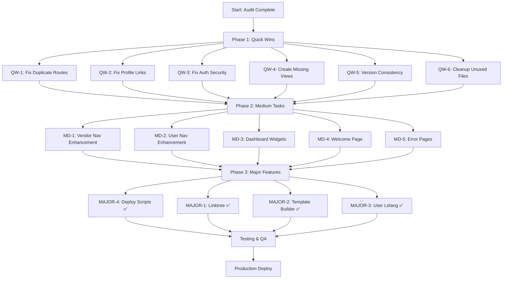

# Rencana Audit & Pengembangan Grafika-Printing

> Dibuat berdasarkan audit menyeluruh projek (Agustus 2026)
> **Constraint:** Project sudah PRODUCTION - tidak boleh modify database tables yang sudah ada

---

## Hasil Audit: Bugs & Masalah Ditemukan

### 🔴 BUG KRITIS

#### 1. Duplicate Route Groups - User Orders
**File:** [`routes/web.php`](routes/web.php:370-384)
- Ada DUA route group dengan prefix `orders` dan name `orders.` di dalam user routes
- Group pertama (baris 371-377): benar - menggunakan `OrderTrackingController` methods untuk user
- Group kedua (baris 380-384): **SALAH** - menggunakan `vendorIndex` dan `updateStatus` yang seharusnya untuk vendor
- **Dampak:** Route `user.orders.index` dan `user.orders.show` ditimpa oleh group kedua. User akan melihat vendor order tracking bukan user order tracking
- **Fix:** Hapus group kedua (baris 379-384) karena vendor order tracking sudah ada di vendor routes (baris 270-276)

#### 2. Missing View - Vendor Public Profile
**File:** [`routes/web.php`](routes/web.php:39-41)
- Route `vendor.public.profile` mereferensikan view `vendor.public-profile` yang **TIDAK ADA**
- **Dampak:** Error 500 saat user membuka profil vendor publik
- **Fix:** Buat view `resources/views/vendor/public-profile.blade.php`

#### 3. Profile Link Salah di Vendor Layout
**File:** [`resources/views/layouts/vendor.blade.php`](resources/views/layouts/vendor.blade.php:109)
- Dropdown profile menggunakan `route('user.profile.edit')` padahal ini vendor layout
- Route yang benar: `vendor.profile` (defined di [`routes/web.php`](routes/web.php:209))
- **Dampak:** Vendor klik profile -> redirect ke user profile page atau error
- **Fix:** Ganti `route('user.profile.edit')` menjadi `route('vendor.profile')`

#### 4. Profile Link Salah di Dev/Admin Layout
**File:** [`resources/views/dev/layouts/app.blade.php`](resources/views/dev/layouts/app.blade.php)
- Sama seperti vendor layout, dropdown profile menggunakan route yang salah untuk admin context
- **Fix:** Pastikan admin profile link menggunakan route yang benar

### 🟡 BUG SEDANG

#### 5. Shipping Routes Tanpa Auth Middleware
**File:** [`routes/web.php`](routes/web.php:387-392)
- Routes `/shipping/invoice/{transaksi}`, `/shipping/payment/{transaksi}`, `/shipping/calculate` tidak ada auth middleware
- **Dampak:** Security issue - siapa saja bisa akses tanpa login
- **Fix:** Tambah middleware auth atau buat route terpisah untuk webhook

#### 6. Duplicate Withdrawal Routes
**File:** [`routes/web.php`](routes/web.php:287-309)
- `wallet/withdrawals/*` (baris 291-296) menggunakan `VendorWalletController`
- `withdrawal/*` (baris 302-309) menggunakan `VendorWithdrawalController`
- Keduanya melakukan hal yang sama (kelola withdrawal)
- **Dampak:** User/vendor bingung mana yang dipakai, duplikasi fungsi
- **Fix:** Konsolidasi ke satu set routes, atau buat clear mana yang primary

#### 7. Tabler Core Version Inconsistency
- Welcome page: `@latest` CDN
- User layout: `1.0.0`
- Vendor layout: `1.0.0`  
- Dev layout: `1.0.0`
- **Dampak:** Tampilan bisa berbeda antar halaman, bug CSS tak terduga
- **Fix:** Konsisten ke satu version (sebaiknya `1.0.0` untuk stabilitas)

#### 8. Footer Placeholder
**File:** [`resources/views/layouts/user.blade.php`](resources/views/layouts/user.blade.php:243-270)
- Footer links "Documentation", "License", "Source code" semua `href="#"`
- **Dampak:** UX buruk, link mati
- **Fix:** Update footer dengan link yang benar atau hapus placeholder

### 🟢 MINOR / POLISH

#### 9. Unused Controller - AuctionApprovalController
- File `AuctionApprovalController.php` ada tapi tidak digunakan di routes
- Routes menggunakan `AuctionManagementController` untuk semua auction admin
- **Fix:** Hapus atau arahkan ke controller yang benar

#### 10. Empty Directory - dev/user-auctions/
- Directory `resources/views/dev/user-auctions/` ADA tapi KOSONG
- Tidak ada route yang referensi directory ini
- **Fix:** Hapus directory kosong atau buat views jika diperlukan

---

## Task Ringan (Quick Wins) - Prioritas 1

> Task yang bisa diselesaikan cepat, high impact, low risk

### QW-1: Fix Duplicate Orders Routes ✅ COMPLETED
- **Action:** Hapus group kedua di user routes (baris 379-384)
- **File:** `routes/web.php`
- **Risk:** Low - hanya menghapus code yang salah
- **Status:** ✅ Done - Duplicate route group removed

### QW-2: Fix Profile Link di Vendor Layout ✅ COMPLETED
- **Action:** Ganti `route('user.profile.edit')` ke `route('vendor.profile')`
- **File:** `resources/views/layouts/vendor.blade.php`
- **Risk:** Low - one-line fix
- **Status:** ✅ Done - Profile link corrected

### QW-3: Fix Profile Link di Dev/Admin Layout ✅ COMPLETED
- **Action:** Periksa dan fix profile link di admin layout
- **File:** `resources/views/dev/layouts/app.blade.php`, `app-old.blade.php`, `app-improved.blade.php`
- **Risk:** Low - one-line fix
- **Status:** ✅ Done - All 3 admin layouts fixed + admin profile routes added

### QW-4: Fix Shipping Routes Auth ✅ COMPLETED
- **Action:** Tambah middleware auth ke shipping routes
- **File:** `routes/web.php`
- **Risk:** Low - security improvement
- **Status:** ✅ Done - Added `['auth', 'verified']` middleware

### QW-5: Create Vendor Public Profile View ✅ COMPLETED
- **Action:** Buat view `resources/views/vendor/public-profile.blade.php`
- **File:** New file (180 lines)
- **Risk:** Low - new file, no existing code affected
- **Status:** ✅ Done - Full profile page with rating, reviews, contact info

### QW-6: Konsolidasi Withdrawal Routes ⏭️ SKIPPED
- **Action:** Pilih satu controller sebagai primary, redirect yang lain
- **File:** `routes/web.php`
- **Risk:** Medium - perlu test semua withdrawal flow
- **Status:** ⏭️ Skipped - Terlalu risky untuk production, perlu riset lebih dalam

### QW-7: Fix Tabler Core Version ✅ COMPLETED
- **Action:** Konsistenkan semua layout ke version `1.0.0`
- **File:** `resources/views/welcome.blade.php` (ganti `@latest` ke `1.0.0`)
- **Risk:** Low - CSS version pinning
- **Status:** ✅ Done - CDN pinned to 1.0.0 via jsdelivr

### QW-8: Fix Footer Placeholder ✅ COMPLETED
- **Action:** Update footer dengan link yang benar atau hapus
- **File:** `resources/views/layouts/user.blade.php`, `resources/views/layouts/vendor.blade.php`
- **Risk:** Low - cosmetic
- **Status:** ✅ Done - Replaced placeholder with real links (Beranda, Dashboard)

### QW-9: Hapus Unused Files ✅ COMPLETED
- **Action:** Hapus `AuctionApprovalController.php` jika unused, hapus empty directory `dev/user-auctions/`
- **Risk:** Low - cleanup
- **Status:** ✅ Done - Controller and empty directory removed

### QW-10: Mobile Responsive Enhancement ✅ COMPLETED
- **Action:** Review dan improve responsive CSS di semua layout
- **Files:** `vendor.blade.php`, `user.blade.php`
- **Risk:** Low - CSS only
- **Status:** ✅ Done - Added mobile breakpoints, touch-friendly sizing, responsive tables/cards

---

## Task Sedang (Medium) - Prioritas 2

> Task yang membutuhkan beberapa file changes, moderate complexity

### MD-1: Navigation Enhancement - Vendor Layout ✅ COMPLETED
- Tambah menu: Rekening Bank, Kalkulator Ongkir, Audit Log ke vendor navigation
- **File:** [`resources/views/layouts/vendor.blade.php`](resources/views/layouts/vendor.blade.php)

### MD-2: Navigation Enhancement - User Layout ✅ COMPLETED
- Tambah menu: Pesanan Saya ke user navigation
- **File:** [`resources/views/layouts/user.blade.php`](resources/views/layouts/user.blade.php)

### MD-3: Dashboard Enhancement ✅ COMPLETED
- Rewrite user dashboard controller & view dengan data real (auctions, orders, spending)
- Fix referensi "Midtrans" → "Xendit"
- **Files:** [`app/Http/Controllers/UserDashboardController.php`](app/Http/Controllers/UserDashboardController.php), [`resources/views/user/dashboard.blade.php`](resources/views/user/dashboard.blade.php)

### MD-4: Welcome Page Enhancement ✅ COMPLETED
- Tambah "Mengapa Grafika?" feature highlights section (4 cards + 3 vendor benefits)
- Tambah CTA section sebelum footer dengan stats counters
- Tambah nav link "Mengapa Grafika" di header navbar
- **File:** [`resources/views/welcome.blade.php`](resources/views/welcome.blade.php)

### MD-5: Error Pages ✅ COMPLETED
- Buat custom error pages (403, 404, 500) dengan gradient backgrounds
- **Files:** [`resources/views/errors/403.blade.php`](resources/views/errors/403.blade.php), [`resources/views/errors/404.blade.php`](resources/views/errors/404.blade.php), [`resources/views/errors/500.blade.php`](resources/views/errors/500.blade.php)

---

## Task Besar (Major) - Prioritas 3

> Fitur baru yang membutuhkan effort signifikan

### MAJOR-1: Linktree Module (sesuai brief client) ✅ COMPLETED
- Models: `Linktree`, `LinktreeLink`, `LinktreeSocial` (3 tables)
- Controllers: `LinktreeController` (vendor CRUD), `LinktreePublicController` (public page)
- Views: vendor linktree CRUD (index, create, edit), public linktree page
- Routes: `/vendor/linktree/*` (vendor), `/l/{customUrl}` (public)
- Navigation added to vendor layout
- Upload directories: `public/linktree/avatars/`, `banners/`, `qris/`

### MAJOR-2: Template Builder ✅ COMPLETED
- Terintegrasi di Linktree create/edit views
- 4 template: minimal, colorful, dark, professional
- Color pickers: primary, secondary, background, text
- Button style: rounded, square, pill
- Live preview functionality di sidebar

### MAJOR-3: User Lelang Management ✅ COMPLETED
- Migration: `lelang_user_profiles` table (terpisah dari users)
- Model: `LelangUserProfile` dengan relationships, scopes, helpers
- Controller: `UserLelangController` (CRUD + verify + suspend + reactivate)
- Views: index (stats + table), show (detail + auctions), create, edit
- Routes: `/admin/user-lelang/*`
- Navigation added to admin layout

### MAJOR-4: Deployment Scripts ✅ COMPLETED
- `deploy.sh` - First-time VPS deployment (Ubuntu 20.04+, Nginx, PHP 8.2-FPM, MySQL, Redis)
- `update.sh` - Update deployment script

---

## Flow Diagram: Urutan Pengerjaan

---

## Ringkasan

| Kategori | Jumlah | Status |
|----------|--------|--------|
| Bug Kritis | 4 | ✅ Semua fixed |
| Bug Sedang | 3 | ✅ 2 fixed, 1 skipped |
| Bug Minor | 2 | ✅ Semua fixed |
| Quick Wins | 10 | ✅ 9 done, 1 skipped |
| Medium Tasks | 5 | ✅ 5/5 completed |
| Major Features | 4 | ✅ 4/4 completed |

### Status Eksekusi:
1. ✅ **Phase 1 (Quick Wins):** 9/10 completed, 1 skipped (QW-6: withdrawal consolidation)
2. ✅ **Phase 2 (Medium Tasks):** 5/5 completed (MD-1 through MD-5)
3. ✅ **Phase 3 (Major Features):** 4/4 completed (MAJOR-1 through MAJOR-4)

### File yang Diubah:
**Phase 1 (Quick Wins):**
- [`routes/web.php`](routes/web.php) - Fix duplicate routes, add auth middleware, add admin profile routes
- [`resources/views/layouts/vendor.blade.php`](resources/views/layouts/vendor.blade.php) - Fix profile link, footer, responsive CSS, navigation enhancement (MD-1)
- [`resources/views/layouts/user.blade.php`](resources/views/layouts/user.blade.php) - Fix footer, responsive CSS, navigation enhancement (MD-2)
- [`resources/views/dev/layouts/app.blade.php`](resources/views/dev/layouts/app.blade.php) - Fix profile link
- [`resources/views/dev/layouts/app-old.blade.php`](resources/views/dev/layouts/app-old.blade.php) - Fix profile link
- [`resources/views/dev/layouts/app-improved.blade.php`](resources/views/dev/layouts/app-improved.blade.php) - Fix profile link
- [`resources/views/welcome.blade.php`](resources/views/welcome.blade.php) - Fix Tabler Core version, feature highlights, CTA section (MD-4)

**Phase 2 (Medium Tasks):**
- [`app/Http/Controllers/UserDashboardController.php`](app/Http/Controllers/UserDashboardController.php) - Rewrite userDashboard() dengan data real (MD-3)
- [`resources/views/user/dashboard.blade.php`](resources/views/user/dashboard.blade.php) - Complete rewrite dengan widgets, stats, tables (MD-3)

### File yang Dibuat Baru:
**Phase 1 & 2:**
- [`resources/views/vendor/public-profile.blade.php`](resources/views/vendor/public-profile.blade.php) - Vendor public profile page (QW-5)
- [`resources/views/errors/403.blade.php`](resources/views/errors/403.blade.php) - Custom 403 error page (MD-5)
- [`resources/views/errors/404.blade.php`](resources/views/errors/404.blade.php) - Custom 404 error page (MD-5)
- [`resources/views/errors/500.blade.php`](resources/views/errors/500.blade.php) - Custom 500 error page (MD-5)

**Phase 3 - MAJOR-1: Linktree Module:**
- [`database/migrations/2025_09_24_100000_create_linktrees_table.php`](database/migrations/2025_09_24_100000_create_linktrees_table.php)
- [`database/migrations/2025_09_24_100001_create_linktree_links_table.php`](database/migrations/2025_09_24_100001_create_linktree_links_table.php)
- [`database/migrations/2025_09_24_100002_create_linktree_socials_table.php`](database/migrations/2025_09_24_100002_create_linktree_socials_table.php)
- [`app/Models/Vendor/Linktree.php`](app/Models/Vendor/Linktree.php)
- [`app/Models/Vendor/LinktreeLink.php`](app/Models/Vendor/LinktreeLink.php)
- [`app/Models/Vendor/LinktreeSocial.php`](app/Models/Vendor/LinktreeSocial.php)
- [`app/Http/Controllers/Vendor/LinktreeController.php`](app/Http/Controllers/Vendor/LinktreeController.php)
- [`app/Http/Controllers/LinktreePublicController.php`](app/Http/Controllers/LinktreePublicController.php)
- [`resources/views/vendor/linktree/index.blade.php`](resources/views/vendor/linktree/index.blade.php)
- [`resources/views/vendor/linktree/create.blade.php`](resources/views/vendor/linktree/create.blade.php)
- [`resources/views/vendor/linktree/edit.blade.php`](resources/views/vendor/linktree/edit.blade.php)
- [`resources/views/linktree/public.blade.php`](resources/views/linktree/public.blade.php)

**Phase 3 - MAJOR-3: User Lelang Management:**
- [`database/migrations/2025_09_25_100000_create_lelang_user_profiles_table.php`](database/migrations/2025_09_25_100000_create_lelang_user_profiles_table.php)
- [`app/Models/LelangUserProfile.php`](app/Models/LelangUserProfile.php)
- [`app/Http/Controllers/Admin/UserLelangController.php`](app/Http/Controllers/Admin/UserLelangController.php)
- [`resources/views/dev/user-lelang/index.blade.php`](resources/views/dev/user-lelang/index.blade.php)
- [`resources/views/dev/user-lelang/show.blade.php`](resources/views/dev/user-lelang/show.blade.php)
- [`resources/views/dev/user-lelang/create.blade.php`](resources/views/dev/user-lelang/create.blade.php)
- [`resources/views/dev/user-lelang/edit.blade.php`](resources/views/dev/user-lelang/edit.blade.php)

**Phase 3 - MAJOR-4: Deployment Scripts:**
- [`deploy.sh`](deploy.sh) - First-time deployment script
- [`update.sh`](update.sh) - Update deployment script

### File yang Dihapus:
- `app/Http/Controllers/Admin/AuctionApprovalController.php` - Unused controller (QW-9)
- `resources/views/dev/user-auctions/` - Empty directory (QW-9)
