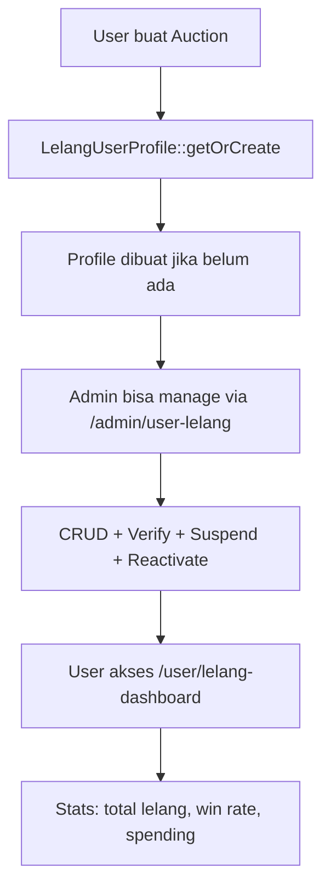
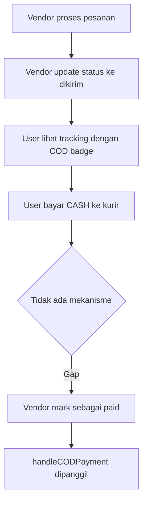
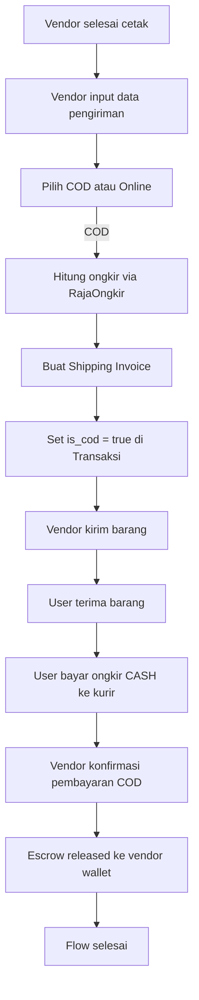

# Audit Flow: User Lelang Management & COD Ongkir

> **Tanggal:** 19 Agustus 2026
> **Mode:** Architect Audit
> **Status:** Temuan ditemukan, menunggu review

---

## RINGKASAN EKSEKUTIF

| Fitur | Status | Temuan |
|-------|--------|--------|
| **User Lelang Management** | ✅ SELESAI | Minor documentation sync |
| **COD Ongkir Flow** | ⚠️ PARTIAL | 5 gap kritis ditemukan |

---

## FITUR 1: USER LELANG MANAGEMENT — ✅ SELESAI

### Verifikasi Komponen

| Komponen | File | Status |
|----------|------|--------|
| Model | [`LelangUserProfile`](app/Models/LelangUserProfile.php) | ✅ Ada |
| Controller | [`UserLelangController`](app/Http/Controllers/Admin/UserLelangController.php) | ✅ Ada |
| Migration | [`create_lelang_user_profiles_table`](database/migrations/2025_09_25_100000_create_lelang_user_profiles_table.php) | ✅ Ada |
| Routes | [`routes/web.php:214-225`](routes/web.php:214) | ✅ 10 routes |
| Views Admin | `resources/views/dev/user-lelang/{index,show,create,edit}.blade.php` | ✅ 4 views |
| Dashboard User | [`user/lelang-dashboard.blade.php`](resources/views/user/lelang-dashboard.blade.php) | ✅ Ada |
| Admin Navigation | [`dev/layouts/app.blade.php:48`](resources/views/dev/layouts/app.blade.php:48) | ✅ Terhubung |
| Auto-assign | [`AuctionController::store()` line 83](app/Http/Controllers/AuctionController.php:83) | ✅ Working |
| User filter | [`UserController::index()`](app/Http/Controllers/UserController.php:44) | ✅ Working |

### Flow Verifikasi



### Temuan Minor

1. **FEATURES.md outdated** — Masih mencantumkan "Perlu Enhancement" padahal sudah selesai
2. **statusColorAttribute** — Menggunakan label "Tabler badge" di comment, padahal sudah Tailwind (cosmetic, tidak mempengaruhi fungsi)

---

## FITUR 2: COD ONGKIR FLOW — ⚠️ PARTIAL

### Verifikasi Komponen

| Komponen | File | Status |
|----------|------|--------|
| DB Columns | `transaksis.is_cod, ongkir, kurir, no_resi, alamat_pengiriman` | ✅ Ada |
| DB Migration | [`add_tracking_fields_to_transaksis`](database/migrations/2025_09_17_133734_add_tracking_fields_to_transaksis_table.php) | ✅ Ada |
| Model Fields | [`Transaksi.php`](app/Models/Vendor/Transaksi.php:45) `is_cod, ongkir` | ✅ Ada |
| COD Handler | [`ShippingInvoiceController::handleCODPayment()`](app/Http/Controllers/ShippingInvoiceController.php:212) | ✅ Ada |
| COD Route | [`routes/web.php:506`](routes/web.php:506) `POST /shipping/payment/{transaksi}` | ✅ Ada |
| UI Display | `user/tracking/{index,show}.blade.php` | ✅ COD badge |
| Invoice Template | `transaksi/invoice.blade.php`, `pos/thermal-print.blade.php` | ✅ COD section |
| Email Template | `emails/shipping-invoice.blade.php` | ✅ COD info |

### Flow Aktual vs Flow Ideal

#### Flow Aktual (SAAT INI)



#### Flow Ideal (YANG SEHARUSNYA)



### GAP ANALYSIS — 5 Temuan Kritis

#### GAP 1: Tidak ada UI untuk vendor memilih COD saat checkout
- **Severity:** HIGH
- **Location:** Checkout flow vendor
- **Issue:** Vendor tidak bisa memilih metode COD saat membuat pesanan. COD hanya bisa di-set manual via database atau API.
- **Impact:** Fitur COD tidak bisa digunakan tanpa intervensi manual database.

#### GAP 2: Vendor tidak bisa input data pengiriman lengkap
- **Severity:** HIGH
- **Location:** Vendor tracking flow
- **Issue:** Vendor bisa update status ke "dikirim" tetapi tidak ada form untuk input data pengiriman (kurir, ongkir, alamat, COD option).
- **Impact:** Data pengiriman tidak terisi dengan benar.

#### GAP 3: Tidak ada alur konfirmasi COD dari vendor ke user
- **Severity:** HIGH
- **Location:** `handleCODPayment()` flow
- **Issue:** Setelah user bayar CASH ke kurir, tidak ada flow untuk vendor mengonfirmasi pembayaran COD. `handleCODPayment()` ada tapi tidak terhubung ke UI.
- **Impact:** Pembayaran COD tidak tercatat di sistem.

#### GAP 4: Dual tracking system membingungkan
- **Severity:** MEDIUM
- **Location:** `Transaksi.tracking_status` vs `OrderTracking.status`
- **Issue:** Ada 2 sistem tracking yang berbeda:
  - `Transaksi.tracking_status`: menunggu → diproses → dicetak → dikirim → selesai
  - `OrderTracking.status`: payment_received → order_accepted → ... → completed
- **Impact:** Status tidak sinkron antara kedua sistem. Vendor dan user melihat status berbeda.

#### GAP 5: COD route tanpa auth check
- **Severity:** MEDIUM (Security)
- **Location:** [`routes/web.php:504-508`](routes/web.php:504)
- **Issue:** Route `POST /shipping/payment/{transaksi}` menggunakan middleware `auth, verified` tetapi tidak memverifikasi apakah user adalah pembeli yang benar.
- **Impact:** User lain bisa mengonfirmasi pembayaran COD untuk transaksi yang bukan miliknya.

### DETAIL SETIAP GAP

---

### GAP 1: Vendor tidak bisa pilih COD

**Root Cause:** Checkout flow hanya menyediakan opsi pembayaran online (Xendit). Tidak ada UI untuk memilih COD.

**Yang perlu ditambahkan:**
1. Form/opsi COD di halaman checkout vendor
2. Field untuk input: alamat pengiriman, kurir, estimasi ongkir
3. Validasi bahwa COD hanya tersedia untuk pesanan tertentu (misalnya minimal order)

**Files yang perlu dimodifikasi:**
- Checkout view (vendor)
- Checkout controller
- Transaksi model (field `is_cod` sudah ada)

---

### GAP 2: Vendor tidak bisa input data pengiriman

**Root Cause:** `ShippingInvoiceController::generateShippingInvoice()` ada tapi membutuhkan data lengkap yang tidak ada di UI vendor.

**Yang perlu ditambahkan:**
1. Form input data pengiriman di vendor panel
2. Integrasi RajaOngkir calculator untuk hitung ongkir
3. Simpan data ke `transaksis`: ongkir, kurir, alamat_pengiriman, is_cod

**Files yang perlu dimodifikasi:**
- Vendor tracking view
- Shipping calculator controller/view

---

### GAP 3: Tidak ada konfirmasi COD payment

**Root Cause:** `handleCODPayment()` ada di route tapi tidak ada tombol/flow untuk memanggilnya.

**Yang perlu ditambahkan:**
1. Tombol "Konfirmasi Pembayaran COD" di vendor tracking
2. Modal/form untuk input metode pembayaran (cash/app)
3. Validasi dan update status

**Files yang perlu dimodifikasi:**
- Vendor tracking view
- Routes (sudah ada: `POST /shipping/payment/{transaksi}`)

---

### GAP 4: Dual tracking system

**Root Cause:** `Transaksi` model punya `tracking_status` sendiri, dan `OrderTracking` model punya `status` sendiri. Keduanya tidak disinkronkan.

**Opsi penyelesaian:**
- **Opsi A (Minimal):** Sinkronkan `Transaksi.tracking_status` saat `OrderTracking.status` diupdate
- **Opsi B (Ideal):** Satukan menjadi satu sistem tracking

**Rekomendasi:** Opsi A (minimal change, mengikuti prinsip MINIMAL CHANGE)

---

### GAP 5: COD route tanpa ownership check

**Root Cause:** Route middleware hanya `auth, verified` tanpa cek apakah user adalah pemilik transaksi.

**Fix:** Tambahkan pengecekan ownership di controller.

---

## REKOMENDASI PRIORITAS

```
KRITIS (harus diperbaiki dulu):
  1. GAP 5 — Security: ownership check di COD route
  2. GAP 3 — Flow: konfirmasi COD payment dari vendor

PENTING (perlu diperbaiki):
  3. GAP 1 — UI: vendor pilih COD saat checkout
  4. GAP 2 — UI: vendor input data pengiriman

NORMAL (enhancement):
  5. GAP 4 — Sync tracking system
  6. Documentation sync (FEATURES.md)
```

## ESTIMASI FILE YANG PERLU DIPERBAIKI

### Tahap 1: Security Fix (GAP 5) + COD Confirmation (GAP 3)
1. `app/Http/Controllers/ShippingInvoiceController.php` — tambah ownership check
2. `resources/views/vendor/tracking/index.blade.php` — tambah tombol konfirmasi COD

### Tahap 2: Vendor COD Checkout (GAP 1) + Shipping Input (GAP 2)
3. Checkout view/controller — tambah opsi COD
4. Vendor tracking view — form input data pengiriman

### Tahap 3: Tracking Sync (GAP 4)
5. `OrderTrackingService` — sync Transaksi.tracking_status saat status diupdate

### Tahap 4: Documentation
6. `FEATURES.md` — update status User Lelang ke SELESAI
7. `ROADMAP.md` — update status COD
