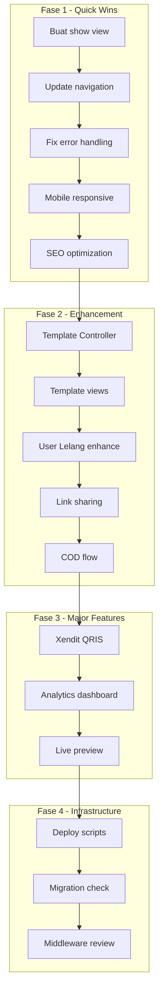

# Rencana Pengembangan Grafika-Printing

## Ringkasan Analisis

Platform **Grafika-Printing** sudah dalam kondisi **production** dengan fitur inti yang sudah berjalan:
- ✅ POS System
- ✅ Auction System
- ✅ Wallet & Withdrawal
- ✅ Xendit Payment Gateway
- ✅ Order Tracking & Shipping
- ✅ Admin Panel lengkap
- ✅ Linktree Module (backend + routing sudah ada)
- ✅ User Lelang Management (admin CRUD sudah ada)
- ✅ Deploy Scripts (deploy.sh & update.sh sudah ada)

---

## Gap Analysis: Temuan Saat Ini

### 🔴 Kritis (Harus Diperbaiki)

| No | Issue | Detail |
|----|-------|--------|
| 1 | View `vendor.linktree.show` belum ada | Controller [`LinktreeController@show()`](app/Http/Controllers/vendor/LinktreeController.php:82) merujuk ke `vendor.linktree.show` tapi view belum dibuat |
| 2 | Vendor Linktree views belum lengkap | Hanya ada index, create, edit. Show view belum ada |

### 🟡 Penting (Perlu Diperbaiki)

| No | Issue | Detail |
|----|-------|--------|
| 3 | Navigasi vendor layout perlu submenu Linktree | Saat ini hanya link ke index, perlu submenu untuk Links, Socials, Settings |
| 4 | Template Builder belum ada | [`TemplateController`](app/Http/Controllers/vendor/TemplateController.php) belum dibuat, views belum ada |
| 5 | Linktree analytics belum ada | Tidak ada dashboard untuk melihat views/clicks per linktree |
| 6 | Mobile responsive perlu perbaikan | Navbar vendor terlalu panjang di mobile |

### 🟢 Normal (Nice to Have)

| No | Issue | Detail |
|----|-------|--------|
| 7 | Error handling perlu diperkuat | Beberapa method di LinktreeController belum ada try-catch |
| 8 | SEO optimization untuk linktree | OG tags sudah ada, perlu schema.org |
| 9 | COD flow belum lengkap | Invoice belum tampilkan rincian harga vs ongkir terpisah |
| 10 | User Lelang dashboard perlu enhancement | Chart dan analytics belum ada |

---

## Rencana Pengerjaan

### Fase 1: Light Tasks (Quick Wins)

#### 1.1 Buat View `vendor.linktree.show.blade.php`
- **Status:** Belum ada
- **Aksi:** Buat view untuk menampilkan detail linktree beserta links dan socials
- **File:** `resources/views/vendor/linktree/show.blade.php`
- **Catatan:** View ini sudah dirujuk di controller tapi belum dibuat

#### 1.2 Perbarui Navigasi Vendor Layout
- **Status:** Perlu enhancement
- **Aksi:** Tambah submenu untuk Linktree (Links, Socials, Settings, Template)
- **File:** `resources/views/layouts/vendor.blade.php`
- **Detail:**
  ```
  Linktree
  ├── Dashboard Linktree
  ├── Kelola Links
  ├── Kelola Social Media
  ├── Template & Tema
  └── Pengaturan
  ```

#### 1.3 Perbaiki Error Handling di LinktreeController
- **Status:** Perlu review
- **Aksi:** Tambah try-catch di semua method CRUD
- **File:** `app/Http/Controllers/vendor/LinktreeController.php`

#### 1.4 Enhance Mobile Responsive
- **Status:** Perlu perbaikan
- **Aksi:**
  - Navbar vendor: buat hamburger menu yang lebih baik
  - Linktree public page: pastikan tampil optimal di semua device
  - POS invoice: perbaiki tampilan print di mobile
- **File:** `resources/views/layouts/vendor.blade.php`, `resources/views/linktree/public.blade.php`

#### 1.5 Tambah SEO untuk Linktree Public
- **Status:** Partial
- **Aksi:** Tambah schema.org structured data
- **File:** `resources/views/linktree/public.blade.php`

#### 1.6 Perbaiki Welcome Page
- **Status:** Perlu review
- **Aksi:** Pastikan auction aktif tampil dengan benar, CMS integration
- **File:** `resources/views/welcome.blade.php`

---

### Fase 2: Medium Tasks (Feature Enhancement)

#### 2.1 Buat Template Controller
- **Status:** Belum ada
- **Aksi:** Buat `TemplateController` dengan methods:
  - `index()` - List template tersedia
  - `preview(Request $request)` - Preview template
  - `apply(Request $request)` - Apply template ke linktree
- **File:** `app/Http/Controllers/vendor/TemplateController.php`
- **Routes:** Tambah di vendor linktree routes

#### 2.2 Buat Template Builder Views
- **Status:** Belum ada
- **Aksi:** Buat views untuk template builder:
  - `resources/views/vendor/linktree/template.blade.php`
  - Color picker, button style options
  - Live preview panel
- **Tech:** Alpine.js untuk interaktivitas

#### 2.3 Enhance User Lelang Dashboard
- **Status:** Partial
- **Aksi:** Tambah chart auction history, spending analytics
- **File:** `resources/views/dev/user-lelang/show.blade.php`

#### 2.4 Tambah Link Sharing untuk Linktree
- **Status:** Belum ada
- **Aksi:**
  - Copy link button
  - QR code generation
  - Social share buttons
- **File:** `resources/views/vendor/linktree/show.blade.php`

#### 2.5 Enhance COD Flow
- **Status:** Partial
- **Aksi:**
  - Pisahkan rincian harga barang vs ongkir di invoice
  - Status pembayaran ongkir terpisah
- **File:** `resources/views/pos/print-invoice.blade.php`, `resources/views/transaksi/invoice.blade.php`

---

### Fase 3: Large Tasks (Major Features)

#### 3.1 Integrasi Xendit QRIS untuk Linktree
- **Status:** Belum ada
- **Aksi:**
  - Dynamic QR generation
  - Webhook handler untuk payment confirmation
  - Pencatatan transaksi
- **Dependencies:** [`XenditService`](app/Services/XenditService.php) sudah ada

#### 3.2 Linktree Analytics Dashboard
- **Status:** Belum ada
- **Aksi:**
  - Views/clicks chart
  - Top links performance
  - Traffic sources
- **File:** `resources/views/vendor/linktree/analytics.blade.php`

#### 3.3 Live Preview untuk Template Builder
- **Status:** Belum ada
- **Aksi:**
  - Real-time preview saat edit
  - Desktop & mobile preview modes
- **Tech:** Alpine.js + iframe

---

### Fase 4: Backend & Infrastructure

#### 4.1 Review Deploy Scripts
- **Status:** Sudah ada
- **Aksi:** Verifikasi `deploy.sh` dan `update.sh` sudah lengkap
- **Files:** `deploy.sh`, `update.sh`

#### 4.2 Cek Migration Status
- **Status:** Perlu verifikasi
- **Aksi:** Pastikan semua migration sudah jalan di production
- **Command:** `php artisan migrate:status`

#### 4.3 Review Middleware Tenant Context
- **Status:** Perlu review
- **Aksi:** Pastikan linktree queries properly filtered by vendor_id
- **File:** `app/Http/Middleware/SetTenantContext.php`

---

## Flow Diagram



---

## Prioritas Pengerjaan

### Urutan Eksekusi (Ringan dulu):

1. **Buat view `vendor.linktree.show.blade.php`** - Critical fix
2. **Perbarui navigasi vendor layout** - UX improvement
3. **Fix error handling** - Stability
4. **Mobile responsive** - User experience
5. **SEO optimization** - Marketing
6. **Welcome page fix** - First impression
7. **Template Controller + Views** - New feature
8. **Link sharing** - Viral feature
9. **COD flow enhancement** - Business requirement
10. **Xendit QRIS integration** - Payment feature

---

## Catatan Penting

### ⚠️ Production Safety
- **TIDAK BOLEM mengubah database yang sudah ada di production**
- Semua migration baru harus additive (tambah tabel/kolom baru)
- Test semua perubahan di development sebelum push ke production
- Gunakan `update.sh` untuk deployment

### Tech Stack
- **Backend:** Laravel 11, PHP 8.2+
- **Frontend:** Tabler Core, Tailwind CSS, Alpine.js
- **Database:** MySQL (shared database multi-tenant)
- **Payment:** Xendit (QRIS, VA, E-Wallet)
- **Shipping:** RajaOngkir API

### File Structure
```
resources/views/
├── vendor/linktree/          # Vendor linktree views
│   ├── index.blade.php       # ✅ Ada
│   ├── create.blade.php      # ✅ Ada
│   ├── edit.blade.php        # ✅ Ada
│   ├── show.blade.php        # ❌ BELUM ADA
│   └── template.blade.php    # ❌ BELUM ADA
├── linktree/
│   └── public.blade.php      # ✅ Ada
└── layouts/
    ├── vendor.blade.php      # Perlu update navigation
    └── user.blade.php        # OK
```
