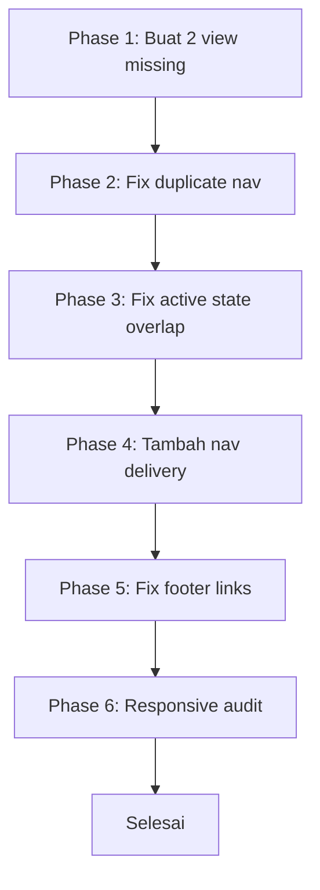

# Phase 2: Bug Fix & Enhancement Plan - Grafika-Printing

**Tanggal:** 4 Agustus 2026  
**Status:** Production - TIDAK BOLEH ada database migration yang mengubah struktur tabel existing

---

## Ringkasan Temuan

Setelah analisis menyeluruh terhadap routes, controllers, views, dan models, ditemukan:

- **2 BUG KRITIS** - View missing yang akan menyebabkan error 500
- **1 BUG NAVIGASI** - Duplicate nav item di user layout
- **1 BUG UI** - Active state overlap di admin layout
- **3 ENHANCEMENT RINGAN** - Navigation, footer, responsive

---

## PHASE 1: BUG FIX KRITIS - View Missing

### 1.1 `dev/audit-logs/high-risk.blade.php`
- **Status:** MISSING - File tidak ada
- **Dampak:** Admin mengklik "High Risk Transactions" di navigasi akan error 500
- **Referensi:** [`AuditLogController@highRisk`](app/Http/Controllers/Admin/AuditLogController.php:89) → `return view('dev.audit-logs.high-risk', compact('logs'))`
- **Solusi:** Buat view baru dengan desain mirip `index.blade.php` tapi filter khusus high-risk

### 1.2 `dev/audit-logs/financial.blade.php`
- **Status:** MISSING - File tidak ada
- **Dampak:** Admin mengklik "Financial Logs" di navigasi akan error 500
- **Referensi:** [`AuditLogController@financial`](app/Http/Controllers/Admin/AuditLogController.php:101) → `return view('dev.audit-logs.financial', compact('logs'))`
- **Solusi:** Buat view baru dengan desain mirip `index.blade.php` tapi filter khusus financial

---

## PHASE 2: BUG FIX NAVIGASI - Duplicate Nav Item

### 2.1 User Layout Duplicate Navigation
- **File:** [`layouts/user.blade.php`](resources/views/layouts/user.blade.php:230)
- **Bug:** Baris 230-246 "Tracking Pesanan" dan baris 248-265 "Pesanan Saya" keduanya mengarah ke `user.orders.index`
- **Dampak:** User melihat 2 link identik di navigasi
- **Solusi:** Hapus baris 248-265 (duplikat "Pesanan Saya") karena "Tracking Pesanan" sudah cukup

---

## PHASE 3: BUG FIX UI - Active State Overlap

### 3.1 Admin Layout Active State
- **File:** [`dev/layouts/app.blade.php`](resources/views/dev/layouts/app.blade.php:410)
- **Bug:** "Transactions" dropdown (baris 410) check `admin.admin-fees.*` DAN "Biaya Admin" nav (baris 284) juga check `admin.admin-fees.*`
- **Dampak:** Saat admin berada di halaman admin-fees, DUA nav item aktif bersamaan
- **Solusi:** Hapus `admin.admin-fees.*` dari active state di "Transactions" dropdown (baris 410)

---

## PHASE 4: ENHANCEMENT - User Navigation Missing Links

### 4.1 Tambah Nav Link Delivery Confirmation
- **File:** [`layouts/user.blade.php`](resources/views/layouts/user.blade.php:230)
- **Issue:** Route `user.delivery-confirmation.create` sudah ada tapi tidak ada di navigasi user
- **Solusi:** Tambahkan nav link "Konfirmasi Terima Barang" di navigasi user

---

## PHASE 5: ENHANCEMENT - Admin Footer Cleanup

### 5.1 Fix Placeholder Footer Links
- **File:** [`dev/layouts/app.blade.php`](resources/views/dev/layouts/app.blade.php:620)
- **Issue:** Footer links Documentation, License, Source code masih "#" placeholder
- **Solusi:** Ganti dengan link yang sesuai atau hapus

---

## Flow Pengerjaan

---

## Catatan Penting

1. **TIDAK ADA database migration** - Semua perubahan hanya di views dan layout files
2. **File yang diubah:**
   - `resources/views/dev/audit-logs/high-risk.blade.php` (BARU)
   - `resources/views/dev/audit-logs/financial.blade.php` (BARU)
   - `resources/views/layouts/user.blade.php` (EDIT)
   - `resources/views/dev/layouts/app.blade.php` (EDIT)
3. **Tidak mengubah controllers atau models** - Hanya views
