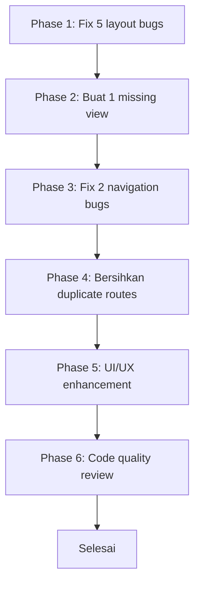

# Phase 3: Comprehensive Audit & Enhancement Plan - Grafika-Printing

**Tanggal:** 5 Agustus 2026  
**Status:** Production - TIDAK BOLEH ada database migration yang mengubah struktur tabel existing  
**Fokus:** Bug fix, clean code, UI/UX enhancement, gap analysis

---

## Ringkasan Temuan

Setelah audit menyeluruh terhadap routes, controllers, views, layouts, dan models:

| Kategori | Jumlah | Prioritas |
|----------|--------|-----------|
| Bug Layout (view extends wrong layout) | 5 | 🔴 KRITIS |
| Bug Navigation | 2 | 🟡 PENTING |
| Missing View | 1 | 🔴 KRITIS |
| Duplicate/Dead Routes | 1 set | 🟢 NORMAL |
| UI/UX Enhancement | 4 | 🟢 NORMAL |
| Code Quality | 3 | 🟢 NORMAL |

---

## PHASE 1: BUG FIX KRITIS - View Extends Wrong Layout

> **Dampak:** Halaman error 500 atau navigasi salah untuk user

### 1.1 `vendor/audit-logs/index.blade.php` - Layout Tidak Ada
- **File:** [`resources/views/vendor/audit-logs/index.blade.php`](resources/views/vendor/audit-logs/index.blade.php:1)
- **Bug:** Line 1: `@extends('vendor.layouts.app')` → layout ini **TIDAK ADA**
- **Dampak:** Vendor mengaklik Audit Log akan **error 500**
- **Solusi:** Ganti ke `@extends('layouts.vendor')`

### 1.2 `vendor/audit-logs/show.blade.php` - Layout Tidak Ada
- **File:** [`resources/views/vendor/audit-logs/show.blade.php`](resources/views/vendor/audit-logs/show.blade.php:1)
- **Bug:** Line 1: `@extends('vendor.layouts.app')` → layout ini **TIDAK ADA**
- **Dampak:** Vendor mengklik detail audit log akan **error 500**
- **Solusi:** Ganti ke `@extends('layouts.vendor')`

### 1.3 `user/delivery-confirmation/create.blade.php` - Layout Salah
- **File:** [`resources/views/user/delivery-confirmation/create.blade.php`](resources/views/user/delivery-confirmation/create.blade.php:1)
- **Bug:** Line 1: `@extends('layouts.app')` → generic layout tanpa navigasi user
- **Dampak:** User tidak bisa navigasi dari halaman konfirmasi pengiriman
- **Solusi:** Ganti ke `@extends('layouts.user')`

### 1.4 `user/delivery-confirmation/show.blade.php` - Layout Salah
- **File:** [`resources/views/user/delivery-confirmation/show.blade.php`](resources/views/user/delivery-confirmation/show.blade.php:1)
- **Bug:** Line 1: `@extends('layouts.app')` → generic layout tanpa navigasi user
- **Dampak:** User tidak bisa navigasi dari halaman detail konfirmasi
- **Solusi:** Ganti ke `@extends('layouts.user')`

### 1.5 `vendor/profile.blade.php` - Layout Salah
- **File:** [`resources/views/vendor/profile.blade.php`](resources/views/vendor/profile.blade.php:1)
- **Bug:** Line 1: `@extends('layouts.user')` → navigasi user, bukan vendor
- **Dampak:** Vendor melihat navigasi user di halaman profil vendor
- **Solusi:** Ganti ke `@extends('layouts.vendor')`

---

## PHASE 2: BUG FIX - Missing View

### 2.1 `vendor/audit-logs/financial.blade.php` - View Missing
- **Controller:** [`VendorAuditLogController@financial`](app/Http/Controllers/VendorAuditLogController.php) → `return view('vendor.audit-logs.financial', compact('logs'))`
- **File:** `resources/views/vendor/audit-logs/financial.blade.php` → **TIDAK ADA**
- **Dampak:** Vendor mengklik "Financial Logs" akan **error 500**
- **Solusi:** Buat view baru berdasarkan `index.blade.php` dengan filter khusus financial

---

## PHASE 3: NAVIGATION FIX

### 3.1 Admin Layout Active State Overlap
- **File:** [`resources/views/dev/layouts/app.blade.php`](resources/views/dev/layouts/app.blade.php:410)
- **Bug:** Baris 410: "Transactions" dropdown check `admin.admin-fees.*` DAN baris 284: "Biaya Admin" nav juga check `admin.admin-fees.*`
- **Dampak:** Dua nav item aktif bersamaan saat admin di halaman admin-fees
- **Solusi:** Hapus `admin.admin-fees.*` dari active state di "Transactions" dropdown (baris 410)

### 3.2 User Layout Missing Nav Link
- **File:** [`resources/views/layouts/user.blade.php`](resources/views/layouts/user.blade.php:230)
- **Issue:** Route `user.delivery-confirmation.create` sudah ada di routes tapi tidak ada di navigasi user
- **Solusi:** Tambahkan nav link "Konfirmasi Terima Barang" di navigasi user setelah "Tracking Pesanan"

---

## PHASE 4: CLEAN CODE - Duplicate Routes

### 4.1 Duplicate Report Routes
- **File:** [`routes/web.php`](routes/web.php:367)
- **Issue:** `vendor.reports.*` (baris 367-373) dan `vendor.laporan.*` (baris 376-381) mengarah ke controller yang sama (`LaporanController`)
- **Dampak:** Dead code, membingungkan developer
- **Solusi:** Pertahankan `vendor.laporan.*` (karena navigasi vendor menggunakannya), hapus atau tandai `vendor.reports.*` sebagai deprecated

---

## PHASE 5: UI/UX ENHANCEMENT

### 5.1 Vendor Layout - Tambah Nama Vendor di Header
- **File:** [`resources/views/layouts/vendor.blade.php`](resources/views/layouts/vendor.blade.php:226)
- **Issue:** Header menampilkan nama vendor tapi font kecil dan kurang prominent
- **Solusi:** Tambahkan badge role di samping nama vendor

### 5.2 User Layout - Tambah Icon Badge untuk Notifications
- **File:** [`resources/views/layouts/user.blade.php`](resources/views/layouts/user.blade.php:123)
- **Issue:** Notification icon tidak memiliki count badge yang berfungsi
- **Solusi:** Tambahkan logic untuk menampilkan jumlah notifikasi unread

### 5.3 Admin Layout - Responsive Mobile Improvement
- **File:** [`resources/views/dev/layouts/app.blade.php`](resources/views/dev/layouts/app.blade.php:15)
- **Issue:** Dropdown menus di mobile perlu improved touch targets
- **Solusi:** Tambahkan CSS untuk dropdown menu yang lebih mobile-friendly

### 5.4 Welcome Page - Mobile Responsive Check
- **File:** [`resources/views/welcome.blade.php`](resources/views/welcome.blade.php:1)
- **Issue:** Perlu verifikasi responsive di berbagai ukuran layar
- **Solusi:** Audit dan perbaiki responsive breakpoints

---

## PHASE 6: CODE QUALITY

### 6.1 Error Handling Consistency
- **Issue:** Beberapa controller menggunakan try-catch, beberapa tidak
- **Solusi:** Pastikan semua controller method yang query database memiliki try-catch yang proper

### 6.2 View Naming Consistency
- **Issue:** View vendor ada di 2 lokasi: `resources/views/vendor/` dan `resources/views/` (root)
- **Contoh:** `vendor/audit-logs/` vs `audit-logs/` (root)
- **Solusi:** Pertahankan konsistensi, jangan pindahkan file yang sudah ada di production

### 6.3 XenditService QRIS Verification
- **File:** [`app/Services/XenditService.php`](app/Services/XenditService.php)
- **Issue:** Perlu verifikasi method `createQrisPayment()` ada dan berfungsi
- **Solusi:** Review dan pastikan QRIS support lengkap

---

## Flow Pengerjaan

---

## File yang Diubah

| File | Aksi | Phase |
|------|------|-------|
| `resources/views/vendor/audit-logs/index.blade.php` | EDIT: ganti extends | 1 |
| `resources/views/vendor/audit-logs/show.blade.php` | EDIT: ganti extends | 1 |
| `resources/views/user/delivery-confirmation/create.blade.php` | EDIT: ganti extends | 1 |
| `resources/views/user/delivery-confirmation/show.blade.php` | EDIT: ganti extends | 1 |
| `resources/views/vendor/profile.blade.php` | EDIT: ganti extends | 1 |
| `resources/views/vendor/audit-logs/financial.blade.php` | BUAT BARU | 2 |
| `resources/views/dev/layouts/app.blade.php` | EDIT: fix active state | 3 |
| `resources/views/layouts/user.blade.php` | EDIT: tambah nav link | 3 |
| `routes/web.php` | EDIT: tandai deprecated routes | 4 |

---

## Catatan Penting

1. **TIDAK ADA database migration** - Semua perubahan hanya di views, layouts, dan routes
2. **Tidak mengubah controllers atau models** - Hanya views dan routes
3. **Aman untuk production** - Tidak ada perubahan data atau struktur database
4. **Total: 9 file diubah, 1 file baru dibuat**
