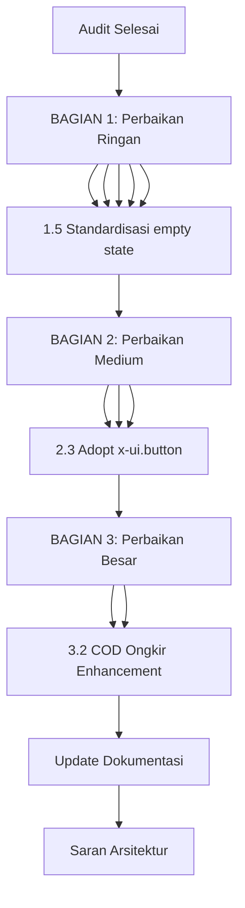

# Phase 4: Comprehensive Audit & Enhancement Plan

**Tanggal:** 7 Agustus 2026
**Status:** In Progress
**Oleh:** Architect Mode

---

## Ringkasan Hasil Audit

Audit menyeluruh dilakukan terhadap seluruh berkas proyek Grafika-Printing, meliputi routes, controllers, views, models, services, dan frontend. Berikut temuan-temuan kritis:

---

## Temuan Audit

### 🔴 KRITIS

| No | Issue | Lokasi | Dampak |
|----|-------|--------|--------|
| 1 | **22 native `confirm()` belum dikonversi ke SweetAlert2** | 14 file view | Inkonsistensi UX, tidak menggunakan Swal wrapper yang sudah ada (`confirmDelete()`/`confirmAction()`) |
| 2 | **PenggunaController CRUD kosong** | [`PenggunaController.php`](app/Http/Controllers/vendor/PenggunaController.php) | Method `create()`, `store()`, `edit()`, `update()`, `destroy()` kosong — tombol di view akan mengarah ke halaman kosong/error |
| 3 | **Placeholder `bulkCheckStatus`** | [`admin/payment-management/index.blade.php:237`](resources/views/admin/payment-management/index.blade.php:237) | Tombol "Bulk Check" hanya menampilkan `alert()` — tidak melakukan apa-apa |

### 🟡 PENTING

| No | Issue | Lokasi | Dampak |
|----|-------|--------|--------|
| 4 | **Inkonsistensi confirm dialog pattern** | 14 file view | Mix `onsubmit="return confirm()"` vs Alpine.js `@submit.prevent="if(confirm())"` vs `@click="return confirm()"` |
| 5 | **COD Ongkir flow belum lengkap** | FEATURES.md & ROADMAP.md | Rincian harga barang + ongkir COD belum dipisah di invoice |
| 6 | **User Lelang Enhancement partial** | FEATURES.md & ROADMAP.md | Dashboard khusus user lelang belum ada, filter admin belum optimal |

### 🟢 NORMAL

| No | Issue | Lokasi | Dampak |
|----|-------|--------|--------|
| 7 | **Breadcrumbs belum konsisten** | Beberapa halaman vendor/admin | UX navigasi kurang optimal |
| 8 | **Raw HTML buttons belum diganti x-ui.button** | ~200+ instances | Inkonsistensi UI, belum menggunakan design system |
| 9 | **Empty state belum konsisten** | Beberapa halaman | Beberapa halaman masih pakai inline HTML empty state |

---

## Rencana Pengerjaan

### BAGIAN 1: Perbaikan RINGAN (Prioritas Utama)

#### 1.1 Konversi 22 native `confirm()` ke SweetAlert2

**File yang perlu diupdate:**

| File | Lokasi | Pattern |
|------|--------|---------|
| [`vendor/withdrawal/show.blade.php`](resources/views/vendor/withdrawal/show.blade.php:22) | onsubmit | `confirmDelete()` |
| [`vendor/wallet/show-withdrawal.blade.php`](resources/views/vendor/wallet/show-withdrawal.blade.php:24) | x-data | `confirmDelete()` |
| [`vendor/manual-transfers/show.blade.php`](resources/views/vendor/manual-transfers/show.blade.php:126) | @submit | `confirmAction()` |
| [`vendor/linktree/show.blade.php`](resources/views/vendor/linktree/show.blade.php:374) | @submit.prevent | `confirmDelete()` |
| [`vendor/linktree/products.blade.php`](resources/views/vendor/linktree/products.blade.php:134) | onsubmit | `confirmDelete()` |
| [`vendor/linktree/import.blade.php`](resources/views/vendor/linktree/import.blade.php:241) | JS | `confirmDelete()` |
| [`vendor/linktree/edit.blade.php`](resources/views/vendor/linktree/edit.blade.php:170,217) | @submit.prevent | `confirmDelete()` |
| [`vendor/linktree/ab-test/show.blade.php`](resources/views/vendor/linktree/ab-test/show.blade.php:58,250,316) | @submit.prevent | `confirmAction()` / `confirmDelete()` |
| [`dev/admin-fees/index.blade.php`](resources/views/dev/admin-fees/index.blade.php:105) | onsubmit | `confirmDelete()` |
| [`dev/auctions/show.blade.php`](resources/views/dev/auctions/show.blade.php:22,57) | @click | `confirmAction()` |
| [`dev/auctions/index.blade.php`](resources/views/dev/auctions/index.blade.php:113) | @click | `confirmAction()` |
| [`dev/auctions/edit.blade.php`](resources/views/dev/auctions/edit.blade.php:198,206) | @click | `confirmAction()` / `confirmDelete()` |
| [`auctions/my-bids.blade.php`](resources/views/auctions/my-bids.blade.php:110) | onsubmit | `confirmDelete()` |
| [`admin/cms/show.blade.php`](resources/views/admin/cms/show.blade.php:210) | JS | `confirmDelete()` |
| [`admin/cms/index.blade.php`](resources/views/admin/cms/index.blade.php:197) | JS | `confirmAction()` |

**Pola konversi:**
```blade
{{-- SEBELUM (native confirm) --}}
<form onsubmit="return confirm('Pesan?')">

{{-- SESUDAH (SweetAlert2) --}}
<form x-data @submit.prevent="if(await confirmDelete('Judul', 'Pesan?')) $el.submit()">
```

#### 1.2 Fix Placeholder bulkCheckStatus

**File:** [`admin/payment-management/index.blade.php`](resources/views/admin/payment-management/index.blade.php:235)

**Fix:** Implementasi fetch ke route `admin.payments.bulk-check` yang sudah ada di routes, atau buat method di controller jika belum ada.

#### 1.3 Implement PenggunaController CRUD

**File:** [`app/Http/Controllers/vendor/PenggunaController.php`](app/Http/Controllers/vendor/PenggunaController.php)

Method yang perlu diimplementasi:
- `create()` — Return view `pengguna.create`
- `store(Request $request)` — Validasi + Create user
- `edit(User $user)` — Return view `pengguna.edit`
- `update(Request $request, User $user)` — Validasi + Update user
- `destroy(User $user)` — Soft delete atau hard delete

**Views yang perlu dicek:**
- [`pengguna/create.blade.php`](resources/views/pengguna/create.blade.php) — Sudah ada
- [`pengguna/edit.blade.php`](resources/views/pengguna/edit.blade.php) — Sudah ada
- [`pengguna/index.blade.php`](resources/views/pengguna/index.blade.php) — Pastikan tombol Create/Edit/Delete terhubung

#### 1.4 Konsistensi Confirm Dialog Pattern

Standarisasi semua konfirmasi hapus/aksi menggunakan pola Alpine.js:
```blade
<form action="{{ route('xxx.destroy', $item) }}" method="POST"
      x-data @submit.prevent="if(await confirmDelete('Hapus?', 'Data tidak dapat dikembalikan')) $el.submit()">
    @csrf
    @method('DELETE')
    <button type="submit">Hapus</button>
</form>
```

#### 1.5 Standardisasi Empty State

Cek semua halaman index dan pastikan menggunakan `<x-ui.empty-state>`:
- [`pengguna/index.blade.php`](resources/views/pengguna/index.blade.php)
- [`pelanggan/index.blade.php`](resources/views/pelanggan/index.blade.php)
- [`transaksi/index.blade.php`](resources/views/transaksi/index.blade.php)
- Dan lainnya yang masih pakai inline HTML

---

### BAGIAN 2: Perbaikan MEDIUM

#### 2.1 Implement bulkCheckStatusPayment

**Controller:** [`PaymentManagementController`](app/Http/Controllers/Admin/PaymentManagementController.php)
- Implementasi method `bulkCheckStatus()` yang sudah ada di route
- Loop semua pending payments, cek status ke Xendit API
- Update status di database
- Return JSON response

#### 2.2 Tambah Breadcrumbs

Gunakan component [`components/breadcrumbs.blade.php`](resources/views/components/breadcrumbs.blade.php) di halaman-halaman berikut:
- Semua halaman admin (dev/)
- Semua halaman vendor
- Semua halaman user

#### 2.3 Adopt x-ui.button Component

Konversi raw HTML buttons ke `<x-ui.button>` di views yang belum pakai. Estimasi ~200+ instances.

---

### BAGIAN 3: Perbaikan BESAR

#### 3.1 User Lelang Enhancement

**Yang sudah ada:**
- [`UserLelangController`](app/Http/Controllers/Admin/UserLelangController.php) — CRUD admin
- [`LelangUserProfile`](app/Models/LelangUserProfile.php) — Model
- [`lelang_user_profiles` migration](database/migrations/2025_09_25_100000_create_lelang_user_profiles_table.php)
- Views: `dev/user-lelang/*`

**Yang perlu ditambah:**
1. Dashboard khusus user lelang di user panel
2. Filter "User Lelang" di admin user management
3. Auto-assign `LelangUserProfile` saat user pertama kali buat auction

#### 3.2 COD Ongkir Enhancement

**Yang sudah ada:**
- `is_cod` field di `transaksis` table
- `ongkir`, `kurir`, `no_resi` fields
- RajaOngkir API integration

**Yang perlu ditambah:**
1. Update invoice template — tampilkan rincian: subtotal barang + ongkir COD
2. Field `ongkir_paid_separate` di transaksi (atau gunakan existing)
3. Status pembayaran ongkir terpisah
4. Rekonsiliasi COD payment dengan kurir

---

## Diagram Alur Pengerjaan



---

## Saran Perbaikan Arsitektur

### 1. Extract Confirm Dialog Helper
Buat JavaScript helper function di `resources/js/confirm.js` atau di `components/alert.blade.php` yang menyediakan:
- `confirmDelete(title, text)` — Untuk konfirmasi hapus
- `confirmAction(title, text)` — Untuk konfirmasi aksi umum
- `showSuccess(message)` — Toast sukses
- `showError(message)` — Toast error

### 2. Middleware Authorization Check
Tambahkan policy/authorization check di semua controller untuk memastikan user hanya bisa mengakses data miliknya (tenant isolation).

### 3. Request Validation Classes
Buat Form Request classes untuk semua endpoint yang menerima input:
- `StorePenggunaRequest`
- `UpdatePenggunaRequest`
- `StoreManualTransferRequest`
- dll

### 4. API Response Standardization
Standarisasi response API menggunakan format:
```json
{
    "success": true,
    "message": "...",
    "data": {}
}
```

### 5. Rate Limiting
Tambahkan rate limiting pada route publik:
- Manual transfer order
- Linktree public page
- API endpoints

### 6. Activity Log Enhancement
Gunakan `AuditLogService` secara konsisten di semua controller untuk logging aksi penting.

---

## Estimasi File yang Perlu Diubah

### RINGAN (estimasi ~15 file)
- 14 view files untuk konversi confirm()
- 1 controller (PenggunaController)

### MEDIUM (estimasi ~10 file)
- 1 controller (PaymentManagementController)
- ~10 view files untuk breadcrumbs dan x-ui.button

### BESAR (estimasi ~15 file)
- 2-3 controllers baru/diupdate
- 5-10 views baru/diupdate
- 1-2 migrations baru
- 1-2 models update
