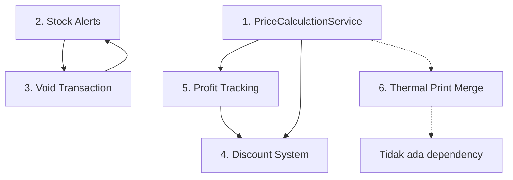

# Spesifikasi Teknis 6 Fitur POS — Grafika-Printing

> **Tanggal:** 2026-08-22
> **Status:** Draft untuk Review
> **Projek:** Grafika-Printing (Laravel 13, Tailwind CSS, Alpine.js)

---

## Daftar Isi

1. [PriceCalculationService — Ekstrak & Deduplicate Logika Kalkulasi Harga](#1-pricecalculationservice)
2. [Stock Minimum Alerts/Notifications](#2-stock-minimum-alerts)
3. [Void/Cancel Transaction Feature](#3-voidcancel-transaction)
4. [Discount/Coupon System](#4-discountcoupon-system)
5. [Profit Tracking — hpp_total di TransaksiItem](#5-profit-tracking)
6. [Thermal Print Template Merge](#6-thermal-print-template-merge)

---

## 1. PriceCalculationService

### 1.1 Analisis Kode Saat Ini

Logika kalkulasi harga **terduplikasi di minimal 5 lokasi**:

| Lokasi | File | Baris | Fungsi |
|--------|------|-------|--------|
| addToCart | `PosController.php` | 146-196 | Menghitung harga per spesifikasi, total harga cart item |
| cart | `PosController.php` | 228-253 | Re-calculate ulang harga saat view cart (recalculate dari DB) |
| checkPrice | `PosController.php` | 294-356 | AJAX price check, logika hampir sama dengan addToCart |
| calculateFinalPrice | `WholesalePrice.php` | 58-73 | Cari wholesale tier, return harga final |
| getPriceForQuantity | `Bahan.php` | 86-98 | Mirip calculateFinalPrice tapi di model Bahan |
| calculatePrice | `SpesifikasiProduk.php` | 70-79 | Hitung harga per spesifikasi produk |

**Masalah yang ditemukan:**

1. **Duplikasi logic** — Setiap method menghitung ulang wholesale price secara independent
2. **Inkonsistensi** — `WholesalePrice::calculateFinalPrice()` query ke `self::where()` tanpa scope vendor, sedangkan `Bahan::getPriceForQuantity()` menggunakan relationship `wholesalePrices`
3. **Instansiasi tidak perlu** — `new WholesalePrice()` dibuat berkali-kali di `addToCart()` dan `cart()` sebagai objek utility, padahal method-nya static-compatible
4. **Tidak ada centralized HPP calculation** — Kalkulasi HPP (harga pokok penjualan) belum ada, hanya harga jual

### 1.2 Desain Solusi: `PriceCalculationService`

#### Service Baru

```
app/Services/PriceCalculationService.php
```

#### Method Signatures

```php
namespace App\Services;

class PriceCalculationService
{
    /**
     * Hitung harga final untuk satu spesifikasi (bahan tertentu)
     * Menggabungkan logic dari WholesalePrice::calculateFinalPrice()
     * dan Bahan::getPriceForQuantity()
     *
     * @param Bahan $bahan
     * @param float $value Nilai input (qty untuk select, dimensi untuk number)
     * @param int $quantity Jumlah item
     * @return array{price_per_unit: float, total_price: float, wholesale_applied: bool}
     */
    public function calculateSpecificationPrice(
        Bahan $bahan,
        float $value,
        int $quantity
    ): array;

    /**
     * Hitung total harga untuk satu cart item / transaksi item
     * Menggabungkan semua spesifikasi menjadi total
     *
     * @param Produk $produk
     * @param int $quantity
     * @param array $specifications [specId => value]
     * @return array{total_price: float, specifications: array, hpp_total: float}
     */
    public function calculateItemTotal(
        Produk $produk,
        int $quantity,
        array $specifications
    ): array;

    /**
     * Hitung total harga seluruh cart
     *
     * @param array $cartItems Session cart items
     * @return array{subtotal: float, hpp_total: float, profit: float}
     */
    public function calculateCartTotal(array $cartItems): array;

    /**
     * Cari harga bahan berdasarkan quantity (wholesale tier)
     * Replacement untuk Bahan::getPriceForQuantity()
     *
     * @param Bahan $bahan
     * @param int $quantity
     * @return float
     */
    public function getBahanPriceForQuantity(Bahan $bahan, int $quantity): float;

    /**
     * Hitung total estimasi waktu produksi
     *
     * @param array $cartItems
     * @return int Total waktu dalam menit
     */
    public function calculateEstimatedTime(array $cartItems): int;
}
```

#### Logic Flow

```
calculateItemTotal()
  → untuk setiap spesifikasi:
      → SpesifikasiProduk::with('spesifikasi', 'bahans')->find($specId)
      → jika tipe 'select':
          → Bahan::find($value)
          → calculateSpecificationPrice($bahan, $quantity, $quantity)
      → jika tipe 'number':
          → $bahan = $spesifikasiProduk->bahans->first()
          → calculateSpecificationPrice($bahan, $inputValue, $quantity)
      → akumulasi total_price dan hpp_total
  → return {total_price, specifications, hpp_total}
```

### 1.3 File yang Perlu Dibuat/Diubah

| Aksi | File | Keterangan |
|------|------|------------|
| **Buat** | `app/Services/PriceCalculationService.php` | Service utama |
| Ubah | `app/Http/Controllers/vendor/pos/PosController.php` | Refactor `addToCart()`, `cart()`, `checkPrice()` |
| Ubah | `app/Http/Controllers/vendor/pos/CheckoutController.php` | Gunakan service untuk hitung total |
| Ubah | `app/Models/Vendor/WholesalePrice.php` | Deprecate `calculateFinalPrice()` |
| Ubah | `app/Models/Vendor/Bahan.php` | Deprecate `getPriceForQuantity()`, gunakan service |
| Ubah | `app/Models/Vendor/SpesifikasiProduk.php` | Deprecate `calculatePrice()`, gunakan service |
| **Buat** | `tests/Feature/PriceCalculationServiceTest.php` | Unit test |

### 1.4 Integrasi

- `PosController::addToCart()` → panggil `$this->priceCalcService->calculateItemTotal()`
- `PosController::cart()` → panggil `$this->priceCalcService->calculateItemTotal()` untuk recalculate
- `PosController::checkPrice()` → panggil `$this->priceCalcService->calculateItemTotal()`
- `CheckoutController::processCheckout()` → panggil `$this->priceCalcService->calculateCartTotal()` untuk validasi
- `SpesifikasiProduk::calculatePrice()` → redirect ke service

---

## 2. Stock Minimum Alerts/Notifications

### 2.1 Analisis Kode Saat Ini

**Sudah ada:**
- `StockService::checkLowStock($vendorId)` — Query bahan dengan stok <= 5 (hardcoded)
- `StockService::notifyLowStock($vendor, $lowStockItems)` — Kirim email via `Mail::raw()`
- `Bahan::checkStockLevel()` — Log warning + update status field (jika ada)
- `Bahan::stock_status` accessor — Status: out / low / available
- `Bahan::scopeStockFilter()` — Filter: low (<10), out (=0), available (>0)
- Pengecekan dilakukan di `CheckoutController::processCheckout()` **setelah** transaksi

**Masalah:**
1. **Threshold hardcoded** — `checkLowStock()` menggunakan `minimumStock = 5` tanpa bisa dikonfigurasi per vendor
2. **Tidak ada kolom `minimum_stok`** di tabel `bahans` — `Bahan::checkStockLevel()` merujuk ke `$this->minimum_stok` yang tidak ada
3. **Hanya email** — Tidak ada in-app notification, tidak ada push notification
4. **Timing terlambat** — Hanya dicek setelah checkout, bukan real-time saat stok berubah
5. **Tidak ada dashboard alert** — Vendor tidak melihat peringatan stok rendah di dashboard POS
6. **Status badge menggunakan HTML** — `getStockStatusLabelAttribute()` mengembalikan raw HTML (violates separation of concerns)

### 2.2 Desain Database

#### Migration: Tambah Kolom `minimum_stok` ke `bahans`

```php
Schema::table('bahans', function (Blueprint $table) {
    $table->integer('minimum_stok')->default(5)->after('stok');
    $table->integer('maksimum_stok')->nullable()->after('minimum_stok');
});
```

#### Migration: Tabel `stock_alerts` (opsional, untuk history)

```php
Schema::create('stock_alerts', function (Blueprint $table) {
    $table->id();
    $table->foreignId('vendor_id')->constrained('vendors');
    $table->foreignId('bahan_id')->constrained('bahans');
    $table->enum('type', ['low_stock', 'out_of_stock', 'restocked']);
    $table->integer('previous_stock');
    $table->integer('current_stock');
    $table->integer('threshold');
    $table->text('message')->nullable();
    $table->boolean('is_read')->default(false);
    $table->timestamp('read_at')->nullable();
    $table->timestamps();

    $table->index(['vendor_id', 'is_read']);
    $table->index(['bahan_id', 'type']);
});
```

### 2.3 File yang Perlu Dibuat/Diubah

| Aksi | File | Keterangan |
|------|------|------------|
| **Buat** | `database/migrations/xxxx_add_minimum_stok_to_bahans.php` | Tambah kolom minimum_stok |
| **Buat** | `database/migrations/xxxx_create_stock_alerts_table.php` | Tabel stock_alerts |
| Ubah | `app/Models/Vendor/Bahan.php` | Update `checkStockLevel()`, gunakan `minimum_stok` |
| Ubah | `app/Services/StockService.php` | Update `checkLowStock()`, tambah `createStockAlert()`, `getUnreadAlerts()` |
| **Buat** | `app/Http/Controllers/vendor/StockAlertController.php` | CRUD & mark-read alerts |
| **Buat** | `resources/views/vendor/stock-alerts/index.blade.php` | Daftar alerts |
| Ubah | `resources/views/layouts/vendor.blade.php` | Tambah badge notifikasi stok |
| Ubah | `routes/web.php` | Tambah routes stock alerts |
| Ubah | `database/seeders/PosCompleteSeeder.php` | Update seed minimum_stok |

### 2.4 Desain API/Method

```php
// StockService — Updated methods
public function checkLowStock(int $vendorId): Collection
{
    return Bahan::where('vendor_id', $vendorId)
        ->whereColumn('stok', '<=', 'minimum_stok')
        ->where('stok', '>', 0)
        ->get();
}

public function checkOutOfStock(int $vendorId): Collection
{
    return Bahan::where('vendor_id', $vendorId)
        ->where('stok', '<=', 0)
        ->get();
}

public function createStockAlert(
    Vendor $vendor,
    Bahan $bahan,
    string $type,
    int $previousStock,
    int $currentStock
): StockAlert;

public function getUnreadAlerts(int $vendorId): Collection;

public function markAsRead(int $alertId, int $vendorId): bool;

public function markAllAsRead(int $vendorId): int;

// StockAlertController
class StockAlertController extends Controller
{
    public function index(Request $request);        // Daftar alerts
    public function markAsRead($id);               // Tandai sudah dibaca
    public function markAllRead();                  // Tandai semua sudah dibaca
    public function getUnreadCount();              // AJAX: jumlah belum dibaca
    public function updateMinimumStok(Request $request, Bahan $bahan); // Update threshold
}
```

### 2.5 Integrasi

- **Saat checkout berhasil** → `StockService::decrementStock()` → panggil `createStockAlert()` jika stok <= minimum_stok
- **Saat stock restore** → `StockService::restoreStock()` → panggil `createStockAlert()` type `restocked`
- **Dashboard vendor** → Tampilkan badge jumlah unread alerts
- **POS home** → Tampilkan banner peringatan jika ada bahan critical (stok = 0)
- **Vendor layout** → Dropdown notifikasi dengan stock alerts

---

## 3. Void/Cancel Transaction

### 2.1 Analisis Kode Saat Ini

**Status transaksi saat ini** (dari migration):
```php
enum('status', ['pending', 'completed', 'cancelled', 'quality_check', 'processing'])
```

**Flow saat ini:**
1. `CheckoutController::processCheckout()` → buat transaksi status `pending`
2. `PaymentController::processCashPayment()` → update status ke `completed`
3. `PaymentController::processXenditPayment()` → update status ke `payment_pending`
4. `PaymentController::paymentSuccess()` → update status ke `completed`
5. `TransaksiController::destroy()` → **hard delete** (hapus semua data + items + specs)

**Masalah:**
1. **Tidak ada fitur void** — Hanya ada hard delete yang menghapus data permanen
2. **Tidak ada audit trail** — Tidak ada catatan alasan pembatalan
3. **Tidak ada refund handling** — Jika sudah bayar via Xendit, tidak ada mekanisme refund
4. **Stock tidak di-restore saat delete** — `TransaksiController::destroy()` tidak memanggil `StockService::restoreStock()`
5. **Status `cancelled` ada tapi tidak terpakai** — Tidak ada flow yang mengatur transisi ke `cancelled`

### 2.2 Desain Database

#### Migration: Tambah Kolom Void ke `transaksis`

```php
Schema::table('transaksis', function (Blueprint $table) {
    // Void fields
    $table->enum('void_status', ['none', 'voided', 'refund_pending', 'refunded'])
        ->default('none')->after('status');
    $table->text('void_reason')->nullable()->after('void_status');
    $table->string('voided_by')->nullable()->after('void_reason'); // user_id
    $table->timestamp('voided_at')->nullable()->after('voided_by');
    $table->decimal('refund_amount', 15, 2)->nullable()->after('voided_at');
    $table->string('refund_id')->nullable()->after('refund_amount'); // Xendit refund ID

    $table->index('void_status');
});
```

#### Migration: Tabel `transaction_void_logs`

```php
Schema::create('transaction_void_logs', function (Blueprint $table) {
    $table->id();
    $table->foreignId('vendor_id')->constrained('vendors');
    $table->foreignId('transaksi_id')->constrained('transaksis');
    $table->foreignId('user_id')->constrained('users');
    $table->enum('action', ['void', 'refund', 'restock']);
    $table->text('reason');
    $table->json('old_data')->nullable(); // Snapshot data sebelum void
    $table->json('new_data')->nullable(); // Data setelah void
    $table->decimal('refund_amount', 15, 2)->nullable();
    $table->timestamps();
});
```

### 2.3 File yang Perlu Dibuat/Diubah

| Aksi | File | Keterangan |
|------|------|------------|
| **Buat** | `database/migrations/xxxx_add_void_fields_to_transaksis.php` | Kolom void |
| **Buat** | `database/migrations/xxxx_create_transaction_void_logs_table.php` | Log void |
| **Buat** | `app/Models/Vendor/TransactionVoidLog.php` | Model log |
| Ubah | `app/Models/Vendor/Transaksi.php` | Tambah relationship ke void_log, method `void()`, `canBeVoided()` |
| **Buat** | `app/Services/VoidTransactionService.php` | Business logic void |
| Ubah | `app/Http/Controllers/vendor/pos/PosController.php` | Tambah action void |
| Ubah | `app/Http/Controllers/vendor/TransaksiController.php` | Replace `destroy()` dengan void |
| **Buat** | `resources/views/vendor/pos/void-modal.blade.php` | Modal konfirmasi void |
| Ubah | `resources/views/transaksi/index.blade.php` | Tambah tombol void |
| Ubah | `resources/views/pos/show.blade.php` | Tambah tombol void |
| Ubah | `routes/web.php` | Tambah route void |
| Ubah | `app/Policies/TransaksiPolicy.php` | Tambah method `void()` |

### 2.4 Desain API/Method

```php
// VoidTransactionService
namespace App\Services;

class VoidTransactionService
{
    /**
     * Batalkan transaksi POS
     *
     * Rules:
     * - Status harus: pending, payment_pending, processing
     * - Jika sudah completed, tidak bisa di-void (harus manual)
     * - Jika sudah bayar via Xendit, trigger refund
     * - Selalu restore stock
     * - Buat audit log
     *
     * @param Transaksi $transaksi
     * @param string $reason Alasan void
     * @param User $user User yang melakukan void
     * @return array{success: bool, message: string, void_log: TransactionVoidLog}
     */
    public function voidTransaction(
        Transaksi $transaksi,
        string $reason,
        User $user
    ): array;

    /**
     * Proses refund untuk transaksi yang sudah dibayar via Xendit
     */
    public function processRefund(
        Transaksi $transaksi,
        string $reason
    ): array;

    /**
     * Cek apakah transaksi bisa di-void
     */
    public function canBeVoided(Transaksi $transaksi): array;

    /**
     * Get riwayat void untuk transaksi
     */
    public function getVoidHistory(Transaksi $transaksi): ?TransactionVoidLog;
}
```

### 2.5 Flow Void

```
Vendor klik "Void" di transaksi
  → VoidTransactionService::canBeVoided()
    → Cek status: pending/payment_pending/processing = OK
    → Cek apakah sudah dibayar: refund_pending = TIDAK
  → Tampilkan modal alasan void
  → VoidTransactionService::voidTransaction()
    → DB::transaction:
      1. Update transaksi: void_status='voided', void_reason, voided_at
      2. Update transaksi: status='cancelled'
      3. StockService::restoreStock($transaksi)
      4. Jika payment_method='xendit' && payment_status='paid':
         → processRefund() → XenditService::createRefund()
         → Update void_status='refund_pending'
      5. Buat TransactionVoidLog
      6. AuditLogService::logUpdated()
    → Return success
```

---

## 4. Discount/Coupon System

### 4.1 Analisis Kode Saat Ini

**Tidak ada sistem diskon/kupon yang ada.** Ini adalah fitur baru sepenuhnya.

**Titik integrasi yang ada:**
- `Transaksi::total_harga` — Total harga yang harus dibayar
- `Transaksi::terbayar` — Jumlah yang dibayar
- `CheckoutController::processCheckout()` — Hitung `$totalAmount = collect($cartItems)->sum('total_price')`
- `PaymentController::processCashPayment()` — Validasi `payment_amount >= total_harga`
- `PaymentController::processXenditPayment()` — Kirim `total_harga` ke Xendit

### 4.2 Desain Database

#### Migration: Tabel `coupons`

```php
Schema::create('coupons', function (Blueprint $table) {
    $table->id();
    $table->foreignId('vendor_id')->constrained('vendors');
    $table->string('code')->unique(); // Kode kupon (misal: HEMAT10)
    $table->string('nama');
    $table->text('deskripsi')->nullable();
    $table->enum('tipe', ['percentage', 'fixed']); // Persentase atau nominal
    $table->decimal('nilai', 10, 2); // Nilai diskon (10 = 10%, 5000 = Rp 5.000)
    $table->decimal('min_pembelian', 15, 2)->default(0); // Minimum pembelian
    $table->decimal('max_diskon', 15, 2)->nullable(); // Maksimal diskon (untuk percentage)
    $table->integer('kuota')->nullable(); // Batas penggunaan (null = unlimited)
    $table->integer('terpakai')->default(0); // Sudah digunakan berapa kali
    $table->timestamp('berlaku_mulai')->nullable();
    $table->timestamp('berlaku_sampai')->nullable();
    $table->boolean('is_active')->default(true);
    $table->timestamps();

    $table->index(['vendor_id', 'code']);
    $table->index(['vendor_id', 'is_active']);
});
```

#### Migration: Tabel `transaksi_discounts`

```php
Schema::create('transaksi_discounts', function (Blueprint $table) {
    $table->id();
    $table->foreignId('vendor_id')->constrained('vendors');
    $table->foreignId('transaksi_id')->constrained('transaksis');
    $table->foreignId('coupon_id')->nullable()->constrained('coupons');
    $table->string('discount_code')->nullable(); // Untuk audit jika kupon dihapus
    $table->enum('tipe', ['percentage', 'fixed', 'manual']);
    $table->decimal('nilai', 10, 2);
    $table->decimal('diskon_amount', 15, 2); // Nominal diskon final
    $table->decimal('subtotal_before_discount', 15, 2);
    $table->decimal('subtotal_after_discount', 15, 2);
    $table->text('catatan')->nullable(); // Catatan untuk diskon manual
    $table->timestamps();

    $table->index('transaksi_id');
});
```

#### Kolom Tambahan ke `transaksis`

```php
Schema::table('transaksis', function (Blueprint $table) {
    $table->decimal('diskon_total', 15, 2)->default(0)->after('total_harga');
    $table->decimal('total_sebelum_diskon', 15, 2)->nullable()->after('diskon_total');
});
```

### 4.3 File yang Perlu Dibuat/Diubah

| Aksi | File | Keterangan |
|------|------|------------|
| **Buat** | `database/migrations/xxxx_create_coupons_table.php` | Tabel kupon |
| **Buat** | `database/migrations/xxxx_create_transaksi_discounts_table.php` | Tabel diskon transaksi |
| **Buat** | `database/migrations/xxxx_add_discount_fields_to_transaksis.php` | Kolom diskon |
| **Buat** | `app/Models/Vendor/Coupon.php` | Model kupon |
| **Buat** | `app/Models/Vendor/TransaksiDiscount.php` | Model diskon transaksi |
| Ubah | `app/Models/Vendor/Transaksi.php` | Tambah relationship `discounts()`, `discountTotal` accessor |
| **Buat** | `app/Services/DiscountService.php` | Business logic diskon |
| **Buat** | `app/Http/Controllers/vendor/CouponController.php` | CRUD kupon |
| Ubah | `app/Http/Controllers/vendor/pos/CheckoutController.php` | Integrasi diskon |
| Ubah | `app/Http/Controllers/vendor/pos/PaymentController.php` | Hitung diskon |
| **Buat** | `resources/views/vendor/coupons/index.blade.php` | Daftar kupon |
| **Buat** | `resources/views/vendor/coupons/create.blade.php` | Form buat kupon |
| **Buat** | `resources/views/vendor/coupons/edit.blade.php` | Form edit kupon |
| Ubah | `resources/views/pos/checkout.blade.php` | Input kode kupon |
| Ubah | `routes/web.php` | Tambah routes kupon |
| Ubah | `resources/views/layouts/vendor.blade.php` | Tambah menu kupon |

### 4.4 Desain API/Method

```php
// DiscountService
namespace App\Services;

class DiscountService
{
    /**
     * Validasi dan hitung diskon
     *
     * @param int $vendorId
     * @param string $code Kode kupon
     * @param float $subtotal Total sebelum diskon
     * @return array{valid: bool, diskon: float, message: string, coupon: ?Coupon}
     */
    public function validateCoupon(
        int $vendorId,
        string $code,
        float $subtotal
    ): array;

    /**
     * Hitung diskon manual (tanpa kupon)
     *
     * @param string $tipe 'percentage' atau 'fixed'
     * @param float $nilai
     * @param float $subtotal
     * @param float|null $maxDiskon
     * @return float Nominal diskon
     */
    public function calculateManualDiscount(
        string $tipe,
        float $nilai,
        float $subtotal,
        ?float $maxDiskon = null
    ): float;

    /**
     * Terapkan diskon ke transaksi
     */
    public function applyDiscount(
        Transaksi $transaksi,
        ?string $couponCode,
        ?float $manualDiscount,
        ?string $tipe
    ): TransaksiDiscount;

    /**
     * Batalkan diskon dari transaksi
     */
    public function removeDiscount(Transaksi $transaksi): bool;
}
```

### 4.5 Flow Diskon

```
Checkout page:
  → User masukkan kode kupon atau pilih diskon manual
  → AJAX: POST /vendor/pos/check-discount
    → DiscountService::validateCoupon()
    → Return: valid, diskon_amount, message
  → Tampilkan diskon di summary

Proses checkout:
  → CheckoutController::processCheckout()
    → DiscountService::applyDiscount()
    → Update Transaksi: diskon_total, total_sebelum_diskon
    → Buat TransaksiDiscount record
    → Update Coupon: terpakai += 1
    → Hitung total_akhir = total_harga - diskon_total
```

---

## 5. Profit Tracking

### 5.1 Analisis Kode Saat Ini

**Data yang ada:**
- `Bahan::hpp` — Harga pokok per unit bahan
- `Produk::harga_jual` — Harga jual produk
- `TransaksiItem::harga_satuan` — Harga satuan per item transaksi
- `TransaksiItem::kuantitas` — Kuantitas
- `WholesalePrice::harga` — Harga grosir per tier

**Yang belum ada:**
- Kolom `hpp_satuan` atau `hpp_total` di `TransaksiItem`
- Kolom `hpp_total` di `Transaksi`
- Tidak ada perhitungan laba/rugi
- Tidak ada laporan profit

### 5.2 Desain Database

#### Kolom Tambahan ke `transaksi_items`

```php
Schema::table('transaksi_items', function (Blueprint $table) {
    $table->decimal('hpp_satuan', 15, 2)->default(0)->after('harga_satuan'); // HPP per unit
    $table->decimal('hpp_total', 15, 2)->default(0)->after('hpp_satuan');   // HPP total
    $table->decimal('laba', 15, 2)->default(0)->after('hpp_total');         // Laba bersih
});
```

#### Kolom Tambahan ke `transaksis`

```php
Schema::table('transaksis', function (Blueprint $table) {
    $table->decimal('hpp_total', 15, 2)->default(0)->after('diskon_total');
    $table->decimal('laba_total', 15, 2)->default(0)->after('hpp_total');
});
```

#### Kolom Tambahan ke `transaksi_item_specifications`

```php
Schema::table('transaksi_item_specifications', function (Blueprint $table) {
    $table->decimal('hpp_price', 15, 2)->default(0)->after('price'); // HPP per spesifikasi
});
```

### 5.3 File yang Perlu Dibuat/Diubah

| Aksi | File | Keterangan |
|------|------|------------|
| **Buat** | `database/migrations/xxxx_add_hpp_fields_to_transaksi_items.php` | Kolom HPP |
| **Buat** | `database/migrations/xxxx_add_hpp_fields_to_transaksis.php` | Kolom HPP transaksi |
| **Buat** | `database/migrations/xxxx_add_hpp_fields_to_transaksi_item_specs.php` | Kolom HPP spec |
| Ubah | `app/Models/Vendor/TransaksiItem.php` | Tambah `$fillable`, `$casts`, accessor `laba` |
| Ubah | `app/Models/Vendor/Transaksi.php` | Tambah `$fillable`, accessor `laba_total` |
| Ubah | `app/Models/Vendor/TransaksiItemSpecifications.php` | Tambah `hpp_price` |
| Ubah | `app/Services/PriceCalculationService.php` | Hitung HPP saat kalkulasi harga |
| Ubah | `app/Http/Controllers/vendor/pos/CheckoutController.php` | Simpan HPP saat checkout |
| Ubah | `app/Http/Controllers/vendor/pos/PaymentController.php` | Simpan HPP saat payment |
| Ubah | `resources/views/pos/thermal-print.blade.php` | Tampilkan laba (opsional, untuk internal) |
| Ubah | `resources/views/pos/print-invoice.blade.php` | Tampilkan laba (opsional) |
| **Buat** | `resources/views/laporan/profit.blade.php` | Laporan laba |
| Ubah | `app/Http/Controllers/vendor/LaporanController.php` | Tambah method profit report |
| Ubah | `routes/web.php` | Tambah route laporan profit |

### 5.4 Desain Method

```php
// PriceCalculationService — tambah method
public function calculateHppTotal(array $specifications, int $quantity): float
{
    $hppTotal = 0;

    foreach ($specifications as $specId => $spec) {
        $bahan = Bahan::find($spec['bahan_id']);
        if (!$bahan) continue;

        $hppPerUnit = $spec['input_type'] === 'number'
            ? $bahan->hpp * (float) $spec['value']
            : $bahan->hpp;

        $specHpp = $hppPerUnit * $quantity;
        $hppTotal += $specHpp;
    }

    return $hppTotal;
}

// TransaksiItem — accessor
public function getLabaAttribute(): float
{
    return ($this->harga_satuan * $this->kuantitas) - $this->hpp_total;
}

// Transaksi — accessor
public function getLabaTotalAttribute(): float
{
    $totalPendapatan = $this->total_harga - $this->diskon_total;
    return $totalPendapatan - $this->hpp_total;
}

// LaporanController
public function profitReport(Request $request)
{
    // Filter: date range, produk, kategori
    // Agregasi: total pendapatan, total HPP, total laba
    // Breakdown per produk
    // Chart: laba per hari/minggu/bulan
}
```

### 5.5 Flow Profit Tracking

```
Saat addToCart / checkPrice:
  → PriceCalculationService::calculateItemTotal()
    → Untuk setiap spesifikasi, hitung HPP
    → Return hpp_total per item

Saat checkout:
  → CheckoutController::processCheckout()
    → Untuk setiap cart item:
      → PriceCalculationService::calculateHppTotal()
      → Simpan ke TransaksiItem: hpp_satuan, hpp_total
      → Simpan ke TransaksiItemSpecifications: hpp_price
    → Hitung total HPP transaksi
    → Simpan ke Transaksi: hpp_total, laba_total

Laporan profit:
  → LaporanController::profitReport()
    → Query: Transaksi with items
    → Agregasi: sum(total_harga), sum(hpp_total), sum(laba_total)
    → Breakdown per produk, per kategori, per periode
```

---

## 6. Thermal Print Template Merge

### 6.1 Analisis Kode Saat Ini

**Dua template yang hampir identik:**

| Aspek | `thermal-print.blade.php` | `thermal-print-js.blade.php` |
|-------|--------------------------|------------------------------|
| Route | `vendor.pos.thermal-print` | `vendor.pos.thermal-print-js` |
| Controller method | `ThermalPrintController::printDirect()` | `ThermalPrintController::printViaJS()` |
| CSS | ~167 baris | ~183 baris |
| HTML | ~200 baris | ~200 baris |
| JS | ~170 baris | ~200 baris |
| Print method | `window.print()` langsung | WebUSB-first, fallback `window.print()` |
| QR section | Tidak ada | Ada CSS `.qr-section` (tidak terpakai) |
| Vendor fallback | `config('app.name')` | Hardcoded "Bamboo Digital Printing" |
| Auto-print | Tidak ada auto-print | Ada auto-print event listener (dikomentari) |

**Perbedaan JS utama:**
- `thermal-print.blade.php`: Fungsi `selectPrinter()` → WebUSB langsung → fallback `window.print()`
- `thermal-print-js.blade.php`: Fungsi `selectAndPrint()` → WebUSB → fallback `printReceipt()` → `window.print()`

**Kesimpulan: Kedua template bisa digabung** karena perbedaannya sangat kecil (hanya logika print flow).

### 6.2 Desain Solusi

#### Opsi yang Disarankan: Single Template dengan Mode Print

Buat satu template unified (`thermal-print.blade.php`) yang mendukung:
1. **Mode direct** — `window.print()` langsung
2. **Mode WebUSB** — WebUSB-first dengan fallback
3. **Setting `auto_print`** — Otomatis print saat load

```php
// ThermalPrintController — simplified
public function printReceipt(Transaksi $transaksi, Request $request)
{
    $vendor = $this->requireVendor();
    $transaksi = Transaksi::with([...])->where('vendor_id', $vendor->id)->findOrFail($transaksi->id);
    $printerSettings = PrinterSetting::forVendor($vendor->id);

    $mode = $request->get('mode', 'direct'); // 'direct' atau 'usb'

    return view('pos.thermal-print', compact('transaksi', 'printerSettings', 'mode'));
}
```

### 6.3 File yang Perlu Dibuat/Diubah

| Aksi | File | Keterangan |
|------|------|------------|
| Ubah | `resources/views/pos/thermal-print.blade.php` | Merge kedua template |
| **Hapus** | `resources/views/pos/thermal-print-js.blade.php` | Diganti oleh unified template |
| Ubah | `app/Http/Controllers/vendor/pos/ThermalPrintController.php` | Simplify methods |
| Ubah | `routes/web.php` | Simplify thermal routes |
| Ubah | `resources/views/pos/payment-success.blade.php` | Update link thermal print |

### 6.4 Struktur Template Unified

```blade
{{-- resources/views/pos/thermal-print.blade.php --}}

{{-- PRINT CONTROLS --}}
<div class="no-print">
    <button onclick="printReceipt()">🖨️ Print Sekarang</button>
    <button onclick="selectAndPrint()">📋 Pilih Printer</button>
    <button onclick="window.close()">✕ Tutup</button>
</div>

{{-- RECEIPT CONTENT --}}
<div class="receipt-content">
    {{-- Header: vendor logo, name, address, phone --}}
    {{-- Transaction Info: kode, tanggal, customer, pembayaran --}}
    {{-- Items: produk, qty, specs --}}
    {{-- Totals: subtotal, ongkir, total, dibayar, kembali --}}
    {{-- Shipping Info (if COD) --}}
    {{-- Barcode --}}
    {{-- Footer --}}
</div>

<script>
// Unified print logic
function printReceipt() {
    window.print();
}

async function selectAndPrint() {
    if ('usb' in navigator) {
        try {
            const device = await navigator.usb.requestDevice({ filters: [] });
            await device.open();
            if (device.configuration === null) {
                await device.selectConfiguration(1);
            }
            await device.claimInterface(0);

            const receiptText = generateReceiptText();
            const encoder = new TextEncoder();
            await device.transferOut(1, encoder.encode(receiptText));

            // Auto cut
            const cutCommand = new Uint8Array([0x1D, 0x56, 0x00]);
            await device.transferOut(1, cutCommand);

            await device.close();
            showToast('Berhasil dikirim ke printer!', 'success');

            @if($printerSettings->auto_close_window)
                setTimeout(() => window.close(), 2000);
            @endif
        } catch (error) {
            console.error('WebUSB Error:', error);
            if (error.name !== 'NotFoundError') {
                showToast('Gagal: ' + error.message, 'error');
            }
            printReceipt(); // Fallback
        }
    } else {
        showToast('WebUSB tidak tersedia. Menggunakan browser print...', 'info');
        printReceipt();
    }
}

function generateReceiptText() {
    // ESC/POS commands — gabungan dari kedua template
    // Lebih lengkap: include spec details, shipping info, dll
}

// Auto print on load (if enabled)
@if($printerSettings->auto_print)
    window.addEventListener('load', function() {
        setTimeout(function() {
            @if($mode === 'direct')
                window.print();
            @endif
        }, {{ $printerSettings->print_delay }});
    });
@endif

// Auto close after printing
@if($printerSettings->auto_close_window)
    window.addEventListener('afterprint', function() {
        setTimeout(function() { window.close(); }, 1500);
    });
@endif
</script>
```

### 6.5 Route Changes

```php
// Sebelum (2 routes):
Route::get('/{transaksi}/thermal', [ThermalPrintController::class, 'printDirect'])->name('thermal-print');
Route::get('/{transaksi}/thermal-js', [ThermalPrintController::class, 'printViaJS'])->name('thermal-print-js');

// Sesudah (1 route):
Route::get('/{transaksi}/thermal', [ThermalPrintController::class, 'printReceipt'])->name('thermal-print');
Route::get('/{transaksi}/thermal-usb', [ThermalPrintController::class, 'printReceipt'])->name('thermal-print-usb');
```

---

## Ringkasan Dependency Antar Fitur



**Dependency chain:**
1. **PriceCalculationService** harus dibuat **dulu** karena fitur lain bergantung padanya
2. **Profit Tracking** menggunakan output dari PriceCalculationService (hpp_total)
3. **Discount System** memodifikasi total harga setelah PriceCalculationService
4. **Stock Alerts** dan **Void Transaction** saling terkait (void mengembalikan stock, trigger alert)
5. **Thermal Print Merge** independen, bisa dikerjakan kapan saja

### Urutan Implementasi yang Disarankan

| Prioritas | Fitur | Alasan |
|-----------|-------|--------|
| 1 | PriceCalculationService | Foundation untuk semua fitur harga |
| 2 | Thermal Print Merge | Quick win, mengurangi maintainability |
| 3 | Stock Minimum Alerts | Meningkatkan operasional vendor |
| 4 | Profit Tracking | Menggunakan PriceCalculationService |
| 5 | Void/Cancel Transaction | Membutuhkan StockService integration |
| 6 | Discount/Coupon System | Paling kompleks, butuh PriceCalculationService |

---

## Database Schema Summary

```mermaid
erDiagram
    bahans {
        int id PK
        int vendor_id FK
        string nama_bahan
        decimal hpp
        string satuan
        int stok
        int minimum_stok NEW
        int maksimum_stok NEW
    }

    transaksis {
        int id PK
        int vendor_id FK
        string kode
        int pelanggan_id FK
        decimal total_harga
        decimal diskon_total NEW
        decimal total_sebelum_diskon NEW
        decimal hpp_total NEW
        decimal laba_total NEW
        decimal terbayar
        string status
        string payment_method
        string void_status NEW
        text void_reason NEW
        timestamp voided_at NEW
    }

    transaksi_items {
        int id PK
        int vendor_id FK
        int transaksi_id FK
        int produk_id FK
        int kuantitas
        decimal harga_satuan
        decimal hpp_satuan NEW
        decimal hpp_total NEW
        decimal laba NEW
    }

    transaksi_item_specifications {
        int id PK
        int vendor_id FK
        int transaksi_item_id FK
        int spesifikasi_produk_id FK
        int bahan_id FK
        string value
        string input_type
        decimal price
        decimal hpp_price NEW
    }

    coupons {
        int id PK
        int vendor_id FK
        string code
        string nama
        string tipe
        decimal nilai
        decimal min_pembelian
        decimal max_diskon
        int kuota
        int terpakai
        timestamp berlaku_mulai
        timestamp berlaku_sampai
        boolean is_active
    }

    transaksi_discounts {
        int id PK
        int vendor_id FK
        int transaksi_id FK
        int coupon_id FK
        string tipe
        decimal nilai
        decimal diskon_amount
        decimal subtotal_before
        decimal subtotal_after
    }

    stock_alerts {
        int id PK
        int vendor_id FK
        int bahan_id FK
        string type
        int previous_stock
        int current_stock
        int threshold
        boolean is_read
    }

    transaction_void_logs {
        int id PK
        int vendor_id FK
        int transaksi_id FK
        int user_id FK
        string action
        text reason
        json old_data
        json new_data
        decimal refund_amount
    }

    transaksis ||--o{ transaksi_items : "has"
    transaksi_items ||--o{ transaksi_item Specifications : "has"
    transaksi_items ||--o{ transaksi_item_specifications : "has"
    transaksis ||--o{ transaksi_discounts : "has"
    transaksis ||--o{ transaction_void_logs : "has"
    coupons ||--o{ transaksi_discounts : "used in"
    bahans ||--o{ stock_alerts : "triggers"
```

---

> **Catatan:** Semua kolom baru ditandai dengan `NEW`. Migration harus dibuat secara berurutan sesuai dependency.
