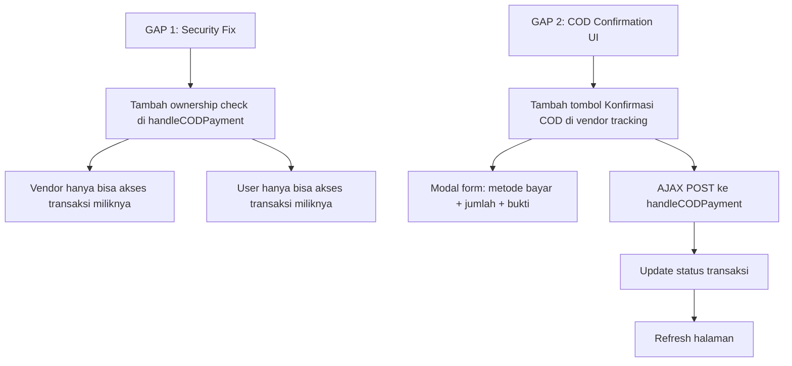

# Tahap 1: Security Fix + COD Confirmation UI

> **Status:** In Progress  
> **Tanggal:** 19 Agustus 2026  
> **Referensi:** `plans/audit-user-lelang-cod.md` (GAP 1 + GAP 2)

---

## Ringkasan

Tahap 1 memperbaiki 2 isu kritis:
1. **GAP 1 (CRITICAL):** Route COD tidak ada ownership verification — siapapun bisa trigger pembayaran COD transaksi orang lain
2. **GAP 2 (HIGH):** Tidak ada UI untuk vendor mengkonfirmasi pembayaran COD — method `handleCODPayment()` sudah ada tapi tidak terpakai

---

## Alur Perbaikan



---

## GAP 1: Security Fix — Ownership Verification

### File: `app/Http/Controllers/ShippingInvoiceController.php`

### Masalah
```php
// Line 212 — TIDAK ADA ownership check
public function handleCODPayment(Request $request, Transaksi $transaksi)
{
    // Siapapun yang login bisa mengakses transaksi vendor lain
    // Route: POST /shipping/payment/{transaksi}
}
```

### Solusi
Tambahkan pengecekan ownership di awal method:
- **Vendor:** Pastikan `$transaksi->vendor_id === Auth::user()->vendor->id`
- **User:** Pastikan `$transaksi->user_id === Auth::id()`
- **Admin/Dev:** Boleh akses semua (role check)

### Implementasi
```php
public function handleCODPayment(Request $request, Transaksi $transaksi)
{
    // === SECURITY FIX: Ownership verification ===
    $user = Auth::user();
    $isOwner = false;
    
    if ($user->usertype === 'vendor' && $user->vendor) {
        $isOwner = ($transaksi->vendor_id === $user->vendor->id);
    } elseif ($user->usertype === 'user') {
        $isOwner = ($transaksi->user_id === $user->id);
    } elseif (in_array($user->usertype, ['dev', 'admin'])) {
        $isOwner = true; // Admin/Dev akses semua
    }
    
    if (!$isOwner) {
        abort(403, 'Anda tidak memiliki akses ke transaksi ini.');
    }
    // === END SECURITY FIX ===
    
    // ... existing validation & logic
}
```

### Catatan
- Juga berlaku untuk `generateShippingInvoice()` (line 29) dan `calculateShippingCost()` (line 276)
- Untuk Tahap 1, fokus ke `handleCODPayment()` dulu karena ini yang paling kritis (mengubah status pembayaran)

---

## GAP 2: COD Confirmation UI — Vendor Tracking

### File: `resources/views/vendor/order-tracking/index.blade.php`

### Masalah
- Halaman vendor order tracking hanya memiliki form update status OrderTracking
- Tidak ada tombol atau form untuk konfirmasi pembayaran COD
- Method `handleCODPayment()` di `ShippingInvoiceController` sudah ada tapi tidak terpanggil dari UI manapun

### Solusi
Tambahkan tombol "Konfirmasi Pembayaran COD" yang:
1. Hanya muncul untuk transaksi yang `is_cod === true` DAN `shipping_payment_status !== 'paid_cash'` / `!== 'paid_app'`
2. Membuka modal form dengan pilihan metode bayar (cash/app), jumlah, dan upload bukti
3. Mengirim AJAX POST ke route `shipping.handle-payment`
4. Menampilkan notifikasi sukses/gagal via SweetAlert2

### Implementasi UI

#### 1. Tambah kolom "COD" di tabel (setelah kolom "Resi")
```html
<th class="text-left py-3 px-4 font-semibold text-gray-600">COD</th>
```

#### 2. Tambah cell "COD" di setiap baris
```html
<td class="py-3 px-4">
    @if($tracking->auction && $tracking->auction->transaksi && $tracking->auction->transaksi->is_cod)
        @php
            $transaksi = $tracking->auction->transaksi;
            $isPaid = in_array($transaksi->shipping_payment_status ?? '', ['paid_cash', 'paid_app']);
        @endphp
        @if($isPaid)
            <span class="inline-flex items-center px-2.5 py-0.5 rounded-full text-xs font-medium bg-green-100 text-green-800">
                <i class="fas fa-check-circle mr-1"></i> Dibayar
            </span>
        @else
            <span class="inline-flex items-center px-2.5 py-0.5 rounded-full text-xs font-medium bg-yellow-100 text-yellow-800">
                <i class="fas fa-money-bill-wave mr-1"></i> Belum Dibayar
            </span>
        @endif
    @else
        <span class="text-gray-400 text-xs">-</span>
    @endif
</td>
```

#### 3. Tambah tombol "Konfirmasi COD" di kolom aksi
```html
<td class="py-3 px-4">
    <div class="flex gap-2">
        <x.ui.button @click="open = !open" variant="primary" size="sm">Update</x.ui.button>
        
        {{-- Tombol Konfirmasi COD --}}
        @if($tracking->auction && $tracking->auction->transaksi && $tracking->auction->transaksi->is_cod)
            @php
                $transaksi = $tracking->auction->transaksi;
                $isPaid = in_array($transaksi->shipping_payment_status ?? '', ['paid_cash', 'paid_app']);
            @endphp
            @if(!$isPaid)
                <x.ui.button 
                    @click="openCOD = true" 
                    variant="success" 
                    size="sm"
                    x-data="{ openCOD: false }"
                >
                    <i class="fas fa-money-bill-wave mr-1"></i> Konfirmasi COD
                </x.ui.button>
            @endif
        @endif
    </div>
</td>
```

#### 4. Tambah modal Konfirmasi COD (di dalam `@foreach`)
```html
{{-- COD Confirmation Modal --}}
@if($tracking->auction && $tracking->auction->transaksi && $tracking->auction->transaksi->is_cod)
@php
    $transaksi = $tracking->auction->transaksi;
    $isPaid = in_array($transaksi->shipping_payment_status ?? '', ['paid_cash', 'paid_app']);
@endphp
@if(!$isPaid)
<tr x-show="openCOD" x-transition @keydown.escape.window="openCOD = false">
    <td colspan="7" class="p-4 bg-green-50 border-l-4 border-green-400">
        <div class="flex items-center justify-between mb-3">
            <h4 class="text-sm font-semibold text-green-900">
                <i class="fas fa-money-bill-wave mr-1"></i> Konfirmasi Pembayaran COD
            </h4>
            <button @click="openCOD = false" class="text-green-600 hover:text-green-800">
                <i class="fas fa-times"></i>
            </button>
        </div>
        
        <div class="mb-3 p-3 bg-white rounded-lg border border-green-200">
            <div class="grid grid-cols-2 sm:grid-cols-4 gap-3 text-sm">
                <div>
                    <span class="text-gray-500">Total Harga:</span>
                    <p class="font-semibold">Rp {{ number_format($transaksi->total_harga, 0, ',', '.') }}</p>
                </div>
                <div>
                    <span class="text-gray-500">Ongkir:</span>
                    <p class="font-semibold">Rp {{ number_format($transaksi->ongkir ?? 0, 0, ',', '.') }}</p>
                </div>
                <div>
                    <span class="text-gray-500">Kurir:</span>
                    <p class="font-semibold">{{ strtoupper($transaksi->kurir ?? '-') }}</p>
                </div>
                <div>
                    <span class="text-gray-500">Total Diterima:</span>
                    <p class="font-bold text-green-700">Rp {{ number_format(($transaksi->ongkir ?? 0), 0, ',', '.') }}</p>
                </div>
            </div>
        </div>

        <form id="codForm-{{ $transaksi->id }}" onsubmit="submitCODPayment(event, {{ $transaksi->id }})">
            @csrf
            <div class="grid grid-cols-1 sm:grid-cols-3 gap-3">
                <div>
                    <label class="block text-xs font-medium text-gray-700 mb-1">Metode Pembayaran</label>
                    <select name="payment_method" class="w-full rounded-lg border border-gray-300 px-3 py-2 text-sm" required>
                        <option value="cash">Cash (Tunai)</option>
                        <option value="app">Aplikasi (Transfer)</option>
                    </select>
                </div>
                <div>
                    <label class="block text-xs font-medium text-gray-700 mb-1">Jumlah Dibayar</label>
                    <input type="number" name="amount_paid" 
                           class="w-full rounded-lg border border-gray-300 px-3 py-2 text-sm" 
                           value="{{ $transaksi->ongkir ?? 0 }}" min="0" required>
                </div>
                <div>
                    <label class="block text-xs font-medium text-gray-700 mb-1">Bukti Pembayaran</label>
                    <input type="file" name="payment_proof" accept="image/*,.pdf"
                           class="w-full rounded-lg border border-gray-300 px-3 py-2 text-sm">
                </div>
            </div>
            <div class="flex gap-2 mt-3">
                <button type="submit" class="inline-flex items-center px-4 py-2 bg-green-600 text-white text-sm font-medium rounded-lg hover:bg-green-700 transition">
                    <i class="fas fa-check mr-1"></i> Konfirmasi Pembayaran
                </button>
                <button type="button" @click="openCOD = false" class="inline-flex items-center px-4 py-2 border border-gray-300 text-gray-700 text-sm font-medium rounded-lg hover:bg-gray-50 transition">
                    Batal
                </button>
            </div>
        </form>
    </td>
</tr>
@endif
@endif
```

#### 5. Tambah JavaScript AJAX handler (di `@push('scripts')`)
```html
@push('scripts')
<script>
function submitCODPayment(event, transaksiId) {
    event.preventDefault();
    
    const form = event.target;
    const formData = new FormData(form);
    
    Swal.fire({
        title: 'Konfirmasi Pembayaran COD?',
        text: 'Pastikan jumlah pembayaran sudah benar.',
        icon: 'question',
        showCancelButton: true,
        confirmButtonColor: '#16a34a',
        cancelButtonColor: '#6b7280',
        confirmButtonText: 'Ya, Konfirmasi',
        cancelButtonText: 'Batal'
    }).then((result) => {
        if (result.isConfirmed) {
            // Show loading
            Swal.fire({
                title: 'Memproses...',
                text: 'Sedang memproses pembayaran COD',
                allowOutsideClick: false,
                allowEscapeKey: false,
                didOpen: () => Swal.showLoading()
            });
            
            fetch(`{{ url('shipping/payment') }}/${transaksiId}`, {
                method: 'POST',
                headers: {
                    'X-CSRF-TOKEN': document.querySelector('meta[name="csrf-token"]').content,
                    'Accept': 'application/json'
                },
                body: formData
            })
            .then(response => response.json())
            .then(data => {
                if (data.success) {
                    Swal.fire({
                        title: 'Berhasil!',
                        text: data.message || 'Pembayaran COD berhasil dikonfirmasi.',
                        icon: 'success',
                        confirmButtonColor: '#16a34a'
                    }).then(() => {
                        window.location.reload();
                    });
                } else {
                    Swal.fire({
                        title: 'Gagal!',
                        text: data.message || 'Terjadi kesalahan saat memproses pembayaran.',
                        icon: 'error',
                        confirmButtonColor: '#dc2626'
                    });
                }
            })
            .catch(error => {
                console.error('COD Payment Error:', error);
                Swal.fire({
                    title: 'Error!',
                    text: 'Terjadi kesalahan jaringan. Silakan coba lagi.',
                    icon: 'error',
                    confirmButtonColor: '#dc2626'
                });
            });
        }
    });
}
</script>
@endpush
```

---

## File yang Diubah

| # | File | Perubahan | Prioritas |
|---|------|-----------|-----------|
| 1 | `app/Http/Controllers/ShippingInvoiceController.php` | Tambah ownership check di `handleCODPayment()` | CRITICAL |
| 2 | `resources/views/vendor/order-tracking/index.blade.php` | Tambah kolom COD + tombol Konfirmasi + modal form + AJAX handler | HIGH |

---

## Checklist Verifikasi

### Security Fix (GAP 1)
- [ ] Vendor hanya bisa akses transaksi milik vendor_id sendiri
- [ ] User hanya bisa akses transaksi milik user_id sendiri
- [ ] Admin/Dev tetap bisa akses semua transaksi
- [ ] Attempt akses transaksi orang lain menghasilkan 403
- [ ] Log error tetap tersimpan untuk debugging

### COD Confirmation UI (GAP 2)
- [ ] Tombol "Konfirmasi COD" hanya muncul untuk transaksi COD yang belum dibayar
- [ ] Modal form menampilkan rincian: total harga, ongkir, kurir
- [ ] Form validasi: metode bayar (cash/app), jumlah, bukti (optional)
- [ ] AJAX POST ke route `shipping.handle-payment`
- [ ] SweetAlert2 loading → sukses/gagal → reload halaman
- [ ] Status berubah menjadi "Dibayar" setelah konfirmasi
- [ ] Tombol konfirmasi hilang setelah pembayaran tercatat

### General
- [ ] Tidak ada regression ke fitur existing
- [ ] UI menggunakan Tailwind CSS (bukan Bootstrap)
- [ ] Interaktivitas menggunakan Alpine.js
- [ ] SweetAlert2 untuk notifikasi (bukan alert biasa)
- [ ] CSRF token terkirim dengan benar di AJAX
