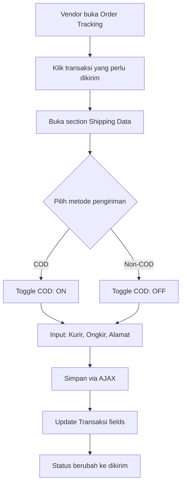

# Tahap 2: Vendor COD Checkout + Shipping Data Input

> **Status:** Planned  
> **Tanggal:** 19 Agustus 2026  
> **Referensi:** `plans/audit-user-lelang-cod.md` (GAP 3 + GAP 4)

---

## Ringkasan

Tahap 2 memperbaiki 2 gap yang tersisa:
1. **GAP 3 (HIGH):** Vendor tidak bisa menandai transaksi sebagai COD (`is_cod = true`)
2. **GAP 4 (HIGH):** Vendor tidak bisa input data pengiriman (kurir, ongkir, alamat) dari halaman order tracking

---

## Analisis Current State

### Yang Sudah Ada
- `Transaksi` model punya field: `is_cod`, `ongkir`, `kurir`, `alamat_pengiriman`, `no_resi`
- `ShippingCalculatorController::saveShipping()` bisa simpan data pengiriman ke transaksi
- `ShippingCalculatorController::calculate()` bisa hitung ongkir via RajaOngkir
- Halaman standalone `vendor/tracking/shipping-calculator.blade.php` (terpisah dari order tracking)
- `handleCODPayment()` sudah diperbaiki di Tahap 1

### Yang Hilang
- Tidak ada cara vendor menandai transaksi sebagai COD dari UI order tracking
- Tidak ada form input data pengiriman di halaman order tracking
- `ShippingCalculatorController::saveShipping()` tidak terintegrasi dengan order tracking flow
- `is_cod` field di `Transaksi` tidak pernah di-set saat transaksi dibuat

---

## Alur Perbaikan



---

## GAP 3: Vendor COD Toggle

### Masalah
Field `is_cod` di `Transaksi` (line 45, 72) tidak pernah di-set ke `true` dari UI manapun.

### Solusi
Tambahkan toggle COD di form data pengiriman vendor. Saat vendor mengaktifkan COD:
1. Set `is_cod = true` di `Transaksi`
2. Set `ongkir` (biaya yang harus dibayar user saat terima barang)
3. Set `kurir` dan `alamat_pengiriman`

---

## GAP 4: Shipping Data Input

### Masalah
Vendor tidak bisa input data pengiriman dari halaman order tracking. `ShippingCalculatorController::saveShipping()` ada tapi tidak terintegrasi.

### Solusi
Tambahkan section "Data Pengiriman" di expanded row order tracking:
- Dropdown kurir (JNE, TIKI, POS, J&T, SiCepat)
- Input ongkir (nominal)
- Textarea alamat pengiriman
- Toggle COD
- Tombol "Hitung Ongkir" (optional, via RajaOngkir API)
- Tombol "Simpan"

---

## File yang Diubah

| # | File | Perubahan |
|---|------|-----------|
| 1 | `app/Http/Controllers/OrderTrackingController.php` | Tambah method `saveShippingData()` |
| 2 | `routes/web.php` | Tambah route `POST vendor/tracking/{orderTracking}/shipping-data` |
| 3 | `resources/views/vendor/order-tracking/index.blade.php` | Tambah section "Data Pengiriman" + AJAX handler |

---

## Detail Implementasi

### 1. Controller: `OrderTrackingController::saveShippingData()`

```php
public function saveShippingData(Request $request, OrderTracking $orderTracking)
{
    $vendor = $this->requireVendor();
    if (!$vendor) abort(403);

    // Ownership check
    if ($orderTracking->vendor_id !== $vendor->id) {
        abort(403, 'Anda tidak memiliki akses ke pesanan ini.');
    }

    $validated = $request->validate([
        'kurir' => 'required|string|in:jne,tiki,pos,jnt,sicepat,ninja,lion',
        'ongkir' => 'required|numeric|min:0',
        'alamat_pengiriman' => 'required|string|max:500',
        'is_cod' => 'sometimes|boolean',
    ]);

    // Get related transaksi
    $transaksi = $orderTracking->auction->transaksi;
    if (!$transaksi) {
        return response()->json(['success' => false, 'message' => 'Transaksi tidak ditemukan'], 404);
    }

    $transaksi->update([
        'kurir' => $validated['kurir'],
        'ongkir' => $validated['ongkir'],
        'alamat_pengiriman' => $validated['alamat_pengiriman'],
        'is_cod' => $validated['is_cod'] ?? false,
    ]);

    Log::info('Shipping data saved from order tracking', [
        'order_tracking_id' => $orderTracking->id,
        'transaksi_id' => $transaksi->id,
        'vendor_id' => $vendor->id,
        'is_cod' => $validated['is_cod'] ?? false,
    ]);

    return response()->json([
        'success' => true,
        'message' => 'Data pengiriman berhasil disimpan',
    ]);
}
```

### 2. Route

```php
// Di vendor tracking route group (sekitar line 322)
Route::post('/{orderTracking}/shipping-data', [OrderTrackingController::class, 'saveShippingData'])->name('shipping-data');
```

### 3. View: Section "Data Pengiriman" di Order Tracking

Tambahkan di expanded row (setelah form status update), dengan Alpine.js state `openShipping`:

**Fields:**
- Toggle COD (checkbox/switch)
- Dropdown Kurir (JNE, TIKI, POS, J&T, SiCepat, Ninja, Lion)
- Input Ongkir (number, formatted Rp)
- Textarea Alamat Pengiriman
- Tombol "Hitung Ongkir" (optional, fetch from API)
- Tombol "Simpan Data Pengiriman"

**Behavior:**
- Section muncul saat vendor klik tombol "Input Pengiriman"
- Jika transaksi sudah punya data pengiriman, tampilkan data yang sudah ada
- AJAX POST ke route `vendor.tracking.shipping-data`
- SweetAlert2 notifikasi sukses/gagal

---

## Checklist Verifikasi

### COD Toggle (GAP 3)
- [ ] Toggle COD muncul di form data pengiriman
- [ ] Saat toggle ON: `is_cod = true` tersimpan di `Transaksi`
- [ ] Saat toggle OFF: `is_cod = false` tersimpan di `Transaksi`
- [ ] Badge "COD" muncul di tabel order tracking untuk transaksi COD

### Shipping Data Input (GAP 4)
- [ ] Form data pengiriman muncul di expanded row order tracking
- [ ] Dropdown kurir dengan opsi: JNE, TIKI, POS, J&T, SiCepat, Ninja, Lion
- [ ] Input ongkir dengan format Rupiah
- [ ] Textarea alamat pengiriman
- [ ] AJAX POST menyimpan data ke `Transaksi` model
- [ ] Data yang sudah tersimpan ditampilkan kembali saat form dibuka
- [ ] Notifikasi sukses/gagal via SweetAlert2

### General
- [ ] Ownership check: vendor hanya bisa input data untuk pesanan sendiri
- [ ] UI menggunakan Tailwind CSS
- [ ] Interaktivitas menggunakan Alpine.js
- [ ] CSRF token terkirim dengan benar
- [ ] Tidak ada regression ke fitur existing
