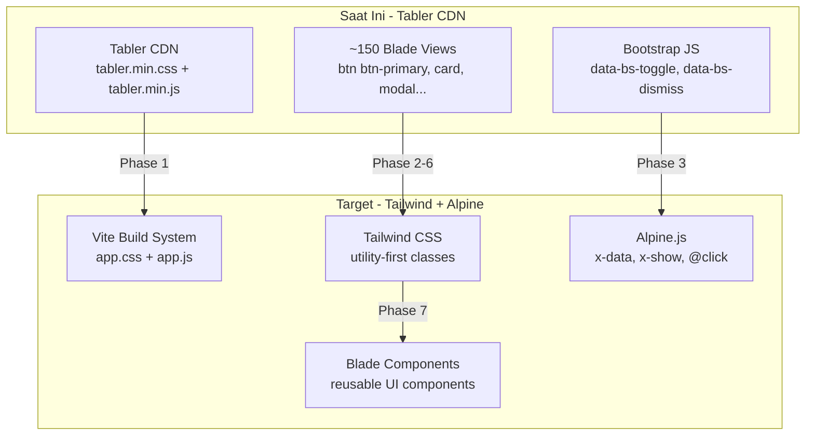

# Rencana Migrasi: Bootstrap Tabler → Tailwind CSS

> **Tanggal:** 5 Agustus 2026  
> **Projek:** Grafika-Printing (Laravel 13)  
> **Status:** Production — Tidak boleh mengubah database yang sudah ada

---

## Ringkasan Eksekutif

Migrasi **FULL** dari Bootstrap Tabler ke Tailwind CSS untuk seluruh aplikasi Grafika-Printing. Proyek ini akan dipakai selamanya, dan Tabler sudah tidak aktif dikembangkan.

### Cakupan Migrasi

| Item | Jumlah | Keterangan |
|------|--------|------------|
| Layout files aktif | 6 | vendor, user, dev/admin, app, auth, vendor/layouts/app |
| View files | ~150+ | Semua view menggunakan Tabler CSS classes |
| Bootstrap JS interactions | ~211 | data-bs-toggle, data-bs-dismiss, data-bs-target |
| Tabler CDN references | 20 | CSS + JS CDN di layout dan standalone views |
| File unused (hapus) | 2 | dev/layouts/app-old.blade.php, dev/layouts/app-improved.blade.php |

### Infrastruktur Yang Sudah Ada

- ✅ Tailwind CSS v3.1.0 sudah terinstall di `package.json`
- ✅ `tailwind.config.js` sudah dikonfigurasi
- ✅ `resources/css/app.css` sudah ada `@tailwind` directives
- ✅ `vite.config.js` sudah dikonfigurasi untuk Tailwind
- ✅ Alpine.js sudah terinstall di `package.json`
- ✅ `layouts/guest.blade.php` sudah menggunakan Tailwind via `@vite`
- ✅ `@tailwindcss/forms` plugin sudah terinstall

---

## Arsitektur Migrasi



---

## Phase 0: Persiapan Infrastructure

### 0.1 Update CSS Entry Point
**File:** `resources/css/app.css`

```css
@tailwind base;
@tailwind components;
@tailwind utilities;

/* Custom component classes */
@layer components {
    .btn-primary { @apply bg-blue-600 text-white px-4 py-2 rounded-lg hover:bg-blue-700 transition-colors font-medium; }
    .btn-secondary { @apply bg-gray-200 text-gray-800 px-4 py-2 rounded-lg hover:bg-gray-300 transition-colors font-medium; }
    .btn-danger { @apply bg-red-600 text-white px-4 py-2 rounded-lg hover:bg-red-700 transition-colors font-medium; }
    .btn-success { @apply bg-green-600 text-white px-4 py-2 rounded-lg hover:bg-green-700 transition-colors font-medium; }
    .btn-ghost { @apply text-gray-600 px-4 py-2 rounded-lg hover:bg-gray-100 transition-colors font-medium; }
    .card { @apply bg-white rounded-xl shadow-sm border border-gray-200; }
    .card-body { @apply p-6; }
    .card-header { @apply px-6 py-4 border-b border-gray-200; }
    .form-input { @apply w-full px-3 py-2 border border-gray-300 rounded-lg focus:ring-2 focus:ring-blue-500 focus:border-blue-500 outline-none transition; }
    .form-label { @apply block text-sm font-medium text-gray-700 mb-1; }
    .form-select { @apply w-full px-3 py-2 border border-gray-300 rounded-lg focus:ring-2 focus:ring-blue-500 focus:border-blue-500 outline-none transition bg-white; }
    .alert-success { @apply bg-green-50 text-green-800 border border-green-200 rounded-lg p-4; }
    .alert-danger { @apply bg-red-50 text-red-800 border border-red-200 rounded-lg p-4; }
    .alert-warning { @apply bg-yellow-50 text-yellow-800 border border-yellow-200 rounded-lg p-4; }
    .alert-info { @apply bg-blue-50 text-blue-800 border border-blue-200 rounded-lg p-4; }
    .badge { @apply inline-flex items-center px-2.5 py-0.5 rounded-full text-xs font-medium; }
    .badge-success { @apply bg-green-100 text-green-800; }
    .badge-danger { @apply bg-red-100 text-red-800; }
    .badge-warning { @apply bg-yellow-100 text-yellow-800; }
    .badge-info { @apply bg-blue-100 text-blue-800; }
    .table { @apply w-full text-sm text-left; }
    .table thead { @apply text-xs text-gray-500 uppercase bg-gray-50; }
    .table th { @apply px-4 py-3 font-medium; }
    .table td { @apply px-4 py-3 border-t border-gray-100; }
    .table tr:hover { @apply bg-gray-50; }
    .stat-card { @apply bg-white rounded-xl shadow-sm border border-gray-200 p-6; }
    .stat-value { @apply text-2xl font-bold text-gray-900; }
    .stat-label { @apply text-sm text-gray-500 mt-1; }
    .page-header { @apply mb-6; }
    .page-title { @apply text-2xl font-bold text-gray-900; }
    .page-subtitle { @apply text-sm text-gray-500; }
    .modal-backdrop { @apply fixed inset-0 bg-black/50 z-40; }
    .modal-content { @apply fixed inset-0 z-50 flex items-center justify-center p-4; }
    .modal-dialog { @apply bg-white rounded-xl shadow-xl max-w-lg w-full max-h-[90vh] overflow-y-auto; }
    .modal-header { @apply flex items-center justify-between px-6 py-4 border-b border-gray-200; }
    .modal-body { @apply px-6 py-4; }
    .modal-footer { @apply flex items-center justify-end gap-3 px-6 py-4 border-t border-gray-200; }
    .dropdown { @apply relative; }
    .dropdown-menu { @apply absolute right-0 mt-2 w-48 bg-white rounded-lg shadow-lg border border-gray-200 py-1 z-50; }
    .dropdown-item { @apply block px-4 py-2 text-sm text-gray-700 hover:bg-gray-100; }
    .dropdown-divider { @apply border-t border-gray-200 my-1; }
}
```

### 0.2 Update Tailwind Config
**File:** `tailwind.config.js`

Tambahkan custom colors, spacing, dan safelist untuk class yang digunakan secara dinamis.

### 0.3 Update package.json
- Hapus `@tabler/core` dari dependencies
- Pastikan semua dependency sudah versi terbaru

---

## Phase 1: Layout Foundation (6 files)

> **PRIORITAS TERTINGGI** — Semua view bergantung pada layout files

### 1.1 `layouts/guest.blade.php` ✅ SUDAH TAILWIND
- Sudah menggunakan `@vite` dan Tailwind classes
- Tidak perlu perubahan

### 1.2 `layouts/vendor.blade.php` (715 lines)
**Yang perlu diubah:**
- Hapus Tabler CDN CSS + JS
- Tambah `@vite(['resources/css/app.css', 'resources/js/app.js'])`
- Convert navbar Tabler → Tailwind + Alpine.js
- Convert sidebar/dropdown → Alpine.js x-data
- Convert responsive styles → Tailwind responsive utilities

### 1.3 `layouts/user.blade.php` (338 lines)
**Yang perlu diubah:**
- Sama seperti vendor.blade.php tapi lebih sederhana
- Navbar lebih minimal untuk user panel

### 1.4 `dev/layouts/app.blade.php` (776 lines)
**Yang perlu diubah:**
- Layout admin/dev — paling kompleks
- Banyak dropdown menu dan nested navigation
- Convert semua Tabler classes

### 1.5 `layouts/app.blade.php` (149 lines)
- Layout untuk payment views
- Lebih sederhana, hanya navbar + content

### 1.6 `layouts/auth.blade.php` (738 lines)
- Login/Register layout dengan split design
- Sudah banyak custom CSS, tinggal convert ke Tailwind
- Hapus 5 Tabler CDN references (unpkg)

### 1.7 `vendor/layouts/app.blade.php`
- Vendor layout alternatif
- Convert Tabler ke Tailwind

---

## Phase 2: Design System — Reusable Blade Components

> **KRITIS** — Membuat component reusable mengurangi duplikasi dan mempercepat migrasi view

### 2.1 Component: `components/ui/button.blade.php`
```blade
@props([
    'variant' => 'primary',
    'size' => 'md',
    'icon' => null,
    'href' => null,
    'type' => 'button',
    'disabled' => false,
])

@php
    $baseClasses = 'inline-flex items-center justify-center font-medium rounded-lg transition-colors focus:ring-2 focus:ring-offset-2 disabled:opacity-50 disabled:cursor-not-allowed';
    $variants = [
        'primary' => 'bg-blue-600 text-white hover:bg-blue-700 focus:ring-blue-500',
        'secondary' => 'bg-gray-200 text-gray-800 hover:bg-gray-300 focus:ring-gray-500',
        'danger' => 'bg-red-600 text-white hover:bg-red-700 focus:ring-red-500',
        'success' => 'bg-green-600 text-white hover:bg-green-700 focus:ring-green-500',
        'warning' => 'bg-yellow-500 text-white hover:bg-yellow-600 focus:ring-yellow-500',
        'ghost' => 'text-gray-600 hover:bg-gray-100 focus:ring-gray-500',
        'outline' => 'border border-gray-300 text-gray-700 hover:bg-gray-50 focus:ring-gray-500',
        'outline-danger' => 'border border-red-300 text-red-700 hover:bg-red-50 focus:ring-red-500',
        'outline-primary' => 'border border-blue-300 text-blue-700 hover:bg-blue-50 focus:ring-blue-500',
    ];
    $sizes = [
        'sm' => 'px-3 py-1.5 text-sm',
        'md' => 'px-4 py-2 text-sm',
        'lg' => 'px-6 py-3 text-base',
        'icon' => 'p-2',
    ];
    $classes = $baseClasses . ' ' . ($variants[$variant] ?? $variants['primary']) . ' ' . ($sizes[$size] ?? $sizes['md']);
@endphp

@if($href)
    <a href="{{ $href }}" {{ $attributes->merge(['class' => $classes]) }}>
        @if($icon) <x-dynamic-component :component="$icon" class="w-4 h-4 {{ $slot->isNotEmpty() ? 'mr-2' : '' }}" /> @endif
        {{ $slot }}
    </a>
@else
    <button type="{{ $type }}" {{ $attributes->merge(['class' => $classes, 'disabled' => $disabled]) }}>
        @if($icon) <x-dynamic-component :component="$icon" class="w-4 h-4 {{ $slot->isNotEmpty() ? 'mr-2' : '' }}" /> @endif
        {{ $slot }}
    </button>
@endif
```

### 2.2 Component: `components/ui/card.blade.php`
### 2.3 Component: `components/ui/modal.blade.php` (Alpine.js)
### 2.4 Component: `components/ui/dropdown.blade.php` (Alpine.js)
### 2.5 Component: `components/ui/alert.blade.php`
### 2.6 Component: `components/ui/badge.blade.php`
### 2.7 Component: `components/ui/table.blade.php`
### 2.8 Component: `components/ui/stat-card.blade.php`
### 2.9 Component: `components/ui/form-group.blade.php`
### 2.10 Component: `components/ui/pagination.blade.php`
### 2.11 Component: `components/ui/confirmation-dialog.blade.php` (Alpine.js)
### 2.12 Component: `components/ui/toast.blade.php` (Alpine.js)

---

## Phase 3: Konversi Bootstrap JS → Alpine.js

> **PATTERN YANG HARUS DIKONVERSI**

### 3.1 Modal (paling banyak digunakan)
```html
<!-- SEBELUM: Bootstrap -->
<button data-bs-toggle="modal" data-bs-target="#myModal">Open</button>
<div class="modal" id="myModal">
  <div class="modal-dialog">
    <div class="modal-content">
      <div class="modal-header">
        <h5>Title</h5>
        <button data-bs-dismiss="modal">×</button>
      </div>
      <div class="modal-body">Content</div>
      <div class="modal-footer">
        <button data-bs-dismiss="modal">Close</button>
        <button type="submit">Save</button>
      </div>
    </div>
  </div>
</div>

<!-- SESUDAH: Alpine.js -->
<div x-data="{ open: false }">
  <button @click="open = true">Open</button>
  <template x-if="open">
    <div class="fixed inset-0 z-50 flex items-center justify-center">
      <div class="fixed inset-0 bg-black/50" @click="open = false"></div>
      <div class="relative bg-white rounded-xl shadow-xl max-w-lg w-full mx-4">
        <div class="flex items-center justify-between px-6 py-4 border-b">
          <h5>Title</h5>
          <button @click="open = false">×</button>
        </div>
        <div class="px-6 py-4">Content</div>
        <div class="flex justify-end gap-3 px-6 py-4 border-t">
          <button @click="open = false">Close</button>
          <button type="submit">Save</button>
        </div>
      </div>
    </div>
  </template>
</div>
```

### 3.2 Dropdown
```html
<!-- SEBELUM: Bootstrap -->
<div class="dropdown">
  <button data-bs-toggle="dropdown">Menu</button>
  <div class="dropdown-menu">
    <a class="dropdown-item" href="#">Link</a>
  </div>
</div>

<!-- SESUDAH: Alpine.js -->
<div x-data="{ open: false }" class="relative">
  <button @click="open = !open">Menu</button>
  <div x-show="open" @click.away="open = false"
       x-transition:enter="transition ease-out duration-100"
       x-transition:enter-start="opacity-0 scale-95"
       x-transition:enter-end="opacity-100 scale-100"
       class="absolute right-0 mt-2 w-48 bg-white rounded-lg shadow-lg border py-1 z-50">
    <a class="block px-4 py-2 text-sm hover:bg-gray-100" href="#">Link</a>
  </div>
</div>
```

### 3.3 Alert Dismiss
```html
<!-- SEBELUM: Bootstrap -->
<div class="alert alert-success alert-dismissible">
  Success! <a class="btn-close" data-bs-dismiss="alert"></a>
</div>

<!-- SESUDAH: Alpine.js -->
<div x-data="{ show: true }" x-show="show"
     x-transition:leave="transition ease-in duration-200"
     x-transition:leave-start="opacity-100" x-transition:leave-end="opacity-0"
     class="bg-green-50 text-green-800 border border-green-200 rounded-lg p-4 flex justify-between">
  <span>Success!</span>
  <button @click="show = false" class="text-green-600 hover:text-green-800">×</button>
</div>
```

### 3.4 Tooltip
```html
<!-- SEBELUM: Bootstrap -->
<button data-bs-toggle="tooltip" title="Tooltip text">Hover</button>

<!-- SESUDAH: Alpine.js -->
<div x-data="{ show: false }" class="relative inline-block">
  <button @mouseenter="show = true" @mouseleave="show = false">Hover</button>
  <div x-show="show" class="absolute bottom-full left-1/2 -translate-x-1/2 mb-2 px-2 py-1 text-xs text-white bg-gray-900 rounded whitespace-nowrap">
    Tooltip text
  </div>
</div>
```

### 3.5 Navbar Collapse (Mobile Menu)
```html
<!-- SEBELUM: Bootstrap -->
<button data-bs-toggle="collapse" data-bs-target="#navbar-menu">☰</button>
<div class="collapse navbar-collapse" id="navbar-menu">
  <nav>...</nav>
</div>

<!-- SESUDAH: Alpine.js -->
<div x-data="{ mobileMenu: false }">
  <button @click="mobileMenu = !mobileMenu">☰</button>
  <nav x-show="mobileMenu" x-transition>
    ...
  </nav>
</div>
```

---

## Phase 4: Konversi View Files (Panel per Panel)

> **Urutan konversi berdasarkan jumlah view dan prioritas**

### 4.1 Vendor Panel (~40 views)
- `resources/views/produk/*.blade.php` (4 files)
- `resources/views/bahan/*.blade.php` (4 files)
- `resources/views/alat/*.blade.php` (4 files)
- `resources/views/spesifikasi/*.blade.php` (4 files)
- `resources/views/kategori_produk/*.blade.php` (4 files)
- `resources/views/pelanggan/*.blade.php` (4 files)
- `resources/views/pengguna/*.blade.php` (4 files)
- `resources/views/transaksi/*.blade.php` (5 files)
- `resources/views/pos/*.blade.php` (12 files)
- `resources/views/vendor/linktree/*.blade.php` (8+ files)
- `resources/views/vendor/tracking/*.blade.php`
- `resources/views/vendor/order-tracking/*.blade.php`
- `resources/views/vendor/bank-accounts/*.blade.php`
- `resources/views/vendor/manual-transfers/*.blade.php`
- `resources/views/vendor/pulse/*.blade.php`

### 4.2 User Panel (~15 views)
- `resources/views/user/dashboard.blade.php`
- `resources/views/user/auctions/*.blade.php` (6 files)
- `resources/views/user/delivery-confirmation/*.blade.php` (3 files)
- `resources/views/user/order-tracking/*.blade.php` (2 files)
- `resources/views/user/tracking/*.blade.php` (2 files)

### 4.3 Admin/Dev Panel (~35 views)
- `resources/views/dev/dashboard.blade.php`
- `resources/views/dev/vendors/*.blade.php` (4 files)
- `resources/views/dev/users/*.blade.php` (4 files)
- `resources/views/dev/user-lelang/*.blade.php` (4 files)
- `resources/views/dev/auctions/*.blade.php` (5 files)
- `resources/views/dev/admin-fees/*.blade.php` (7 files)
- `resources/views/dev/wallets/*.blade.php` (4 files)
- `resources/views/dev/audit-logs/*.blade.php` (4 files)
- `resources/views/dev/shipping/*.blade.php` (3 files)
- `resources/views/dev/delivery/*.blade.php` (2 files)
- `resources/views/dev/service-configs/*.blade.php` (2 files)
- `resources/views/dev/vendor-revenue/*.blade.php` (2 files)
- `resources/views/dev/pulse/*.blade.php` (4 files)
- `resources/views/admin/*.blade.php` (10+ files)

### 4.4 Shared Views (~10 views)
- `resources/views/auctions/*.blade.php` (5 files)
- `resources/views/payments/*.blade.php` (4 files)
- `resources/views/laporan/*.blade.php` (3+ files)
- `resources/views/errors/*.blade.php` (3 files)
- `resources/views/profile/*.blade.php` (4 files)
- `resources/views/linktree/public.blade.php`

---

## Phase 5: Cleanup

### 5.1 Hapus File Unused
- `resources/views/dev/layouts/app-old.blade.php`
- `resources/views/dev/layouts/app-improved.blade.php`
- `public/css/dashboard-improvements.css` (pindah ke Tailwind)
- `resources/css/welcome.css` (ganti dengan Tailwind)

### 5.2 Update package.json
```json
{
  "dependencies": {
    "@fortawesome/fontawesome-free": "^6.4.0",
    "sweetalert2": "^11.17.2"
    // HAPUS: "@tabler/core": "^1.0.0"
  }
}
```

### 5.3 Bersihkan CDN References
- Hapus semua `<link>` dan `<script>` yang merujuk ke Tabler CDN
- Hapus SweetAlert2 CDN (pindah ke npm + Vite)

---

## Phase 6: Responsive Design

### 6.1 Mobile-First Approach
- Semua layout menggunakan Tailwind responsive prefixes (sm:, md:, lg:, xl:)
- Navbar → Mobile hamburger menu dengan Alpine.js
- Tables → Responsive horizontal scroll atau card layout di mobile
- Forms → Stacked layout di mobile, inline di desktop

### 6.2 Breakpoints
```css
sm: 640px    /* Mobile landscape */
md: 768px    /* Tablet */
lg: 1024px   /* Desktop */
xl: 1280px   /* Large desktop */
2xl: 1536px  /* Extra large */
```

---

## Phase 7: Testing & QA

### 7.1 Visual Testing
- Test semua layout di Chrome, Firefox, Safari
- Test responsive di 320px, 375px, 768px, 1024px, 1440px
- Test semua modal, dropdown, alert dismiss

### 7.2 Functional Testing
- Test semua form submissions
- Test navigation links
- Test SweetAlert2 confirmations
- Test file uploads
- Test payment flows

### 7.3 Performance
- Bandingkan bundle size Tabler vs Tailwind
- Test page load times
- Optimasi CSS purging

---

## Peta Konversi Class

### Tabler → Tailwind Mapping

| Tabler Class | Tailwind Equivalent |
|-------------|---------------------|
| `btn btn-primary` | `bg-blue-600 text-white px-4 py-2 rounded-lg hover:bg-blue-700` |
| `btn btn-secondary` | `bg-gray-200 text-gray-800 px-4 py-2 rounded-lg hover:bg-gray-300` |
| `btn btn-danger` | `bg-red-600 text-white px-4 py-2 rounded-lg hover:bg-red-700` |
| `btn btn-success` | `bg-green-600 text-white px-4 py-2 rounded-lg hover:bg-green-700` |
| `btn btn-ghost` | `text-gray-600 px-4 py-2 rounded-lg hover:bg-gray-100` |
| `btn btn-outline-*` | `border border-*-300 text-*-700 px-4 py-2 rounded-lg hover:bg-*-50` |
| `btn-sm` | `text-sm px-3 py-1.5` |
| `btn-lg` | `text-base px-6 py-3` |
| `btn-icon` | `p-2` |
| `card` | `bg-white rounded-xl shadow-sm border border-gray-200` |
| `card-body` | `p-6` |
| `card-header` | `px-6 py-4 border-b border-gray-200` |
| `form-control` | `w-full px-3 py-2 border border-gray-300 rounded-lg focus:ring-2 focus:ring-blue-500` |
| `form-label` | `block text-sm font-medium text-gray-700 mb-1` |
| `form-select` | `w-full px-3 py-2 border border-gray-300 rounded-lg bg-white` |
| `form-check` | `flex items-center` |
| `navbar` | `bg-white shadow-sm border-b border-gray-200` |
| `navbar-brand` | `text-xl font-bold` |
| `nav-link` | `px-3 py-2 text-sm font-medium text-gray-600 hover:text-gray-900` |
| `nav-link.active` | `text-blue-600 bg-blue-50` |
| `table` | `w-full text-sm text-left` |
| `table-striped` | `divide-y divide-gray-200` |
| `badge` | `inline-flex items-center px-2.5 py-0.5 rounded-full text-xs font-medium` |
| `badge bg-green` | `bg-green-100 text-green-800` |
| `badge bg-red` | `bg-red-100 text-red-800` |
| `badge bg-yellow` | `bg-yellow-100 text-yellow-800` |
| `badge bg-blue` | `bg-blue-100 text-blue-800` |
| `alert` | `rounded-lg p-4` |
| `alert-success` | `bg-green-50 text-green-800 border border-green-200` |
| `alert-danger` | `bg-red-50 text-red-800 border border-red-200` |
| `container-xl` | `max-w-7xl mx-auto px-4 sm:px-6 lg:px-8` |
| `row` | `grid grid-cols-1 sm:grid-cols-2 lg:grid-cols-3 gap-6` |
| `col-*` | `col-span-*` |
| `d-none` | `hidden` |
| `d-flex` | `flex` |
| `d-block` | `block` |
| `d-inline-block` | `inline-block` |
| `text-muted` | `text-gray-500` |
| `text-end` | `text-right` |
| `text-center` | `text-center` |
| `fw-bold` | `font-bold` |
| `fs-*` | `text-*` |
| `mb-*` | `mb-*` |
| `mt-*` | `mt-*` |
| `p-*` | `p-*` |
| `px-*` | `px-*` |
| `py-*` | `py-*` |
| `gap-*` | `gap-*` |
| `w-100` | `w-full` |
| `h-*` | `h-*` |
| `rounded` | `rounded-lg` |
| `shadow` | `shadow-sm` |
| `shadow-lg` | `shadow-lg` |
| `overflow-auto` | `overflow-auto` |
| `dropdown` | `relative` (dengan Alpine.js) |
| `dropdown-menu` | `absolute right-0 mt-2 w-48 bg-white rounded-lg shadow-lg border py-1 z-50` |
| `dropdown-item` | `block px-4 py-2 text-sm text-gray-700 hover:bg-gray-100` |
| `modal` | Alpine.js x-data + x-show |
| `page-header` | `mb-6` |
| `page-title` | `text-2xl font-bold text-gray-900` |
| `page-pretitle` | `text-sm text-gray-500 uppercase tracking-wide` |
| `stat-card` | `bg-white rounded-xl shadow-sm border p-6` |
| `avatar` | `inline-flex items-center justify-center w-10 h-10 rounded-full bg-blue-600 text-white text-sm font-medium` |
| `icon` | SVG inline |
| `btn-close` | Alpine.js `@click="show = false"` |
| `alert-dismissible` | Alpine.js x-data + x-show + x-transition |
| `form-floating` | Floating label pattern dengan Tailwind |

---

## Estimasi File yang Perlu Diubah

| Kategori | File Count | Prioritas |
|----------|-----------|-----------|
| Layout files | 6 | Phase 1 |
| Blade components (baru) | 12 | Phase 2 |
| Vendor views | ~40 | Phase 4.1 |
| User views | ~15 | Phase 4.2 |
| Admin/Dev views | ~35 | Phase 4.3 |
| Shared views | ~10 | Phase 4.4 |
| Error pages | 3 | Phase 4.4 |
| Config/CSS/JS files | 5 | Phase 0, 5 |
| **TOTAL** | **~126 files** | |

---

## Risiko & Mitigasi

| Risiko | Mitigasi |
|--------|----------|
| UI berubah drastis | Buat design system yang mirip dengan Tabler visual |
| Fitur JavaScript rusak | Test semua interaksi modal/dropdown/alert |
| Performance regression | Gunakan Tailwind CSS purging |
| Responsive rusak | Test di multiple breakpoints |
| Browser compatibility | Test di Chrome, Firefox, Safari, Edge |

---

## Catatan Penting

1. **TIDAK BOLEH mengubah database** — Migrasi ini murni frontend
2. **SweetAlert2 tetap dipakai** — Tidak perlu diganti, tinggal ganti CDN ke npm
3. **Alpine.js sudah terinstall** — Tinggal digunakan untuk mengganti Bootstrap JS
4. **Vite sudah dikonfigurasi** — Tinggal ubah layout untuk pakai `@vite` directive
5. **guest.blade.php sudah Tailwind** — Bisa dijadikan referensi untuk pattern lain
